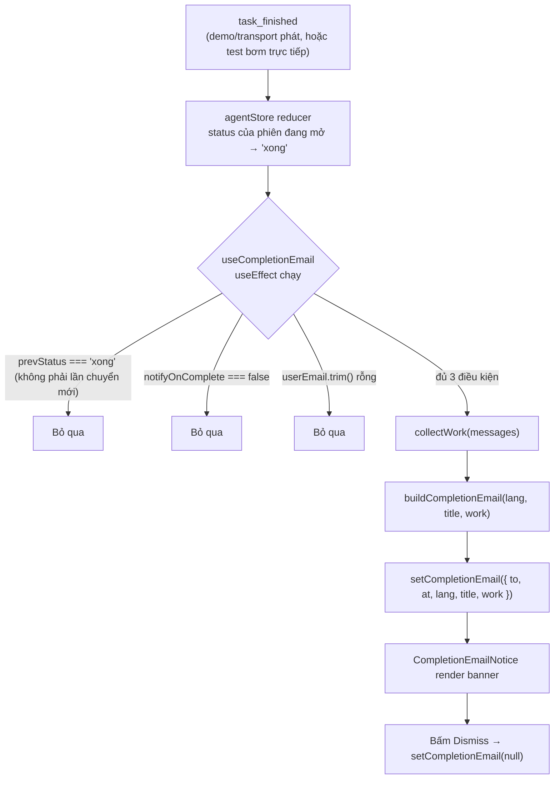
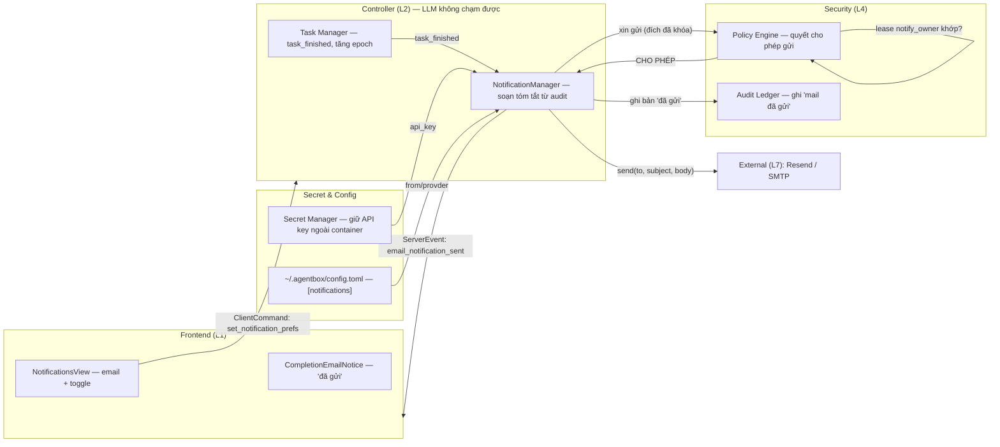

# Email thông báo khi task xong — kiến trúc gửi mail thật

> **Cập nhật**: 2026-08-29 — thiết kế tầng gửi mail thật khi box hoàn thành một task
> được giao. Tài liệu này **bổ sung** cho `plan/agent-box-plan.md` (Phần V, VI, IX,
> XI) và mô tả cách biến bản **mock giao diện hiện có** (banner `completionEmail`,
> view `Notifications`) thành một kênh egress thật đi qua đúng một cổng `Policy Engine`.

---

## 1. Mục tiêu và hiện trạng

**Mục tiêu:** khi box chạy xong một task (`task_finished`), hệ thống gửi một email
**thật** tới địa chỉ người dùng đã cấu hình — bằng ngôn ngữ UI hiện tại, chỉ tóm tắt
việc đã làm (không liệt kê commit) — và frontend hiển thị một thông báo "đã gửi".

**Hiện trạng (mock):** toàn bộ phần email hiện là client-side, nằm trong
`frontend/`:

| Thành phần | Vai trò hiện tại (mock) |
|---|---|
| `src/lib/notifyEmail.ts` | Dựng `{subject, body}` nội địa hoá (`vi`/`en`), chỉ tóm tắt việc đã làm |
| `src/hooks/useCompletionEmail.ts` | Khi `status` phiên chuyển sang `xong` + có toggle + email, ghi `uiStore.completionEmail` |
| `src/components/CompletionEmailNotice.tsx` | Banner góc dưới phải "xem trước" email |
| `src/components/settings/NotificationsView.tsx` | Input email + công tắc gửi |
| `src/store/uiStore.ts` | Trạng thái `userEmail`, `notifyOnComplete`, `completionEmail` (chỉ trong RAM) |
| `src/i18n/{vi,en}.ts` | Namespace `notifications.*` (subject/body/nhãn tool) |

Không đoạn nào gọi mạng hay gọi provider. Đây là **hợp đồng UI** đúng đắn, nhưng
**ai gửi mail thật phải là backend**, không phải frontend (xem §4, quyết định D1).
Cơ chế chi tiết từng bước của bản mock được mô tả ở §2.

---

## 2. Cơ chế hiện tại (mock) — luồng chi tiết

> Phần này mô tả **cơ chế đang chạy thật trong trình duyệt** ở chế độ mock
> (`VITE_TRANSPORT=mock`, không backend, không có ai gửi mail thật). Toàn bộ diễn ra
> nội bộ trong bộ nhớ qua ba nguồn trạng thái: `agentStore` (phiên + tin nhắn),
> `uiStore` (cấu hình + email kết quả) và `useI18n()` (ngôn ngữ UI). Hợp đồng UI này
> được giữ nguyên khi chuyển lên live (§7) — chỉ khác là *ai* soạn mail và *ai* gửi.

### 2.1 Sơ đồ luồng từ `task_finished` tới banner



### 2.2 Điều kiện kích hoạt (gating)

Email mock chỉ được ghi **một lần** cho mỗi lần box thật sự "xong", khi hội đủ cả ba:

1. **Chuyển trạng thái** — `status` phiên đang mở đổi sang `'xong'`. Dùng `useRef`
   `prevStatus` để so sánh với giá trị lần render trước: `prevStatus.current !== 'xong'
   && status === 'xong'`. Đây là cạnh "chỉ bắn ở *cạnh lên*", không bắn lại mỗi lần
   render khi đã ở `'xong'`.
2. **Công tắc bật** — `notifyOnComplete === true` (người dùng bật
   `Email me when a task completes` trong Settings).
3. **Có địa chỉ email** — `userEmail.trim()` khác rỗng (người dùng đã nhập ở
   `NotificationsView`).

Lý do `reason` tham gia: reducer `task_finished` gán `status = event.reason === 'reset'
? 'dang_chay' : 'xong'`. Như vậy khi reset kịch bản, trạng thái quay về `'dang_chay'`,
lần chạy sau sẽ lại tạo cạnh lên `'xong'` và email mới được sinh ra bình thường.

### 2.3 Từng thành phần (file → hàm → vai trò)

| File | API chính | Vai trò |
|---|---|---|
| `store/agentStore.ts` | reducer case `task_finished` | Khi nhận sự kiện, đổi `status` phiên đang mở (`xong` / `dang_chay` khi reset). Là tín hiệu duy nhất hook lắng nghe |
| `hooks/useCompletionEmail.ts` | `useCompletionEmail()`, `collectWork()` | Subscribe `status`/`title`/`messages` + `userEmail`/`notifyOnComplete`; phát hiện cạnh `'xong'`, gọi `collectWork` rồi `setCompletionEmail` |
| `lib/notifyEmail.ts` | `ExecutedWork`, `workTargetOf()`, `buildCompletionEmail()` | Dựng `{ subject, body }` nội địa hoá, chỉ tóm tắt việc đã làm |
| `store/uiStore.ts` | `userEmail`, `notifyOnComplete`, `completionEmail` (+ setters) | Lưu cấu hình + email kết quả (chỉ trong RAM, không persist) |
| `components/CompletionEmailNotice.tsx` | banner cố định phải-dưới | Đọc `completionEmail`, render "gửi tới ai", subject, body; nút `Dismiss` |
| `components/settings/NotificationsView.tsx` | Input `type=email` + `CustomCheckbox` | Nơi người dùng nhập email + bật công tắc (entry: Settings → Account → Notifications) |
| `i18n/{vi,en}.ts` | namespace `notifications.*` | Template subject/body + nhãn 8 tool + chuỗi banner |

#### 2.3.1 `useCompletionEmail` — chi tiết

- `collectWork(messages)` lọc các tin nhắn `kind === 'agent_step' && tool_name`, map mỗi
  bước thành `{ tool, target: workTargetOf(params) }`. Đây là chính là nguồn "việc đã
  làm" — **không** đọc trạng thái bước của plan (§2.4).
- `prevStatus = useRef(status)` khởi tạo bằng `status` hiện tại; trong `useEffect`:
  tính `completed`, cập nhật `prevStatus.current = status` **trước** khi rẽ nhánh, rồi
  chỉ tiếp tục nếu `completed` và đủ điều kiện 2 + 3.
- Mảng phụ thuộc `useEffect` gồm đủ 7 giá trị (`status`, `notifyOnComplete`,
  `userEmail`, `lang`, `title`, `messages`, `setCompletionEmail`) để không bỏ sót lần
  đổi nào và không để closure bị stale.

#### 2.3.2 `notifyEmail` — cách dựng nội dung

- `workTargetOf(params)` chọn ưu tiên theo thứ tự
  `path → file_path → command → url → text → destination`; nếu chuỗi dài quá 72 ký tự
  thì cắt + `…`; nếu không khớp key nào thì lấy value đầu tiên.
- `buildCompletionEmail(lang, title, work)` chọn từ điển `vi` nếu `lang === 'vi'`, ngược
  lại `en`; dùng `interpolate()` để điền `{{title}}` vào `emailSubject` và `emailBody`.
- Nếu `work` rỗng → body chỉ là phần mở đầu. Nếu có → thêm
  `\n\n<workLabel>\n• <nhãn tool>[ — target]` mỗi dòng một mục. **Không có danh sách
  commit** (quyết định #4650), **không có nội dung kết quả tool** (tránh lộ dữ liệu).

### 2.4 Nguồn "việc đã làm" phải là `agent_step`, không phải plan status

Trong mock, `planWorkspace`/`planEndorsed` chỉ được reducer `plan_updated` ghi; **không
có** reducer `step_completed`, và `step_started` chỉ nối thêm một tin nhắn `agent_step`
vào chat. Snapshot plan trong `mock/scenario.ts` gán status `xong`/`cho` một lần rồi
không bao giờ cập nhật theo tiến độ. Vì vậy tổng kết "đã làm gì" phải lấy từ **các tin
nhắn `agent_step` đã thực thi** (tool + tham số), đúng như `collectWork` đang làm. Khi
lên live (§7.2), nguồn này đổi thành `Audit Ledger`/`EventBus` của backend nhưng khái
niệm giữ nguyên: chuỗi tool-call đã chạy thật, không phải plan.

### 2.5 Giới hạn của bản mock hiện tại

- **Không thể chạy tới `task_finished` qua UI**: điều khiển demo (nút "bước tiếp") đã
  bị gỡ ở lần refactor trước, không còn nút phát `scenario_step` ở chế độ ACT. Do đó
  cạnh `'xong'` chỉ được trích qua unit test (bơm trực tiếp
  `agentStore.applyEvent({ type:'task_finished', reason:'Safe completion' })`) chứ không
  phải click-through đầy đủ. Xem thêm §10 (kiểm thử).
- **Trạng thái chỉ trong RAM**: `userEmail`/`notifyOnComplete` không persist qua
  `localStorage`; tải lại trang sẽ mất — cố ý, vì bản thật sẽ lưu ở backend
  (`set_notification_prefs`, §7.1).
- **Không gọi mạng**: `completionEmail` là object thuần trong bộ nhớ; banner là bản
  xem trước, không phải "đã gửi thật".

---

## 3. Vị trí trong kiến trúc bảy tầng

Email "xong task" không phải một tool agent gọi tự do (đó là một tool EGRESS nguy
hiểm khác — xem §8). Nó là một **kênh thông báo do Controller nắm**, kích hoạt khi
`Task Manager` đánh dấu task xong.

| Tầng | Package backend | Vai trò trong feature email |
|---|---|---|
| L2 — Controller | `controller/` | Thêm **`NotificationManager`** (thành phần thứ 8, hoặc mở rộng `EventBus`) — lắng nghe sự kiện `task_finished`, soạn nội dung từ sổ audit, gọi gửi |
| L4 — Security Gateway | `security/` | `Policy Engine` cấp/quyết cho phép gửi (đích allowlist), `Audit Ledger` ghi "dữ liệu nào đã rời máy" |
| L5 — Tools & Skills | `tools/` | Thêm **`EmailBackend`** (Resend / SMTP) — đây là *động cơ* gửi, không phải tool agent nhìn thấy |
| L7 — External world | — | Provider mail (Resend API / SMTP server) |

Sơ đồ luồng xem §5.

---

## 4. Các quyết định thiết kế then chốt

### D1 — Backend gửi, frontend chỉ hiển thị kết quả

- API key của provider mail là **bí mật hệ thống** (cùng loại `GEMINI_API_KEY`, mục
  9.6.1). Nếu đặt ở frontend/browser thì bất kỳ ai mở devtools đều đọc được, và
  frontend là bề mặt dễ bị prompt injection qua `screen://` / nội dung web.
- Vì vậy: browser gửi **lệnh cấu hình** (`set_notification_prefs`) xuống backend; chính
  backend giữ key, soạn mail, gọi provider, ghi audit, rồi phát lại **sự kiện kết quả**
  (`email_notification_sent`) qua WebSocket để frontend hiện banner "đã gửi".

### D2 — Nội dung mail do Controller soạn, KHÔNG do LLM soạn tự do

Lý do ở nguyên tắc **N2** (LLM không được tin) và mục 9.4: nếu để LLM viết nội dung
email gửi đi, một chỉ thị độc có thể chèn nội dung lừa đảo, hoặc "vô tình" nhét data
`BÍ_MẬT` vào body. Thay vào đó:

- Controller đọc **danh sách tool call đã thực thi** (từ `Audit Ledger` / `EventBus`,
  chính là nguồn mà mock `collectWork()` đang dùng) và dựng bản tóm tắt **có kiểm soát**:
  tên tool + *mục tiêu đã làm sạch* (path/command, đã cắt ngắn như `workTargetOf`).
- **Không** đưa nội dung kết quả tool, không đưa giá trị bí mật, không render HTML tùy ý.
- Template subject/body lấy theo `lang` người dùng (quyết định #4651) — cần bản đối xứng
  Python của namespace `notifications.*` (xem §7).

### D3 — "Gửi mail khi xong" là một giấy phép đứng (standing), không phải hỏi từng lần

Người dùng bật công tắc `Email me when a task completes` = một lần duy nhất cấp quyền
gửi mail về **đúng địa chỉ họ tự nhập**. Điều này ánh xạ sang mô hình lease ở mục 9.5:

```
Lease(
  tool_name       = "notify_owner",        # kênh riêng, KHÔNG phải send_email cho agent
  destinations    = [domain_of(user_email)],# đích bị khóa = đúng địa chỉ đã cấu hình
  operation       = "send",
  minimum_integrity = USER_AUTHORIZED,      # nội dung do Controller soạn = được tin
  max_confidentiality = INTERNAL,           # tóm tắt tối đa NỘI_BỘ, KHÔNG bao giờ BÍ_MẬT
)
```

- Bật toggle → Controller tạo/refresh lease này. Tắt toggle / reset ngữ cảnh /
  `task_epoch` tăng → thu hồi (đúng N3: chỉ Controller cấp và thu).
- Gửi từng lần vẫn ghi 1 bản ghi audit (trả lời câu hỏi 9.7.1 "dữ liệu nào đã rời máy").

### D4 — Provider: khuyến nghị Resend, dự phòng SMTP

| Tiêu chí | **Resend (khuyến nghị)** | SMTP/stdlib (`smtplib`) | Supabase/Edge |
|---|---|---|---|
| Setup | 1 API key, gọi REST | Cần SMTP host + user/pass | Cần project + Edge Function + vẫn cần provider mail |
| Gửi test tới email cá nhân | Có — chế độ test `onboarding@resend.dev` gửi tới email chủ tài khoản | Có, nếu có app password | Phức tạp hơn |
| Domain gửi thật | Cần verify domain (hoặc dùng domain test) | Tùy server | Tùy provider phía sau |
| Python | `httpx` gọi REST | stdlib, không dependency | Thêm 1 backend thứ hai |
| Khớp kiến trúc hiện tại | Có (FastAPI + Secret Manager) | Có | Lệch (project là FastAPI, không phải Supabase) |

> **Chốt khuyến nghị:** dùng **Resend** làm backend mặc định, vì ít phụ thuộc và cho
> phép gửi thử ngay tới `njnjakhai@gmail.com` ở chế độ test. Trừu tượng hóa qua
> interface `EmailBackend` để có thể đổi sang SMTP/SES/SendGrid mà không sửa controller.

### D5 — Một interface `EmailBackend` duy nhất

Controller thấy đúng một hàm `send(...)`; việc chọn Resend hay SMTP nằm sau interface.
Thêm provider mới = thêm 1 class, không chạm vào `NotificationManager`.

---

## 5. Luồng dữ liệu end-to-end



**Thứ tự một lần gửi (thời gian):**

| Bước | Bên làm | Hành động |
|---|---|---|
| 1 | Agent Core | Vòng lặp kết thúc, phát tín hiệu hoàn thành |
| 2 | Task Manager | Đánh dấu task xong, phát `task_finished` |
| 3 | NotificationManager | Kiểm tra `notifyOnComplete && userEmail`; nếu đủ, dựng tóm tắt từ audit |
| 4 | Policy Engine | Kiểm lease `notify_owner` còn hiệu lực, đích == địa chỉ đã cấu hình |
| 5 | NotificationManager | Gọi `EmailBackend.send(...)` |
| 6 | Audit Ledger | Ghi 1 bản: `tool=notify_owner`, `destination`, hash thân mail, `lease_id` |
| 7 | Event Bus | Phát `email_notification_sent {to, at, subject}` qua WebSocket |
| 8 | Frontend | Nhận sự kiện → hiện banner "đã gửi" (thay cho mock hiện tại) |

---

## 6. Thành phần backend

### 6.1 Interface và các backend

```python
# tools/email_backend.py
class EmailBackend(Protocol):
    def send(self, to: str, subject: str, body_text: str) -> str:  # trả message_id
        ...

class ResendEmailBackend:
    """Gọi Resend REST bằng httpx. API key đọc từ Secret Manager, không vào config.'''
    def __init__(self, api_key: str, from_address: str, timeout_s: float = 10.0): ...
    def send(self, to, subject, body_text): ...

class SmtpEmailBackend:
    """stdlib smtplib + STARTTLS, cho provider SMTP bất kỳ.'''
    def __init__(self, host, port, username, password, from_address): ...
    def send(self, to, subject, body_text): ...
```

Quy tắc khớp với `backend/README.md`:

- `EmailBackend` **không** import LLM, **không** self-grant lease.
- Mọi lời gọi `send()` của controller PHẢI đã qua `Policy Engine` trước (§8).

### 6.2 Cấu hình — thêm section vào `~/.agentbox/config.toml`

```toml
# Giữ ngoài workspace — agent không có quyền ghi (mục 11.4)
[notifications]
enabled          = false                     # mặc định: mock không gửi gì
provider         = "resend"                  # "resend" | "smtp"
from_name        = "BoxFox"
from_address     = "onboarding@resend.dev"   # test mode; đổi khi verify domain

[notifications.resend]
api_key_env = "BOXFOX_RESEND_API_KEY"        # Secret Manager đọc từ env, KHÔNG hash vào file
api_url     = "https://api.resend.com/emails"

[notifications.smtp]
host          = "smtp.gmail.com"
port          = 587
username_env  = "BOXFOX_SMTP_USERNAME"
password_env  = "BOXFOX_SMTP_PASSWORD"
use_tls       = true
```

Lưu ý bảo mật: key để ở `api_key_env` (tên biến môi trường), giá trị nằm ngoài repo
và ngoài container (mục 9.6.1 dòng 1). `Secret Manager` đọc nó, không bao giờ vào
prompt LLM, không bao giờ log giá trị.

### 6.3 `NotificationManager` (controller mới)

Trách nhiệm: lắng nghe sự kiện hoàn thành và dựng mail **có kiểm soát**. Không gọi LLM.

```python
class NotificationManager:
    def __init__(self, backend: EmailBackend, ledger: AuditLedger, events: EventBus): ...

    def on_task_finished(self, epoch: int, title: str, lang: str,
                         tool_calls: list[ToolCallRecord]) -> SendResult | None:
        prefs = self.config.notifications          # từ config.toml
        if not (prefs.enabled and self.user_email):
            return None
        work = [Work(tool=c.tool_name, target=mask_target(c.params)) for c in tool_calls]
        subject, body = build_message(lang, title, work)   # đối xứng Python của notifyEmail.ts
        lease = self.policy.authorize_notify_owner(self.user_email, confidentiality(work))
        if not lease:
            return None
        message_id = self.backend.send(self.user_email, subject, body)
        self.ledger.append(notify_send_record(epoch, lease.lease_id, message_id))
        self.events.emit(EmailNotificationSent(to=self.user_email, at=now_iso(), subject=subject))
        return SendResult(sent=True, message_id=message_id)
```

`mask_target()` che bí mật theo cùng detector 9.6.2 + cắt ngắn >72 ký tự (giữ nguyên
hành vi `workTargetOf`). `build_message()` là bản Python của `buildCompletionEmail` —
đọc cùng bộ template i18n để subject/body đúng ngôn ngữ.

---

## 7. Thành phần frontend — từ mock sang live

### 7.1 Hợp đồng transport phải thêm (trong `frontend/src/types/transport.ts`)

```typescript
// ClientCommand mới (UI → backend): lưu cấu hình thông báo
export type ClientCommand =
  | ...
  | { type: 'set_notification_prefs'; email: string; enabled: boolean }

// ServerEvent mới (backend → UI): kết quả gửi thật
export type ServerEvent =
  | ...
  | { type: 'email_notification_sent'; to: string; at: string; subject: string }
```

### 7.2 Những gì giữ nguyên vs đổi

| File frontend | Giữ nguyên | Đổi khi lên live |
|---|---|---|
| `NotificationsView.tsx` | Input + toggle + note mock | Khi bật/tắt → phát `set_notification_prefs` qua `agentStore.sendCommand` |
| `uiStore.ts` | `userEmail`/`notifyOnComplete` | `completionEmail` do **sự kiện live** ghi, không do hook tự bắn |
| `useCompletionEmail.ts` | ý tưởng phát hiện `xong` | Xóa logic tự soạn trong browser; chỉ subscribe `email_notification_sent` |
| `CompletionEmailNotice.tsx` | Banner hiển thị | Hiện trạng thái "đã gửi" (thành công / lỗi) từ sự kiện |
| `lib/notifyEmail.ts` | Giữ làm **preview** (khi `VITE_TRANSPORT=mock`) | Cần bản **Python** đối xứng cho backend; không gửi từ browser |
| `i18n/{vi,en}.ts` | Giữ nguyên template | Backend cần cùng nguồn template (sinh chung hoặc mirror) |

> **Nguồn sự thật i18n:** vì mail do backend soạn, template `notifications.*` phải có
> bản Python. Cách gọn nhất: giữ 1 file JSON/markdown chung ở `backend/src/agentbox/`
> (hoặc thư mục `i18n/` riêng) để cả hai phía import, tránh lệch bản dịch.

---

## 8. Bảo mật — vì sao làm kiểu này (không làm kiểu kia)

### 8.1 Phân biệt hai thứ rất khác nhau

| | **Kênh `notify_owner` (feature này)** | **Tool `send_email` cho agent (ngoài phạm vi)** |
|---|---|---|
| Ai kích hoạt | Controller khi `task_finished` | Agent tự gọi khi thấy cần |
| Đích | Đúng địa chỉ người dùng đã cấu hình | Bất kỳ địa chỉ agent chọn |
| Nội dung | Controller soạn, đã che bí mật | LLM soạn tự do → vector prompt injection |
| Nguy hiểm | Thấp (đích khóa + nội dung tin cậy) | **EGRESS cực cao** — chính là kênh exfiltrate ở S8 |
| Khuyến nghị | Làm trong đồ án | Hoãn; nếu làm phải như `fetch_url` (allowlist đích + quét DLP, mục 9.8 "Proxy egress") |

Feature người dùng yêu cầu **chỉ là `notify_owner`**. Đừng nhập nhằng thành
`send_email` tổng quát — nhập nhằng là tạo lỗ hổng exfiltrate không cần thiết.

### 8.2 Bảng các điều kiện ràng buộc khi gửi

| Điều kiện | Giá trị | Ghi chú mục |
|---|---|---|
| `tool_name` trong lease | `notify_owner` | không phải tool agent thấy được |
| `destinations` | == domain của `user_email` đã cấu hình | khóa đích, không cho agent đổi |
| `minimum_integrity` | `USER_AUTHORIZED` | nội dung do Controller = được tin |
| `max_confidentiality` | `NỘI_BỘ` | thân mail tối đa NỘI_BỘ; nếu touch BÍ_MẬT → che trước khi gửi |
| Tắt toggle / epoch tăng / reset | thu hồi lease ngay | N3 |
| Mỗi lần gửi | 1 bản ghi audit | câu hỏi 9.7.1 |

### 8.3 Phản ví dụ phải chặn (bắt chước mục 9.5.2)

1. Người dùng bật thông báo về `njnjakhai@gmail.com`.
2. Agent chạy xong task, nhưng **đã đọc** một file `BÍ_MẬT` (`.env`).
3. Nếu tóm tắt được dựng cẩu thả, danh sách tool call có thể kéo theo giá trị bí mật.
4. `NotificationManager` dựng mail chỉ với **tên tool + target đã che**, `max_confidentiality`
   giữ ở `NỘI_BỘ` → giá trị bí mật **không bao giờ xuất hiện** trong body.

Test tích hợp bắt buộc: chạy task đụng `.env` → bật thông báo → xác minh mail nhận được
**không chứa** giá trị bí mật (dùng cùng ca ở S8/scenario mock).

---

## 9. Kế hoạch triển khai từng bước (cho agent đọc và viết)

| Giai đoạn | Việc | Ước lượng | Tiêu chí xong |
|---|---|---|---|
| **P0 — Spike** | Script `scripts/send_test_email.py` gọi Resend bằng `httpx`, gửi 1 mail tới `njnjakhai@gmail.com` ở test mode | 1 ngày | Nhận được mail trong hộp thư |
| **P1 — EmailBackend** | `tools/email_backend.py`: interface + `ResendEmailBackend` + `SmtpEmailBackend`; nạp config từ `[notifications]`; unit test với fake transport | 1,5 ngày | Mock transport ghi nhận đúng `to/subject/body` |
| **P2 — Nội dung + bảo mật** | `build_message`/`mask_target` Python; đối xứng i18n với frontend; khai lease `notify_owner` | 2 ngày | Subject/body đúng `vi`/`en`; bí mật bị che |
| **P3 — Controller** | `NotificationManager` + móc vào `Task Manager`; gọi qua `Policy Engine`; ghi `Audit Ledger` | 2 ngày | `task_finished` → mail gửi + 1 bản audit |
| **P4 — Transport** | Thêm `set_notification_prefs` + `email_notification_sent`; nối store frontend | 1,5 ngày | UI bật toggle → backend lưu; nhận sự kiện gửi |
| **P5 — Frontend live** | Thay mock `completionEmail` bằng sự kiện live; giữ `notifyEmail.ts` làm preview mock | 1 ngày | Chạy live nhận banner "đã gửi" |
| **P6 — Kiểm thử + demo** | e2e: bật thông báo → chạy task → nhận mail; ca phản ví dụ §8.3 | 2 ngày | Mail thật tới `njnjakhai@gmail.com`, không lộ bí mật |
| **Tổng** | | **~11 ngày ≈ 2 tuần** | |

**Lưu ý lệ thuộc:** P3–P5 phụ thuộc backend đã có `Agent Core` + `Policy Engine` chạy
được (hiện `backend/src/agentbox/*` chỉ là skeleton). Vì vậy thứ tự thực tế là: **dựng
P0/P1 ngay** (chứng minh gửi được mail thật, độc lập với agent loop), rồi nối vào
Controller khi các tầng 2–4 sẵn sàng.

---

## 10. Kiểm thử

| Lớp | Ca | Kỳ vọng |
|---|---|---|
| Unit | `build_message` (vi/en, có/không work) | Subject/body khớp template, không liệt kê commit |
| Unit | `mask_target` | Target >72 ký tự cắt + `…`; giá trị khớp mẫu bí mật bị thay `••••` |
| Unit | `ResendEmailBackend`/`SmtpEmailBackend` với transport giả | Gọi đúng endpoint/host, không log key |
| Integration | Nội dung qua `Policy Engine` với lease `notify_owner` | Đích sai / hết hạn / đã thu hồi → từ chối |
| Integration | **Phản ví dụ §8.3** (task đụng `.env`) | Mail không chứa giá trị bí mật |
| e2e | Bật toggle → chạy kịch bản tới `task_finished` → nhận mail | Mail thật trong hộp thư, banner "đã gửi" đúng |

Các ca lành tính/độc hại hệ thống hóa sau này đưa vào `benchmark/` (theo quy tắc:
thí nghiệm có số liệu không nằm trong `backend/tests/`).

---

## 11. Câu hỏi mở cần người dùng chốt trước khi code

1. **Provider** — xác nhận Resend (khuyến nghị) hay SMTP khác. Resend cần bạn tạo 1
   API key; SMTP cần host + app password.
2. **Địa chỉ người gửi** — dùng `onboarding@resend.dev` (test mode, chỉ gửi được tới
   email chủ tài khoản) hay verify domain thật riêng.
3. **Độ chi tiết tóm tắt** — hiện là `• tool — target`. Có muốn thêm số bước / thời
   gian chạy / chi phí USD (đã có ở `Budget Keeper`) vào mail không?
4. **Gửi lại khi demo** — có cần nút "test gửi ngay" trong `NotificationsView` (gọi 1
   lần `set_notification_prefs` + 1 event gửi thử) để xác minh không cần chạy cả task?

---

## 12. Tham chiếu chéo

- `/code/.../docs/plan/agent-box-plan.md` — Phần V (Controller, §5.2.1), VI (tool, mức
  `EGRESS`), IX (nhãn/lease/audit: §9.3, §9.5, §9.6, §9.7), XI.4 (`config.toml`).
- `frontend/src/lib/notifyEmail.ts`, `hooks/useCompletionEmail.ts` — hợp đồng UI mock
  hiện có cần đối xứng sang Python.
- `frontend/src/types/transport.ts` — nơi thêm `set_notification_prefs` /
  `email_notification_sent`.
