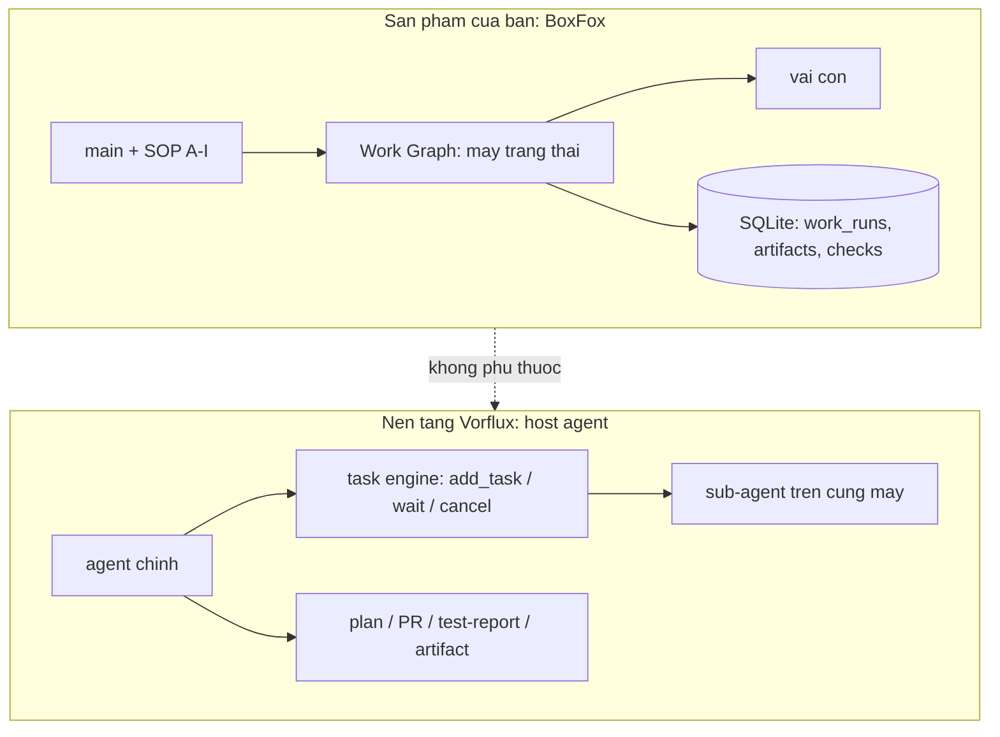
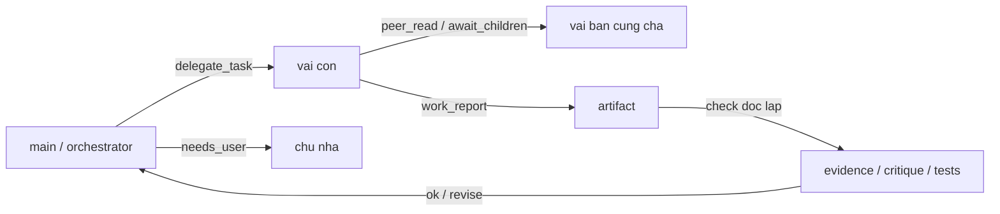
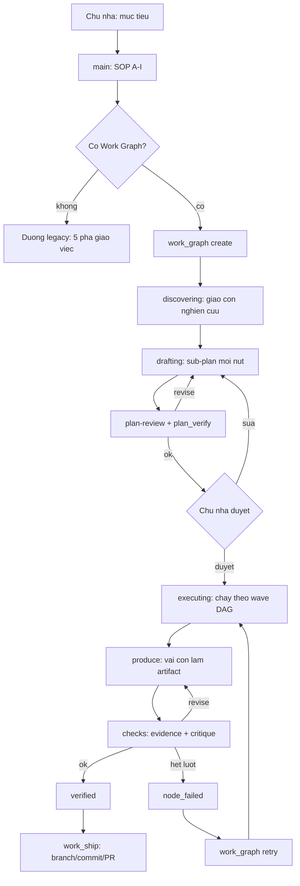
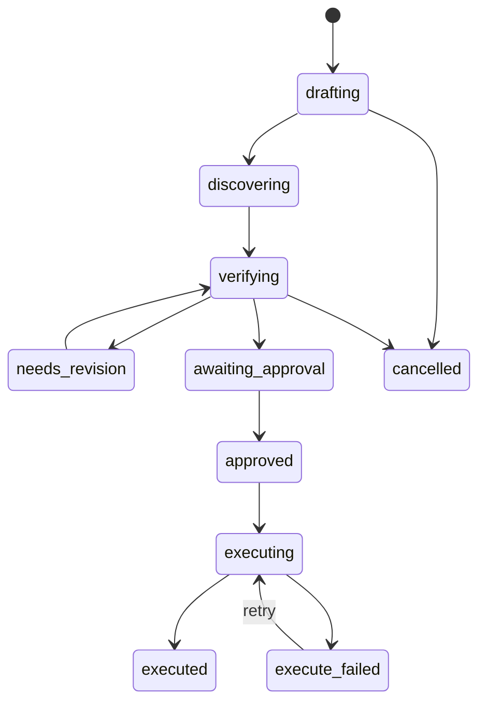
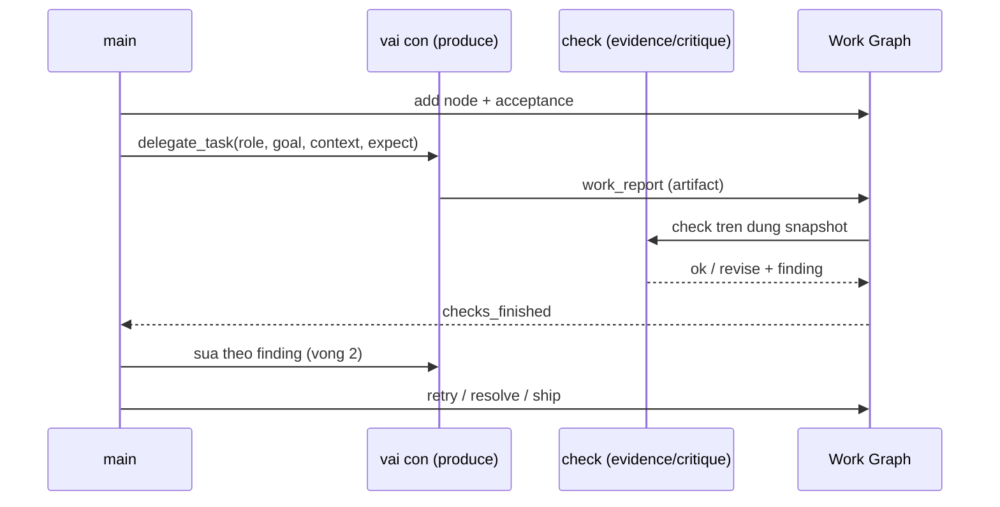
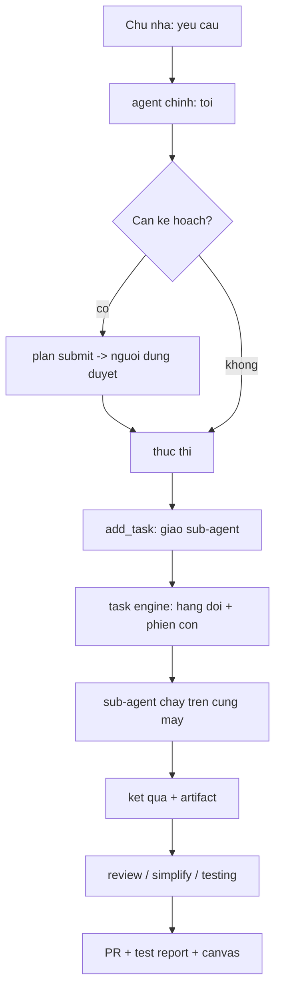
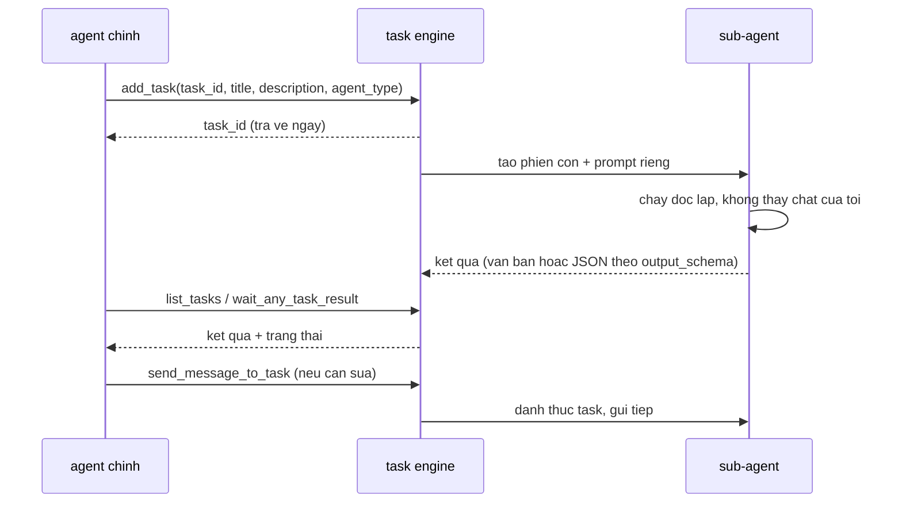
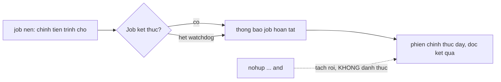
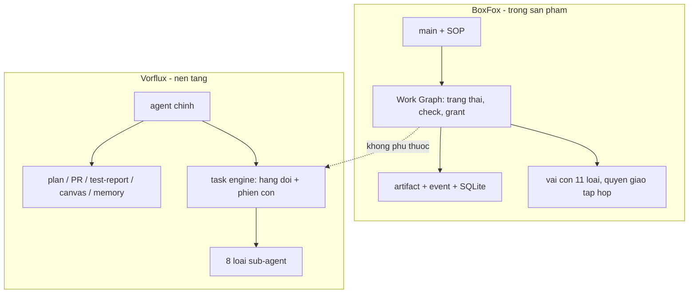
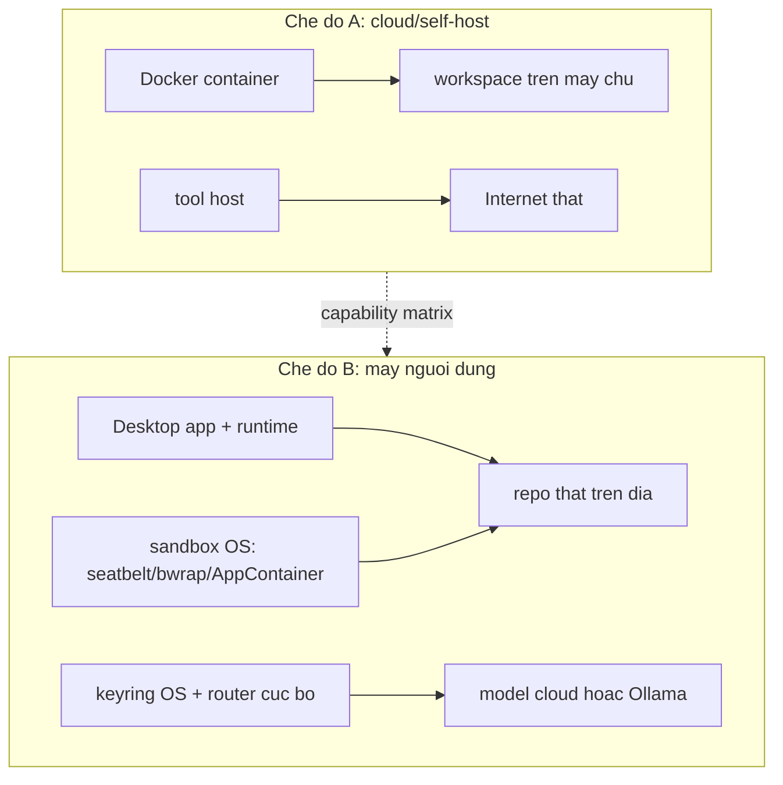

# Đối chiếu tầng điều phối: BoxFox (sản phẩm) vs Vorflux (nền tảng chạy agent)

> **Trạng thái:** Tài liệu đối chiếu kỹ thuật, viết ngày 2026-10-03, đọc trực tiếp từ mã trong
> repo này và từ cấu hình runtime của phiên Vorflux đang thi công. Không phải đặc tả sản phẩm;
> mọi con số của BoxFox đều kèm đường dẫn mã, mọi mô tả về Vorflux đều nói rõ nó là **cấu trúc
> prompt/hợp đồng công cụ của nền tảng**, không phải mã trong repo.
>
> **Neo phép đo:** bộ W10.F tuần tự đang chạy trên cây `6adbe78`. Tài liệu này là **file mới
> thuần tài liệu**, không sửa mã mà bộ đo đang chạy.

---

## 0. Mục đích

Câu hỏi cần trả lời: *BoxFox đang tổ chức prompt, skill, tool, quyền và điều phối như thế nào;
Vorflux (nền tảng chạy agent) tổ chức như thế nào; hai bên khác nhau ở đâu; và hướng tinh chỉnh
nào là hợp lý.*

Cả hai hệ **cùng một gốc ý tưởng**: `roles.py` của BoxFox ghi rõ *"Adapted from Hermes
delegate_tool_toolsets.py"*, và BoxFox vendor nguyên cây skill của Hermes
(`backend/src/agentbox/vendor/hermes/skills/`, 69 `SKILL.md`). Vì vậy hai bên dùng chung từ vựng
(role, delegate, child, skill, tool group) nhưng **đặt tầng điều phối ở hai nơi khác nhau**.

Định nghĩa dùng thống nhất trong tài liệu: **tầng điều phối** là phần trả lời bốn câu hỏi —
*ai làm việc này*, *với quyền gì*, *ngân sách nào*, *bằng chứng nào và ai duyệt*.

---

## 1. Tóm tắt một trang

| Khía cạnh | BoxFox (sản phẩm của bạn) | Vorflux (nền tảng của tôi) |
|---|---|---|
| Nơi đặt | TRONG sản phẩm, chạy trong Docker sandbox của người dùng | NGOÀI sản phẩm; là runtime host agent trên máy này |
| Bộ điều phối | phiên `main` (LLM) + **Work Graph** — máy trạng thái tất định | agent chính (tôi) + **task engine** của nền tảng |
| Hợp đồng điều phối | SOP pha A–I + bộ tool `work_*` | luật nền tảng: plan approval, PR, test-report, các pha review/simplify/testing |
| Máy trạng thái | có (`drafting → … → executed/execute_failed`) | không có (tôi giữ mạch việc) |
| Cưỡng chế quyền | bằng mã: con = cha ∩ vai, nút kiểm chỉ-đọc, `WORK_*` codes | mềm: do tôi + hợp đồng công cụ |
| Ngân sách | `maxSteps`/`deadlineSeconds`/token/fan-out slot | `timeout_seconds`, cost limit phiên, rate limit automation |
| Bằng chứng | artifact + check + event stream trong SQLite | artifact + test report + PR + canvas |
| Người dùng thao tác | card duyệt (`action=submit`), `retry` nút, `needs_user` | nhắn tôi, duyệt plan, xem canvas/PR |
| Số vai | 11 vai con | 8 loại sub-agent |
| Điểm mạnh | tất định, kiểm toán được, chạy offline trong sản phẩm | linh hoạt, mở rộng nhanh, kết quả kiểm được bằng schema |
| Điểm yếu | cứng: luật gì cũng phải viết thành mã; trần token ra 4096 | phụ thuộc phán đoán của agent; không có lưu vết máy móc |

---

## 2. BoxFox — tầng điều phối nằm trong sản phẩm

### 2.1 Bộ điều phối gồm hai lớp

1. **Phiên `main` (orchestrator).** Là một phiên LLM bình thường nhưng nhận
   `ORCHESTRATOR_SOP_GUIDANCE` (`backend/src/agentbox/agent_core/runtime.py:233` và tiếp). SOP
   chia việc thành các pha A–I, trong đó có câu bắt buộc: *"For any non-trivial development,
   bugfix, refactoring, or feature request: NEVER attempt to do everything in a single turn. You
   MUST invoke your specialists via `delegate_task`."*
2. **Work Graph** (`work_graph.py`) — máy trạng thái tất định đặt **trên** main. Main không tự
   quyết định "xong"; nó phải đi qua các trạng thái run, nút, pha, artifact và lượt kiểm.

Trạng thái run (`work_graph.py:83` `DRIVING_STATUSES` và các nhánh còn lại):

```
drafting → discovering → verifying → needs_revision | verified
        → awaiting_approval → approved → executing → executed | execute_failed
```

`TERMINAL_STATUSES` chặn mọi thao tác sửa sau khi run đóng (`WORK_RUN_CLOSED`), và mọi thao tác
sửa trong lúc `work_run` đang chạy bị chặn bằng `WORK_RUN_BUSY`.

### 2.2 Cách dựng system prompt

**Phiên bất kỳ** (`runtime.py:1954`–`1978`):

```
<identity>                       # AGENT.md ở gốc repo nếu có, không thì IDENTITY mặc định
=== ASSIGNED ROLE: <ROLE> ===    # chỉ phiên con
<role_instructions>              # roles.py: EXPLORE_INSTRUCTIONS, BUILD_INSTRUCTIONS, …
<required_text>                  # kỹ năng BẮT BUỘC của research / research-review, nhúng nguyên văn
=== ENABLED SKILLS (Load full content via skill_view before executing complex workflows) ===
<self.catalog.prompt(skills)>    # chỉ "- id: description" cho từng kỹ năng được bật
=== ANSWER LENGTH ===
<ANSWER_LENGTH_HINT>
<evidence_line>                  # CHỈ phiên chính (không phải phiên con)
=== OWNER-CONFIGURED DIRECTIVES ===   # nếu chủ nhà cấu hình systemPromptAppended
```

Ba điểm đáng chú ý:

- **Identity đọc từ `AGENT.md` ở gốc repo** (`get_agent_identity()`, `runtime.py:291`), fallback
  về chuỗi `IDENTITY` ghép từ các khối hướng dẫn (`TOOL_USE_ENFORCEMENT_GUIDANCE`,
  `EXECUTION_DISCIPLINE_GUIDANCE`, `ACT_DONT_ASK_GUIDANCE`, `TASK_COMPLETION_GUIDANCE`,
  `PARALLEL_TOOL_CALL_GUIDANCE`).
- **Phiên con không nhận dòng bằng chứng dành cho chủ nhà** (`ANSWER_EVIDENCE_LINE`): con trả kết
  quả theo hợp đồng con, không trả báo cáo cho người dùng cuối.
- **Kỹ năng chỉ vào prompt bằng một dòng mô tả.** Nội dung đầy đủ phải gọi `skill_view`, tức là
  ngân sách ngữ cảnh chỉ bị tiêu khi vai thật sự cần.

### 2.3 Giao việc: `delegate_task`

Tham số (theo hợp đồng công cụ và chỗ dựng prompt, `runtime.py:6985`–`7090`):

| Tham số | Vai trò | Cắt biên |
|---|---|---|
| `role` | chọn vai con | phải có trong `ROLES` |
| `goal` | nhiệm vụ | là dòng đầu của prompt con |
| `context` | dữ liệu cha cung cấp | `≤ 16000` ký tự (`[:16000]`) |
| `expect` | dạng kết quả cha cần | `≤ CHILD_EXPECT_MAX_CHARS = 2000` |
| `reviewTarget` | ràng buộc đọc đúng file trước khi chấm | thêm một dòng "Binding from the harness" |
| `deliverTo` | giao kết quả cho phiên bạn | `≤ PEER_DELIVER_MAX`, vượt thì **báo lỗi**, không cắt im lặng |
| `wait` | chờ hay chạy nền | `false` thì cha đọc sau bằng `await_children` |

Prompt con = `goal` (+ brief dựng từ scope cho research) → `Parent-supplied context (data)` →
`Parent-required deliverable and evidence (result shape)` → **hợp đồng đầu ra**:

- Work Graph: `work_prompts.child_contract(purpose, lang)` — theo `purpose`:
  - `review`: bắt buộc có **object `coverage` trong fenced json** (mỗi criterion id/status/target/
    evidence đúng một lần) và **đúng một dòng cuối** `VERDICT: ok` hoặc `VERDICT: revise`;
  - `knowledge`: dùng `DELIVERABLE_LOOKUP` (trần 120 từ cho mục `## Trả lời`/`## Answer`);
  - `produce`: hợp đồng đầy đủ — *"đặt toàn bộ báo cáo trong câu trả lời cuối cho reviewer độc
    lập"*, dữ kiện phải có `path:line`/URL đã mở hoặc output lệnh thật.
- Ngoài Work Graph: `CHILD_RESULT_CONTRACT` (`runtime.py:1415`) — bốn mục **Findings / Evidence /
  Verification performed / Limitations & open questions**, kèm câu *"An unevidenced claim is a
  failure, not an answer"* và luật hết ngân sách thì trả chẩn đoán `partial`.

### 2.4 Mười một vai và bộ quyền

`ROLES` (`roles.py:277`): `explore`, `plan`, `plan-review`, `design`, `build`, `debug`, `review`,
`simplify`, `testing`, `research`, `research-review`.

Quyền là các **frozenset** ghép theo nhóm (`roles.py:1`–`35`):

| Nhóm | Nội dung | Ghi chú |
|---|---|---|
| `DECISION` | `ask_user`, `request_approval` | có trong `READ` nhưng **bị chặn ở runtime** cho phiên con |
| `PEER` | `peer_read`, `await_children` | mọi vai đều có (READ là gốc) |
| `READ` | `file_read`, `codebase_glob`, `codebase_grep`, `skills_list`, `skill_view` + `DECISION` + `PEER` | |
| `WRITE` | `READ` + `file_write`, `file_edit_block`, `terminal_exec` | `build`, `debug`, `simplify`, `testing` |
| `VISUAL` | `computer_screen_capture`, `computer_screen_record`, `computer_use`, `browser_use`, `inspect_element` + `DECISION` | |
| `VERIFY` | `verify_exec` | reviewer chạy **một** claim tính toán trong sandbox tạm, repo chỉ-đọc |
| `RESEARCH` | `READ` + web/browser + `SOURCE_TOOLS` (`source_add`/`source_list`) + `SOURCE_READ` + `BRANCH_REPORT` | chỉ vai `research` |
| `SOURCE_TOOLS` | `source_add`, `source_list` | sổ nguồn: con research GHI dòng sổ, **không** ghi hồ sơ |
| `SOURCE_READ` | `source_list`, `source_verify`, `research_status` | vai phản biện đọc để tự kiểm |
| `BRANCH_REPORT` | `research_branch_report` | trả bài có cấu trúc trong MỘT lượt gọi |

### 2.5 Cưỡng chế quyền (khác biệt lớn nhất so với nền tảng)

Quyền con **không** phải bản sao quyền vai; nó là **giao**:

```python
child = self.create(..., parent_tools=config['tools'])   # runtime.py ~7008
```

và bị chặn thêm theo **ngữ cảnh công việc**:

- `binding['checkId']` ⇒ cấm `file_write`, `file_edit_block`, `write_plan`, `delegate_task`
  (`WORK_CHECK_READ_ONLY`), và bộ tool bị thay bằng `work_check_tools(role, parent_tools)`;
- `binding['diagnosticOnly']` ⇒ cấm `file_write`/`file_edit_block` (`WORK_DIAGNOSTIC_READ_ONLY`);
- phiên con gọi `ask_user`/`request_approval` ⇒ `DECISION_UNAVAILABLE: a delegated session cannot
  ask the user; decide from your own evidence` (`runtime.py:5486`);
- `terminal_exec` của con đọc **phạm vi của lượt chủ** (`work_scope`), ra ngoài phạm vi thì bị
  `WORK_SCOPE_TERMINAL_MUTATING`;
- `work_scope` còn chặn theo vai: `WORK_SCOPE_DELEGATE_ROLE`, `WORK_SCOPE_COMMAND_ROLE`,
  `WORK_SCOPE_ARTIFACT_ONLY`, `WORK_SCOPE_APPROVAL_REQUIRED`, `WORK_SCOPE_RUN_CLOSED`,
  `WORK_CAPABILITY_REVOKED`.

### 2.6 Skill

- Catalog: `backend/src/agentbox/skills/catalog.py`; `prompt(enabled)` chỉ in `- id: description`.
- Nội dung đọc bằng `skill_view`; mỗi kỹ năng có `basePath = /opt/boxfox-skills/<...>`, `sha256`,
  danh sách `linkedFiles` — tức là kỹ năng là **gói file có hash**, không phải văn bản rời.
- Ánh xạ vai → kỹ năng: `ROLE_SKILLS` (`skills/commands.py:40`), ví dụ:
  - `explore`: `codebase-inspection`, `ast-grep`
  - `plan`: `codebase-inspection`, `planning`, `grill-me`, `work-graph-planning`
  - `build`: `codebase-inspection`, `test-driven-development`, `claude-design`, `popular-web-designs`, `design-md`
  - `testing`: `test-driven-development`, `dogfood`, `claude-design`
  - `research`: `research-team`, `research-search`, `research-reading`, `research-evidence`, `grounded-citations`, `arxiv`, `blocked-page-recovery`, `codebase-inspection`
- **Kỹ năng bắt buộc nhúng nguyên văn** cho research/research-review (`runtime.py:1957`), không qua
  `skill_view` — vì đó là luật, không phải tuỳ chọn.
- Kho kỹ năng vendor từ Hermes: `backend/src/agentbox/vendor/hermes/skills/` — 69 `SKILL.md`.

### 2.7 Tool

Tên công cụ có adapter thật (`tool_contracts.py`, `tool('name', …)`), 55 công cụ:

```
file_read, file_write, file_edit_block, codebase_glob, codebase_grep, terminal_exec,
verify_exec, computer_screen_capture, computer_screen_record, computer_use, browser_use,
inspect_element, web_search, web_fetch, read_source, paper_citations, skills_list,
skill_view, session_search, peer_read, await_children, journal_write, journal_brief,
delegate_task, ask_user, request_approval, write_plan, plan_verify, plan_scope,
source_add, source_list, source_verify, claim_assess, dossier_write,
research_branch_report, research_brief, research_verify, research_status,
research_update, research_suggest, research_scope, cancel_child, design_scope,
design_branch_create, design_write, design_diff, design_revert, design_review,
design_report, canvas_draw, work_graph, work_run, work_check, work_report,
work_artifact_read, work_ship, interview
```

Bộ **chỉ orchestrator** giữ (con không có): `work_graph`, `work_run`, `work_ship`,
`work_check`, `work_report`, `interview` (`WORK_TOOLS`, `runtime.py:1218`).

### 2.8 Ngân sách và vòng đời

`limits.py` (đã cập nhật theo quyết định chủ nhà #6457, 03/10/2026):

| Hằng số | Giá trị | Ghi chú |
|---|---|---|
| `MAX_STEPS_DEFAULT` / `MAX_STEPS_MAX` | 120 / 400 | phiên chính |
| `DEADLINE_DEFAULT_SECONDS` / `MAX` | 1800 / 7200 | phiên chính |
| `CHILD_MAX_STEPS` | 200 | trần con, vẫn `min()` theo cha |
| `CHILD_DEADLINE_SECONDS` | 3600 | trần con |
| `FANOUT_PER_PARENT_DEFAULT` / `MAX` | 3 / 6 | slot mỗi cha |
| `FANOUT_GLOBAL_CEILING` | 8 | trần toàn cục |
| `FANOUT_QUEUE_WAIT_SECONDS` | 30 | hết slot thì xếp hàng, quá thì `FANOUT_BUSY` |
| `PEER_WAIT_TOTAL_MAX_SECONDS` | 300 | trần chờ phiên bạn mỗi lượt |
| `ROUTER_BODY_BUDGET` | 900 KiB | trần byte thân request (không phải token) |
| `INSTRUCTIONS_MAX_CHARS` | 12 000 | chỉ thị chủ nhà cấu hình |

Ngoài ra: `work_budget.applied(request, config)` trả `{profile, requestedMaxSteps,
effectiveMaxSteps, requestedDeadlineSeconds, effectiveDeadlineSeconds, clamped}` — tức là **nói
thật khi bị kẹp**, và `lifetime` đếm `calls`/`children`/`seconds`/`childSeconds` cho mỗi run.

### 2.9 Bằng chứng và lưu vết

- `work_report` → artifact (có hash, có binding `codeSnapshot`) → lượt kiểm độc lập
  (`evidence` / `critique` / `tests` / `whole`).
- Mọi thứ nằm trong SQLite của sản phẩm (`work_runs`, artifact, checks, history), kèm event stream
  của từng phiên con mà UI đọc được (`peer_read` đọc chính luồng đó, có cắt biên).
- Vòng sửa: `needs_revision` → `work_graph action=retry` chạy lại nút với findings; quá trần thì
  `WORK_CHECK_EXHAUSTED`.

### 2.10 Mã lỗi tiêu biểu (trích)

`WORK_ARTIFACT_UNKNOWN`, `WORK_FINDING_UNCITED`, `WORK_SCOPE_TERMINAL_MUTATING`,
`WORK_SCOPE_DELEGATE_ROLE`, `WORK_SCOPE_RUN_CLOSED`, `WORK_CAPABILITY_REVOKED`,
`WORK_CHECK_EXHAUSTED`, `WORK_RUN_BUSY`, `WORK_RUN_CLOSED`, `WORK_CHECK_READ_ONLY`,
`WORK_DIAGNOSTIC_READ_ONLY`, `DECISION_UNAVAILABLE`, `DECISION_INVALID`, `FANOUT_BUSY`,
`STEP_BUDGET_EXHAUSTED`, `TURN_CANCELLED`, `TURN_EXTENDED`, `PEER_WAIT_CLAMPED`,
`PLAN_APPROVAL_UNVERIFIED`, `PLAN_VERDICT_MISSING_AT_TURN_END`, `PLAN_SOURCES_REJECTED`.

Điểm chung của các mã này: **nói ra luật bị vi phạm và trường nào sai**, để mô hình sửa một lần
chứ không gửi lại y nguyên.

---

## 3. Vorflux — tầng điều phối nằm ngoài sản phẩm

Phần này mô tả **cấu trúc** hợp đồng mà agent chính (tôi) đang chạy: các khối prompt, bộ công cụ,
luật quy trình. Đây không phải mã trong repo BoxFox, và cũng không phải bản sao nguyên văn prompt
của nền tảng — nó là bản mô tả cấu trúc + những luật có ảnh hưởng trực tiếp tới cách việc được
giao và được nghiệm thu.

### 3.1 Prompt của agent chính gồm những khối nào

| Khối | Nội dung | Ảnh hưởng tới công việc |
|---|---|---|
| Vai & phong cách | ngôn ngữ trả lời, độ dài, cấm bịa hội thoại, ASD-STE100 khi được yêu cầu | quyết định hình dạng mọi câu trả lời cho người dùng |
| Chế độ suy nghĩ | chỉ dùng extended thinking khi thật cần | chi phí/độ trễ |
| Đầu ra & artifact | đường dẫn artifact, cách đính kèm file, quy tắc một canvas mỗi lượt | nơi bằng chứng được đặt |
| An toàn dữ liệu | truy vấn production phải bounded, ít song song | ràng buộc khi chạm dữ liệu thật |
| Bộ nhớ chia sẻ | `/memory/knowledge`, `/memory/user-preferences/<user_id>`, `/memory/sessions`, `/memory/testing`, `/memory/setup-learnings`, `/memory/scripts` | nguồn ngữ cảnh dài hạn |
| Skill | 14 skill hệ thống trong `/code/.skills/system/`, cộng skill của repo (`.claude/skills/`) | quy trình viết sẵn, đọc trước khi làm |
| Subagent | 8 loại, luật giao việc, luật chờ kết quả | cách chia việc |
| Git/PR | skill `git-pr-workflow` bắt buộc đọc trước khi push/PR | chuẩn hoá nhánh, mô tả, review |
| Quy trình plan | `plan submit` / `plan approve`, plan phải được duyệt tường minh | chốt phạm vi với người dùng |
| Pha chất lượng | sau khi code xong phải gửi đúng **một** thông báo chuyển pha, kèm URL PR draft | nhịp báo cáo |
| Testing | bắt buộc giao cho subagent `testing`; agent chính không được tự viết Test Report | tách người làm / người kiểm |
| Post-merge | `pr impact` khi phát hiện PR đã merge gây lỗi | truy vết hậu kiểm |
| Công cụ | danh sách tool + `vflux_exec` với ~20 nhóm lệnh | năng lực thật |
| Nén ngữ cảnh | chế độ compaction có trigger riêng | vòng đời phiên dài |

### 3.2 Giao việc: `add_task` và bộ công cụ task

```json
add_task(
  task_id        // duy nhất trong phiên
  title          // 3–6 từ, hiện trên UI
  description    // WHAT: mọi ngữ cảnh để chạy tự chủ
  instructions   // HOW: chỉ ghi khi cần ghi đè quy trình
  agent_type     // explore|plan|design|build|debug|review|simplify|testing
  output_schema  // JSON Schema kiểm kết quả (workflow_mode)
  phase, component
  workflow_mode  // prompt hệ thống rút gọn + bắt buộc ghi RESULT_FILE
  timeout_seconds
)
```

Bộ công cụ vòng đời: `list_tasks`, `wait_any_task_result`, `send_message_to_task`,
`cancel_task`, `abandon_blocked_task`.

Khác biệt cốt lõi so với `delegate_task`: **không có hợp đồng đầu ra mặc định**. Nếu tôi không
viết `description` đủ, subagent không có gì để bám — nó không thấy hội thoại. Bù lại, ở
`workflow_mode` kết quả bị **kiểm bằng schema**, thứ mà BoxFox chỉ làm được ở mức văn bản.

### 3.3 Tám loại sub-agent

| Loại | Việc | Được sửa file? | Ghi chú |
|---|---|---|---|
| `explore` | tìm kiếm/thu thập ngữ cảnh trong repo | không | loại trừ debug/điều tra nguyên nhân |
| `plan` | soạn kế hoạch triển khai tập trung | không | |
| `design` | mockup HTML/CSS + `design-plan.json` | chỉ mockup | xem qua `plan submit --design-file-paths` |
| `build` | triển khai + **viết test case/fixture của sản phẩm** | có | một việc triển khai thì agent chính tự làm |
| `debug` | lỗi, log, tái hiện, kiểm định giả thuyết | có | |
| `review` | soát mã + đánh giá rủi ro khi được yêu cầu | không | phản hồi được chuyển lại cho bên làm |
| `simplify` | tái cấu trúc/đơn giản hoá phần thay đổi | đề xuất | |
| `testing` | kiểm chứng theo yêu cầu, dựng môi trường, trả bằng chứng + Test Report | không viết test sản phẩm | loại duy nhất có `ask_non_blocking_question` |

### 3.4 Hợp đồng công cụ của agent chính

- **File/shell**: `read`, `write_file`, `edit_file`, `bash_execute` (có `run_in_background`,
  `job` để đọc log/status/kill, `wait_any_job_result`).
- **Repo**: `list-git-repositories`, `resolve-git-repository-path`, `vflux_exec session repos-set`.
- **Web**: `web_search`, `context7 resolve-library-id` / `query-docs`.
- **Nền tảng** (`vflux_exec`, ~20 nhóm): `session` (repos-set, fork, message-user, preview-url,
  group-add, search-history, start), `plan` (submit/approve/reply), `pr` (create/comment/review/
  edit/reply/upsert-review-section/report-risk/impact), `test-report submit`, `merge-queue`,
  `blueprint`, `workflow-script`, `memory-snippet`, `secret request|resolve`,
  `file-access request`, `port expose`, `ios-build`, `artifact`, `jira`, `repo learned-knowledge`,
  `schedule create`, `automation create`, `ask_user`.
- **Tương tác người dùng**: `ask_user` (1–5 câu hỏi có lựa chọn), `render_canvas`,
  `add_todos`/`update_todo`/`list_todos`, `complete_without_response`.
- **Tự báo cáo**: `report_infrastructure_issue`.

### 3.5 Luật quy trình (phần "máy trạng thái" mềm của nền tảng)

1. **Plan**: chỉ dùng khi người dùng yêu cầu rõ, hoặc khi khám phá repo cho thấy một quyết định
   sản phẩm/kiến trúc chưa ngã ngũ. Plan đã gửi thì phiên dừng chờ duyệt.
2. **Pha chất lượng**: sau khi code xong, gửi **đúng một** thông báo chuyển pha (kèm URL PR), rồi
   mới gọi `simplify`/`review`/`testing`.
3. **Simplify/Review**: mỗi vòng tối đa 2 lượt phản hồi; phản hồi ngoài phạm vi thì `scope-feedback
   surface` và không chặn việc đang làm.
4. **Testing**: subagent `testing` tự hỏi khi bị chặn; agent chính **không** được viết Test Report
   thay; mỗi chu kỳ kiểm chỉ submit **một** báo cáo, có `--status`, `--coverage`, `--blocked-reason`.
5. **PR**: đọc skill `git-pr-workflow` trước mọi thao tác; chế độ open-PR thì mở PR thật, chế độ
   draft-PR thì để draft; PR phải có mục Testing và (nếu có) Out-of-Scope Feedback.
6. **Post-merge**: `pr impact` khi phát hiện PR đã merge gây lỗi — chỉ ghi vào lịch sử PR, không
   gửi thông báo.
7. **An toàn dữ liệu production**: truy vấn bounded, ít song song, ưu tiên nguồn hẹp.

### 3.6 Bộ nhớ, artifact, canvas

- **Bộ nhớ**: `/memory/knowledge` (gotcha, cách làm đã kiểm), `/memory/user-preferences/<user_id>`
  (chỉ đọc file của chính người dùng hiện tại), `/memory/sessions` (transcript phiên trước),
  `/memory/testing`, `/memory/scripts`, `/memory/automations`, `/memory/scheduled-sessions`.
- **Artifact**: `/code/.generated_artifacts/` cho file người dùng tải; ảnh/ghi hình của subagent
  vào `images/` và `recordings/`; agent chính **chọn lọc** artifact để trình bày, không đổ hết.
- **Canvas**: tài liệu trực quan một cột, spec JSON có kiểm lược đồ; bản v2 thêm từ vựng
  `document`/`presentation` (eyebrow, summary, metadata, treatment, navigation, section layout).

### 3.7 Cơ chế đánh thức và vòng đời job

Đây là phần **khác hẳn** BoxFox và cũng là chỗ dễ hiểu sai nhất:

- Agent chính **không chạy liên tục**. Giữa hai lượt, nó không tồn tại như một tiến trình suy nghĩ.
- Việc dài được đẩy thành **background job** trên máy; khi job kết thúc, nền tảng **đánh thức**
  phiên bằng một thông báo, và lượt mới bắt đầu từ đó.
- Hệ quả thực tế: một job tách rời (chỉ ghi log, không phải job do nền tảng quản) **không** đánh
  thức được ai. Muốn có bảo đảm "xong thì báo", phải dùng job có watchdog của nền tảng.
- `session fork` tạo phiên con độc lập cho một việc riêng (không đọc lại kết quả); subagent thì
  ngược lại — chạy song song nhưng **kết quả trả về cho agent chính**.

### 3.8 Ngân sách và giới hạn

| Loại | Cơ chế |
|---|---|
| Thời gian mỗi task | `timeout_seconds` khi `add_task`; subagent có thể bị `cancel_task` |
| Chi phí phiên | `automation create --session-cost-limit-usd` |
| Nhịp automation | `--rate-limit-max-runs` + `--rate-limit-window-seconds` |
| Job nền | watchdog theo `timeout_seconds`; `-1` cho tiến trình dài hạn |
| Vòng review | tối đa 2 vòng phản hồi cho mỗi lần gọi simplify/review |
| Nén ngữ cảnh | compaction theo trigger của framework |

---

## 4. Đối chiếu chi tiết theo từng trục

### 4.1 Prompt

| Câu hỏi | BoxFox | Vorflux |
|---|---|---|
| Prompt dựng ở đâu | trong runtime sản phẩm, hàm tạo phiên (`runtime.py:1954`) | nền tảng dựng harness; tôi cấp `description`/`instructions` |
| Identity lấy từ đâu | `AGENT.md` gốc repo, fallback chuỗi `IDENTITY` | không có file identity trong repo người dùng |
| Prompt vai | `roles.py`, mỗi vai một khối instructions cố định | mỗi loại sub-agent có prompt hệ thống riêng của nền tảng |
| Kỹ năng vào prompt thế nào | một dòng `- id: description`, nội dung gọi bằng `skill_view` | tên skill + đường dẫn file; tôi phải dặn đọc file |
| Hợp đồng đầu ra | `child_contract(purpose)` hoặc `CHILD_RESULT_CONTRACT` (bốn mục bắt buộc) | tôi tự viết; `workflow_mode` thì có schema kiểm |
| Cắt biên | context ≤16k, expect ≤2k, echo ≤3k ký tự | `description`/`instructions` không bị cắt, nhưng tôi phải tự đủ ngữ cảnh |
| Chỉ thị người dùng cuối | `OWNER-CONFIGURED DIRECTIVES` ≤12 000 ký tự | `preferences.md` của người dùng trong `/memory/user-preferences/<id>/` |

### 4.2 Skill

| Câu hỏi | BoxFox | Vorflux |
|---|---|---|
| Nơi chứa | `vendor/hermes/skills/` (69 `SKILL.md`) + catalog | `/code/.skills/system/` (14 skill) + skill repo (`.claude/skills/`) |
| Định danh | `id`, `description`, `sha256`, `linkedFiles`, `basePath` | tên + đường dẫn file |
| Lọc theo vai | `ROLE_SKILLS` bắt buộc; giao với skill bật ở phiên | tôi tự quyết định đọc skill nào |
| Kỹ năng bắt buộc | nhúng nguyên văn cho research/research-review | không có cơ chế tương đương |

### 4.3 Tool

| Câu hỏi | BoxFox | Vorflux |
|---|---|---|
| Số lượng | 55 công cụ có adapter | ~25 tool trực tiếp + ~20 nhóm lệnh `vflux_exec` |
| Bộ chỉ orchestrator | `work_graph`, `work_run`, `work_ship`, `work_check`, `work_report`, `interview` | các lệnh nền tảng (`plan`, `pr`, `test-report`, `merge-queue`, …) |
| Giao quyền | giao tập hợp (cha ∩ vai), chặn theo ngữ cảnh | không giao tập hợp; tôi tự giới hạn bằng lời |
| Công cụ đặc thù | `verify_exec`, `peer_read`, `await_children`, `canvas_draw`, `work_artifact_read` | `render_canvas`, `pr_tour`, `job`, `wait_any_job_result`, `ask_user` |

### 4.4 Quyền

| Câu hỏi | BoxFox | Vorflux |
|---|---|---|
| Mặc định | không có quyền nào ngoài tập vai | mọi subagent là agent đầy đủ trên máy |
| Chặn theo ngữ cảnh | có (nút kiểm chỉ-đọc, chẩn đoán không được vá, phạm vi terminal) | không có; tôi phải viết rõ trong `instructions` |
| Hỏi người dùng | bị chặn cho con (`DECISION_UNAVAILABLE`) | chỉ `testing` có `ask_non_blocking_question` |
| Đọc phiên bạn | có (`peer_read`), chỉ đọc event, có trần | không có |
| Phê duyệt | `work_graph action=submit` → card duyệt; Autopilot tự duyệt | `plan submit` → người dùng duyệt; PR review |

### 4.5 Ngân sách

| Câu hỏi | BoxFox | Vorflux |
|---|---|---|
| Bước | phiên chính 120 (trần 400); con 200 | không có trần bước |
| Thời gian | chính 1800 s (trần 7200); con 3600 s | `timeout_seconds` mỗi task, không trần cứng |
| Token ra | mặc định 4096; 16 000 cho check/plan/design/research/knowledge | không đặt |
| Song song | fan-out 3/6/8 + hàng đợi 30 s | tôi tự dispatch, không có slot |
| Bị kẹp thì sao | `work_budget.applied(...).clamped` nói thật | tôi tự thấy timeout/không thấy |

### 4.6 Bằng chứng và ai duyệt

| Câu hỏi | BoxFox | Vorflux |
|---|---|---|
| Đơn vị bằng chứng | artifact + hash + binding snapshot mã + lượt kiểm | file artifact + log + test report + PR |
| Kiểm độc lập | có, là bước bắt buộc trong Work Graph | có, do tôi gọi `testing`/`review` |
| Nơi lưu | SQLite sản phẩm + event stream | máy này (`/code/.generated_artifacts/`, PR, canvas) |
| Ai duyệt cuối | chủ nhà, qua card duyệt hoặc Autopilot | người dùng, qua chat/plan/PR |

---

## 5. Canvas v2 — nội dung đã trình bày cho chủ nhà

Canvas `boxfox-vs-vorflux-subagents` (phiên 2026-10-03) là bản trực quan của tài liệu này. Nội dung
của nó, giữ nguyên để đối chiếu:

### 5.1 Sự kiện nhanh

| Nhãn | Giá trị |
|---|---|
| Vai con của BoxFox | 11 (explore, plan, plan-review, design, build, debug, review, simplify, testing, research, research-review) |
| Loại sub-agent của Vorflux | 8 (explore, plan, design, build, debug, review, simplify, testing) |
| BoxFox — con hỏi người dùng | BỊ CHẶN: `DECISION_UNAVAILABLE` |
| Vorflux — sub-agent hỏi người dùng | chỉ loại `testing` (`ask_non_blocking_question`) |
| Trần token ra của BoxFox | 4096 mặc định; 16 000 cho check/plan/design/research |

### 5.2 Tầng điều phối — sản phẩm của bạn vs nền tảng của tôi

| Khía cạnh | BoxFox | Vorflux |
|---|---|---|
| Nơi đặt | TRONG sản phẩm, chạy trong Docker sandbox của người dùng | NGOÀI sản phẩm; runtime host agent trên máy này |
| Ai/cái gì điều phối | phiên `main` + Work Graph là máy trạng thái tất định | agent chính + task engine của nền tảng |
| Hợp đồng điều phối | SOP pha A–I + bộ tool `work_*` | luật nền tảng: plan approval, PR, test-report, review/simplify/testing |
| Máy trạng thái | có (`drafting → … → executed`) | không có |
| Cưỡng chế | quyền con = cha ∩ vai; nút kiểm chỉ-đọc; `WORK_RUN_BUSY` | mềm: agent chính + hợp đồng công cụ |
| Ngân sách | `maxSteps`, `deadlineSeconds`, token, slot fan-out 3/6/8 | timeout mỗi task, cost limit phiên, rate limit automation |
| Bằng chứng/lưu vết | artifact + check + event stream trong SQLite | artifact + test report + PR + canvas |
| Người dùng thao tác | card duyệt (`action=submit`), `retry` nút, `needs_user` | nhắn agent, duyệt plan, xem canvas/PR |
| Mạnh | tất định, kiểm toán được, chạy offline trong sản phẩm | linh hoạt, mở rộng nhanh, kết quả kiểm bằng schema |
| Yếu | cứng: luật gì cũng phải viết thành mã; trần 4096 | phụ thuộc phán đoán của agent; không lưu vết máy móc |

### 5.3 Sơ đồ hai tầng



### 5.4 Vòng giao việc của BoxFox



---

## 6. Khác biệt then chốt và hướng tinh chỉnh

### 6.1 Năm khác biệt có ảnh hưởng thật

1. **Nơi đặt máy trạng thái.** BoxFox buộc mọi bước đi qua một máy trạng thái có mã lỗi; Vorflux
   để agent chính tự giữ mạch. Hệ quả: BoxFox tái lập được một lần chạy hỏng, Vorflux thì phải
   đọc lại log.
2. **Cách cấp quyền.** BoxFox giao tập hợp và chặn theo ngữ cảnh; Vorflux cấp toàn quyền máy rồi
   dựa vào lời dặn. Hệ quả: một subagent Vorflux có thể vô tình sửa file sản phẩm; một vai con
   BoxFox thì không (nếu binding nói chỉ-đọc).
3. **Đường hỏi người dùng.** BoxFox cấm con hỏi; Vorflux cho `testing` hỏi. Hệ quả: BoxFox phải
   dựng đường "main chuyển tiếp" và nó là điểm nghẽn; Vorflux giảm được vòng lặp nhưng đổi lại
   câu hỏi đến người dùng từ một tiến trình mà người dùng không thấy toàn cảnh.
4. **Kiểm kết quả.** BoxFox kiểm bằng hợp đồng văn bản + lượt kiểm độc lập trong Work Graph;
   Vorflux có thể kiểm bằng JSON Schema (`workflow_mode`) nhưng chỉ khi agent chính khai schema.
5. **Ngân sách và trần token.** BoxFox có trần cứng cho mọi thứ, kể cả trần token ra (4096 mặc
   định). Vorflux không đặt trần token, chỉ đặt timeout. Đây chính là chỗ đang gây hỏng bộ đo
   W10.F: model suy luận nhiều + trần 4096 ⇒ `PROVIDER_OUTPUT_TRUNCATED` ⇒ con trả `partial` ⇒
   nút hỏng sớm.

### 6.2 Ứng viên tinh chỉnh cho BoxFox (xếp theo tỉ lệ lợi/rủi ro)

| # | Đề xuất | Vì sao | Rủi ro |
|---|---|---|---|
| 1 | Nâng trần token ra cho vai **produce** (`explore`, `build`, `testing`, `debug`) khỏi mức 4096, hoặc cho phép cấu hình theo vai | số đo W10.F: `PROVIDER_OUTPUT_TRUNCATED` là nguyên nhân gần của phần lớn nút hỏng sớm | tốn token hơn; cần đo lại để không nới vô hạn |
| 2 | Thử lại **một lần** khi luồng bị ngắt giữa chừng mà phần đã sinh **không đủ** cho hợp đồng (hiện chỉ thử lại khi phản hồi RỖNG) | `PROVIDER_STREAM_INTERRUPTED` chiếm 40 lần trong một ô S02 | phải phân biệt "ngắt giữa luồng" với "mô hình tự dừng"; nếu không sẽ đốt ngân sách |
| 3 | Cho `peer_read` đọc thêm **artifact** của phiên bạn (hiện chỉ đọc event) | vai kiểm phải tự đọc bằng chứng; hiện phải chờ bạn giao hoặc cha chuyển | tăng bề mặt rò rỉ giữa các nhánh |
| 4 | Chuẩn hoá "câu hỏi chặn" của con thành một cấu trúc cố định để main chuyển tiếp nhanh | giảm vòng lặp main ↔ con khi con gặp điều không tự quyết được | thêm một hợp đồng nữa phải giữ |
| 5 | Cho hợp đồng đầu ra của con một **schema tuỳ chọn** (như `workflow_mode`) | kiểm được máy, không chỉ kiểm bằng mắt | dễ làm hỏng các hợp đồng văn bản đang chạy tốt |

### 6.3 Điều nên giữ nguyên (đừng bắt chước Vorflux)

- **Giao tập hợp quyền cho con.** Đây là thứ BoxFox làm tốt hơn hẳn; bỏ nó là mất luôn khả năng
  chứng minh "con này không thể ghi".
- **Cấm con hỏi thẳng người dùng.** Giữ luật, chỉ cải thiện đường chuyển tiếp.
- **Máy trạng thái tất định.** Linh hoạt kiểu Vorflux đổi bằng khả năng kiểm toán; với sản phẩm
  bán cho người khác thì kiểm toán quan trọng hơn.

### 6.4 Cảnh báo khi đọc bảng so sánh

Vorflux "mạnh" hơn ở vài dòng không phải vì thiết kế tốt hơn, mà vì nó **không phải sản phẩm**:
nó chạy trên một máy do một người vận hành, không cần phân quyền cho người lạ, không cần tái lập
cho khách hàng. Mọi thứ BoxFox làm khó hơn (máy trạng thái, giao quyền, trần ngân sách, lưu vết)
đều là cái giá của việc trở thành sản phẩm.

---

## 7. Phụ lục

### 7.1 Đường dẫn mã đã đọc

| Việc | Tệp |
|---|---|
| Vai, nhóm quyền, `ROLE_SKILLS` | `backend/src/agentbox/agent_core/roles.py`, `backend/src/agentbox/skills/commands.py` |
| Dựng prompt phiên | `backend/src/agentbox/agent_core/runtime.py` (`start`, `create`, `delegate`) |
| Hợp đồng đầu ra | `runtime.py` (`CHILD_RESULT_CONTRACT`), `work_prompts.py` (`child_contract`) |
| Chặn quyết định của con | `runtime.py` (`decide`) |
| Work Graph, trạng thái, mã lỗi | `work_graph.py`, `work_checks.py`, `work_feedback.py`, `work_grants.py` |
| Ngân sách | `limits.py`, `work_budget.py`, `output_policy.py` |
| Công cụ | `tool_contracts.py`, `tool_groups.py` |
| Kỹ năng | `skills/catalog.py`, `skills/commands.py`, `vendor/hermes/skills/` |
| Mã lỗi phạm vi | `work_scope.py` |

### 7.2 Hằng số quan trọng

```text
MAX_STEPS_DEFAULT = 120          MAX_STEPS_MAX = 400
DEADLINE_DEFAULT_SECONDS = 1800  DEADLINE_MAX_SECONDS = 7200
CHILD_MAX_STEPS = 200            CHILD_DEADLINE_SECONDS = 3600
FANOUT_PER_PARENT_DEFAULT = 3    FANOUT_PER_PARENT_MAX = 6   FANOUT_GLOBAL_CEILING = 8
FANOUT_QUEUE_WAIT_SECONDS = 30   PEER_WAIT_TOTAL_MAX_SECONDS = 300
PEER_READ_DEFAULT_ROWS = 40      PEER_READ_MAX_ROWS = 120    PEER_READ_CHAR_LIMIT = 2000
CHILD_ECHO_MAX_CHARS = 3000      CHILD_EXPECT_MAX_CHARS = 2000      PEER_DELIVER_MAX = 4
INSTRUCTIONS_MAX_CHARS = 12000   ROUTER_BODY_BUDGET = 900 KiB
DEFAULT_OUTPUT_TOKENS = 4096     (16 000 cho check/plan/design/research/knowledge)
CLAIM_TOKENS_MAX = 600           (trần tập claim của reviewedSet, #6474)
```

### 7.3 Mã lỗi hay gặp khi đọc kết quả bộ đo

`WORK_SCOPE_TERMINAL_MUTATING`, `WORK_CHECK_EXHAUSTED`, `WORK_CHECK_READ_ONLY`,
`WORK_FINDING_UNCITED`, `WORK_ARTIFACT_UNKNOWN`, `WORK_PRODUCER_INCOMPLETE`, `WORK_NODE_INVALID`,
`PROVIDER_OUTPUT_TRUNCATED`, `PROVIDER_STREAM_INTERRUPTED`, `DECISION_UNAVAILABLE`, `FANOUT_BUSY`,
`STEP_BUDGET_EXHAUSTED`.

### 7.4 Cách đọc nhanh một lượt hỏng của BoxFox

1. `run.history` — mốc thời gian từng bước (`node_started`, `artifact_ready`, `checks_finished`,
   `node_failed`).
2. `checks` — kind/status từng lượt kiểm; `revise` là bị trả về.
3. `lifetime` — `calls`, `children`, `seconds`, `childSeconds` (chi phí thật của nút).
4. Bộ đếm mã lỗi trong event của phiên con — cho biết hỏng vì luật sản phẩm hay vì provider.

---

## 8. "Task engine" là gì, và main của BoxFox có phải chỉ là LLM?

### 8.1 Task engine của nền tảng Vorflux

Task engine là **tầng chạy nền của nền tảng**, không phải model và không phải prompt. Nó giữ bốn thứ:

| Thành phần | Việc nó làm | Tôi thấy nó qua đâu |
|---|---|---|
| Hàng đợi task | nhận `add_task` và trả về ngay (`task_id`), không chặn vòng lặp của tôi | `add_task` trả `task_id` tức thì |
| Quản lý phiên con | mỗi task là **một agent session thật**, chạy song song trên **cùng máy**, cùng checkout | mô tả công cụ: "share this machine and this conversation" |
| Trạng thái + kho kết quả | giữ tiến độ, kết quả cuối, và cho phép gửi tiếp vào task đã xong | `list_tasks`, `wait_any_task_result`, `send_message_to_task` |
| Kênh đánh thức | đưa kết quả nền trở lại phiên chính | `wait_any_job_result`, thông báo job hoàn tất |

Tôi chỉ nhìn thấy task engine **qua hợp đồng công cụ và hành vi**, không thấy mã của nó. Ví dụ hành vi
đã gặp trong phiên này: job nền `3227052d` báo `completed` sau **3 giây** vì tôi bọc `nohup … &`
bên trong — nghĩa là task engine coi "lệnh đã trả về" là "việc đã xong". Bài học: muốn được đánh
thức thì **chính tiến trình chờ** phải là thân của job, không được tách rời.

Bốn đặc điểm cần nhớ:

1. **Bất đối xứng.** Task engine là thứ *chạy* con; tôi là thứ *ra lệnh* cho nó. Nó không có luật
   nghiệp vụ (không biết "check", "grant", "review" là gì).
2. **Không có máy trạng thái nghiệp vụ.** Trạng thái nó giữ là trạng thái *kỹ thuật* (đang chạy,
   xong, lỗi, bị huỷ), không phải `drafting → verified`.
3. **Con không điều khiển được con.** Subagent không có `add_task`; chỉ main có. Con cũng không
   fork được.
4. **Kết quả trả về là văn bản**, trừ khi tôi khai `output_schema` (workflow mode) — khi đó con phải
   ghi JSON vào `/code/.plans/workflow/results/<task_id>.json` và kết thúc bằng dòng
   `RESULT_FILE: <path>`.

### 8.2 Main của BoxFox có phải "chỉ là LLM"?

**Không.** Đọc mã cho thấy main của BoxFox là một agent đầy đủ, và ở vài mặt còn bị ràng buộc chặt
hơn tôi:

| Tiêu chí "là agent" | BoxFox main | Vorflux (tôi) |
|---|---|---|
| Vòng lặp model ↔ tool | có (`runtime.py` + 55 công cụ) | có |
| Bộ nhớ ngoài vòng lặp | **Work Graph** (SQLite: node, artifact, check, grant) | task engine + file + memory |
| Kế hoạch nhiều bước | SOP pha A–I bắt buộc | hướng dẫn + plan approval |
| Trần bước | 120 (trần 400) | không có trần bước công bố |
| Trần thời gian | 1800 s (trần 7200) | `timeout_seconds` mỗi task; cost limit cho automation |
| Trần token ra | **4096 mặc định**, 16 000 cho một số vai | không đặt trần token |
| Cổng duyệt của người dùng | card duyệt + `plan_verify` + `PLAN_APPROVAL_UNVERIFIED` | plan approval + xác nhận qua chat |
| Tự sửa lỗi | `retry` nút sau `execute_failed`, vòng `revise` trong check | gửi lại task, vòng review tối đa 2 |
| Phân quyền | quyền con = cha ∩ vai, nút kiểm chỉ-đọc | mô tả bằng hướng dẫn, không cưỡng chế bằng mã |

Nói cách khác: khác biệt **không phải** "LLM thường vs agent". Khác biệt là **luật nằm ở đâu**:

- BoxFox: luật nằm **trong sản phẩm**, viết thành mã, mọi bước đều có mã lỗi ⇒ tất định, kiểm toán
  được, nhưng cứng.
- Vorflux: luật nằm **ở nền tảng + hướng dẫn**, tôi tự giữ mạch ⇒ linh hoạt, mở rộng nhanh, nhưng
  không tái lập máy móc được một lượt chạy.

### 8.3 Vậy "nâng main lên ngang agent" nghĩa là gì?

Không phải thêm vòng lặp tool (đã có). Ba việc thật cần làm, theo thứ tự:

1. **Cho main một task engine riêng** — hiện main ôm cả Work Graph lẫn việc gọi con; tách ra một
   hàng đợi task có vòng đời (`list/wait/send/cancel`) giúp main không phải chờ đồng bộ và không mất
   kết quả khi bị cắt.
2. **Cho main khả năng phục hồi** — retry khi lỗi hạ tầng (hiện chỉ khi phản hồi rỗng), và trần token
   ra theo vai (hiện 4096 cho mọi vai sản xuất).
3. **Cho main hợp đồng kết quả** — schema tuỳ chọn cho đầu ra của con, để kiểm bằng máy thay vì đọc
   bằng mắt.

---

## 9. Chi tiết nền tảng Vorflux: prompt, skill, tool, phương pháp

Phần này mô tả **cấu trúc và luật**, không dán nguyên văn prompt hệ thống (bản nguyên văn dài và
phần lớn là quy ước nội bộ). Chỗ nào có số liệu thì lấy từ chính phiên này.

### 9.1 Prompt — 9 nhóm khối, khoảng 35 khối

| Nhóm | Khối tiêu biểu | Luật rút ra (có thể mượn) |
|---|---|---|
| A. Định danh & giọng | identity; communication style (ASD-STE100: câu ≤25 từ, thể chủ động); thinking; độ dài trả lời | quy định *độ dài* và *giọng* thành luật viết, không để model tự chọn |
| B. An toàn & dữ liệu | production data safety; GitHub credentials (dùng credential helper, cấm đi tìm token); secrets catalog | nói rõ **nguồn** của bí mật, cấm tự đi tìm |
| C. Bộ nhớ | sơ đồ `/memory/` (knowledge, user-preferences, sessions, testing, setup-learnings, scripts, automations); `mark_important_memory`; knowledge index | bộ nhớ có **thư mục chuẩn + luật đọc/ghi**; cấm ghi bừa ra gốc |
| D. Môi trường | ngày giờ hiện tại (chống đoán); danh sách repo đã clone; thứ tự ưu tiên file hướng dẫn (root → nested); luật tìm mã (rg, hẹp trước, `-l`/`-c`); preview URL; browser-state | **tiêm dữ kiện môi trường** thay vì để model tự dò |
| E. Điều phối con | 8 loại sub-agent; tham số `add_task`; vòng đời `list/wait/send/cancel/abandon`; khác biệt fork vs subagent; luật "một task implementation thì tự làm" | hợp đồng giao việc có **tham số tường minh** và **luật khi nào không giao** |
| F. Quy trình | planning workflow; quality phase transition; simplify review; testing + presenting evidence; post-merge PR impact; git/PR operations; out-of-scope feedback | mỗi pha có **cổng** (plan phải duyệt; PR phải có Test Report) |
| G. Giao tiếp | canvas (một canvas/bài trả lời, cùng `canvas_id` = bản mới); artifact sharing; preamble; interim updates; asking questions (1–5 câu hỏi có lựa chọn) | đầu ra có **định dạng**, câu hỏi có **cấu trúc** |
| H. Công cụ | danh sách tool; catalog `vflux_exec`; danh sách skill | công cụ được mô tả kèm **điều kiện dùng** |
| I. Vòng đời | compaction mode (chỉ kích hoạt bằng đúng câu lệnh hệ thống) | có cơ chế **nén ngữ cảnh** tường minh |

Điểm đáng chú ý: prompt của tôi **không** chứa SOP nghiệp vụ kiểu A–I. Nó chứa *luật quy trình* và
*định dạng đầu ra*; phần "làm gì" do tôi tự suy từ yêu cầu. BoxFox làm ngược lại: SOP nghiệp vụ rất
chi tiết, còn luật trình bày thì mỏng. **Mượn 30% ở đây = thêm nhóm G (định dạng đầu ra + câu hỏi có
cấu trúc) và nhóm D (tiêm dữ kiện môi trường) cho main.**

### 9.2 Skill — 14 skill hệ thống

| Skill | Dùng khi | Nội dung cốt lõi |
|---|---|---|
| `pr-tour` | cần tour PR tương tác | inventory → detail → publish; curation chỉ dùng ID |
| `android-testing` | thử app Android | ADB + Redroid, build APK, QR cài máy thật |
| `browser-testing` | thử UI web | agent-browser CLI, snapshot theo ref, video |
| `planning-workflow` | viết/duyệt plan | submit → duyệt → thực thi; đổi phạm vi phải làm lại plan |
| `ios-testing` | build/test iOS | đẩy lên macOS fleet qua CodeBuild |
| `electron-testing` | thử app Electron | XFCE + DISPLAY, HTTP + browser |
| `whoami` | hỏi "bạn làm được gì" | bảng năng lực |
| `agent-reliability` | chẩn đoán agent hỏng | taxonomy lỗi tool, quy lỗi model hay harness |
| `risk-assessment` | chấm rủi ro PR | thang điểm + định dạng |
| `git-pr-workflow` | **bắt buộc trước mọi thao tác git/PR** | branch, commit, PR, review |
| `file-access-requests` | cần file không đọc được | gửi yêu cầu cấp quyền, không chặn |
| `secrets-catalog` | thiếu credential | liệt kê secret, cách xin |
| `web-preview` | preview web | expose backend, repoint frontend, allow-list host |
| `canvas-spec` | trước lần vẽ canvas đầu tiên | toàn bộ từ vựng canvas v2 |

Cơ chế: skill là **file markdown đọc theo nhu cầu** (progressive disclosure), không nạp sẵn. So với
BoxFox: BoxFox gán skill theo vai (`ROLE_SKILLS`) + có `sha256`/`basePath`/`linkedFiles` — chặt hơn.
Vorflux rộng hơn: main đọc bất cứ skill nào, bất cứ lúc nào, và **một skill có thể là "cổng bắt buộc"**
(`git-pr-workflow` phải đọc trước khi push). **Mượn: thêm khái niệm "skill bắt buộc theo hành động"
cho main, giữ nguyên cách gán skill theo vai của BoxFox.**

### 9.3 Tool — 23 tool của tôi + 61 lệnh `vflux_exec` trong 19 nhóm

Tool trực tiếp (23):

| Nhóm | Tool |
|---|---|
| Shell & file | `bash_execute`, `edit_file`, `read`, `write_file`* |
| Job nền | `job`, `wait_any_job_result` |
| Git/repo | `list-git-repositories`, `resolve-git-repository-path` |
| Subagent | `add_task`, `list_tasks`, `wait_any_task_result`, `send_message_to_task`, `cancel_task`, `abandon_blocked_task` |
| Kế hoạch việc | `add_todos`, `update_todo`, `list_todos` |
| Trình bày | `render_canvas`, `pr_tour` |
| Khác | `web_search`, `mark_important_memory`, `report_infrastructure_issue`, `complete_without_response` |

\* `write_file` xuất hiện trong bộ tool của phiên khi cần ghi file mới dung lượng lớn.

`vflux_exec` — 19 nhóm, 61 lệnh: `blueprint` (6), `session` (9, gồm `fork`, `message-user`,
`scope-feedback`), `plan` (3), `workflow-script` (2), `memory-snippet` (1), `test-report` (1),
`merge-queue` (6), `port expose` (1), `secret` (2), `file-access` (1), `ask_user` (1), `schedule` (1),
`automation` (1), `ios-build` (7), `artifact` (2), `pr` (8), `jira` (5), `repo` (2), `context7` (2).

Ba điểm khác BoxFox đáng chú ý:

1. **Vòng đời task là công cụ hạng nhất** — `list/wait/send/cancel/abandon`. BoxFox có
   `peer_read`/`await_children` cho con, nhưng main không có bộ "quản lý task" tương đương.
2. **Job nền có watchdog** — `job` + `wait_any_job_result` là cặp "chạy dài" và "đánh thức".
3. **Todo list** — `add_todos/update_todo/list_todos` giữ kế hoạch ngắn hạn ngoài ngữ cảnh.

### 9.4 Phương pháp — 15 quy trình đang chạy

| # | Phương pháp | Cách làm | BoxFox tương đương | Nên mượn |
|---|---|---|---|---|
| 1 | Duyệt plan | `plan submit` → chờ → `plan approve` → thực thi | card duyệt + `plan_verify` | đã có |
| 2 | PR | branch `vorflux/…`, draft PR, body theo mẫu, review/simplify | `work_ship` tạo branch/commit/PR | một phần |
| 3 | Test Report | 1 report/chu kỳ, có `status` + `coverage x/y`, kèm artifact | chưa có tầng báo cáo | **nên mượn** |
| 4 | Simplify | subagent `simplify` sau khi viết mã | vai `simplify` | đã có |
| 5 | Review | tối đa 2 vòng; reviewer chấm rủi ro | vai `review` + checks | đã có |
| 6 | Out-of-scope | `scope-feedback surface`, ghi vào PR, không chặn | `needs_user` + finding | một phần |
| 7 | Bộ nhớ | `/memory/*` + `mark_important_memory` + search session cũ | SQLite + `journal_*` | một phần |
| 8 | Job nền + đánh thức | job phải là **chính** tiến trình chờ | chưa có | **nên mượn** |
| 9 | Fork | tách việc độc lập thành phiên riêng (≤10/giờ) | chưa có | tuỳ |
| 10 | `workflow_mode` | con ghi JSON theo `output_schema`, kết thúc `RESULT_FILE:` | hợp đồng văn bản | **nên mượn** |
| 11 | Canvas | 1 canvas/bài trả lời; cùng id = bản mới | `canvas_draw` | đã có |
| 12 | Design subagent | mockup HTML + `design-plan.json` + duyệt kèm plan | `design_report` + skill design | đã có |
| 13 | Lịch & automation | `schedule create`, `automation create` (có cost limit) | chưa có | tuỳ |
| 14 | Cổng bắt buộc | skill `git-pr-workflow` phải đọc trước khi push | SOP pha A–I | đã có (mạnh hơn) |
| 15 | Nén ngữ cảnh | compaction tường minh | `COMPRESSION_THRASH_SECONDS` | đã có |

### 9.5 Cái tôi không có mà BoxFox có (đừng mượn nhầm)

- **Máy trạng thái nghiệp vụ** và **kiểm tra trên đúng snapshot** — đây là thế mạnh riêng của BoxFox.
- **Grant/lease** cho hành động nguy hiểm.
- **Fan-out có slot** (`FANOUT_PER_PARENT_MAX`, `FANOUT_GLOBAL_CEILING`, `FANOUT_QUEUE_WAIT_SECONDS`).
- **Chạy trong sandbox của người dùng cuối** (Docker desktop, code-server, VNC).
- **Đa nhà cung cấp qua router** với khoá luân phiên (6 connection).

---

## 10. Đánh giá BoxFox hiện tại trên thang 100

### 10.1 Cách chấm

Mười tiêu chí, mỗi tiêu chí 10 điểm. Điểm lấy từ **bằng chứng trong phiên này**: mã đã đọc, bộ đo
W10.F (7 ô tuần tự đã xong + các pilot), bộ test đơn vị, ảnh chụp UI. Không chấm theo cảm nhận.

### 10.2 Bảng điểm

| # | Tiêu chí | Điểm | Bằng chứng | Cách nâng |
|---|---|---|---|---|
| 1 | Kiến trúc & mô hình thực thi | **9**/10 | Work Graph + harness + sandbox Docker; `docs/` dày; event/artifact/check có mã | giữ |
| 2 | Điều phối đa agent | **8**/10 | 11 vai; quyền con = cha ∩ vai; fan-out slot 3/6/8; thiếu vòng đời task cho main | thêm task engine (§8.3) |
| 3 | Hoàn thành task end-to-end | **5**/10 | 7 ô tuần tự: 0 ô về `verified` (`needs_revision` ×3, `discovering` ×3, `drafting` ×1); 1 ô S12 chạy đơn lẻ đạt `approved` | A1+A2+A3 ở §11 |
| 4 | Ổn định & phục hồi lỗi | **4**/10 | chỉ retry khi phản hồi rỗng; `PROVIDER_STREAM_INTERRUPTED` tới 209 lần/ô; 4 lượt kiểm rồi `WORK_CHECK_EXHAUSTED` | A2, A4 |
| 5 | Ngân sách & chi phí | **6**/10 | trần cứng tốt (120 bước/1800 s); nhưng 4096 token cho mọi vai sản xuất; một ô tốn 82 k token suy luận | A1, C1–C6 |
| 6 | Quan sát & kiểm toán | **9**/10 | event stream, `lifetime` (calls/children/seconds), hash artifact, checks theo kind/status | giữ |
| 7 | An toàn & phân quyền | **9**/10 | quyền ngoài model; nút kiểm chỉ-đọc; `DECISION_UNAVAILABLE`; sandbox là ranh giới thật | giữ |
| 8 | UI/UX | **7**/10 | provider ring 6 khoá, picker có `Thinking: Minimal/Low/Medium/High`; nhưng 3 test frontend đỏ, W7.1 UI acceptance chưa chạy | B1–B7 |
| 9 | Chất lượng kỹ thuật & test | **8**/10 | 3319 passed / 2 lỗi môi trường; bench 66 test; harness đo được | giữ + sửa 2 lỗi môi trường |
| 10 | Tài liệu & bàn giao | **9**/10 | `docs/plan` + evidence JSON + handoff + báo cáo W11 | giữ |
| | **Tổng** | **74/100** | | |

### 10.3 Nếu coi như người dùng lần đầu

| Câu hỏi | Trả lời |
|---|---|
| Ấn tượng đầu | **mạnh (8/10)**: UI sạch, cấu hình provider/khoá rõ ràng, model picker hiện cả mức suy luận |
| Có mượt không? | luồng cấu hình mượt; luồng chạy việc **không mượt** khi gặp lỗi hạ tầng — người dùng chỉ thấy "đang chạy" rồi "needs revision" |
| Có xong việc không? | có lúc xong (S12 `approved`), nhưng tỷ lệ xong trên bộ đầy đủ đang thấp vì hai lỗi cấu hình phía sản phẩm + provider chặn luồng |
| Lỗi có hiểu được không? | sau #6474/#6475 thì mã nội bộ bớt lộ; nhưng `WORK_SCOPE_TERMINAL_MUTATING` vẫn xuất hiện 6–29 lần/ô mà người dùng không thấy lý do |
| Có đáng tiền không? | phần **kiến trúc + kiểm toán** thì có; phần **tỷ lệ hoàn thành** cần sửa trước khi bán |

### 10.4 Điểm "hot" (nên giữ và khoe)

1. **Work Graph + check trên đúng snapshot** — hiếm sản phẩm nào làm; nó là bằng chứng "agent không
   tự ký duyệt bài của mình".
2. **Quyền con = cha ∩ vai, cưỡng chế bằng mã** — vượt mức "dặn dò" của đa số harness.
3. **Event stream + `lifetime`** — nhìn được chi phí thật của từng nút.
4. **Router đa nhà cung cấp + vòng khoá** — 6 khoá luân phiên, đổi route không cần sửa mã agent.
5. **Sandbox thật** — Docker desktop + code-server + VNC + browser, không phải mô phỏng.

### 10.5 Điểm trừ (theo mức độ)

1. **Trần token ra 4096 cho vai sản xuất** — nguyên nhân gần của phần lớn lượt hỏng sớm.
2. **Không retry khi luồng bị ngắt giữa chừng** — `PROVIDER_STREAM_INTERRUPTED` không được xử lý.
3. **Trạng thái cuối khó hiểu với người dùng** — `needs_revision` / `discovering` không nói *vì sao*.
4. **`WORK_SCOPE_TERMINAL_MUTATING` xuất hiện dày** — luật đúng nhưng bị kích hoạt nhiều, gợi ý con
   đang cố ghi sau khi phạm vi đã chốt (cần xem lại hợp đồng nhắc việc).
5. **Hai test đỏ môi trường** (`test_terminal_tools`, `test_web_tools`) — không chặn nhưng làm mờ
   tín hiệu CI.

---

## 11. Backlog nâng cấp lần 3 (gợi ý ~30% mượn từ Vorflux)

Ba nhóm: **A. Agent core** (mượn nhiều nhất), **B. UI/UX**, **C. Tối ưu token**. Mỗi mục có tệp đích,
lợi ích, chi phí và cách đo.

### A. Agent core

| # | Việc | Tệp đích | Lợi ích | Cách đo |
|---|---|---|---|---|
| A1 | Trần token ra **theo vai**: thêm nhánh `produce` (explore/build/testing/debug) 8192–16 000 | `output_policy.py` | cắt `PROVIDER_OUTPUT_TRUNCATED` | đếm mã này trước/sau trên cùng bộ W10.F |
| A2 | **Retry một lần** khi luồng bị ngắt giữa chừng mà phần đã sinh không đủ hợp đồng | adapter router (`agent_core/…`) | cắt `PROVIDER_STREAM_INTERRUPTED` | tỷ lệ ô về `verified` |
| A3 | Hợp đồng kết quả **có schema tuỳ chọn** cho con (như `workflow_mode`) | `work_prompts.py` + validator | bớt `WORK_FINDING_UNCITED`; kiểm bằng máy | số finding thiếu trích dẫn |
| A4 | **Câu hỏi chặn có cấu trúc** từ con → main chuyển tiếp (giữ luật cấm con hỏi trực tiếp) | `runtime.py` (child contract) | bớt vòng lặp main ↔ con | số vòng `revise` mỗi nút |
| A5 | `peer_read` đọc thêm **artifact** của phiên bạn (có `peer_safe_data`) | `runtime.py` | vai kiểm tự lấy bằng chứng | số lần phải chuyển artifact thủ công |
| A6 | **Task engine cho main**: bảng `tasks` + lệnh `task_list/wait/send/cancel` | mới, cạnh `work_graph.py` | main không chặn, không mất kết quả khi bị cắt | thời gian main rảnh; số kết quả thất lạc |
| A7 | **Job nền có watchdog** cho việc dài (hiện `terminal_exec` chặn vòng lặp) | `runtime.py` + tool mới | chạy dài không giữ slot model | số việc dài chạy được song song |
| A8 | **Todo list** cho main (`add/update/list`) | tool mới | kế hoạch ngắn hạn ngoài ngữ cảnh | — |

### B. UI/UX

| # | Việc | Lợi ích | Cách đo |
|---|---|---|---|
| B1 | Mỗi lượt `revise`/`error` hiện **lý do người đọc được** thay vì mã | người dùng hiểu vì sao hỏng | khảo sát 5 lượt chạy |
| B2 | Card có **nút hành động**: retry nút, xem log con, mở artifact | bớt phải hỏi agent | số thao tác/lượt |
| B3 | Timeline kiểu `lifetime` (calls/children/seconds) cho người dùng | thấy chi phí thật | — |
| B4 | Cảnh báo ngân sách sớm (80% deadline/bước) | tránh chờ vô ích 30 phút | số lượt hết giờ |
| B5 | Banner trạng thái provider ("đang bị ngắt luồng") | phân biệt lỗi sản phẩm với lỗi nhà cung cấp | — |
| B6 | Empty/error state + i18n (nếu chưa có) | trải nghiệm đầu | — |
| B7 | Xem artifact inline (diff, markdown, ảnh) | giảm vòng tải file | — |

### C. Tối ưu token / chi phí

| # | Việc | Số liệu hiện tại | Mục tiêu |
|---|---|---|---|
| C1 | Đo `lifetime` mỗi ô bằng script sẵn có (`/var/tmp/w10f-lifetime.py`) | S01 r1: calls 2, children 5, 383 s | có bảng theo ô trước mọi tối ưu |
| C2 | Đo **thành phần prompt** mỗi call (hệ thống / skill / lịch sử) | prompt median 18 339 token | xác định phần nén được |
| C3 | Nạp skill **theo bước** thay vì theo vai | — | giảm prompt mỗi call |
| C4 | Ngưỡng nén theo **token thật**, không chỉ theo phút (`COMPRESSION_THRASH_SECONDS=300`) | — | bớt nén thừa |
| C5 | Ghim prefix / cache prompt nếu router hỗ trợ | — | giảm chi phí lặp |
| C6 | Đặt `thinkingLevel` mặc định theo vai: produce = `low`, plan/research = `medium` | router có `thinkingLevels=[minimal…high]`, hiện chạy mặc định nhà cung cấp | cắt phần suy luận (S01 r1: 82 k/110 k token là reasoning) |
| C7 | Fan-out có kiểm soát tải: 3 shard làm latency ×3,4 | đã đo: median 4,2 s → 14,2 s | giữ tuần tự khi đo, song song khi sản xuất |
| C8 | Tắt bớt research cho ô không cần | — | giảm 1–2 con/ô |

### Cách dùng backlog này

Thứ tự đề xuất: **A1 → A2 → C6 → A3 → A6**, rồi tới nhóm B. A1 và A2 là hai sửa nhỏ nhưng chặn
nguyên nhân gần của phần lớn lượt hỏng; C6 là tối ưu rẻ nhất (chỉ đổi mặc định); A6 là việc lớn nhất
và nên làm sau khi A1/A2 ổn định số đo.

---

## 12. Prompt chi tiết — từng vai, hai bên

Phần này đối chiếu **văn bản prompt thật**: bên BoxFox trích từ mã nguồn trong repo này; bên
Vorflux mô tả cấu trúc + ví dụ thật từ phiên làm việc. Không dán nguyên văn prompt hệ thống của
Vorflux (bản đầy đủ dài và phần lớn là quy ước nội bộ); chỗ nào cần thì trích ngắn.

### 12.1 Prompt hệ thống của phiên main

**BoxFox** (`runtime.py`, hàm dựng prompt) ghép theo thứ tự cố định:

```text
<IDENTITY>                       ← từ AGENT.md ở gốc repo, hoặc hằng IDENTITY
=== ASSIGNED ROLE: MAIN ===      ← role.upper()
<role_instructions>              ← ROLES[role].instructions (hoặc orchestrator_guidance())
<required research skills>       ← nội dung ĐẦY ĐỦ của skill bắt buộc theo vai
=== ENABLED SKILLS (Load full content via skill_view before executing complex workflows) ===
- id: mô tả ngắn                  ← catalog.prompt(skills): chỉ id + description
=== ANSWER LENGTH ===
<ANSWER_LENGTH_HINT>
<ANSWER_EVIDENCE_LINE>           ← CHỈ phiên chính; phiên con không nhận dòng này
=== OWNER-CONFIGURED DIRECTIVES ===
<config['instructions']>         ← chỉ khi chủ nhà có cấu hình
```

Bốn điểm đáng chú ý: (a) skill bắt buộc theo vai được **nạp nguyên văn** vào prompt, còn skill
thường chỉ hiện **id + mô tả** (nạp sau bằng `skill_view`); (b) phiên con **không** nhận dòng bằng
chứng của chủ nhà — nó trả theo `CHILD_RESULT_CONTRACT`; (c) phần `OWNER-CONFIGURED DIRECTIVES`
đứng **cuối** prompt (ưu tiên thấp nhất theo thứ tự đọc); (d) lời dặn của người dùng không có khe
riêng ở giữa.

**Vorflux (tôi)** ghép theo nhóm, không theo một thứ tự cứng, và **không có "role instructions"**
cho phiên chính — tôi luôn là chính tôi. Các nhóm (§9.1) trộn: định danh, giọng văn, an toàn, bộ
nhớ, môi trường, điều phối con, quy trình, định dạng đầu ra, danh mục công cụ, vòng đời.
Khác biệt cốt lõi: BoxFox **gán vai cho phiên** rồi nạp văn bản của vai; Vorflux **không gán vai
cho phiên chính** — vai chỉ tồn tại ở tác vụ con (`agent_type`).

### 12.2 Vai `plan` — BoxFox nói gì, tôi làm gì

**BoxFox** (`roles.py`, `PLAN_INSTRUCTIONS`) — trích:

> "You are the Plan Specialist… When bound to ACTIVE MODE: PLAN, return proposed architecture,
> decisions and missing questions to the main session. **Only the main session interviews the user
> and writes the official Plan document.**"
> "…return a structured Markdown report with: ### Implementation Milestones (ordered, with assigned
> specialist roles) / ### Files to Modify / Create / ### Verification / Acceptance Criteria
> (**REQUIRED: at least one observable check and its expected result**…) / ### Risks / Limitations"
> "**Document Gate**: `write_plan` refuses a plan without those sections and writes NOTHING on
> refusal… In a Work Graph node you must NOT call `write_plan` at all: the harness writes the
> documents after the whole-plan review. A command you have not run is a planned check, not a result
> — label it as planned."

Cơ chế kèm theo: `plan_scope` (root-owned: status/update/ask/confirm/switch), `plan-review` là vai
phản biện độc lập bắt buộc, `plan_verify` ghi verdict `ok|revise`, và cổng
`PLAN_APPROVAL_UNVERIFIED` chặn duyệt khi chưa có verdict.

**Vorflux (tôi)**: không có vai `plan` cho phiên chính. Khi người dùng xin kế hoạch, tôi đọc skill
`planning-workflow` rồi viết một file plan (mục tiêu, phạm vi, các bước, tiêu chí nghiệm thu, rủi
ro), gửi bằng `plan submit` kèm tiêu đề; phiên **dừng** cho tới khi người dùng duyệt
(`plan approve`) hoặc yêu cầu sửa. Kế hoạch đổi phạm vi thì phải làm lại và duyệt lại. Nếu cần
thiết kế trước, tôi giao subagent `design` và gửi kèm mockup trong cùng lần duyệt
(`--design-file-paths`, `--design-plan-file-path`). Khi cần một bản kế hoạch *kỹ thuật* để tham
khảo, tôi giao subagent `plan`.

So sánh gọn: BoxFox tách **ba** thứ (plan_scope của root, sub-plan của vai plan, verdict của
plan-review) và ghi thành máy trạng thái; Vorflux gộp vào **một** đường (tôi viết → người dùng
duyệt) và không có verdict bắt buộc. Đổi lại, BoxFox không thể "quên" bước phản biện; Vorflux có
thể — tôi chỉ phản biện khi tự thấy cần hoặc khi người dùng yêu cầu.

### 12.3 Vai `design`

**BoxFox** (`DESIGN_INSTRUCTIONS`) yêu cầu: kiến trúc & hợp đồng dữ liệu (TypeScript/Python type
signatures), cây thành phần & luồng UX, đánh đổi; cấm viết mã sản xuất.
**Vorflux**: subagent `design` tạo **mockup HTML/CSS** trong `/code/.plans/designs/` + một
`design-plan.json`, để người dùng xem trong lần duyệt plan; mockup là **file xem được**, không chỉ
là văn bản mô tả. Đây là điểm Vorflux mạnh hơn về "nhìn thấy trước", còn BoxFox mạnh hơn về ràng
buộc hợp đồng dữ liệu.

### 12.4 Vai `build`

**BoxFox** (`BUILD_INSTRUCTIONS`) — trích: "Inspect Before Editing… Surgical Edits… **NEVER leave
placeholder comments like '// TODO' or stub implementations**… Pre-verification: Verify syntax or
run local compilation checks where feasible… **STRICT PROHIBITION: Never claim that unrun tests
have passed.**"
**Vorflux**: tôi **tự làm** một việc triển khai duy nhất (chỉ giao subagent `build` khi cần chia
nhiều việc song song), rồi bắt buộc đi qua chuỗi: simplify → review (tối đa 2 vòng) → testing →
test report. Ràng buộc "không được nói test đã pass khi chưa chạy" của BoxFox nằm ở prompt vai;
của tôi nằm ở **luật trình bày bằng chứng** (báo cáo phải có lệnh đã chạy + đầu ra).

### 12.5 Vai `review`

**BoxFox** (`REVIEW_INSTRUCTIONS` + `REVIEW_TAIL_VI`) — trích hai luật đắt giá nhất:

> "A blocking finding MUST cite the toolCallId of a call you made in THIS review (or a
> `verify:<codeHash>` signature); a prose reference such as "file_read:src/x.py" is not evidence
> and the finding is downgraded."

> "Trước khi chặn, chỉ rõ yêu cầu được giao, đọc đoạn artifact và nguồn gốc liên quan, xét bằng
> chứng mạnh nhất có thể bác bỏ chính finding của bạn… Nghi ngờ chưa có bằng chứng giữ UNVERIFIED,
> không gọi là lỗi đã xác nhận… Tối đa 8 finding, mỗi claim tối đa 300 ký tự; trích receipt, không
> trích trí nhớ."

**Vorflux**: subagent `review` đọc diff và trả nhận xét + **chấm rủi ro**; tôi là người quyết định
sửa gì. Không có luật "receipt bắt buộc" — nghĩa là Vorflux dễ nhận finding không có bằng chứng
hơn. **Mượn được ngay**: luật receipt + trần 8 finding/300 ký tự, vì nó rẻ và chặn được review
kiểu cảm tính.

### 12.6 Vai `testing`

**BoxFox** (`TESTING_INSTRUCTIONS`) — trích: "Formulate Test Matrix… Execute Automated Tests… Visual
& UI Verification: use `browser_use` or `computer_screen_capture`… **STRICT PROHIBITION: NEVER
fabricate test results. If a test fails, report the failure honestly with the raw error output.**"
Ngoài ra hợp đồng `produce` bắt buộc: dữ kiện cần `path:line`/URL đã mở hoặc output lệnh thực.
**Vorflux**: subagent `testing` (là loại **duy nhất** được hỏi ngược người dùng qua
`ask_non_blocking_question`) lập test plan → dựng môi trường → chờ lệnh → chạy → trả báo cáo có
`OVERALL STATUS`, `TESTING COVERAGE: x/y`, artifact trong `/code/.generated_artifacts/`; tôi
**không được tự viết Test Report**. Khác biệt: BoxFox cấm bịa bằng lời dặn; Vorflux cấm bằng
**quy trình** (report do bên khác viết, tôi chỉ submit).

### 12.7 Hợp đồng kết quả con — hai bên viết khác nhau

**BoxFox** (`CHILD_RESULT_CONTRACT`, nối vào **mọi** prompt con, ≤1200 ký tự):

> "Result contract (the parent needs exactly this back). Your own budget is at most 200 steps and
> 3600 s, clamped by the parent; plan for it. / ## Findings / ## Evidence / ## Verification
> performed / ## Limitations & open questions / **An unevidenced claim is a failure, not an
> answer.** / If you run out of steps or time… answer with the four-part diagnosis instead… a
> `partial` answer with that diagnosis is worth far more to the parent than an empty failure."

Kèm theo, theo `taskKind`/`depth`: nhánh tra cứu có trần **120 từ** cho mục Trả lời (luật đếm:
thân mục, không tính dòng tiêu đề), research brief **400 từ**, và mỗi vai có **deliverable** riêng
(EN/VI) + **rubric** riêng. Vai `review` phải trả một object `coverage` trong fenced json và dòng
cuối `VERDICT: ok|revise`.

**Vorflux**: hợp đồng nằm ở **tham số tôi viết khi giao việc** — `description` (WHAT + bối cảnh) và
`instructions` (HOW, chỉ khi cần ghi đè), cộng `output_schema` nếu bật workflow mode (con ghi JSON
vào `/code/.plans/workflow/results/<task_id>.json`, kết thúc bằng `RESULT_FILE: <path>`). Trần nội
dung: mô tả ngắn, kết quả trả về là văn bản tự do trừ khi có schema.

Khác biệt thật: BoxFox **áp** hợp đồng bằng mã cho mọi con; Vorflux **thương lượng** hợp đồng bằng
lời của tôi cho từng việc. BoxFox chắc hơn; Vorflux linh hoạt hơn.

### 12.8 Bảng đối chiếu prompt theo vai

| Vai | BoxFox: prompt vai (nguồn) | Vorflux: cơ chế tương ứng | Ghi chú |
|---|---|---|---|
| main | `orchestrator_guidance()` + SOP A–I | luật nền tảng + quy trình (không có SOP nghiệp vụ) | BoxFox chi tiết hơn |
| explore | `EXPLORE_INSTRUCTIONS` — 4 mục output, read-only | subagent `explore` + luật tìm mã trong prompt | tương đương |
| plan | `PLAN_INSTRUCTIONS` + `plan_scope` + `plan-review`/`plan_verify` | tôi viết plan + `plan submit`; subagent `plan` khi cần | BoxFox nhiều cổng hơn |
| design | `DESIGN_INSTRUCTIONS` (hợp đồng dữ liệu) | subagent `design` → mockup HTML + `design-plan.json` | Vorflux "nhìn thấy" hơn |
| build | `BUILD_INSTRUCTIONS` (cấm TODO/stub) | tôi tự làm; build subagent khi chia việc | tương đương |
| debug | `DEBUG_INSTRUCTIONS` (tái hiện → nguyên nhân → sửa nhỏ) | subagent `debug` | tương đương |
| review | `REVIEW_INSTRUCTIONS` + receipt + trần 8 finding | subagent `review` + chấm rủi ro | BoxFox chặt hơn |
| simplify | `SIMPLIFY_INSTRUCTIONS` (giữ hành vi) | subagent `simplify` | tương đương |
| testing | `TESTING_INSTRUCTIONS` (cấm bịa) | subagent `testing` + test-report | Vorflux chặt hơn về quy trình |
| research | `RESEARCH_INSTRUCTIONS` + ledger + `research_branch_report` | không có vai research ở nền tảng; tôi dùng `web_search`/`read` trực tiếp | BoxFox mạnh hơn hẳn |
| plan-review | vai riêng, kết thúc `VERDICT:` | không có | BoxFox mạnh hơn |
| research-review | vai riêng, 3 mode critique/evidence/coverage | không có | BoxFox mạnh hơn |

---

## 13. Tôi giao việc cho sub-agent bằng cách nào?

Không phải "nhập prompt bừa". Có **bảy trường** và một vòng đời. Bảng dưới là hợp đồng `add_task`
mà tôi phải điền:

| Trường | Bắt buộc | Vai trò | Ví dụ (rút từ phiên này) |
|---|---|---|---|
| `task_id` | có | định danh duy nhất trong phiên, dùng lại được khi cần nối tiếp | `test-6456-6457` |
| `title` | có | nhãn 3–6 từ cho UI, **không** chứa đường dẫn/tên nhánh | "Kiểm thử hồi quy ngân sách" |
| `description` | có | WHAT + toàn bộ bối cảnh con cần để tự chạy | xem ví dụ dưới |
| `instructions` | không | HOW — chỉ khi cần ghi đè quy trình mặc định | "Không sửa mã sản phẩm; chỉ chạy kiểm thử" |
| `agent_type` | không | 8 loại: explore/plan/design/build/debug/review/simplify/testing | `testing` |
| `output_schema` | không | JSON Schema cho kết quả (workflow mode) | schema báo cáo rủi ro |
| `phase` / `component` | không | nhãn nhóm việc và nhãn hiển thị | `phase=verify`, `component=Backend` |

Vòng đời: `add_task` trả về **ngay** (`task_id`) → tôi tiếp tục việc khác → `list_tasks` xem trạng
thái → `wait_any_task_result` chờ kết quả → `send_message_to_task` gửi tiếp (kể cả đánh thức task
đã xong) → `cancel_task`/`abandon_blocked_task` dừng khi cần.

**Ví dụ thật (rút gọn) — task kiểm thử #6456/#6457:**

```text
task_id: test-6456-6457
title:   Kiểm thử hồi quy ngân sách
type:    testing
description: "Kiểm thử E2E hai thay đổi #6456 (ngân sách trẻ) và #6457 (sửa vòng native) trên
  nhánh vorflux/w10-w12-completion. Repo đã checkout sẵn tại /code/...; nhánh đã push.
  Bối cảnh: (a) #6456 đổi cách tính ngân sách trẻ; (b) #6457 sửa vòng sửa lỗi native.
  Yêu cầu: dựng kịch bản chạy trên bề mặt tool thật, không gọi model; lưu bằng chứng vào
  /code/.generated_artifacts/; chạy pytest các tệp bị ảnh hưởng + toàn bộ suite."
instructions: "Bắt đầu bằng test plan và dựng môi trường; chờ lệnh của tôi trước khi chạy."
```

Sau khi chạy, tôi nhận về: báo cáo văn bản có `OVERALL STATUS: PASSED`, `TESTING COVERAGE: 11/11`,
các artifact (`results-final-*.json`, log pytest, script E2E 470 dòng). Tôi **không** tự viết Test
Report — tôi submit nó bằng `test-report submit`.

**Điểm khác BoxFox `delegate_task`:**

| Khía cạnh | BoxFox `delegate_task` | Vorflux `add_task` |
|---|---|---|
| Định danh | không có id do cha đặt (con sinh id nội bộ) | `task_id` do tôi đặt, dùng lại được |
| Vai | 11 vai cố định, gán bằng enum `role` | 8 loại, gán bằng `agent_type` |
| Đầu ra | `expect` — cha **bắt buộc** khai hình dạng kết quả | mô tả tự do; schema là tuỳ chọn |
| Chờ | `wait=true/false` + `deliverTo` + `await_children` | `wait_any_task_result` (không chặn lúc giao) |
| Nối tiếp | cha gửi lại việc mới | `send_message_to_task` vào **chính** task đó |
| Hỏi ngược | con không hỏi được (trừ research branch report) | chỉ `testing` có `ask_non_blocking_question` |
| Trần | 200 bước / 3600 s mỗi con, fan-out 3–6 | `timeout_seconds` mỗi task; không trần bước |
| Bằng chứng | `CHILD_RESULT_CONTRACT` bắt buộc 4 mục | tôi quy định trong `description` |

**Cách tôi chọn loại và viết mô tả (thực tế trong phiên này):**

1. Việc đọc hiểu repo → `explore`, mô tả nêu rõ **câu hỏi cần trả lời** và **giới hạn** (không
   sửa file, chỉ đọc).
2. Việc viết mã đã chốt phạm vi → `build`, mô tả nêu **tệp đích + hợp đồng + test phải chạy**.
3. Việc chẩn đoán → `debug`, mô tả nêu **triệu chứng + cách tái hiện**.
4. Kiểm tra độc lập → `review` (kèm yêu cầu **chấm rủi ro**) hoặc `simplify` (chỉ giảm phức tạp).
5. Xác minh cuối → `testing`, mô tả nêu **kịch bản, bề mặt thật, nơi lưu bằng chứng**.
6. Kế hoạch/thiết kế → `plan`/`design`, mô tả nêu **ràng buộc và định dạng đầu ra mong muốn**.

Bốn luật tôi tự giữ: (a) mỗi task một mục tiêu; (b) bối cảnh con không tự lấy được thì **nhét vào
mô tả**; (c) không giao việc mà tôi có thể tự làm nhanh hơn; (d) ghi rõ **cái không được làm**
(ví dụ: không sửa mã sản phẩm, không commit).

---

## 14. Hai chế độ máy (cloud/self-host vs máy người dùng) — cần gì để làm

### 14.1 Hai chế độ là gì

| | **Chế độ A — cloud/self-host** (hiện tại) | **Chế độ B — máy người dùng** (kiểu Codex/Claude Code) |
|---|---|---|
| Runtime ở đâu | server/VPS, agent chạy trong Docker container | tiến trình trên máy người dùng (desktop app) |
| Workspace | nằm trên máy chủ, người dùng xem qua web/VNC | **repo thật của người dùng** trên đĩa của họ |
| Ranh giới an toàn | container là ranh giới thật | **không có container**; ranh giới là OS + quy tắc của app |
| Mạng | box không ra Internet; tool host mới ra | máy người dùng có mạng thật; phải tự chặn egress |
| Bí mật | khoá nằm trên máy chủ, không mount vào box | khoá nằm trên máy người dùng (keyring OS) |
| Ai trả tiền model | chủ máy chủ hoặc khoá của người dùng | khoá của người dùng, hoặc Ollama local |

Kế hoạch sản phẩm (`docs/plan/agent-box-plan.md`) đã ghi **câu hỏi mở §214**: "Mức cloud nào chấp
nhận được khi định vị local-first: chỉ self-host, hybrid hay hosted control plane?" — đây chính là
quyết định phải chốt trước khi làm chế độ B. ADR-0001 trong repo đã định nghĩa **ba lựa chọn cô
lập shell** cho vấn đề này: (1) worker ngắn hạn với mount riêng; (2) sandbox tiến trình trong
desktop; (3) shell toàn workspace + approval/audit.

### 14.2 Cái gì giữ nguyên, cái gì phải đổi

**Giữ nguyên (không phụ thuộc nơi chạy):** Work Graph và máy trạng thái; 11 vai + `ROLE_SKILLS`;
hợp đồng kết quả con; `work_prompts`; checks/rubric; `lifetime`; router đa nhà cung cấp.
**Phải đổi:** lớp *cưỡng chế* (sandbox → ranh giới OS), *đường dẫn* (mount ảo → đường dẫn thật),
*vòng đời tiến trình* (container dài hạn → tiến trình có thể bị người dùng tắt), *bí mật*
(máy chủ → máy người dùng), *cập nhật* (deploy → auto-update), và *test matrix* (nhân đôi theo hệ
điều hành).

### 14.3 Sáu nhóm việc phải làm

**1) Đóng gói và phân phối.** Chọn vỏ: Electron/Tauri (khuyến nghị Tauri nếu muốn nhẹ) hoặc CLI
trước, GUI sau. Phải bundling runtime (Python + Node) hoặc yêu cầu cài; ký số (macOS notarization,
Windows code signing); kênh cập nhật (stable/beta) + rollback; chế độ chạy không cần Docker.
*Nghiệm thu:* cài trên máy sạch (Win/macOS/Linux) trong ≤10 phút, mở được repo thật, chạy một task
nhỏ.

**2) Ranh giới thực thi (isolation).** Trên máy người dùng, ba lựa chọn của ADR-0001 áp lại khác:
worker-mount riêng khó vì phải dựng filesystem ảo; **khả thi nhất là (2) sandbox tiến trình**:
macOS `sandbox-exec`/seatbelt, Linux `bwrap`/`landlock`, Windows Job Objects + AppContainer. Nếu
không làm được, phải rơi về (3) shell toàn workspace + approval/audit — và **phải nói rõ trong
tuyên bố bảo mật** rằng không có path-scoped isolation. *Nghiệm thu:* bộ spike của ADR-0001
(sibling write, symlink race, host sentinel, secret không mount, process con, egress) chạy trên cả
ba hệ điều hành.

**3) Quyền, phê duyệt và hoàn tác.** Áp lại Plan/Act + grant lên môi trường thật, thêm ba thứ mới:
(a) **allow-list theo đường dẫn** (workspace root được ghi; `~/.ssh`, `~/.aws`, keychain, `.env`
ngoài workspace bị chặn cứng); (b) **checkpoint git trước mỗi lần ghi** để có undo thật; (c) **thang
tin cậy** chống mệt mỏi phê duyệt — dữ liệu trong kế hoạch: Claude Code sinh khoảng **100 lần xin
phép mỗi giờ**, và hệ quả thường là người dùng bấm đồng ý theo phản xạ hoặc tắt bảo vệ bằng
`--dangerously-skip-permissions`. *Nghiệm thu:* đo số lần hỏi/giờ trên 3 kịch bản thật; mục tiêu
dưới 20 lần/giờ mà không mất mốc chặn quan trọng.

**4) Bí mật và mô hình.** Khoá API nằm ở keyring OS, không ghi ra file cấu hình dạng chữ; router
chạy cục bộ (`127.0.0.1`) và **chỉ** nhận kết nối từ app; hỗ trợ Ollama local cho chế độ không
mạng (ghi chú của kế hoạch: model 7B cần ~8 GB RAM — máy yếu thì phải hạ model hoặc dùng cloud).
*Nghiệm thu:* quét đĩa không thấy khoá dạng chữ; tắt mạng vẫn chạy được task đọc/ghi file với model
local.

**5) Đồng bộ và chế độ lai.** Nếu giữ cả hai chế độ, phải định nghĩa: định danh workspace (repo
nào), chiều đồng bộ (đẩy artifact/event lên hay giữ tại chỗ), chính sách dữ liệu (cái gì **được**
rời máy), và chế độ lai khả dĩ (plan trên cloud, act trên máy người dùng). Đây là chỗ câu hỏi §214
của kế hoạch phải được trả lời trước. *Nghiệm thu:* một task bắt đầu ở A, chuyển sang B, không mất
artifact/check nào.

**6) Vận hành.** Telemetry tối thiểu + opt-in; crash report có mã hoá; offline mode; ma trận test
theo 3 hệ điều hành; tài liệu "cái gì chạy ở đâu" cho người dùng cuối. *Nghiệm thu:* chạy bộ
acceptance hiện có trên cả hai chế độ và so kết quả.

### 14.4 Thứ tự đề xuất

1. Chốt câu hỏi §214 (self-host / hybrid / hosted) — **quyết định sản phẩm, không phải kỹ thuật**.
2. Viết ADR mới: "local execution isolation" chọn giữa ba lựa chọn ADR-0001 cho máy người dùng.
3. Spike sandbox trên 3 hệ điều hành (2–3 tuần) — nếu thất bại, hạ cấp tuyên bố bảo mật và đi tiếp.
4. Đóng gói + auto-update + keyring.
5. Cổng quyền mới (allow-list, checkpoint, thang tin cậy).
6. Chế độ lai + đồng bộ.

### 14.5 Rủi ro riêng của chế độ B

- **Prompt injection từ file local** trở nên nguy hiểm hơn: file trong repo người dùng là dữ liệu
  không tin cậy, nhưng cùng máy với khoá và tài liệu riêng.
- **Rò rỉ bí mật**: không còn container để chặn; phải chặn bằng allow-list đường dẫn + egress.
- **Người dùng tắt bảo vệ**: cần chế độ "tin cậy workspace" có ghi log, không im lặng.
- **Phân mảnh hành vi**: hai chế độ có thể lệch nhau; phải có **capability matrix** theo chế độ và
  test chung một bộ acceptance.
- **Chi phí test ×2–3**: ma trận theo hệ điều hành; không có đường tắt.

---

## 15. Sơ đồ luồng

### 15.1 BoxFox — vòng chạy chính



### 15.2 BoxFox — máy trạng thái Work Graph



### 15.3 BoxFox — một vòng giao việc và kiểm tra



### 15.4 Vorflux — vòng chạy chính



### 15.5 Vorflux — vòng đời một task con



### 15.6 Vorflux — đánh thức phiên chính



### 15.7 So sánh trách nhiệm hai bên



### 15.8 Hai chế độ máy (nếu làm chế độ B)


