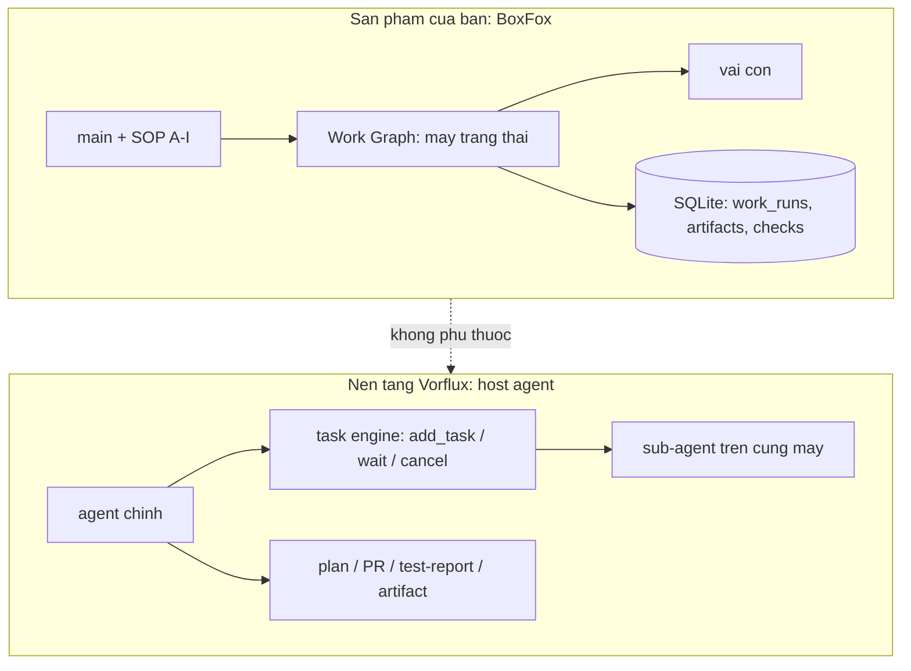
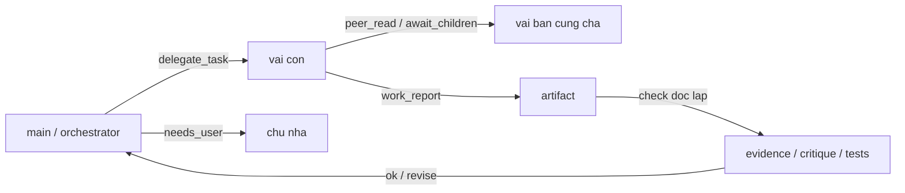

# Đối chiếu tầng điều phối: BoxFox (sản phẩm) vs Vorflux (nền tảng chạy agent)

> **Trạng thái:** Tài liệu đối chiếu kỹ thuật, viết ngày 2026-10-03, đọc trực tiếp từ mã trong
> repo này và từ cấu hình runtime của phiên Vorflux đang thi công. Không phải đặc tả sản phẩm;
> mọi con số của BoxFox đều kèm đường dẫn mã, mọi mô tả về Vorflux đều nói rõ nó là **cấu trúc
> prompt/hợp đồng công cụ của nền tảng**, không phải mã trong repo.
>
> **Neo phép đo:** bộ W10.F tuần tự đang chạy trên cây `6adbe78`. Tài liệu này là **file mới
> thuần tài liệu**, không sửa mã mà bộ đo đang chạy.

---

## 0. Mục đích

Câu hỏi cần trả lời: *BoxFox đang tổ chức prompt, skill, tool, quyền và điều phối như thế nào;
Vorflux (nền tảng chạy agent) tổ chức như thế nào; hai bên khác nhau ở đâu; và hướng tinh chỉnh
nào là hợp lý.*

Cả hai hệ **cùng một gốc ý tưởng**: `roles.py` của BoxFox ghi rõ *"Adapted from Hermes
delegate_tool_toolsets.py"*, và BoxFox vendor nguyên cây skill của Hermes
(`backend/src/agentbox/vendor/hermes/skills/`, 69 `SKILL.md`). Vì vậy hai bên dùng chung từ vựng
(role, delegate, child, skill, tool group) nhưng **đặt tầng điều phối ở hai nơi khác nhau**.

Định nghĩa dùng thống nhất trong tài liệu: **tầng điều phối** là phần trả lời bốn câu hỏi —
*ai làm việc này*, *với quyền gì*, *ngân sách nào*, *bằng chứng nào và ai duyệt*.

---

## 1. Tóm tắt một trang

| Khía cạnh | BoxFox (sản phẩm của bạn) | Vorflux (nền tảng của tôi) |
|---|---|---|
| Nơi đặt | TRONG sản phẩm, chạy trong Docker sandbox của người dùng | NGOÀI sản phẩm; là runtime host agent trên máy này |
| Bộ điều phối | phiên `main` (LLM) + **Work Graph** — máy trạng thái tất định | agent chính (tôi) + **task engine** của nền tảng |
| Hợp đồng điều phối | SOP pha A–I + bộ tool `work_*` | luật nền tảng: plan approval, PR, test-report, các pha review/simplify/testing |
| Máy trạng thái | có (`drafting → … → executed/execute_failed`) | không có (tôi giữ mạch việc) |
| Cưỡng chế quyền | bằng mã: con = cha ∩ vai, nút kiểm chỉ-đọc, `WORK_*` codes | mềm: do tôi + hợp đồng công cụ |
| Ngân sách | `maxSteps`/`deadlineSeconds`/token/fan-out slot | `timeout_seconds`, cost limit phiên, rate limit automation |
| Bằng chứng | artifact + check + event stream trong SQLite | artifact + test report + PR + canvas |
| Người dùng thao tác | card duyệt (`action=submit`), `retry` nút, `needs_user` | nhắn tôi, duyệt plan, xem canvas/PR |
| Số vai | 11 vai con | 8 loại sub-agent |
| Điểm mạnh | tất định, kiểm toán được, chạy offline trong sản phẩm | linh hoạt, mở rộng nhanh, kết quả kiểm được bằng schema |
| Điểm yếu | cứng: luật gì cũng phải viết thành mã; trần token ra 4096 | phụ thuộc phán đoán của agent; không có lưu vết máy móc |

---

## 2. BoxFox — tầng điều phối nằm trong sản phẩm

### 2.1 Bộ điều phối gồm hai lớp

1. **Phiên `main` (orchestrator).** Là một phiên LLM bình thường nhưng nhận
   `ORCHESTRATOR_SOP_GUIDANCE` (`backend/src/agentbox/agent_core/runtime.py:233` và tiếp). SOP
   chia việc thành các pha A–I, trong đó có câu bắt buộc: *"For any non-trivial development,
   bugfix, refactoring, or feature request: NEVER attempt to do everything in a single turn. You
   MUST invoke your specialists via `delegate_task`."*
2. **Work Graph** (`work_graph.py`) — máy trạng thái tất định đặt **trên** main. Main không tự
   quyết định "xong"; nó phải đi qua các trạng thái run, nút, pha, artifact và lượt kiểm.

Trạng thái run (`work_graph.py:83` `DRIVING_STATUSES` và các nhánh còn lại):

```
drafting → discovering → verifying → needs_revision | verified
        → awaiting_approval → approved → executing → executed | execute_failed
```

`TERMINAL_STATUSES` chặn mọi thao tác sửa sau khi run đóng (`WORK_RUN_CLOSED`), và mọi thao tác
sửa trong lúc `work_run` đang chạy bị chặn bằng `WORK_RUN_BUSY`.

### 2.2 Cách dựng system prompt

**Phiên bất kỳ** (`runtime.py:1954`–`1978`):

```
<identity>                       # AGENT.md ở gốc repo nếu có, không thì IDENTITY mặc định
=== ASSIGNED ROLE: <ROLE> ===    # chỉ phiên con
<role_instructions>              # roles.py: EXPLORE_INSTRUCTIONS, BUILD_INSTRUCTIONS, …
<required_text>                  # kỹ năng BẮT BUỘC của research / research-review, nhúng nguyên văn
=== ENABLED SKILLS (Load full content via skill_view before executing complex workflows) ===
<self.catalog.prompt(skills)>    # chỉ "- id: description" cho từng kỹ năng được bật
=== ANSWER LENGTH ===
<ANSWER_LENGTH_HINT>
<evidence_line>                  # CHỈ phiên chính (không phải phiên con)
=== OWNER-CONFIGURED DIRECTIVES ===   # nếu chủ nhà cấu hình systemPromptAppended
```

Ba điểm đáng chú ý:

- **Identity đọc từ `AGENT.md` ở gốc repo** (`get_agent_identity()`, `runtime.py:291`), fallback
  về chuỗi `IDENTITY` ghép từ các khối hướng dẫn (`TOOL_USE_ENFORCEMENT_GUIDANCE`,
  `EXECUTION_DISCIPLINE_GUIDANCE`, `ACT_DONT_ASK_GUIDANCE`, `TASK_COMPLETION_GUIDANCE`,
  `PARALLEL_TOOL_CALL_GUIDANCE`).
- **Phiên con không nhận dòng bằng chứng dành cho chủ nhà** (`ANSWER_EVIDENCE_LINE`): con trả kết
  quả theo hợp đồng con, không trả báo cáo cho người dùng cuối.
- **Kỹ năng chỉ vào prompt bằng một dòng mô tả.** Nội dung đầy đủ phải gọi `skill_view`, tức là
  ngân sách ngữ cảnh chỉ bị tiêu khi vai thật sự cần.

### 2.3 Giao việc: `delegate_task`

Tham số (theo hợp đồng công cụ và chỗ dựng prompt, `runtime.py:6985`–`7090`):

| Tham số | Vai trò | Cắt biên |
|---|---|---|
| `role` | chọn vai con | phải có trong `ROLES` |
| `goal` | nhiệm vụ | là dòng đầu của prompt con |
| `context` | dữ liệu cha cung cấp | `≤ 16000` ký tự (`[:16000]`) |
| `expect` | dạng kết quả cha cần | `≤ CHILD_EXPECT_MAX_CHARS = 2000` |
| `reviewTarget` | ràng buộc đọc đúng file trước khi chấm | thêm một dòng "Binding from the harness" |
| `deliverTo` | giao kết quả cho phiên bạn | `≤ PEER_DELIVER_MAX`, vượt thì **báo lỗi**, không cắt im lặng |
| `wait` | chờ hay chạy nền | `false` thì cha đọc sau bằng `await_children` |

Prompt con = `goal` (+ brief dựng từ scope cho research) → `Parent-supplied context (data)` →
`Parent-required deliverable and evidence (result shape)` → **hợp đồng đầu ra**:

- Work Graph: `work_prompts.child_contract(purpose, lang)` — theo `purpose`:
  - `review`: bắt buộc có **object `coverage` trong fenced json** (mỗi criterion id/status/target/
    evidence đúng một lần) và **đúng một dòng cuối** `VERDICT: ok` hoặc `VERDICT: revise`;
  - `knowledge`: dùng `DELIVERABLE_LOOKUP` (trần 120 từ cho mục `## Trả lời`/`## Answer`);
  - `produce`: hợp đồng đầy đủ — *"đặt toàn bộ báo cáo trong câu trả lời cuối cho reviewer độc
    lập"*, dữ kiện phải có `path:line`/URL đã mở hoặc output lệnh thật.
- Ngoài Work Graph: `CHILD_RESULT_CONTRACT` (`runtime.py:1415`) — bốn mục **Findings / Evidence /
  Verification performed / Limitations & open questions**, kèm câu *"An unevidenced claim is a
  failure, not an answer"* và luật hết ngân sách thì trả chẩn đoán `partial`.

### 2.4 Mười một vai và bộ quyền

`ROLES` (`roles.py:277`): `explore`, `plan`, `plan-review`, `design`, `build`, `debug`, `review`,
`simplify`, `testing`, `research`, `research-review`.

Quyền là các **frozenset** ghép theo nhóm (`roles.py:1`–`35`):

| Nhóm | Nội dung | Ghi chú |
|---|---|---|
| `DECISION` | `ask_user`, `request_approval` | có trong `READ` nhưng **bị chặn ở runtime** cho phiên con |
| `PEER` | `peer_read`, `await_children` | mọi vai đều có (READ là gốc) |
| `READ` | `file_read`, `codebase_glob`, `codebase_grep`, `skills_list`, `skill_view` + `DECISION` + `PEER` | |
| `WRITE` | `READ` + `file_write`, `file_edit_block`, `terminal_exec` | `build`, `debug`, `simplify`, `testing` |
| `VISUAL` | `computer_screen_capture`, `computer_screen_record`, `computer_use`, `browser_use`, `inspect_element` + `DECISION` | |
| `VERIFY` | `verify_exec` | reviewer chạy **một** claim tính toán trong sandbox tạm, repo chỉ-đọc |
| `RESEARCH` | `READ` + web/browser + `SOURCE_TOOLS` (`source_add`/`source_list`) + `SOURCE_READ` + `BRANCH_REPORT` | chỉ vai `research` |
| `SOURCE_TOOLS` | `source_add`, `source_list` | sổ nguồn: con research GHI dòng sổ, **không** ghi hồ sơ |
| `SOURCE_READ` | `source_list`, `source_verify`, `research_status` | vai phản biện đọc để tự kiểm |
| `BRANCH_REPORT` | `research_branch_report` | trả bài có cấu trúc trong MỘT lượt gọi |

### 2.5 Cưỡng chế quyền (khác biệt lớn nhất so với nền tảng)

Quyền con **không** phải bản sao quyền vai; nó là **giao**:

```python
child = self.create(..., parent_tools=config['tools'])   # runtime.py ~7008
```

và bị chặn thêm theo **ngữ cảnh công việc**:

- `binding['checkId']` ⇒ cấm `file_write`, `file_edit_block`, `write_plan`, `delegate_task`
  (`WORK_CHECK_READ_ONLY`), và bộ tool bị thay bằng `work_check_tools(role, parent_tools)`;
- `binding['diagnosticOnly']` ⇒ cấm `file_write`/`file_edit_block` (`WORK_DIAGNOSTIC_READ_ONLY`);
- phiên con gọi `ask_user`/`request_approval` ⇒ `DECISION_UNAVAILABLE: a delegated session cannot
  ask the user; decide from your own evidence` (`runtime.py:5486`);
- `terminal_exec` của con đọc **phạm vi của lượt chủ** (`work_scope`), ra ngoài phạm vi thì bị
  `WORK_SCOPE_TERMINAL_MUTATING`;
- `work_scope` còn chặn theo vai: `WORK_SCOPE_DELEGATE_ROLE`, `WORK_SCOPE_COMMAND_ROLE`,
  `WORK_SCOPE_ARTIFACT_ONLY`, `WORK_SCOPE_APPROVAL_REQUIRED`, `WORK_SCOPE_RUN_CLOSED`,
  `WORK_CAPABILITY_REVOKED`.

### 2.6 Skill

- Catalog: `backend/src/agentbox/skills/catalog.py`; `prompt(enabled)` chỉ in `- id: description`.
- Nội dung đọc bằng `skill_view`; mỗi kỹ năng có `basePath = /opt/boxfox-skills/<...>`, `sha256`,
  danh sách `linkedFiles` — tức là kỹ năng là **gói file có hash**, không phải văn bản rời.
- Ánh xạ vai → kỹ năng: `ROLE_SKILLS` (`skills/commands.py:40`), ví dụ:
  - `explore`: `codebase-inspection`, `ast-grep`
  - `plan`: `codebase-inspection`, `planning`, `grill-me`, `work-graph-planning`
  - `build`: `codebase-inspection`, `test-driven-development`, `claude-design`, `popular-web-designs`, `design-md`
  - `testing`: `test-driven-development`, `dogfood`, `claude-design`
  - `research`: `research-team`, `research-search`, `research-reading`, `research-evidence`, `grounded-citations`, `arxiv`, `blocked-page-recovery`, `codebase-inspection`
- **Kỹ năng bắt buộc nhúng nguyên văn** cho research/research-review (`runtime.py:1957`), không qua
  `skill_view` — vì đó là luật, không phải tuỳ chọn.
- Kho kỹ năng vendor từ Hermes: `backend/src/agentbox/vendor/hermes/skills/` — 69 `SKILL.md`.

### 2.7 Tool

Tên công cụ có adapter thật (`tool_contracts.py`, `tool('name', …)`), 55 công cụ:

```
file_read, file_write, file_edit_block, codebase_glob, codebase_grep, terminal_exec,
verify_exec, computer_screen_capture, computer_screen_record, computer_use, browser_use,
inspect_element, web_search, web_fetch, read_source, paper_citations, skills_list,
skill_view, session_search, peer_read, await_children, journal_write, journal_brief,
delegate_task, ask_user, request_approval, write_plan, plan_verify, plan_scope,
source_add, source_list, source_verify, claim_assess, dossier_write,
research_branch_report, research_brief, research_verify, research_status,
research_update, research_suggest, research_scope, cancel_child, design_scope,
design_branch_create, design_write, design_diff, design_revert, design_review,
design_report, canvas_draw, work_graph, work_run, work_check, work_report,
work_artifact_read, work_ship, interview
```

Bộ **chỉ orchestrator** giữ (con không có): `work_graph`, `work_run`, `work_ship`,
`work_check`, `work_report`, `interview` (`WORK_TOOLS`, `runtime.py:1218`).

### 2.8 Ngân sách và vòng đời

`limits.py` (đã cập nhật theo quyết định chủ nhà #6457, 03/10/2026):

| Hằng số | Giá trị | Ghi chú |
|---|---|---|
| `MAX_STEPS_DEFAULT` / `MAX_STEPS_MAX` | 120 / 400 | phiên chính |
| `DEADLINE_DEFAULT_SECONDS` / `MAX` | 1800 / 7200 | phiên chính |
| `CHILD_MAX_STEPS` | 200 | trần con, vẫn `min()` theo cha |
| `CHILD_DEADLINE_SECONDS` | 3600 | trần con |
| `FANOUT_PER_PARENT_DEFAULT` / `MAX` | 3 / 6 | slot mỗi cha |
| `FANOUT_GLOBAL_CEILING` | 8 | trần toàn cục |
| `FANOUT_QUEUE_WAIT_SECONDS` | 30 | hết slot thì xếp hàng, quá thì `FANOUT_BUSY` |
| `PEER_WAIT_TOTAL_MAX_SECONDS` | 300 | trần chờ phiên bạn mỗi lượt |
| `ROUTER_BODY_BUDGET` | 900 KiB | trần byte thân request (không phải token) |
| `INSTRUCTIONS_MAX_CHARS` | 12 000 | chỉ thị chủ nhà cấu hình |

Ngoài ra: `work_budget.applied(request, config)` trả `{profile, requestedMaxSteps,
effectiveMaxSteps, requestedDeadlineSeconds, effectiveDeadlineSeconds, clamped}` — tức là **nói
thật khi bị kẹp**, và `lifetime` đếm `calls`/`children`/`seconds`/`childSeconds` cho mỗi run.

### 2.9 Bằng chứng và lưu vết

- `work_report` → artifact (có hash, có binding `codeSnapshot`) → lượt kiểm độc lập
  (`evidence` / `critique` / `tests` / `whole`).
- Mọi thứ nằm trong SQLite của sản phẩm (`work_runs`, artifact, checks, history), kèm event stream
  của từng phiên con mà UI đọc được (`peer_read` đọc chính luồng đó, có cắt biên).
- Vòng sửa: `needs_revision` → `work_graph action=retry` chạy lại nút với findings; quá trần thì
  `WORK_CHECK_EXHAUSTED`.

### 2.10 Mã lỗi tiêu biểu (trích)

`WORK_ARTIFACT_UNKNOWN`, `WORK_FINDING_UNCITED`, `WORK_SCOPE_TERMINAL_MUTATING`,
`WORK_SCOPE_DELEGATE_ROLE`, `WORK_SCOPE_RUN_CLOSED`, `WORK_CAPABILITY_REVOKED`,
`WORK_CHECK_EXHAUSTED`, `WORK_RUN_BUSY`, `WORK_RUN_CLOSED`, `WORK_CHECK_READ_ONLY`,
`WORK_DIAGNOSTIC_READ_ONLY`, `DECISION_UNAVAILABLE`, `DECISION_INVALID`, `FANOUT_BUSY`,
`STEP_BUDGET_EXHAUSTED`, `TURN_CANCELLED`, `TURN_EXTENDED`, `PEER_WAIT_CLAMPED`,
`PLAN_APPROVAL_UNVERIFIED`, `PLAN_VERDICT_MISSING_AT_TURN_END`, `PLAN_SOURCES_REJECTED`.

Điểm chung của các mã này: **nói ra luật bị vi phạm và trường nào sai**, để mô hình sửa một lần
chứ không gửi lại y nguyên.

---

## 3. Vorflux — tầng điều phối nằm ngoài sản phẩm

Phần này mô tả **cấu trúc** hợp đồng mà agent chính (tôi) đang chạy: các khối prompt, bộ công cụ,
luật quy trình. Đây không phải mã trong repo BoxFox, và cũng không phải bản sao nguyên văn prompt
của nền tảng — nó là bản mô tả cấu trúc + những luật có ảnh hưởng trực tiếp tới cách việc được
giao và được nghiệm thu.

### 3.1 Prompt của agent chính gồm những khối nào

| Khối | Nội dung | Ảnh hưởng tới công việc |
|---|---|---|
| Vai & phong cách | ngôn ngữ trả lời, độ dài, cấm bịa hội thoại, ASD-STE100 khi được yêu cầu | quyết định hình dạng mọi câu trả lời cho người dùng |
| Chế độ suy nghĩ | chỉ dùng extended thinking khi thật cần | chi phí/độ trễ |
| Đầu ra & artifact | đường dẫn artifact, cách đính kèm file, quy tắc một canvas mỗi lượt | nơi bằng chứng được đặt |
| An toàn dữ liệu | truy vấn production phải bounded, ít song song | ràng buộc khi chạm dữ liệu thật |
| Bộ nhớ chia sẻ | `/memory/knowledge`, `/memory/user-preferences/<user_id>`, `/memory/sessions`, `/memory/testing`, `/memory/setup-learnings`, `/memory/scripts` | nguồn ngữ cảnh dài hạn |
| Skill | 14 skill hệ thống trong `/code/.skills/system/`, cộng skill của repo (`.claude/skills/`) | quy trình viết sẵn, đọc trước khi làm |
| Subagent | 8 loại, luật giao việc, luật chờ kết quả | cách chia việc |
| Git/PR | skill `git-pr-workflow` bắt buộc đọc trước khi push/PR | chuẩn hoá nhánh, mô tả, review |
| Quy trình plan | `plan submit` / `plan approve`, plan phải được duyệt tường minh | chốt phạm vi với người dùng |
| Pha chất lượng | sau khi code xong phải gửi đúng **một** thông báo chuyển pha, kèm URL PR draft | nhịp báo cáo |
| Testing | bắt buộc giao cho subagent `testing`; agent chính không được tự viết Test Report | tách người làm / người kiểm |
| Post-merge | `pr impact` khi phát hiện PR đã merge gây lỗi | truy vết hậu kiểm |
| Công cụ | danh sách tool + `vflux_exec` với ~20 nhóm lệnh | năng lực thật |
| Nén ngữ cảnh | chế độ compaction có trigger riêng | vòng đời phiên dài |

### 3.2 Giao việc: `add_task` và bộ công cụ task

```json
add_task(
  task_id        // duy nhất trong phiên
  title          // 3–6 từ, hiện trên UI
  description    // WHAT: mọi ngữ cảnh để chạy tự chủ
  instructions   // HOW: chỉ ghi khi cần ghi đè quy trình
  agent_type     // explore|plan|design|build|debug|review|simplify|testing
  output_schema  // JSON Schema kiểm kết quả (workflow_mode)
  phase, component
  workflow_mode  // prompt hệ thống rút gọn + bắt buộc ghi RESULT_FILE
  timeout_seconds
)
```

Bộ công cụ vòng đời: `list_tasks`, `wait_any_task_result`, `send_message_to_task`,
`cancel_task`, `abandon_blocked_task`.

Khác biệt cốt lõi so với `delegate_task`: **không có hợp đồng đầu ra mặc định**. Nếu tôi không
viết `description` đủ, subagent không có gì để bám — nó không thấy hội thoại. Bù lại, ở
`workflow_mode` kết quả bị **kiểm bằng schema**, thứ mà BoxFox chỉ làm được ở mức văn bản.

### 3.3 Tám loại sub-agent

| Loại | Việc | Được sửa file? | Ghi chú |
|---|---|---|---|
| `explore` | tìm kiếm/thu thập ngữ cảnh trong repo | không | loại trừ debug/điều tra nguyên nhân |
| `plan` | soạn kế hoạch triển khai tập trung | không | |
| `design` | mockup HTML/CSS + `design-plan.json` | chỉ mockup | xem qua `plan submit --design-file-paths` |
| `build` | triển khai + **viết test case/fixture của sản phẩm** | có | một việc triển khai thì agent chính tự làm |
| `debug` | lỗi, log, tái hiện, kiểm định giả thuyết | có | |
| `review` | soát mã + đánh giá rủi ro khi được yêu cầu | không | phản hồi được chuyển lại cho bên làm |
| `simplify` | tái cấu trúc/đơn giản hoá phần thay đổi | đề xuất | |
| `testing` | kiểm chứng theo yêu cầu, dựng môi trường, trả bằng chứng + Test Report | không viết test sản phẩm | loại duy nhất có `ask_non_blocking_question` |

### 3.4 Hợp đồng công cụ của agent chính

- **File/shell**: `read`, `write_file`, `edit_file`, `bash_execute` (có `run_in_background`,
  `job` để đọc log/status/kill, `wait_any_job_result`).
- **Repo**: `list-git-repositories`, `resolve-git-repository-path`, `vflux_exec session repos-set`.
- **Web**: `web_search`, `context7 resolve-library-id` / `query-docs`.
- **Nền tảng** (`vflux_exec`, ~20 nhóm): `session` (repos-set, fork, message-user, preview-url,
  group-add, search-history, start), `plan` (submit/approve/reply), `pr` (create/comment/review/
  edit/reply/upsert-review-section/report-risk/impact), `test-report submit`, `merge-queue`,
  `blueprint`, `workflow-script`, `memory-snippet`, `secret request|resolve`,
  `file-access request`, `port expose`, `ios-build`, `artifact`, `jira`, `repo learned-knowledge`,
  `schedule create`, `automation create`, `ask_user`.
- **Tương tác người dùng**: `ask_user` (1–5 câu hỏi có lựa chọn), `render_canvas`,
  `add_todos`/`update_todo`/`list_todos`, `complete_without_response`.
- **Tự báo cáo**: `report_infrastructure_issue`.

### 3.5 Luật quy trình (phần "máy trạng thái" mềm của nền tảng)

1. **Plan**: chỉ dùng khi người dùng yêu cầu rõ, hoặc khi khám phá repo cho thấy một quyết định
   sản phẩm/kiến trúc chưa ngã ngũ. Plan đã gửi thì phiên dừng chờ duyệt.
2. **Pha chất lượng**: sau khi code xong, gửi **đúng một** thông báo chuyển pha (kèm URL PR), rồi
   mới gọi `simplify`/`review`/`testing`.
3. **Simplify/Review**: mỗi vòng tối đa 2 lượt phản hồi; phản hồi ngoài phạm vi thì `scope-feedback
   surface` và không chặn việc đang làm.
4. **Testing**: subagent `testing` tự hỏi khi bị chặn; agent chính **không** được viết Test Report
   thay; mỗi chu kỳ kiểm chỉ submit **một** báo cáo, có `--status`, `--coverage`, `--blocked-reason`.
5. **PR**: đọc skill `git-pr-workflow` trước mọi thao tác; chế độ open-PR thì mở PR thật, chế độ
   draft-PR thì để draft; PR phải có mục Testing và (nếu có) Out-of-Scope Feedback.
6. **Post-merge**: `pr impact` khi phát hiện PR đã merge gây lỗi — chỉ ghi vào lịch sử PR, không
   gửi thông báo.
7. **An toàn dữ liệu production**: truy vấn bounded, ít song song, ưu tiên nguồn hẹp.

### 3.6 Bộ nhớ, artifact, canvas

- **Bộ nhớ**: `/memory/knowledge` (gotcha, cách làm đã kiểm), `/memory/user-preferences/<user_id>`
  (chỉ đọc file của chính người dùng hiện tại), `/memory/sessions` (transcript phiên trước),
  `/memory/testing`, `/memory/scripts`, `/memory/automations`, `/memory/scheduled-sessions`.
- **Artifact**: `/code/.generated_artifacts/` cho file người dùng tải; ảnh/ghi hình của subagent
  vào `images/` và `recordings/`; agent chính **chọn lọc** artifact để trình bày, không đổ hết.
- **Canvas**: tài liệu trực quan một cột, spec JSON có kiểm lược đồ; bản v2 thêm từ vựng
  `document`/`presentation` (eyebrow, summary, metadata, treatment, navigation, section layout).

### 3.7 Cơ chế đánh thức và vòng đời job

Đây là phần **khác hẳn** BoxFox và cũng là chỗ dễ hiểu sai nhất:

- Agent chính **không chạy liên tục**. Giữa hai lượt, nó không tồn tại như một tiến trình suy nghĩ.
- Việc dài được đẩy thành **background job** trên máy; khi job kết thúc, nền tảng **đánh thức**
  phiên bằng một thông báo, và lượt mới bắt đầu từ đó.
- Hệ quả thực tế: một job tách rời (chỉ ghi log, không phải job do nền tảng quản) **không** đánh
  thức được ai. Muốn có bảo đảm "xong thì báo", phải dùng job có watchdog của nền tảng.
- `session fork` tạo phiên con độc lập cho một việc riêng (không đọc lại kết quả); subagent thì
  ngược lại — chạy song song nhưng **kết quả trả về cho agent chính**.

### 3.8 Ngân sách và giới hạn

| Loại | Cơ chế |
|---|---|
| Thời gian mỗi task | `timeout_seconds` khi `add_task`; subagent có thể bị `cancel_task` |
| Chi phí phiên | `automation create --session-cost-limit-usd` |
| Nhịp automation | `--rate-limit-max-runs` + `--rate-limit-window-seconds` |
| Job nền | watchdog theo `timeout_seconds`; `-1` cho tiến trình dài hạn |
| Vòng review | tối đa 2 vòng phản hồi cho mỗi lần gọi simplify/review |
| Nén ngữ cảnh | compaction theo trigger của framework |

---

## 4. Đối chiếu chi tiết theo từng trục

### 4.1 Prompt

| Câu hỏi | BoxFox | Vorflux |
|---|---|---|
| Prompt dựng ở đâu | trong runtime sản phẩm, hàm tạo phiên (`runtime.py:1954`) | nền tảng dựng harness; tôi cấp `description`/`instructions` |
| Identity lấy từ đâu | `AGENT.md` gốc repo, fallback chuỗi `IDENTITY` | không có file identity trong repo người dùng |
| Prompt vai | `roles.py`, mỗi vai một khối instructions cố định | mỗi loại sub-agent có prompt hệ thống riêng của nền tảng |
| Kỹ năng vào prompt thế nào | một dòng `- id: description`, nội dung gọi bằng `skill_view` | tên skill + đường dẫn file; tôi phải dặn đọc file |
| Hợp đồng đầu ra | `child_contract(purpose)` hoặc `CHILD_RESULT_CONTRACT` (bốn mục bắt buộc) | tôi tự viết; `workflow_mode` thì có schema kiểm |
| Cắt biên | context ≤16k, expect ≤2k, echo ≤3k ký tự | `description`/`instructions` không bị cắt, nhưng tôi phải tự đủ ngữ cảnh |
| Chỉ thị người dùng cuối | `OWNER-CONFIGURED DIRECTIVES` ≤12 000 ký tự | `preferences.md` của người dùng trong `/memory/user-preferences/<id>/` |

### 4.2 Skill

| Câu hỏi | BoxFox | Vorflux |
|---|---|---|
| Nơi chứa | `vendor/hermes/skills/` (69 `SKILL.md`) + catalog | `/code/.skills/system/` (14 skill) + skill repo (`.claude/skills/`) |
| Định danh | `id`, `description`, `sha256`, `linkedFiles`, `basePath` | tên + đường dẫn file |
| Lọc theo vai | `ROLE_SKILLS` bắt buộc; giao với skill bật ở phiên | tôi tự quyết định đọc skill nào |
| Kỹ năng bắt buộc | nhúng nguyên văn cho research/research-review | không có cơ chế tương đương |

### 4.3 Tool

| Câu hỏi | BoxFox | Vorflux |
|---|---|---|
| Số lượng | 55 công cụ có adapter | ~25 tool trực tiếp + ~20 nhóm lệnh `vflux_exec` |
| Bộ chỉ orchestrator | `work_graph`, `work_run`, `work_ship`, `work_check`, `work_report`, `interview` | các lệnh nền tảng (`plan`, `pr`, `test-report`, `merge-queue`, …) |
| Giao quyền | giao tập hợp (cha ∩ vai), chặn theo ngữ cảnh | không giao tập hợp; tôi tự giới hạn bằng lời |
| Công cụ đặc thù | `verify_exec`, `peer_read`, `await_children`, `canvas_draw`, `work_artifact_read` | `render_canvas`, `pr_tour`, `job`, `wait_any_job_result`, `ask_user` |

### 4.4 Quyền

| Câu hỏi | BoxFox | Vorflux |
|---|---|---|
| Mặc định | không có quyền nào ngoài tập vai | mọi subagent là agent đầy đủ trên máy |
| Chặn theo ngữ cảnh | có (nút kiểm chỉ-đọc, chẩn đoán không được vá, phạm vi terminal) | không có; tôi phải viết rõ trong `instructions` |
| Hỏi người dùng | bị chặn cho con (`DECISION_UNAVAILABLE`) | chỉ `testing` có `ask_non_blocking_question` |
| Đọc phiên bạn | có (`peer_read`), chỉ đọc event, có trần | không có |
| Phê duyệt | `work_graph action=submit` → card duyệt; Autopilot tự duyệt | `plan submit` → người dùng duyệt; PR review |

### 4.5 Ngân sách

| Câu hỏi | BoxFox | Vorflux |
|---|---|---|
| Bước | phiên chính 120 (trần 400); con 200 | không có trần bước |
| Thời gian | chính 1800 s (trần 7200); con 3600 s | `timeout_seconds` mỗi task, không trần cứng |
| Token ra | mặc định 4096; 16 000 cho check/plan/design/research/knowledge | không đặt |
| Song song | fan-out 3/6/8 + hàng đợi 30 s | tôi tự dispatch, không có slot |
| Bị kẹp thì sao | `work_budget.applied(...).clamped` nói thật | tôi tự thấy timeout/không thấy |

### 4.6 Bằng chứng và ai duyệt

| Câu hỏi | BoxFox | Vorflux |
|---|---|---|
| Đơn vị bằng chứng | artifact + hash + binding snapshot mã + lượt kiểm | file artifact + log + test report + PR |
| Kiểm độc lập | có, là bước bắt buộc trong Work Graph | có, do tôi gọi `testing`/`review` |
| Nơi lưu | SQLite sản phẩm + event stream | máy này (`/code/.generated_artifacts/`, PR, canvas) |
| Ai duyệt cuối | chủ nhà, qua card duyệt hoặc Autopilot | người dùng, qua chat/plan/PR |

---

## 5. Canvas v2 — nội dung đã trình bày cho chủ nhà

Canvas `boxfox-vs-vorflux-subagents` (phiên 2026-10-03) là bản trực quan của tài liệu này. Nội dung
của nó, giữ nguyên để đối chiếu:

### 5.1 Sự kiện nhanh

| Nhãn | Giá trị |
|---|---|
| Vai con của BoxFox | 11 (explore, plan, plan-review, design, build, debug, review, simplify, testing, research, research-review) |
| Loại sub-agent của Vorflux | 8 (explore, plan, design, build, debug, review, simplify, testing) |
| BoxFox — con hỏi người dùng | BỊ CHẶN: `DECISION_UNAVAILABLE` |
| Vorflux — sub-agent hỏi người dùng | chỉ loại `testing` (`ask_non_blocking_question`) |
| Trần token ra của BoxFox | 4096 mặc định; 16 000 cho check/plan/design/research |

### 5.2 Tầng điều phối — sản phẩm của bạn vs nền tảng của tôi

| Khía cạnh | BoxFox | Vorflux |
|---|---|---|
| Nơi đặt | TRONG sản phẩm, chạy trong Docker sandbox của người dùng | NGOÀI sản phẩm; runtime host agent trên máy này |
| Ai/cái gì điều phối | phiên `main` + Work Graph là máy trạng thái tất định | agent chính + task engine của nền tảng |
| Hợp đồng điều phối | SOP pha A–I + bộ tool `work_*` | luật nền tảng: plan approval, PR, test-report, review/simplify/testing |
| Máy trạng thái | có (`drafting → … → executed`) | không có |
| Cưỡng chế | quyền con = cha ∩ vai; nút kiểm chỉ-đọc; `WORK_RUN_BUSY` | mềm: agent chính + hợp đồng công cụ |
| Ngân sách | `maxSteps`, `deadlineSeconds`, token, slot fan-out 3/6/8 | timeout mỗi task, cost limit phiên, rate limit automation |
| Bằng chứng/lưu vết | artifact + check + event stream trong SQLite | artifact + test report + PR + canvas |
| Người dùng thao tác | card duyệt (`action=submit`), `retry` nút, `needs_user` | nhắn agent, duyệt plan, xem canvas/PR |
| Mạnh | tất định, kiểm toán được, chạy offline trong sản phẩm | linh hoạt, mở rộng nhanh, kết quả kiểm bằng schema |
| Yếu | cứng: luật gì cũng phải viết thành mã; trần 4096 | phụ thuộc phán đoán của agent; không lưu vết máy móc |

### 5.3 Sơ đồ hai tầng



### 5.4 Vòng giao việc của BoxFox



---

## 6. Khác biệt then chốt và hướng tinh chỉnh

### 6.1 Năm khác biệt có ảnh hưởng thật

1. **Nơi đặt máy trạng thái.** BoxFox buộc mọi bước đi qua một máy trạng thái có mã lỗi; Vorflux
   để agent chính tự giữ mạch. Hệ quả: BoxFox tái lập được một lần chạy hỏng, Vorflux thì phải
   đọc lại log.
2. **Cách cấp quyền.** BoxFox giao tập hợp và chặn theo ngữ cảnh; Vorflux cấp toàn quyền máy rồi
   dựa vào lời dặn. Hệ quả: một subagent Vorflux có thể vô tình sửa file sản phẩm; một vai con
   BoxFox thì không (nếu binding nói chỉ-đọc).
3. **Đường hỏi người dùng.** BoxFox cấm con hỏi; Vorflux cho `testing` hỏi. Hệ quả: BoxFox phải
   dựng đường "main chuyển tiếp" và nó là điểm nghẽn; Vorflux giảm được vòng lặp nhưng đổi lại
   câu hỏi đến người dùng từ một tiến trình mà người dùng không thấy toàn cảnh.
4. **Kiểm kết quả.** BoxFox kiểm bằng hợp đồng văn bản + lượt kiểm độc lập trong Work Graph;
   Vorflux có thể kiểm bằng JSON Schema (`workflow_mode`) nhưng chỉ khi agent chính khai schema.
5. **Ngân sách và trần token.** BoxFox có trần cứng cho mọi thứ, kể cả trần token ra (4096 mặc
   định). Vorflux không đặt trần token, chỉ đặt timeout. Đây chính là chỗ đang gây hỏng bộ đo
   W10.F: model suy luận nhiều + trần 4096 ⇒ `PROVIDER_OUTPUT_TRUNCATED` ⇒ con trả `partial` ⇒
   nút hỏng sớm.

### 6.2 Ứng viên tinh chỉnh cho BoxFox (xếp theo tỉ lệ lợi/rủi ro)

| # | Đề xuất | Vì sao | Rủi ro |
|---|---|---|---|
| 1 | Nâng trần token ra cho vai **produce** (`explore`, `build`, `testing`, `debug`) khỏi mức 4096, hoặc cho phép cấu hình theo vai | số đo W10.F: `PROVIDER_OUTPUT_TRUNCATED` là nguyên nhân gần của phần lớn nút hỏng sớm | tốn token hơn; cần đo lại để không nới vô hạn |
| 2 | Thử lại **một lần** khi luồng bị ngắt giữa chừng mà phần đã sinh **không đủ** cho hợp đồng (hiện chỉ thử lại khi phản hồi RỖNG) | `PROVIDER_STREAM_INTERRUPTED` chiếm 40 lần trong một ô S02 | phải phân biệt "ngắt giữa luồng" với "mô hình tự dừng"; nếu không sẽ đốt ngân sách |
| 3 | Cho `peer_read` đọc thêm **artifact** của phiên bạn (hiện chỉ đọc event) | vai kiểm phải tự đọc bằng chứng; hiện phải chờ bạn giao hoặc cha chuyển | tăng bề mặt rò rỉ giữa các nhánh |
| 4 | Chuẩn hoá "câu hỏi chặn" của con thành một cấu trúc cố định để main chuyển tiếp nhanh | giảm vòng lặp main ↔ con khi con gặp điều không tự quyết được | thêm một hợp đồng nữa phải giữ |
| 5 | Cho hợp đồng đầu ra của con một **schema tuỳ chọn** (như `workflow_mode`) | kiểm được máy, không chỉ kiểm bằng mắt | dễ làm hỏng các hợp đồng văn bản đang chạy tốt |

### 6.3 Điều nên giữ nguyên (đừng bắt chước Vorflux)

- **Giao tập hợp quyền cho con.** Đây là thứ BoxFox làm tốt hơn hẳn; bỏ nó là mất luôn khả năng
  chứng minh "con này không thể ghi".
- **Cấm con hỏi thẳng người dùng.** Giữ luật, chỉ cải thiện đường chuyển tiếp.
- **Máy trạng thái tất định.** Linh hoạt kiểu Vorflux đổi bằng khả năng kiểm toán; với sản phẩm
  bán cho người khác thì kiểm toán quan trọng hơn.

### 6.4 Cảnh báo khi đọc bảng so sánh

Vorflux "mạnh" hơn ở vài dòng không phải vì thiết kế tốt hơn, mà vì nó **không phải sản phẩm**:
nó chạy trên một máy do một người vận hành, không cần phân quyền cho người lạ, không cần tái lập
cho khách hàng. Mọi thứ BoxFox làm khó hơn (máy trạng thái, giao quyền, trần ngân sách, lưu vết)
đều là cái giá của việc trở thành sản phẩm.

---

## 7. Phụ lục

### 7.1 Đường dẫn mã đã đọc

| Việc | Tệp |
|---|---|
| Vai, nhóm quyền, `ROLE_SKILLS` | `backend/src/agentbox/agent_core/roles.py`, `backend/src/agentbox/skills/commands.py` |
| Dựng prompt phiên | `backend/src/agentbox/agent_core/runtime.py` (`start`, `create`, `delegate`) |
| Hợp đồng đầu ra | `runtime.py` (`CHILD_RESULT_CONTRACT`), `work_prompts.py` (`child_contract`) |
| Chặn quyết định của con | `runtime.py` (`decide`) |
| Work Graph, trạng thái, mã lỗi | `work_graph.py`, `work_checks.py`, `work_feedback.py`, `work_grants.py` |
| Ngân sách | `limits.py`, `work_budget.py`, `output_policy.py` |
| Công cụ | `tool_contracts.py`, `tool_groups.py` |
| Kỹ năng | `skills/catalog.py`, `skills/commands.py`, `vendor/hermes/skills/` |
| Mã lỗi phạm vi | `work_scope.py` |

### 7.2 Hằng số quan trọng

```text
MAX_STEPS_DEFAULT = 120          MAX_STEPS_MAX = 400
DEADLINE_DEFAULT_SECONDS = 1800  DEADLINE_MAX_SECONDS = 7200
CHILD_MAX_STEPS = 200            CHILD_DEADLINE_SECONDS = 3600
FANOUT_PER_PARENT_DEFAULT = 3    FANOUT_PER_PARENT_MAX = 6   FANOUT_GLOBAL_CEILING = 8
FANOUT_QUEUE_WAIT_SECONDS = 30   PEER_WAIT_TOTAL_MAX_SECONDS = 300
PEER_READ_DEFAULT_ROWS = 40      PEER_READ_MAX_ROWS = 120    PEER_READ_CHAR_LIMIT = 2000
CHILD_ECHO_MAX_CHARS = 3000      CHILD_EXPECT_MAX_CHARS = 2000      PEER_DELIVER_MAX = 4
INSTRUCTIONS_MAX_CHARS = 12000   ROUTER_BODY_BUDGET = 900 KiB
DEFAULT_OUTPUT_TOKENS = 4096     (16 000 cho check/plan/design/research/knowledge)
CLAIM_TOKENS_MAX = 600           (trần tập claim của reviewedSet, #6474)
```

### 7.3 Mã lỗi hay gặp khi đọc kết quả bộ đo

`WORK_SCOPE_TERMINAL_MUTATING`, `WORK_CHECK_EXHAUSTED`, `WORK_CHECK_READ_ONLY`,
`WORK_FINDING_UNCITED`, `WORK_ARTIFACT_UNKNOWN`, `WORK_PRODUCER_INCOMPLETE`, `WORK_NODE_INVALID`,
`PROVIDER_OUTPUT_TRUNCATED`, `PROVIDER_STREAM_INTERRUPTED`, `DECISION_UNAVAILABLE`, `FANOUT_BUSY`,
`STEP_BUDGET_EXHAUSTED`.

### 7.4 Cách đọc nhanh một lượt hỏng của BoxFox

1. `run.history` — mốc thời gian từng bước (`node_started`, `artifact_ready`, `checks_finished`,
   `node_failed`).
2. `checks` — kind/status từng lượt kiểm; `revise` là bị trả về.
3. `lifetime` — `calls`, `children`, `seconds`, `childSeconds` (chi phí thật của nút).
4. Bộ đếm mã lỗi trong event của phiên con — cho biết hỏng vì luật sản phẩm hay vì provider.
