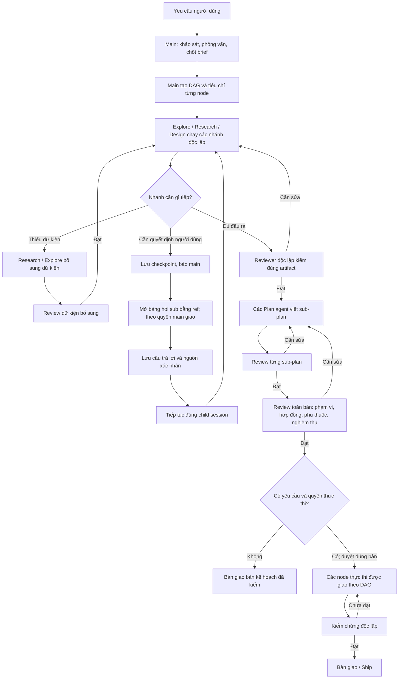
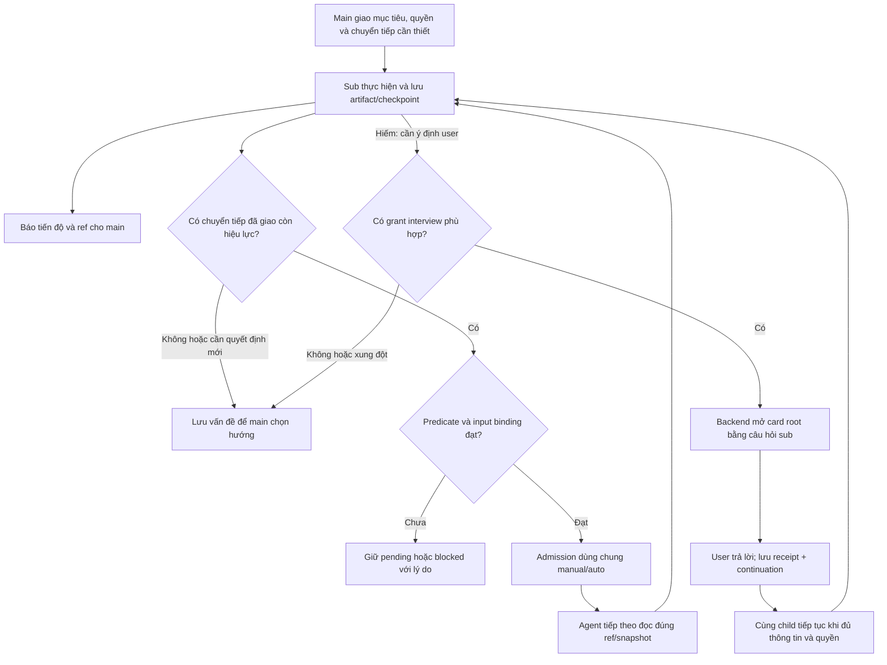
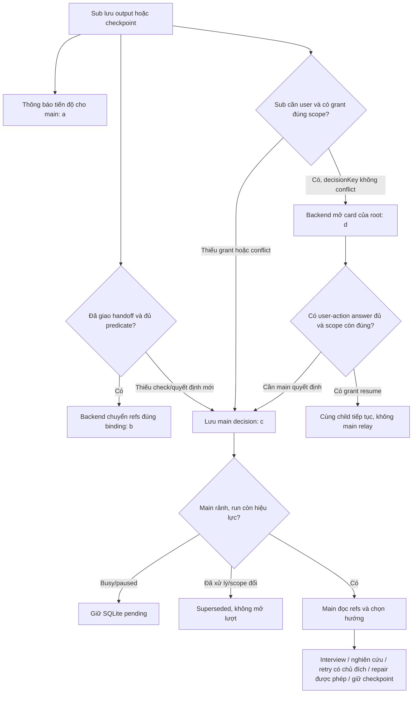

# Sửa độ tin cậy của Work Graph: điều phối linh hoạt, kiểm chứng theo nhiệm vụ và phỏng vấn có thể tiếp tục

> Cập nhật 02/10/2026, chỉ nhánh **B**. Neo triển khai gần nhất **`1ddbce77`**: hàng đợi quyết định main tại 33.11; neo evidence `09ab9075`. A3.3f chống admission lặp đang kiểm tại **33.12**. A1/A2/A3.1/A3.2 và các phần A3.3 trước đã có checkpoint; **chưa hoàn tất W7/W8**: A4 reuse tester/isolation/integration và kiểm soát phạm vi thi công còn tiếp theo. Kiến trúc A đã được duyệt ở mục29. Mỗi kết quả chỉ chứng nhận đúng snapshot/phạm vi ghi trong checkpoint; W7.1/W7.2/W6.2/W6.1.3/W9 còn riêng.
>
> Quyết định mới của chủ dự án thay thế yêu cầu “mọi sub-agent đều có một lượt review giống nhau”: main chọn specialist và cách kiểm chứng phù hợp; backend bảo đảm các kiểm tra bắt buộc theo đầu ra, phạm vi thay đổi và rủi ro. Phần 6–9 cụ thể hóa chính sách này, chuẩn đầu ra và prompt cho coding agent.

## 1. Kết quả khảo sát và các lỗi cần sửa

### Phạm vi và trạng thái hiện tại

Giữ main là chủ điều phối; chọn công việc và kiểm chứng theo yêu cầu:

**Main giao nhiệm vụ và điều kiện chuyển tiếp → các nhánh phù hợp chạy theo dependency → lưu artifact/checkpoint và báo tiến độ → kiểm chứng theo policy → bàn giao trong phạm vi được yêu cầu.** Đây không là pipeline bắt mọi role đi qua Explore/Plan/Build/Testing/Debug/Review. “Về main” mặc định là thông báo; chỉ quyết định mới mới cần main suy luận. Xem luồng có điều kiện tại mục 6.2 và hợp đồng tại mục 29.

Hai yêu cầu bạn đã chốt:

- **Kiểm chứng bắt buộc được xác định theo nhiệm vụ**, không gắn một reviewer giống nhau vào mọi sub-agent. Khi một kiểm tra đã được xác định là bắt buộc, không được bỏ qua vì thiếu role, hết ngân sách hoặc bật Autopilot. Plan và thiết kế làm căn cứ triển khai cần phản biện độc lập; code cần kiểm thử; debug định tuyến có thể không cần semantic review riêng. Xem ma trận tại mục 6.
- Khi một nhánh cần người dùng quyết định, **sub tự soạn bảng hỏi 1–3 câu và lưu checkpoint**. Main có thể mở nguyên bảng hỏi bằng ref; đề xuất quyền được giao trước để backend xuất bản trong phiên chính và tiếp tục đúng child nằm tại mục 29, chưa triển khai. Các nhánh độc lập tiếp tục chạy.

Khảo sát trước ngày 01/10/2026 đã đọc code, SQLite của phiên thử nghiệm, hai tài liệu đính kèm và kiểm tra UI bằng CUA. Đợt W0–W2 ngày 01/10/2026 sửa validation/schema/hướng dẫn recovery và tách diagnostic qua code paths hiện có, chạy kiểm thử bằng fixture trên checkout B. Không mở phiên model/live CUA mới trong đợt này. Kết quả fixture kiểm chứng hành vi code, không chứng minh chất lượng plan do model thật sinh ra.

**Nhánh triển khai: B.** Checkout chính tại `D:/create/BoxFox-Agent-Box` vẫn ở `main`, có thay đổi chưa commit tại `HarnessFlowVisualizer.tsx`. Checkout riêng của B tại `D:/create/BoxFox-Agent-Box-B`, cùng baseline commit `3694305642fc9bf922389dc04329fbc7ede4ef59`. Source, tests và tài liệu của đợt này chỉ được sửa trong checkout B; không sửa bản người dùng lưu ở main hoặc file frontend đang dở. Chưa commit/push/merge.

**File bàn giao hiện tại:** `docs/plan/Work-Graph-fix.md` trong checkout B. Giữ cùng tên với bản người dùng cung cấp, không tạo thêm một plan song song. Các đường dẫn code trong bằng chứng cũ trỏ checkout chính; nội dung tương ứng đã đối chiếu với B. Khi triển khai phải mở file thuộc checkout B.

### Bằng chứng quan trọng từ phiên bạn thử

Run `w-eb1e012a20` hiện có:

| Thành phần | Trạng thái thực tế |
|---|---|
| R1–R4 | `failed`, lỗi `Specialist is disabled or unknown`; không có reviewer session hoặc verdict. |
| E1 | `accepted`, có reviewer và `VERDICT: ok`; vẫn có những tiêu chí chưa xác minh. |
| Review toàn bản | Chưa chạy. |
| Node Plan | Chưa được tạo. |
| Tài liệu chính thức của run | Chưa có. |
| Phỏng vấn trong snapshot run | Rỗng, dù lịch sử Decisions vẫn giữ câu trả lời. |
| Trạng thái run | `needs_revision`. |
| Kết luận của main trong chat | Báo “đã xong”, sau đó lưu tài liệu bằng đường ghi file thông thường. |

Cấu hình phiên lưu **9 role cũ**, thiếu `plan-review` và `research-review`. Vì vậy lỗi này không chứng minh bạn đã tắt reviewer; backend chưa bổ sung các role mới cho cấu hình cũ.

Trong 13 phiên con của ca này, 9 phiên có notice về output bị cắt, hết bước hoặc hết thời gian. Hai lượt cuối dùng hết **2.048 completion token cho reasoning**, không còn câu trả lời để bàn giao.

Các điểm vào chính để triển khai:

- [Work Graph engine](D:/create/BoxFox-Agent-Box/backend/src/agentbox/agent_core/work_graph.py:1024).
- [Runtime delegation và xử lý completion](D:/create/BoxFox-Agent-Box/backend/src/agentbox/agent_core/runtime.py:6657).
- [Sub-agent inspector](D:/create/BoxFox-Agent-Box/frontend/src/components/panels/SubagentInspectorPanel.tsx:655).

### Danh mục lỗi

“Đã xác nhận” nghĩa là có bằng chứng từ phiên/UI hoặc phép kiểm tra trực tiếp. “Rủi ro trong code” nghĩa là đã xác định đường lỗi, nhưng chưa gây lại tình huống đó trên phiên sống.

| Mã | Hiện tượng và nguyên nhân | Hệ quả | Mốc sửa |
|---|---|---|---|
| **F01 — Đã xác nhận** | Reviewer cần cho nhiệm vụ thiếu trong cấu hình phiên cũ. Backend chỉ tìm role đã lưu và được bật; engine không kiểm tra trước khi nghiên cứu. | R1–R4 nghiên cứu xong rồi thất bại lúc tạo reviewer; main tiếp tục thử lại mà cấu hình không đổi. Chuẩn hóa/preflight theo check policy, không bật mọi reviewer cho mọi node. | M1 |
| **F02 — Đã xác nhận** | Research dùng mặc định 4.096 output token. Khi bị cắt, runtime gửi lại cùng lịch sử dài, bỏ tools và thường giảm xuống 2.048 token. | Retry có thể chỉ sinh reasoning; không bảo toàn báo cáo hoàn chỉnh và không giải quyết nguyên nhân độ dài. | M2 |
| **F03 — Đã xác nhận trong code** | Adapter và SSE client dùng `length` cả khi hết token lẫn khi stream thiếu tín hiệu kết thúc. | `PROVIDER_OUTPUT_TRUNCATED` không đủ phân biệt giới hạn output với đứt kết nối; khó chọn cách phục hồi đúng. | M2 |
| **F04 — Đã xác nhận** | Runtime nối `[Diagnostic: … tools_run=[…]]` vào `summary`, sau khi đã giới hạn độ dài nội dung. Danh sách tool chứa nhiều tên lặp. | Metadata bị main hoặc UI coi như báo cáo; chuỗi diagnostic lọt vào bảng và cạnh URL đang viết dở như ảnh 5–6. | M2, M5 |
| **F05 — Đã xác nhận bằng CUA** | Payload `web_search` hợp lệ. Firecrawl trả 403; SearXNG, Brave, Tavily chưa có cấu hình. Hint lỗi vẫn yêu cầu “sửa input và gọi lại”. | Agent tốn bước thử những truy vấn khác trên cùng hạ tầng không hoạt động. Đây không phải lỗi do tiếng Việt trong query. | M2 |
| **F06 — Đã xác nhận** | Prompt wrapper, deliverable và reviewer template viết tiếng Anh. Nhánh `knowledge` còn dùng contract chung thay vì contract Work Graph đầy đủ. | Prompt pha hai ngôn ngữ; có knowledge agent trả kết quả cuối bằng tiếng Anh và nhắc tới `researchId` mà nó chưa được cấp. | M1, M5 |
| **F07 — Đã xác nhận** | Main tạo `mixed` run chỉ có discovery nodes; chưa tạo Plan hoặc chạy whole-plan review. Ba lần `write_plan` thiếu `slug`, rồi chuyển sang `file_write`/terminal. | Tài liệu nháp được lưu và báo hoàn tất ngoài cổng chất lượng của DAG. | M3, M5 |
| **F08 — Đã xác nhận trong code** | Reviewer nhận tối đa 14.000 ký tự output; whole-plan review nhận các phần 5.000–6.000 ký tự rồi context lại bị giới hạn. | Phần cuối, nguồn và cảnh báo có thể không tới reviewer; review không gắn chắc với toàn bộ tài liệu. | M1, M3 |
| **F09 — Đã xác nhận** | Engine có thể dùng output của child bị lỗi nếu còn chữ; parse verdict không bắt buộc child hoàn tất. Hết vòng, Research/Explore có thể chuyển `accepted` với caveat. | Một đoạn dở hoặc kết quả chưa đánh giá đầy đủ vẫn mở đường cho bước tiếp theo. E1 đã được nhận dù một số acceptance còn `UNVERIFIED`. | M3 |
| **F10 — Đã xác nhận** | Phỏng vấn xảy ra trước khi tạo run nên câu trả lời chỉ nằm trong events. Khi có interview trong run, context chỉ giữ question/answer, bỏ một phần provenance. | Reviewer không có snapshot đầy đủ về điều người dùng xác nhận và điều agent tự đề xuất. | M1, M4 |
| **F11 — Đã xác nhận trong code** | `Knowledge requests` chỉ hỗ trợ thiếu dữ kiện bên ngoài/repo, rồi tạo producer mới. Không có giao thức riêng cho quyết định của người dùng và resume đúng child. Interview giữ future trong RAM, có timeout tự giao quyền cho agent. | Luồng “research một phần → main hỏi user → đúng agent làm tiếp” chưa được bảo đảm; restart có thể làm quyết định không trả lời tiếp được. | M4 |
| **F12 — Đã xác nhận trong code** | Update chỉ reset node bị đổi, chưa vô hiệu hóa đầy đủ các node phụ thuộc. Thay đổi `files` không nằm trong bộ so sánh; remove chưa reset đầy đủ review/approval. | Kết quả cũ có thể được dùng sau khi căn cứ hoặc đồ thị đã đổi. | M1, M3 |
| **F13 — Đã xác nhận** | Acceptance yêu cầu shell probes nhưng Explore/Review không có `terminal_exec`. `codebase_glob` dùng `Path.glob`, không hỗ trợ brace expansion. Kiểm tra trực tiếp: `*.{py,ts}` trả 0, `*.py` trả 40 file. | “Không tìm thấy” có thể bị hiểu sai thành “không tồn tại”; nhiệm vụ được giao có tiêu chí agent không thể kiểm tra. | M2, M3 |
| **F14 — Đã xác nhận bằng CUA** | Màu xanh lá phản ánh child `completed`, không phải đã được reviewer chấp nhận. Vòng reviewer không tạo được vẫn hiển thị `pending`. Khi chuyển agent, dữ liệu cũ còn hiển thị trước khi fetch mới hoàn tất. | Người dùng khó biết hoàn thành tính toán, hoàn thành báo cáo và đạt phản biện là ba trạng thái khác nhau. | M5 |
| **F15 — Rủi ro trong code** | Execution reviewer dùng role Testing có quyền ghi; yêu cầu “không sửa source” chủ yếu nằm trong prompt. | Reviewer có thể sửa thứ đang kiểm tra, làm mất tính độc lập của bằng chứng test. | M3 |
| **F16 — Rủi ro trong code** | `work_ship` đổi branch sau khi thực thi và stage bằng `git add -A`, chưa gắn chặt với tập thay đổi của run. | Có thể sửa trên branch ngoài ý định hoặc đưa thay đổi không thuộc công việc vào commit. | M3 |

**Trả lời trực tiếp câu hỏi của bạn:** phiên này có gọi nhiều Research agent, nhưng **R1–R4 chưa được verify độc lập**. Hai knowledge agent cũng không có vòng review riêng. E1 có review thật, nhưng cổng hiện tại vẫn nhận kết quả còn khoảng trống nghiệm thu.

---

## 2. Đối chiếu feedback của coding agent

Dùng [plan bạn gửi](</C:/Users/Admin/.codex/attachments/8c2169e3-fa0e-46e1-ad6b-ba39833e9f3f/Văn bản đã dán.txt>) và [feedback đính kèm](</C:/Users/Admin/.codex/attachments/9ab199c0-9fe6-4db0-9c84-5b507982a317/Văn bản đã dán.txt>) làm ca hồi quy cho harness.

Không lấy điểm “6,5/10” làm kết luận kỹ thuật. Những nhận xét có cơ sở được quy về nguyên nhân sau:

| Nhận xét | Kết luận và nguyên nhân ở harness |
|---|---|
| Thiếu nguồn pháp lý quan trọng; Luật 91 bị đánh dấu chưa xác minh | Có cơ sở. Tìm kiếm không hoạt động, nhưng nhiệm vụ/reviewer chưa bảo đảm tìm nguồn thay thế, kiểm tra đúng số hiệu–tên–mốc hiệu lực và phát hiện khoảng trống pháp lý trước khi tổng hợp. |
| Benchmark/schema chưa khớp bàn giao ca, hội chẩn | Có cơ sở về khoảng trống phù hợp mục tiêu. Research chưa có bước đánh giá khả năng chuyển kết quả benchmark sang bài toán của người dùng; review toàn bản chưa chạy. “Discharge Me!” thực sự tập trung vào nội dung tóm tắt xuất viện. [Bài gốc](https://aclanthology.org/2024.bionlp-1.7/). |
| Có citation chưa chứng minh câu tổng hợp đúng | Đúng. Plan chưa định nghĩa đầy đủ quan hệ claim–evidence và cách kiểm chứng nội dung. Rubric chưa buộc phân biệt kiểm tra field tồn tại với chứng minh yêu cầu đúng. |
| `unsupported_claims` dùng ID chưa được định nghĩa; input/output không thống nhất | Đúng. Thiếu kiểm tra hợp đồng xuyên suốt giữa kiến trúc, schema, grounding và nghiệm thu. |
| Ngưỡng nghiệm thu chưa có căn cứ | Đúng. Agent đề xuất ngưỡng nhưng chưa ghi rõ đơn vị đo, dữ liệu, baseline, mức nghiêm trọng, cách hiệu chỉnh và bất định thống kê. Với giả định các ca độc lập, 0 lỗi/250 ca vẫn cho cận trên một phía 95% khoảng 1,19%; không chứng minh tỷ lệ lỗi thực bằng 0. |
| Điểm Qwen được dùng để biện minh cho tóm tắt lâm sàng | Có cơ sở. Bảng 33 đo MLogiQA, INCLUDE, MT-AIME24 và PolyMath. Knowledge agent đã cảnh báo chúng không đo chất lượng tóm tắt lâm sàng; cảnh báo bị mất khi main tổng hợp. [Báo cáo Qwen3](https://arxiv.org/html/2505.09388v1). |
| Timeline, lệnh kiểm thử và cây thư mục mâu thuẫn | Đúng về những điểm nêu rõ trong tài liệu, như P5 “4–8 tuần” và “3–6 tháng”. Thiếu review toàn bản và ma trận liên kết đầu ra–milestone–nghiệm thu. |
| Sizing GPU, throughput và tiến độ chưa được đo | Có cơ sở về thiếu bằng chứng. Harness chưa buộc giữ trạng thái “ước tính cần đo” khi số liệu được chuyển thành quyết định thiết kế. |
| Người dùng chọn bừa nhưng plan dựng luôn phạm vi production lớn | Harness không thể biết người dùng chọn bừa. Lỗi cần sửa là thiếu bản brief xác nhận phạm vi, chi phí và các đánh đổi lớn sau phỏng vấn; không được tự thay câu trả lời thành MVP. |
| Header cho thấy plan chưa qua reviewer | Đúng với bản này. Không có whole-plan review hoặc plan-verification tương ứng. Trạng thái phải hiện trong UI/sổ review; nội dung chuyên môn không nên bị trộn diagnostic nội bộ. |

Đã xác minh sự tồn tại và mốc hiệu lực của các văn bản mà feedback nói còn thiếu:

- [Luật 91/2025/QH15](https://vanban.chinhphu.vn/?classid=1&docid=214590&pageid=27160&typegroupid=3) và [Nghị định 356/2025/NĐ-CP](https://vanban.chinhphu.vn/?classid=1&docid=216387&pageid=27160&typegroupid=4): hiệu lực 01/01/2026.
- [Luật 134/2025/QH15](https://vanban.chinhphu.vn/?classid=1&docid=216334&pageid=27160&typegroupid=3): hiệu lực 01/03/2026; [Nghị định 142/2026/NĐ-CP](https://vanban.chinhphu.vn/?classid=1&docid=218029&pageid=27160&typegroupid=4): hiệu lực 01/05/2026.
- [Thông tư 13/2025/TT-BYT](https://vbpl.vn/boyte/Pages/vbpq-toanvan.aspx?ItemID=178219) về bệnh án điện tử và [Thông tư 33/2025/TT-BYT](https://vanban.chinhphu.vn/?classid=1&docid=214427&orggroupid=4&pageid=27160) về thời hạn lưu trữ.

Đợt này chưa xác nhận toàn bộ nghĩa vụ áp dụng cho hệ thống y tế cụ thể. Benchmark phải kiểm khả năng nhận diện phần còn cần xác minh, không biến danh sách văn bản thành chứng nhận tuân thủ.

**Không đưa các ý sau thành luật mặc định của harness:**

- Bắt buộc NLI cho mọi thiết kế grounding.
- Alpha 0,8 là ngưỡng phổ quát cho mọi bài toán y tế.
- Model bị gated đồng nghĩa không thể dùng production.
- Không tìm thấy model/benchmark đồng nghĩa chúng không tồn tại.
- Model cũ hơn đồng nghĩa lựa chọn chắc chắn kém.

Đây là các quyết định cần bằng chứng và đánh đổi theo bài toán.

---

## 3. Thiết kế sửa trong DAG hiện có

### 3.1 Luồng phối hợp và phản biện

Sơ đồ trên là một ví dụ cho nhiệm vụ Plan có nghiên cứu và checks đã giao, không là pipeline chung. Luồng có điều kiện chính thức ở mục 6.2; thông báo main không chặn handoff. Nhánh debug, testing, knowledge đơn giản và kiểm chứng linh hoạt được định nghĩa tại mục 6/29. Yêu cầu chỉ lập kế hoạch kết thúc ở tài liệu đã kiểm, không tự thi công. Giữ cách main phân rã công việc và fan-out.

Đặc biệt, **không đổi ngữ nghĩa cạnh Plan → Plan hiện có**. Nếu nhiều sub-plan cần một hợp đồng chung, tạo đầu ra Design/Research dùng chung làm dependency; whole-plan reviewer kiểm tra các hợp đồng thống nhất.

### 3.2 Cấu hình, snapshot và kết quả có cấu trúc

Bổ sung một giao thức kết quả dùng chung cho producer, knowledge helper và reviewer.

| Thành phần | Thay đổi tối thiểu cần có |
|---|---|
| Run | Thêm phiên bản giao thức, ngôn ngữ đầu ra, loại deliverable, snapshot brief và provenance. |
| Node/stage | Theo dõi riêng trạng thái thực thi, mức hoàn chỉnh của deliverable và trạng thái review. |
| Artifact | Nội dung đầy đủ, ID/version/hash bất biến, nguồn liên quan và các phần đã hoàn thành. |
| Review | Gắn với run, node, stage, node revision, brief revision, artifact hash và snapshot dependency. |
| Yêu cầu từ child | Phân biệt `knowledge`, `user_decision`, `environment_blocker`; có ID ổn định và lý do ảnh hưởng. |
| Continuation | Gắn đúng child session, checkpoint và snapshot; invocation ID chống chạy trùng. |

Backend tự lấy danh tính session và binding; model không được tự khai mình là reviewer độc lập hoặc tự gán một đề xuất thành quyết định người dùng.

**Đối chiếu giao thức `work_report` với draft W7:**

- Child dùng `checkpoint`, `needs_user` hoặc `needs_evidence` để lưu phần đã làm và lý do đang chặn; `needs_user` mang nguyên bảng hỏi do sub soạn.
- Main dùng `status`/`resume` hoặc mở `interview` bằng request ref. Auto publish/resume có grant là thiết kế mục 29, chưa có.
- Child hoàn tất vẫn trả final theo hợp đồng hiện hành; harness chốt artifact và check service ghi review/coverage. Các action `finalize`/`review` từng đề xuất ở bản trước **không có trong schema W7 hiện tại**; không tự bổ sung tool/quyền này trong đợt đang làm.

Các thao tác dùng part/invocation ID để gửi lại an toàn. Backend lưu kết quả trước khi xác nhận thành công. UI dựng báo cáo từ artifact đã lưu; không buộc model sinh lại toàn bộ tài liệu dài trong một câu trả lời cuối.

Tiếp tục hỗ trợ đọc transcript và verdict cũ. Kết quả dùng parser cũ chỉ là lịch sử; khi tiếp tục run phải kiểm theo giao thức mới trước khi coi là đạt.

### 3.3 Hoàn thành output và phục hồi đúng nguyên nhân

- Tách nguyên nhân: output token limit, stream kết thúc bất thường, hết bước, hết thời gian, provider refusal và lỗi schema.
- Router truyền finish reason gốc và tình trạng có/không có terminal event. Không tự đổi stream bị đứt thành “hết token”.
- Bỏ cách retry cùng yêu cầu dài với budget bị giảm một nửa.
- Producer ghi checkpoint sau các phần nghiên cứu có giá trị. Báo cáo dài được lưu theo phần hoàn chỉnh; finalize dùng manifest/reference ngắn.
- Khi thiếu phần cuối, phục hồi từ checkpoint trên cùng model/route, chỉ yêu cầu bổ sung phần còn thiếu.
- Tool-call JSON bị cắt không được thực thi hoặc tự vá thành `{}`.
- Lỗi tham số trả đúng field bị thiếu, ví dụ `slug`, cùng một ví dụ hợp lệ ngắn.
- Lỗi cấu hình/provider không được trả hint “sửa input”; phải trả capability đang thiếu và các đường còn dùng được.
- Diagnostic nằm trong trường metadata riêng. Model và Markdown renderer không nhận chuỗi `tools_run` nối vào deliverable.

Giữ model, provider và cấu hình reasoning đang dùng. Giữ trần review hiện có: mặc định ba vòng, tối đa bốn vòng khi cấu hình cho phép; whole-plan review tối đa ba lần. Retry/finalization phải nằm trong ngân sách, không tạo vòng vô hạn. Hết ngân sách thì lưu checkpoint và báo rõ phần chưa hoàn thành.

### 3.4 Kiểm chứng theo nhiệm vụ và review khi cần

**Bảo đảm có reviewer:**

- Chuẩn hóa cấu hình harness khi khôi phục frontend, tạo/đọc phiên backend và tiếp tục run.
- Những reviewer/tester mà check policy yêu cầu phải có effective configuration. Nếu role chưa tồn tại trong cấu hình cũ, bổ sung role tương thích với route kế thừa hiện có; không đổi provider.
- Settings thể hiện các specialist và việc kiểm chứng bắt buộc cho nhiệm vụ hiện tại; không trình mọi reviewer là bắt buộc cho mọi node.
- Preflight kiểm tra route, role, tools và khả năng đọc artifact của các check bắt buộc trước khi chạy producer. Node độc lập không cần capability đó vẫn được chạy.
- Reviewer không khởi tạo được phải ghi `review_error` cùng nguyên nhân; không để vòng ở `pending`.

**Điều kiện nhận một kết quả:**

- Deliverable đã finalize hoàn chỉnh.
- Mọi check bắt buộc theo policy có kết luận hợp lệ; check độc lập dùng child khác producer. Kiểm tra tự động có thể cung cấp bằng chứng trực tiếp mà không mở thêm một LLM reviewer.
- Nếu cần semantic review, reviewer kiểm đúng version/hash và đọc được toàn bộ artifact cần đánh giá. Test phải gắn đúng code snapshot và lệnh/đầu ra thật.
- Mọi acceptance bắt buộc có kết luận `pass`, `fail` hoặc `unverified` cùng căn cứ và check chịu trách nhiệm.
- Không có blocker và không có tiêu chí bắt buộc còn `unverified`.
- Kết quả reviewer bị cắt hoặc chưa hoàn tất không tự tính đạt dù có chuỗi `VERDICT: ok`.

Bỏ đường chuyển `accepted` khi đã hết vòng nhưng còn blocker hoặc chưa review. Giữ output dưới trạng thái nháp/partial để tận dụng tiếp; các node phụ thuộc không được coi nó là bằng chứng đã chốt.

**Research có ảnh hưởng lớn:**

- Knowledge đơn giản có thể được xác minh bằng nguồn/locator và kiểm tra tự động, hoặc được kiểm ở consumer trước khi consumer chốt quyết định. Không bắt một LLM reviewer cho từng helper. Knowledge quan trọng dùng để chốt kiến trúc, an toàn hoặc nghĩa vụ pháp lý phải có kiểm chứng độc lập trước khi quyết định dựa vào nó được chấp nhận.
- Với nghiên cứu ảnh hưởng tới pháp lý, sức khỏe, bảo mật, ngân sách lớn hoặc quyết định kiến trúc nền tảng, dùng hai lượt độc lập: **kiểm chứng bằng chứng** và **phản biện kết luận**.
- Tận dụng logic evidence/critique hiện có của Research; điều chỉnh binding cho Work Graph, không buộc child dùng một `researchId` chưa được tạo.
- Evidence review kiểm nguồn thật, đoạn trích, ngày, phạm vi và quan hệ claim–evidence.
- Critique kiểm suy luận, bằng chứng trái chiều, lựa chọn thay thế và khả năng áp dụng vào mục tiêu người dùng.
- Không review reviewer theo chuỗi đệ quy. Backend kiểm tính hợp lệ của review; các lượt evidence/critique đánh giá hai khía cạnh của cùng producer artifact.

**Review kế hoạch:**

Phải kiểm sản phẩm, kiến trúc, stack, dữ liệu, hợp đồng, AI engineering khi áp dụng, vận hành, milestone và nghiệm thu. Mỗi finding chỉ rõ section/acceptance bị ảnh hưởng, bằng chứng và hướng sửa.

Ma trận bắt buộc:

**Yêu cầu → quyết định thiết kế → milestone → đầu ra → cách nghiệm thu → expected result.**

Các con số chưa đo phải giữ nhãn đề xuất/ước tính; các đường dẫn dự kiến tạo phải khác đường dẫn đã xác minh tồn tại. `ready` chỉ xác nhận kế hoạch đủ căn cứ để triển khai theo phạm vi đã chốt, không chứng nhận sản phẩm đã an toàn hoặc tuân thủ pháp luật.

### 3.5 Hỏi người dùng và tiếp tục đúng agent

Internal feedback của child gồm:

- Phần đã hoàn thành và checkpoint.
- Quyết định nào đang chặn, vì sao không thể tự khảo sát.
- Lựa chọn và tác động tới phạm vi/chi phí/dữ liệu.
- Câu trả lời cần để tiếp tục phần nào.

Main gom câu hỏi liên quan thành các vòng ngắn, mặc định 1–3 câu. Không hỏi lại câu còn hiệu lực; không bắt người dùng chọn chi tiết kỹ thuật mà agent có thể nghiên cứu.

Quy trình:

1. Child lưu checkpoint và trả `needs_user`; giải phóng slot tính toán.
2. Scheduler giữ node và các dependency chưa đủ điều kiện ở trạng thái chờ; các nhánh độc lập tiếp tục.
3. Main nhận sự kiện sớm, không phải đợi toàn bộ `work_run` kéo dài kết thúc.
4. Câu hỏi xuất hiện trong chat và Decisions.
5. Câu trả lời được lưu cùng continuation trong transaction.
6. Worker tiếp tục **cùng child session ID**, mang lịch sử, nguồn đã đọc, checkpoint và brief cập nhật.
7. Output mới qua các check đúng policy của node; nếu cần review thì reviewer nhận đúng bản mới.

Yêu cầu bền vững:

- Pending question và continuation nằm trong SQLite, không phụ thuộc future trong RAM.
- Thời gian người dùng suy nghĩ không tiêu ngân sách tính toán.
- Không tự coi câu chưa trả lời hoặc timeout là “để agent quyết định”.
- Gửi trùng chỉ tạo một continuation.
- Kiểm revision của câu hỏi/node và brief liên quan; các nhánh khác hoàn tất không làm câu trả lời bị conflict chỉ vì global run revision tăng.
- Nếu phạm vi đã đổi, trả conflict rõ ràng và dựng lại câu hỏi.
- Giữ bảng hỏi cùng câu trả lời trong chat và lịch sử Decisions sau khi gửi.
- Phỏng vấn trước khi tạo run được gắn vào run theo cùng intent/invocation, không tự nhập toàn bộ quyết định cũ của phiên.
- “Để agent đề xuất” là ủy quyền đề xuất; phương án kỹ thuật vẫn mang nguồn `proposed`.

Sau phỏng vấn đầu, những dự án lớn phải có brief ngắn xác nhận phạm vi và đánh đổi đáng kể trước khi soạn đầy đủ. Không thay câu trả lời production thành MVP chỉ vì prompt ban đầu ngắn.

### 3.6 Artifact, nguồn và UI

- Khi deliverable yêu cầu kế hoạch, main phải bảo đảm có Plan artifact tương ứng và chạy review toàn bản. Mặc định Plan agents đảm nhiệm các sub-plan; Research được giao plan candidate đầy đủ có thể cung cấp artifact này nếu đạt cùng rubric. Main tổng hợp, điều phối và trình bày trạng thái; không tự lưu vài đoạn research rồi coi là plan đã đạt.
- Cho phép lưu nháp sớm qua đường artifact chuyên dụng. Ghi file thông thường không tạo chứng nhận review hoặc trạng thái `ready`.
- Tài liệu chính thức đi qua một đường đăng ký thống nhất để giữ version, hash, trạng thái chất lượng và lịch sử.
- Full plan nằm trong tab Plan; chat có tóm tắt, liên kết và trạng thái.
- URL lấy từ source record đã đọc, gồm URL gốc/cuối, thời điểm, locator và đoạn hỗ trợ claim. Không dựng lại URL từ trí nhớ, rút gọn bằng `...` hoặc dùng link lỗi như nội dung đã xác minh.
- Phân biệt nguồn không mở được, nguồn không hỗ trợ claim và nghiên cứu chưa tìm thấy bằng chứng.
- Kiểm tra pháp lý phải đối chiếu số hiệu, loại văn bản, tên và mốc hiệu lực; không chọn tài liệu chỉ vì trùng một phần số.
- Ngôn ngữ đầu ra lưu ở run và truyền cho mọi purpose. Template hiển thị, tiêu đề và kết quả cuối dùng tiếng Việt có dấu; giữ identifier, URL, trích dẫn và mã giao thức nguyên dạng. Reasoning có thể dùng tiếng Anh.
- Phân biệt feedback `definition_changed`, `review_findings`, `provider_failure`, `user_answer`; không gọi thay đổi node của main là “reviewer đã từ chối”.

UI dùng hai chỉ báo riêng:

| Chỉ báo | Ví dụ trạng thái |
|---|---|
| Thực thi/đầu ra | Đang chạy, chờ người dùng, dở do ngân sách, output bị cắt, đã hoàn thành deliverable. |
| Chất lượng | Chưa review, đang review, cần sửa, lỗi reviewer, đã đạt đúng phiên bản. |

Khi chuyển child, xóa nội dung của child trước khỏi vùng hiển thị và hiện loading/error theo đúng ID. Preview có nhãn cắt ngắn và đường mở bản đầy đủ; reviewer luôn đọc artifact đầy đủ.

### 3.7 Mất hiệu lực kết quả và quyền thực thi

- Đổi mục tiêu, acceptance, tests, files, dependency hoặc quyết định nền tảng phải vô hiệu hóa các kết quả bị ảnh hưởng theo quan hệ phụ thuộc.
- Add/remove/update làm mất hiệu lực whole-plan review và approval liên quan.
- Giữ review cũ trong lịch sử dưới trạng thái superseded, không xóa.
- Execute kiểm lại snapshot/hash đã duyệt. Autopilot không bỏ qua check bắt buộc hoặc kiểm tra phiên bản; yêu cầu chỉ lập plan/research/design không tự cho phép Build.
- Reviewer không được sửa source. Test chạy trên snapshot được kiểm soát; thay đổi source làm bằng chứng test không còn hợp lệ.
- Giao việc phải phù hợp tools của role. Shell probes đọc hiện trạng được thực hiện qua đường có quyền thích hợp và ghi bằng chứng, không giao cho Explore một acceptance bất khả thi.
- `codebase_glob` hỗ trợ danh sách pattern đơn; cú pháp không hỗ trợ phải báo lỗi thay vì trả rỗng gây hiểu nhầm.
- Nhánh làm việc được xác nhận trước khi Build ghi mã. Ship chỉ stage tập thay đổi thuộc run, kiểm tra dirty files ngoài phạm vi và branch được phép; không gom bằng `git add -A`.

---

## 4. Các mốc triển khai và tracking

M0–M6 là các gói đầu ra để tracking. **Thứ tự thi công thực tế từ dễ đến khó nằm tại mục 12**; không bắt hoàn thành toàn bộ M1 rồi mới được sửa bug độc lập của M2. Từng bước phải có test và handoff trước khi chuyển sang bước sau.

| Mốc | Công việc và đầu ra | Điều kiện hoàn thành |
|---|---|---|
| **M0 — Bàn giao và baseline** | Lưu/cập nhật `docs/plan/Work-Graph-fix.md` trên B; thêm bảng tracking gồm việc đã làm, commit, bằng chứng test, việc còn dở và bước tiếp theo. Tạo fixture đã loại thông tin nhạy cảm từ phiên lỗi. | Tài liệu đã lưu; fixture F01–F14 còn cần dựng; ghi riêng F15–F16 là rủi ro chưa tái hiện. Giữ nguyên checkout bẩn hiện tại; triển khai trong checkout B. |
| **M1 — Giao thức và tương thích cấu hình** | Check policy theo task/artifact/risk; role preflight; artifact/snapshot/binding; `work_report`; các trường trạng thái và ngôn ngữ. Migration SQLite bổ sung, đọc được lịch sử cũ. | Phiên 9 role cũ tạo được specialist kiểm chứng cần thiết. Main chọn policy có căn cứ; backend chặn hạ mức kiểm tra bắt buộc. Model không giả mạo nguồn người dùng hoặc review. Output đầy đủ không bị thay bằng preview. |
| **M2 — Completion và công cụ** | Sửa phân loại SSE, phục hồi từ checkpoint, tách diagnostic; schema errors đúng field; phân loại lỗi tìm kiếm và tránh retry hạ tầng đã hỏng; sửa glob/probe capability. | Các ca cắt giữa URL/JSON, reasoning-only, EOF và hết token có trạng thái đúng; checkpoint không mất; không spam query hoặc diagnostic. |
| **M3 — Kiểm chứng và chất lượng** | Policy Explore/Research/Design/Plan/Build/Debug/Testing; evidence/critique khi cần; rubric theo acceptance; review toàn artifact; invalidation theo dependency/hash; quyền tester/reviewer và phạm vi branch/change set. | Không nhận `accepted`/`verified` khi output dở hoặc check bắt buộc thiếu/lỗi. Debug/test có luồng phù hợp, không thêm review đệ quy. Bản mẫu phải bị yêu cầu bổ sung. |
| **M4 — Interview và resume** | Durable user requests, answer transaction, continuation worker, callback về main, tiếp tục đúng child; câu hỏi trước run và provenance. | Chờ user không giữ model turn; restart trả lời tiếp được; nhánh khác tiếp tục; gửi trùng chỉ resume một lần; child ID không đổi. |
| **M5 — Plan, prompt và UI** | Localize tất cả purpose; feedback đúng loại; Plan agent/sub-plan/whole-plan path; draft registration; chat–Decisions–Plan dùng cùng dữ liệu; badge và inspector loading theo child. | Không còn báo hoàn tất cho run `needs_revision`; toàn văn nằm trong Plan; lịch sử hỏi đáp còn nguyên; giao diện phân biệt completed với reviewed. |
| **M6 — Hồi quy và đánh giá sống** | Test unit/integration, fault injection, CUA và bộ prompt cố định; giữ model/route hiện có; báo cáo từng lần chạy, token/latency nếu đo được. | Đạt các cổng trong mục 5; không bỏ lượt lỗi khỏi thống kê; có handoff rõ phần chưa đạt. |

Tracking ban đầu:

- [x] Đọc code và xác định đường điều phối hiện tại.
- [x] Đối chiếu phiên SQLite, lỗi tìm kiếm và reviewer trên UI.
- [x] Đọc plan và phân loại feedback có cơ sở.
- [x] Ghi nhận điều chỉnh 01/10/2026: kiểm chứng linh hoạt theo nhiệm vụ; giữ resume đúng agent.
- [x] Lưu bản cập nhật vào `docs/plan/Work-Graph-fix.md` trên checkout B.
- [ ] M0: dựng fixture baseline; hiện chỉ hoàn thành khảo sát và tài liệu.
- [ ] M1–M6 — chưa triển khai code hoặc chạy bộ nghiệm thu của bản cập nhật này.

Mỗi mốc chỉ được tick sau khi có bằng chứng. Tick triển khai và tick nghiệm thu phải tách riêng.

**API bổ sung/điều chỉnh:**

- Giữ `GET /api/agent/sessions/{sid}/work`, bổ sung snapshot, request và trạng thái review rõ ràng.
- Thêm đường đọc artifact đầy đủ theo session/run/artifact ID, hỗ trợ đọc từng phần.
- Mở rộng `POST /api/agent/sessions/{sid}/decisions` cho câu trả lời bền vững với decision revision và invocation ID.
- Backend kiểm quyền sở hữu run/child, snapshot và deduplication; frontend không tự quyết định node đã đạt.

---

## 5. Kiểm thử, CUA và điều kiện nghiệm thu

### 5.1 Test xác định bắt buộc

| Nhóm | Ca kiểm tra | Kết quả đúng |
|---|---|---|
| Role migration | Khôi phục phiên chỉ có 9 role cũ. | Specialist cho check bắt buộc tồn tại trước khi producer chạy; giữ route đang cấu hình; không tạo reviewer thừa cho diagnostic đơn giản. |
| Preflight | Reviewer route hoặc công cụ cần thiết không khả dụng. | Báo nguyên nhân cấu hình trước khi tốn lượt nghiên cứu; không lặp producer vô ích. |
| Completion | Token limit, thiếu terminal event, reasoning-only, 503, deadline, step budget. | Phân loại riêng; checkpoint còn; không chuyển thẳng sang accepted. |
| Tool arguments | Thiếu `slug`, JSON bị cắt, object sai schema. | Tool chưa thực thi; lỗi nêu đúng field/độ dài/vị trí khi phù hợp; không thay bằng `{}`. |
| Search | Firecrawl 403 và các leg thiếu cấu hình. | Báo capability thiếu một lần; dùng nguồn còn khả dụng hoặc conditional answer; không bảo rằng sửa query sẽ chữa hạ tầng. |
| Diagnostic | Output kết thúc ở `https:` hoặc giữa bảng. | Metadata không nối vào Markdown hoặc URL; link không hoàn chỉnh bị đánh dấu, không bịa phần còn lại. |
| Review | Producer/reviewer partial nhưng có `VERDICT: ok`. | Chưa được nhận cho tới khi finalize và các check bắt buộc hợp lệ; verdict dở không tạo bằng chứng đạt. |
| Review cap | Hết vòng với blocker hoặc chưa có reviewer. | Giữ nháp và findings; dependency quan trọng chưa mở. |
| Full artifact | Finding nằm sau mốc 14.000 ký tự hoặc cuối sub-plan. | Reviewer đọc được phần đó; hash khớp toàn văn. |
| Knowledge | Helper đưa một dữ kiện sai nhưng producer dùng để chốt stack. | Check của helper hoặc consumer chặn trước khi quyết định được nhận; không bắt một reviewer cho mỗi phép tra cứu đơn giản. |
| Flexible checks | Debug chỉ tái hiện lỗi; Build tạo patch; Testing trả log; knowledge lookup đơn giản. | Debug có thể không semantic review; patch vẫn cần test; log được gắn snapshot; helper được xác minh theo mức rủi ro. Không review reviewer/tester theo vòng vô hạn. |
| User handoff | Research cần định hướng; nhánh độc lập đang chạy. | Main nhận request; nhánh độc lập tiếp tục; câu trả lời tới đúng child. |
| Restart/dedup | Restart khi đang chờ; gửi hai lần; trả lời câu hỏi cũ. | Pending còn; đúng một continuation; câu hỏi lỗi thời trả conflict rõ. |
| Invalidation | Update/remove node, đổi files, đổi brief hoặc output dependency. | Review/approval liên quan hết hiệu lực; node phụ thuộc được đánh giá lại. |
| Permissions | Reviewer thử sửa source; Build ở branch ngoài phạm vi; Ship gặp file ngoài run. | Bị chặn ở execution boundary; không dựa riêng vào prompt. |
| Locale | Producer, knowledge, reviewer, plan, API, render và copy. | Tiếng Việt có dấu; identifier và trích dẫn nguyên văn được giữ. |
| Legacy | Mở plan/run/review cũ. | Vẫn đọc được, không tự gán nhãn đạt tiêu chuẩn mới. |

### 5.2 Runbook CUA cho agent kiểm thử

Chạy các ca gây lỗi trong session, database và workspace thử nghiệm riêng. Phiên hiện có chỉ dùng để đọc đối chiếu.

| Thao tác CUA | Output đúng cần thấy |
|---|---|
| Mở một Research child đã finalize nhưng chưa review. | “Đã hoàn thành đầu ra” và “Chưa review” là hai trạng thái riêng; không gắn nhãn đã verify. |
| Gây lỗi tạo reviewer. | Node và round hiển thị lỗi reviewer cụ thể; không nằm mãi ở `pending`. |
| Mở kết quả `web_search` không khả dụng. | Thông báo cấu hình/provider; không yêu cầu sửa query nếu arguments đã hợp lệ. |
| Mở child có output bị cắt. | Thấy checkpoint, phần thiếu và cách tiếp tục; diagnostic nằm trong khu vực riêng. |
| Click đổi liên tục giữa hai child. | Loading và nội dung luôn thuộc child đang chọn; không hiện báo cáo A với badge của B. |
| Research trả `needs_user`. | Chat và Decisions cùng hiện bộ câu hỏi; Work Graph cho biết node đang chờ, nhánh độc lập vẫn chạy. |
| Chọn options/nhập tự do và gửi. | Bảng hỏi cùng câu trả lời còn trong chat và Resolved; node tiếp tục đúng child ID. |
| Reload rồi restart backend trong lúc chờ user. | Câu hỏi vẫn trả lời được; không tự chọn thay người dùng; không tạo child trùng. |
| Mở Plan nháp và Plan đã đạt review. | Có version, trạng thái, findings và toàn văn đúng bản; chat chỉ tóm tắt/liên kết. |
| Sửa quyết định sau review. | Bản mới chưa được duyệt; review cũ hiện superseded; thực thi không dùng bản cũ. |
| Copy báo cáo/click nguồn. | Không có `[Diagnostic…]` trong nội dung; URL đầy đủ và tiếng Việt giữ dấu. |
| Bật Autopilot với một node chưa đạt. | Các check của policy vẫn bắt buộc; không bỏ blocker hoặc biến yêu cầu chỉ lập tài liệu thành triển khai. |

Agent QA phải lưu ảnh, thao tác, run/child ID, revision/hash, kết quả quan sát và log liên quan. Không tick chỉ vì UI không có banner đỏ.

### 5.3 Bộ đánh giá hành vi

Chạy 12 kịch bản, mỗi kịch bản hai lần:

1. Prompt y tế nguyên văn và câu trả lời phỏng vấn đã cung cấp.
2. Prompt đầy đủ, không cần hỏi thêm.
3. Phiên cũ thiếu role mới.
4. Search provider không khả dụng.
5. Output bị cắt và reasoning-only.
6. Knowledge helper sai hoặc thiếu bằng chứng.
7. Research cần user định hướng giữa chừng.
8. Người dùng đổi ý sau checkpoint.
9. Restart khi đang chờ trả lời.
10. Plan đầy tiêu đề nhưng thiếu thiết kế và nghiệm thu thực chất.
11. Reviewer lỗi/partial và finding nằm cuối tài liệu dài.
12. Build/test thất bại hoặc có thay đổi ngoài phạm vi run.

Ghi model, commit B, cấu hình, từng attempt, budget, token/latency nếu có, và kết quả mong đợi của từng kịch bản. Giữ riêng lỗi provider/model và lỗi sản phẩm, nhưng tính cả lượt lỗi trong tổng số.

**Cổng nghiệm thu:**

- 100% kết quả được gắn `accepted`/`verified` có đầy đủ check bắt buộc theo policy, đúng snapshot. Nhãn UI phải nói rõ đã test, đã kiểm nguồn hay đã semantic review; không gọi tất cả là reviewed.
- Không có auto-pass vì reviewer thiếu, output partial, verdict không hoàn chỉnh hoặc hết vòng.
- 100% ca hỏi giữa nhánh tiếp tục đúng child, không làm dừng nhánh độc lập.
- 100% ca retry câu trả lời không tạo continuation trùng.
- Bản mẫu bị đánh dấu thiếu căn cứ/thiết kế cần bổ sung; không được gọi là ready chỉ vì có nhiều nguồn.
- Không có diagnostic trong deliverable, URL bịa hoặc mất dấu khi render/copy.
- Ít nhất 22/24 lượt hoàn tất **đúng trạng thái mong đợi của kịch bản**, kể cả `blocked` khi đó là kết quả đúng; không đánh đồng mọi kịch bản với phải sinh plan ready.
- Không chuyển provider/model để cải thiện số liệu nghiệm thu.
- Báo cáo bàn giao nêu rõ mốc hoàn thành, test đã chạy, phần còn dở và bước tiếp theo.

**Giới hạn đã chốt:** sửa các lỗi về độ tin cậy, kiểm chứng theo nhiệm vụ, provenance, completion, interview và UI trong DAG hiện có; ứng dụng y tế là ca đánh giá harness. Việc triển khai và lưu tài liệu phải diễn ra trên nhánh B.

## 6. Điều phối linh hoạt: main giao bước tiếp; quyết định lại khi cần

### 6.1 Quyết định kiến trúc

Chọn **main điều phối + backend bảo đảm điều kiện chuyển trạng thái**. Main hiểu mục tiêu, chia nhánh, nhận kết quả nháp, đề xuất check policy, gọi các specialist cần thiết và tổng hợp dần. Backend quản lý trạng thái bền vững, quyền, dependency, ngân sách và bằng chứng hoàn thành.

Main được đọc kết quả nháp ngay để phát hiện thiếu sót, đặt câu hỏi và giao bổ sung. Việc nhận nháp không chứng nhận kết quả đúng. Khi trình kết luận, đưa kết quả vào quyết định thiết kế hoặc mở thực thi, phải đáp ứng các check bắt buộc của quyết định đó.

Không giữ ba bộ điều phối cạnh tranh cho Plan/Design/Research của nhiệm vụ mới. WorkRun là nguồn trạng thái chung; Plan, Research và Design giữ các bộ quy tắc chuyên môn và các view/artifact tương ứng. PlanRun/ResearchRun/DesignRun cũ vẫn đọc được; API tương thích chuyển lệnh của run mới tới WorkRun, không ghi hai state machine độc lập cho cùng nhiệm vụ.

Không thay framework/model/provider để giải quyết đợt này. Tách các phần mới ra module nhỏ cạnh work_graph.py; runtime.py chỉ là adapter vào tool dispatch, session, provider và executor. Tên file mới tại mục 8 là dự kiến, không khẳng định đã tồn tại.

### 6.2 Luồng do chủ dự án bổ sung — thông báo và bàn giao độc lập

~~~mermaid
flowchart TD
    U["Người dùng: yêu cầu / ticket / lỗi"] --> M["Main: brief, phạm vi, chọn nhánh và quyền chuyển tiếp"]
    M --> W["Sub phù hợp chạy theo dependency và quyền"]
    W --> A["Backend lưu artifact hoặc checkpoint; binding và hash"]
    A -. "a: báo tiến độ/ref, không bắt mở lượt main" .-> N["Main biết tiến độ; có thể can thiệp"]
    A --> G{"Bước tiếp đã được main giao và đủ điều kiện?"}
    G -->|"Có"| H["b: backend claim bàn giao đúng snapshot một lần"]
    H --> S["Testing / kiểm nguồn / Review / bước khác đã giao"]
    S --> A
    G -->|"Thiếu quyết định, mâu thuẫn hoặc chưa giao"| D["c: yêu cầu main quyết định; giữ checkpoint"]
    D --> M
    G -->|"Cần người dùng quyết định"| Q["Sub soạn 1–3 câu; lưu request và checkpoint"]
    Q --> P{"Có quyền xuất bản bảng hỏi phù hợp?"}
    P -->|"Có"| C["d: backend mở thẻ ở phiên chính; báo main"]
    P -->|"Không / trùng / mâu thuẫn"| R["Main xem request; mở bằng ref hoặc điều chỉnh"]
    R --> C
    C --> V["User trả lời; SQLite ghi answer và continuation"]
    V --> B{"Binding còn đúng, đủ câu trả lời và có quyền resume?"}
    B -->|"Có"| X["Backend tiếp tục cùng child/context/folder; báo main"]
    X --> W
    B -->|"Không"| D
    G -->|"Đầu ra cuối đủ checks và đúng phạm vi"| O["Bàn giao; chỉ Build/PR khi có yêu cầu và quyền"]
    M --> I["Nhánh độc lập"]
    I --> A
~~~

Đây là luồng mục tiêu theo yêu cầu làm rõ, **chưa phải khả năng đã nghiệm thu của code**. Main giao các bước phù hợp; backend thực hiện điều kiện đã giao, không tự chọn bước mới từ tên role. Thông báo cho main và bàn giao không phụ thuộc vào việc main đã mở/đọc thông báo. Main có thể gọi Research/Design trong lúc Plan đang soạn và đổi phương án sau một finding. Các nhánh độc lập tiếp tục theo giới hạn fan-out hiện có. Test đỏ không mặc định Debug: giao Build sửa khi lỗi rõ và đã được phép; cần điều tra thì mới Debug; chưa có phương án được giao thì yêu cầu main quyết định.

Với ví dụ Research nhả về kết quả và sub-plan:

1. Research lưu báo cáo, nguồn, hạn chế và plan candidate; main nhận thông báo cùng các artifact reference.
2. Nếu main đã giao evidence review/critique/plan review cho đúng đầu ra và đủ điều kiện, backend chuyển ref trực tiếp cho checker và báo main. Nếu có lựa chọn mới hoặc thiếu sót ngoài chính sách đã giao, main đọc phần cần thiết rồi chọn hướng; không bắt main gọi lại cùng mệnh lệnh chỉ để chuyển tiếp.
3. Reviewer nhận nguyên yêu cầu, brief, câu trả lời có provenance, acceptance, artifact ID/version/hash và manifest nguồn. Main không viết lại bản nháp để che cảnh báo của producer.
4. Nếu Research chỉ trả findings nhưng thiếu kế hoạch thực thi, main giao Plan agent xây phần còn thiếu từ những kết luận đã được kiểm chứng.
5. Nếu Research đã được giao cả plan candidate và đầu ra đủ chuẩn, có thể kiểm trực tiếp theo rubric Plan; không cần tạo thêm Plan child chỉ để chép lại cùng nội dung.
6. Review plan không thay thế kiểm nguồn nghiên cứu; evidence review không thay thế kiểm tính triển khai của plan. Một child có thể nhận hai nhiệm vụ kiểm khi rủi ro cho phép, nhưng phải trả kết luận riêng cho từng check.
7. Findings về một lựa chọn cần người dùng chốt quay về main để interview; findings kỹ thuật được giao đúng specialist sửa. Bản sửa tạo artifact version mới và làm mất hiệu lực các check liên quan.

Đây là điều chỉnh của v2 so với quy tắc “main chỉ thấy output sau ok”. Main thấy draft/partial để điều phối; consumer và state gate chỉ dùng kết quả theo mức tin cậy được khai báo.

### 6.3 Chính sách kiểm chứng theo đầu ra

Role là chuyên môn của worker. Artifact kind, mục đích sử dụng, tác động của thay đổi và mức rủi ro quyết định check cần có. Không được đổi tên role từ Build thành Debug để bỏ test, hoặc từ Plan thành Research để bỏ phản biện kế hoạch.

| Công việc / artifact | Check tối thiểu | Khi tăng mức kiểm | Bước tiếp khi chưa đạt |
|---|---|---|---|
| Explore trả bản đồ repo hoặc fact đơn giản | Đường dẫn/symbol tồn tại, locator và phạm vi đã đọc; acceptance có căn cứ. Có thể dùng check tự động và main spot-check. | Kết quả là căn cứ migration, quyền, phân tách kiến trúc: independent Explore/Review kiểm các claim quyết định. | Explore bổ sung; capability không có thì báo blocker. |
| Knowledge lookup đơn giản | Source record đã đọc và claim có locator; giữ nguyên giới hạn nguồn. Có thể kiểm ở consumer trong cùng check. | Claim bên ngoài tác động lớn hoặc mâu thuẫn: evidence check độc lập trước khi consumer chốt quyết định. | Research/Explore bổ sung hoặc ghi chưa xác minh. |
| Research độc lập để giao cho người dùng | Evidence verification của các claim trọng yếu và review tính trả lời đúng câu hỏi. Có thể gộp trong một research-review child ở mức thường. | Y tế/pháp lý/bảo mật/quyết định khó đảo ngược: thêm critique độc lập về suy luận, nguồn trái chiều và mức áp dụng. | Research sửa đúng findings; main interview nếu thiếu phạm vi/định hướng. |
| Design làm căn cứ xây dựng | Independent contract/flow review theo phạm vi; các trạng thái, data/API, lựa chọn và acceptance thống nhất. | Auth, dữ liệu nhạy cảm, migration, tương tác phức tạp: thêm kiểm bảo mật hoặc nguyên mẫu có phạm vi rõ. | Design sửa hoặc Research giải quyết unknown. |
| Plan / sub-plan do bất kỳ role nào tạo | Independent plan review theo chuẩn SWE/AI; full-plan review kiểm coverage, contracts, dependencies và acceptance xuyên nhánh. | Thay đổi lớn: review quyết định nền tảng riêng và yêu cầu brief confirmation. | Plan/Design/Research sửa đúng phần; không chạy Build từ plan dở. |
| Build / Debug có sửa source | Test gắn code snapshot, acceptance và evidence thực tế. Testing child độc lập chạy các lệnh/check cần thiết trước khi nhận patch. | Thay đổi hành vi quan trọng, API/schema, concurrency, quyền, dữ liệu hoặc phạm vi rộng: semantic code review độc lập ngoài test. | Test fail -> Debug định vị -> Build/Debug sửa -> test lại. |
| Debug chỉ điều tra, chưa sửa mã | Tái hiện hoặc bằng chứng nguyên nhân; hypothesis phân biệt với conclusion. Không tự mở semantic review chỉ vì tên role Debug. | Root cause được dùng để thay kiến trúc hoặc bỏ một cơ chế an toàn: kiểm độc lập các bằng chứng liên quan. | Thiếu dữ liệu -> Explore/probe/Research; đã tìm hướng sửa -> giao worker sửa và test. |
| Testing trả kết quả lệnh | Backend xác nhận lệnh, exit code, log, môi trường và snapshot. Không review tester theo vòng đệ quy. | Test suite không chứng minh yêu cầu: main thêm acceptance/test hoặc semantic review. | Failure report gửi main và Debug; test không được tự sửa source. |
| Reviewer trả findings | Schema, ownership, binding, completion và coverage của review hợp lệ. Không tạo reviewer của reviewer mặc định. | Reviewers bất đồng về vấn đề lớn: main yêu cầu specialist thứ hai/adjudication giới hạn trong ngân sách. | Thiếu evidence -> review bổ sung; provider lỗi -> retry một lần. |
| Checkpoint, progress, needs_user | Kiểm schema/binding và lưu bền vững; không semantic review từng cập nhật. | Nội dung sắp được dùng làm kết luận chính thức phải chuyển thành finalized artifact và chạy check tương ứng. | Giữ partial, tiếp tục đúng child hoặc chờ câu trả lời. |

Khả năng làm các check chuyên môn là capability profile, không nhất thiết tạo thêm role công khai như Security cho đợt này. Dùng các role hiện có Explore, Research, Design, Plan, Build, Debug, Testing, Review, Plan Review, Research Review; giới hạn tool theo task binding.

Main được đề xuất tăng mức kiểm và chọn specialist phù hợp. Backend áp mức tối thiểu từ loại artifact, task intent và phạm vi thay đổi thực tế. Policy phải lưu rationale và phiên bản; thay đổi policy làm vô hiệu hóa những check không còn đủ.

Một fact không trọng yếu còn chưa xác minh có thể ở mục giới hạn của báo cáo. Nếu acceptance bắt buộc hoặc quyết định nền tảng phụ thuộc vào fact đó, kết quả chưa được nhận làm căn cứ. Không lấy tổng điểm cao bù cho blocker.

### 6.4 Hợp đồng dữ liệu và scheduler

Các trường mới dưới đây là thiết kế dự kiến:

~~~json
{
  "nodeId": "R1",
  "taskKind": "research",
  "artifactKind": "research_report",
  "purpose": "choose_architecture",
  "outputLanguage": "vi",
  "permissionProfile": "read_and_artifact",
  "verificationPolicy": {
    "version": "work-checks/2",
    "risk": "consequential",
    "rationale": "Kết luận được dùng để chọn kiến trúc xử lý dữ liệu y tế.",
    "required": [
      {"id": "sources", "kind": "evidence", "executorRole": "research-review"},
      {"id": "inference", "kind": "critique", "executorRole": "research-review"}
    ]
  },
  "produceDependsOn": [],
  "executeDependsOn": []
}
~~~

Check record gồm check ID/kind, checker identity hoặc deterministic executor, producer identity, run/node/stage revisions, artifact version/hash, dependency snapshot, acceptance results, findings, commands/log references và completion state. Check do một child làm vẫn độc lập với producer khi policy yêu cầu độc lập.

Đề xuất module mới:

- work_policy.py: policy tối thiểu, risk/intent, capability preflight; pure rules, không gọi model.
- work_artifacts.py: immutable parts/manifest/hash, full read, finalization và registration adapter.
- work_checks.py: dispatch/check records, acceptance gate, coverage, reviewer/test binding.
- work_requests.py: user/knowledge/environment requests, durable continuation và outbox.

Work Graph giữ scheduler và dependency ordering; main ra quyết định thông qua tools. Khi producer kết thúc, backend lưu artifact rồi thông báo artifact_ready/needs_checks. Checks và bước tiếp đã được main giao có thể được backend dispatch từ binding hiện hành, độc lập với thông báo main; không tự gắn cùng một reviewer cho mọi role. Thiếu assignment/quyền hoặc có quyết định mới thì main gọi work_check/chọn hướng. Backend từ chối policy thấp hơn mức tối thiểu. Cơ chế quyền, admission và checkpoint được đề xuất ở mục 29; code hiện tại vẫn yêu cầu lời gọi work_check của main.

Tool work_check hỗ trợ status/start với runId, nodeId, artifact reference, checkIds và invocationId. Model main cấp assignment/quyền; backend có thể start theo quyền cụ thể đã giao, child không được tự gọi/delegate tùy ý. Backend chọn binding theo policy, không nhận verdict tự khai từ main. Check xong trả pass/revise/unverified/error cùng next action cụ thể. Test failures trả command, symptom và snapshot: Build sửa khi rõ; Debug điều tra khi cần; việc chọn hướng mới cần main, không biến mọi test đỏ thành Debug.

work_report dùng checkpoint/needs_user/finalize/review như mục 3.2; thêm completion report cho diagnostic/test artifacts. Không đánh đồng finalized với accepted.

State tách ba trục:

- execution: pending/running/waiting_user/waiting_capability/completed/failed/paused.
- artifact: none/partial/finalized/superseded.
- checks: not_required/pending/running/pass/revise/unverified/error/superseded.

not_required chỉ dùng cho check không thuộc policy; không dùng thay pass cho check bắt buộc. accepted được backend tính từ finalized + đủ required checks + dependency snapshot còn hiệu lực. verified toàn run còn cần kiểm output contract và coverage, không chỉ tổng số node accepted.

SQLite giữ WorkRun aggregate hiện có và bổ sung artifact/check/request/continuation records có unique invocation keys. Ghi state change và outbox trong cùng transaction. Worker claim outbox theo lease, xử lý idempotent, kiểm lại revision/hash trước khi ghi kết quả; kết quả cũ lưu lịch sử với nhãn superseded.

API GET work hiển thị policy, check coverage và pending requests. Đường đọc artifact/check theo run có kiểm quyền sở hữu session, hỗ trợ đọc phần lớn tài liệu. POST decisions ghi answer + continuation transaction. Legacy API Plan/Research/Design của run mới phải đi qua cùng service, không update trạng thái riêng.

### 6.5 Hai loại phụ thuộc và thực thi song song

Giữ ngữ nghĩa legacy Plan -> Plan là thứ tự thực thi khi nhập run cũ. Run protocol v2 phân biệt:

- produceDependsOn: cần artifact đã đạt các check phù hợp để thiết kế hoặc nghiên cứu tiếp.
- executeDependsOn: cần code/đầu ra thực thi trước đó đã qua acceptance để chạy bước sau.

Ví dụ P3 phụ thuộc P1 về implementation nhưng đã có contract chung D1: P1 và P3 có thể soạn song song từ D1; Build P3 phải đợi Build P1 và các check của P1 đạt. Nếu chưa có contract và P3 thật sự cần quyết định trong P1, thêm produce dependency hoặc giao Design chốt contract trước.

Backend kiểm cycle trên mỗi đồ thị và đồ thị kết hợp thực thi/đọc artifact, chặn dependency tới node không tồn tại. Whole-plan reviewer kiểm hidden coupling và thứ tự; không trông chờ chỉ một thuật toán cycle chứng minh thiết kế đúng.

Một nhánh chờ user hoặc đang debug chỉ chặn các nhánh phụ thuộc vào kết quả chưa đủ điều kiện. Bản kế hoạch toàn run có thể tổng hợp dần phần đã đạt, nhưng không trình ready khi coverage bắt buộc còn thiếu.

Trước Build, kiểm nhánh cho phép và baseline dirty state. Các worker thực thi song song có touch set; tác vụ đụng cùng file/contract dùng resource lock hoặc serialized merge. Không để hai agents viết cùng file chỉ vì DAG không có cạnh. Nhánh riêng/worktree từng worker chỉ tạo khi cần isolation và có đường merge/test rõ ràng.

Sau khi các patch được hợp nhất, chạy integration/system checks trên snapshot hợp nhất. Test từng nhánh pass không chứng minh cả hệ thống pass. PR chỉ được chuẩn bị từ change set thuộc run, kèm plan, check results, limitations và test thật; tạo/push PR theo quyền/phạm vi đã có, không ngầm cho phép từ yêu cầu chỉ viết tài liệu.

## 7. Lưu artifact theo session, lượt và run; giao review bằng reference

### 7.1 Quyết định của chủ dự án

Đã xác nhận ngày 01/10/2026: “mã hóa riêng” ở đây là **ID riêng cho session/lượt**. Backend sinh ID ổn định, không dùng tên người dùng, tiêu đề chat hoặc vị trí lượt trong danh sách làm định danh.

Mỗi sub-plan được lưu trước khi main giao review. Prompt không chứa toàn văn plan; nó chứa artifact reference, manifest reference, yêu cầu và acceptance cần kiểm. Reviewer mở file/đọc artifact qua tool được cấp.

Thư mục đề xuất trong workspace của session:

~~~text
.plans/
  sessions/
    s-<rootSessionId>/
      turns/
        t-<originTurnId>/
          runs/
            <runId>/
              manifests/
                manifest-v1.json
                manifest-v2.json
              master/
                v1-plan.md
                v2-plan.md
              subplans/
                p1/
                  v1-plan.md
                  v2-plan.md
                p2/
                  v1-plan.md
              research/
                r1/
                  v1-report.md
              design/
                d1/
                  v1-design.md
              checkpoints/
                r1/
                  part-<partId>.md
              checks/
                p1/
                  <checkId>/
                    result.json
                    report.md
              evidence/
                index.json
~~~

Đây là đường dẫn thiết kế dự kiến. Chọn prefix s-/t- để phù hợp slug segments hiện tại của worker; tận dụng directory grouping và exclusive version writes tại sandbox/worker.py:496–566. File source, URL và log lớn có thể nằm ở kho tương ứng; manifest trỏ reference và hash, không sao chép tất cả nguồn vào plan.

rootSessionId xác định phiên chủ sở hữu, không phải child ID. originTurnId là ID lượt khởi tạo công việc, không phải turn_count có thể đổi sau resume/compaction. runId phân biệt nhiều công việc được khởi tạo trong cùng lượt. Backend kiểm ID/prefix/path; model không được chọn thư mục tùy ý hoặc trỏ sang session khác.

Nếu run tiếp tục ở lượt sau, giữ nguyên originTurnId và folder; lưu continuationTurnIds, answer references và event sequence trong registry. Yêu cầu mới khác phạm vi tạo run/folder mới sau khi làm rõ; sửa cùng kế hoạch tạo version mới trong folder cũ.

### 7.2 Registry và manifest

SQLite là nguồn chân lý về owner, current version, trạng thái check và approval. Manifest là bản chỉ mục để đọc và xuất; agent sửa manifest trên đĩa không được thay đổi quyền hoặc tự tạo kết quả pass.

Manifest có:

- Schema version, root session ID, origin turn ID, run ID, run/brief revision và ngôn ngữ.
- Goal/brief reference và decision references có provenance.
- Nodes, task kinds, policy references, produce/execute dependencies.
- Danh sách artifact ID/kind/node/version, relative path, UTF-8 byte size, hash và completeness.
- Source records và claim/source mapping; nguồn không mở được có trạng thái riêng.
- Checks và kết quả theo acceptance, checker session ID, snapshot/hash được kiểm.
- Current document references, phần thiếu, các bản superseded và trạng thái ready/approval.

Main nhận summary nhỏ và manifest reference. Được đọc thêm phần cần để ra quyết định; không phải đưa mọi transcript/file của child vào context của main. Final chat chứa link master/sub-plan và trạng thái chính xác.

Reviewer prompt mẫu:

~~~json
{
  "task": "Kiểm tính triển khai và coverage của sub-plan P1",
  "runId": "w-example",
  "nodeId": "P1",
  "briefRevision": 4,
  "artifact": {
    "id": "a-example",
    "version": 2,
    "contentHash": "<sha256>",
    "path": ".plans/sessions/s-<sid>/turns/t-<tid>/runs/w-example/subplans/p1/v2-plan.md"
  },
  "manifestRef": "<manifest id/version/hash>",
  "requestRef": "<original goal and interview snapshot>",
  "requiredChecks": ["scope", "contracts", "dependencies", "acceptance"],
  "instruction": "Mở manifest và đọc bản v2 bằng tool. Đọc nguồn cần xác minh. Báo findings theo acceptance; không đánh giá chỉ từ preview."
}
~~~

Backend dựng binding thật từ registry. Không tin path/hash do model tự khai. Yêu cầu/tiêu chí ngắn được đưa vào prompt để reviewer hiểu nhiệm vụ; phần dài có reference và phải được đọc trước khi kết luận.

### 7.3 Quy tắc ghi, đọc và khôi phục

1. Producer có quyền ghi artifact theo node binding qua work_report hoặc artifact writer chuyên dụng; không mở file_write/terminal rộng chỉ để lưu plan.
2. Lưu checkpoint phần hoàn chỉnh có part ID idempotent. Bản nháp chưa đầy đủ có nhãn partial và danh sách phần còn thiếu.
3. Khi finalize, backend xác nhận các phần, UTF-8 bytes và hash; writer ghi file bất biến, không ghi đè v1 thành nội dung v2.
4. Ghi file qua temporary file + rename/exclusive create trong workspace. Sau khi xác minh file, đăng ký metadata/check request trong transaction SQLite + outbox. File và SQLite không được giả định là một transaction chung.
5. Nếu crash giữa ghi file và đăng ký, recovery phát hiện orphan/pending write, hoàn thành idempotent hoặc giữ draft có lỗi rõ. Không gắn accepted/ready cho file chưa có hoặc sai hash.
6. Reader hỗ trợ offset/limit, nextOffset, total bytes/chars và hash; không cắt im lặng. Manifest cho biết tổng artifact/sections để reviewer lập coverage.
7. Reviewer đọc full target hoặc các phần cần cho check có phạm vi được khai báo. Whole-plan check bao phủ tất cả sub-plan và hợp đồng chung; không lấy đoạn đầu 5.000 ký tự làm toàn văn.
8. Không đọc hết trong ngân sách thì check giữ incomplete/unverified với checkpoint; không trả pass để thoát deadline. Có thể phân nhánh check theo section rồi tổng hợp coverage.
9. Approval/Execute kiểm current snapshot, review/check bindings và bytes thực trên đĩa. Sửa file trực tiếp sau check làm check hết hiệu lực.
10. Export có manifest + master + sub-plans + check summaries, giữ đường dẫn tương đối đọc được. Backup/recovery phải chứa cả SQLite và workspace artifacts; mất workspace không được tiếp tục hiển thị verified từ DB.

Giữ giới hạn 1 MiB cho từng file plan hiện có; kế hoạch dài dùng nhiều sub-plan/parts và manifest, không tăng vô hạn output token. Preview có giới hạn, bản đầy đủ luôn có đường đọc; diagnostic nằm trong metadata, không vào nội dung.

Plan browser/index phải phân loại bằng registry artifact kind. Master/sub-plan hiện trong Plan; report Design/Research dùng đúng panel. Việc đặt supporting report trong cùng run folder không khiến mọi Markdown trở thành plan “đã đạt”. Thêm compatibility tests cho index/preview/export; các plan cũ trong .plans/work/<slug>/ vẫn đọc được tại chỗ, không mass-move hoặc tự chứng nhận lại.

### 7.4 Ca nghiệm thu bổ sung

| Ca | Output đúng |
|---|---|
| Hai session có cùng tiêu đề và cùng node P1 | Folder/identity khác nhau; không ghi nhầm hoặc xem nhầm dữ liệu. |
| Hai lượt mới trong cùng session | originTurnId khác nhau; mỗi run có manifest riêng. |
| Resume run sau interview hoặc restart | Folder và run ID giữ nguyên; câu trả lời mới được liên kết bằng continuationTurnId. |
| Main mở review | Prompt không có toàn văn plan; reviewer đọc manifest/target bằng tool và kết luận đúng version/hash. |
| Finding ở cuối bản dài | Reader cho đọc đến phần đó; reviewer phát hiện hoặc ghi rõ chưa đủ coverage. |
| Sửa file bằng đường ngoài sau review | Hash mismatch; ready/execute bị chặn và UI cho biết check lỗi thời. |
| Reviewer gửi path của session khác | Backend từ chối theo owner/binding; không lấy ID khó đoán làm quyền truy cập. |
| Crash trước/sau file promotion và DB registration | Không mất draft; recovery không tạo duplicate version/check và không chứng nhận file chưa đăng ký. |
| Export/copy | Đủ sub-plan, nguồn/check references; UTF-8 có dấu; không có diagnostic spam. |

## 8. Rà soát prompt gốc và chuẩn đầu ra chuyên môn

### 8.1 Những điểm giữ và những điểm phải sửa

Prompt gốc đã xác định đúng main là bộ não, context riêng cho child, sub-plan có acceptance/test và DAG thực thi. Nó chưa quyết định đủ những điều sau; coding agent cần dùng bản v2 thay vì diễn giải tự do:

| Điều trong prompt | Khoảng trống dẫn tới triển khai hiện tại | Quyết định của plan v2 |
|---|---|---|
| Main đa năng, không lock mode | Lệnh có task đã đi qua workIntent nhưng đường mode cũ, prompt và trạng thái còn nhiều nơi. | Intent/deliverable xác định đầu ra; task permission xác định được làm gì. Main có thể gọi mọi specialist phù hợp trong một WorkRun. |
| “User nói tính năng -> ship plan” | Main có thể tạo discovery-only mixed run rồi tự viết file và báo xong. | requestedDeliverables có plan thì phải có artifact Plan đủ chuẩn và checks; producer có thể Plan hoặc Research được giao rõ cả plan candidate. Backend chặn ready khi thiếu deliverable, không chỉ trông chờ prompt. |
| “Mọi output luôn review” | Reviewer cố định theo role, thiếu cấu hình gây lỗi; kiểm lookup/debug/test thừa; thiếu kiểm phù hợp với patch. | Dùng check policy tại mục 6; testing, evidence, critique, contract/code review có mục đích riêng. Main nhận nháp trước để điều phối. |
| “Review = verify” | Một VERDICT được dùng thay mọi bằng chứng, cả khi output còn dở. | Đặt một hệ thống check chung, nhưng giữ check kind và phạm vi: semantic review, evidence verification, executable test. Kết quả pass phải chứng minh đúng acceptance. |
| “Lặp tới khi tốt” | Không có điều kiện dừng, sửa lại toàn báo cáo, exhaustion có đường auto-pass. | Giữ vòng/budget có giới hạn, findings có ID; sửa phần bị ảnh hưởng; hết budget lưu checkpoint, chưa đạt vẫn draft/blocked. |
| “Explore 1..N rồi P1..N” | Dễ áp dây chuyền nhiều agents cho việc nhỏ hoặc bỏ Research/Design cần thiết. | Main phân nhánh theo unknown và output cần có. Task nhỏ có plan ngắn; task lớn có nhiều sub-plan. Không thưởng số agents hoặc số trang. |
| “P3 phụ thuộc P1” | Không rõ phụ thuộc khi soạn hay khi Build, có nguy cơ hidden contract. | Hai loại cạnh tại mục 6.5; shared contract artifact khi cần, execution waves giữ scheduler DAG. |
| “Tạo PR khi kế hoạch hoàn thành” | Không rõ chỉ viết plan hay đã code/test; branch được tạo quá muộn. | Plan-only dừng ở tài liệu. PR của triển khai sau patch, checks, integration và phạm vi ủy quyền; branch/change set kiểm trước khi ghi code. |
| “Interview” | Không rõ ai hỏi, child dừng ở đâu, có timeout hoặc restart ra sao. | Main hỏi; durable request/answer, same-child continuation, các nhánh độc lập tiếp tục. |
| “Tách context” | Kết quả dài bị cắt rồi ghép vào prompt/summary, mất caveat và nguồn. | Full artifact theo session/turn/run; main/reviewer nhận references; đọc bằng tool, summary không thay bản đầy đủ. |
| “Plan SWE chuyên nghiệp” | Nhiều tiêu đề/nguồn nhưng quyết định/data/API/test không khớp nhau. | Rubric theo chiều bắt buộc và traceability; check tính triển khai, không chỉ đếm headings. |
| “Fix plan_scope” | Một số lỗi hình dạng đã được sửa ở code, có thể sửa trùng hoặc nới provenance. | Audit schema/runtime/examples; regression trước khi sửa; giữ nguồn và readiness chặt, lỗi có field-specific recovery. |

### 8.2 Lỗi tool đã có sửa một phần

Tại baseline commit 36943056, plan_workflow.py:310–367 đã có coerce_item:

- Chuỗi brief được chuyển thành proposed; source dạng chuỗi được đổi thành object.
- Có alias source kind và lấy reason từ source.reason/why/tradeoff.
- Lỗi PLAN_BRIEF_INVALID đã nêu field và ví dụ hình dạng; revision conflict đã trả revision hiện tại.
- tool_contracts.py:40–58 và 104–119 đã khai báo nested brief schema.
- ROLES của PlanWorkflow tại dòng 28 đã bao gồm plan, research, research-review, plan-review và design. Báo cáo cũ “chỉ cho explore/design/review” không còn là mô tả chính xác của baseline này.

Đây là bằng chứng code đã đổi, chưa phải bằng chứng tất cả live cases đã khỏi. Cần test các payload đã gây lỗi, đường WorkRun mới và đường legacy. Không sửa bằng cách chấp nhận bất kỳ source kind nào hoặc tự nhận lời model là lời người dùng.

Đề xuất hoàn thiện:

1. Một schema canonical cho brief item, question option, decision và evidence; prompts/examples dùng đúng schema sinh từ cùng nguồn.
2. Bare string được lưu draft proposed để không mất ý; reason mặc định “model proposal” không đủ chứng minh lý do/đánh đổi của quyết định quan trọng. Readiness yêu cầu rationale thực hoặc hỏi/main nghiên cứu bổ sung.
3. Source user được backend gắn từ input/answer records, model chỉ đề xuất mapping tới record. Source observed tham chiếu evidence ID thật thay exact-match path kèm ghi chú.
4. Evidence có reference riêng và note riêng. Chuẩn hóa relative/absolute path trong cùng workspace và URL redirect bằng record đã đọc; không bỏ tùy tiện suffix rồi tin rằng source đã được đọc.
5. Conflict trả expectedRevision, actualRevision, affected field và next action. Không tự retry một mutation stale khi brief đã đổi; main đọc status, rebase proposal rồi gửi invocation mới.
6. Policy và source lỗi trả structured error, fieldErrors, retryable và recovery; không bọc mọi tình huống thành TURN_FAILED_VALUEERROR với cùng một reflection hint.
7. plan_scope có WorkRun binding dùng brief chung; không đòi người dùng gõ /plan trước mới cho main quản lý brief. Legacy bound PlanRun giữ adapter tương thích.
8. Main mutating brief/question bằng transaction; không chạy song song hai mutation cùng revision. Check completion của nhánh độc lập không làm câu trả lời user conflict chỉ vì global revision tăng.

### 8.3 Chuẩn Plan theo SWE/AI

Plan có quy mô tương ứng công việc. Task nhỏ được gộp mục nhưng vẫn phải rõ thay đổi, kiểm chứng và rủi ro. Hệ thống/app mới hoặc thay kiến trúc lớn cần:

- Sản phẩm: users, job-to-be-done, luồng chính, scope/non-goals và thành công đo được.
- Hiện trạng: code/contracts đã đọc, thành phần tận dụng/tạo mới và phần chưa xác minh.
- Kiến trúc: thành phần, ownership, data/control flows, boundaries và failure paths.
- Stack/decisions: công nghệ chọn để giải quyết việc cụ thể, alternatives và lý do/chi phí/đánh đổi.
- Data: entity/key/schema, invariants, nguồn, validation, retention, migration và dữ liệu lỗi.
- Contracts: API/events/input/output/errors/auth/async state/idempotency/versioning khi áp dụng.
- AI: mục đích LLM/agent, baseline không AI hoặc đơn giản, model/cách chọn, retrieval/OCR chỉ khi có nhu cầu, grounding, evaluation và fallback.
- Vận hành: deployment/config/secrets/observability/retry/backup/rollback theo quy mô.
- Milestones M1..Mn: phụ thuộc, work items, worker role, path/function dự kiến, output, test/check, expected result và completion evidence.
- Acceptance/traceability: requirement -> decision -> milestone -> artifact -> check -> expected. Lệnh chưa chạy là planned check, không phải kết quả.

Rubric lấy các chiều SWE-AI/1 hiện có làm nền: intent, grounding, technical, data_contracts, ai, acceptance, operations, clarity. Thêm check tương thích và tính nhất quán xuyên sub-plan. Mục không áp dụng cần lý do; không dùng một số điểm tổng để bù cho data/API thiếu hoặc nghiệm thu không chứng minh mục tiêu.

AI evaluation cần dataset/unit/baseline/scoring/calibration, severity và uncertainty; đo riêng correctness, omission, unsupported claims và abstention. Ngưỡng chưa có dữ liệu là “mục tiêu đề xuất cần hiệu chỉnh”. Có citation hoặc có field JSON không tự chứng minh câu tóm tắt đúng.

### 8.4 Chuẩn Research

Research artifact trả đúng câu hỏi, ghi phạm vi/as-of date, cách tìm và lựa chọn nguồn, claim/source mapping, đối chiếu phương án, bằng chứng trái chiều, giới hạn và recommendation có rationale.

Phải phân biệt observation, inference và proposal. Không tìm thấy trong một tập nguồn không chứng minh thứ đó không tồn tại. Search results/URL HTTP 200 không tự chứng minh nội dung nguồn hỗ trợ claim. Các kết luận chuyển sang Plan vẫn giữ caveat, độ chắc chắn và phạm vi áp dụng.

Khi task yêu cầu đề xuất kỹ thuật, Research có thể trả plan candidate riêng. Candidate phải được đăng ký artifact kind Plan và qua rubric Plan trước ready; không gọi báo cáo nghiên cứu vài đoạn là kế hoạch triển khai.

### 8.5 Chuẩn Design

Design artifact phải đúng loại thiết kế được giao:

- Architecture/API: boundaries, trách nhiệm, contracts, invariants, states/errors, concurrency, compatibility, alternatives và acceptance.
- UI/UX: users/tasks, navigation, interaction/state matrix, empty/loading/error/permission, accessibility/responsive và hành vi dữ liệu.
- Prototype: chỉ khi thuộc deliverable/permission đã cho; nằm trong vùng artifact, có nhãn và mục tiêu thử nghiệm; không ngầm scaffold code production.

Không bắt một API design tạo màn hình hoặc một UI task viết toàn bộ kiến trúc backend. Main chọn subtype; reviewer dùng rubric phù hợp. Design quyết định một contract dùng chung có thể là produce dependency của nhiều Plan nodes.

### 8.6 Prompt/skill và tham khảo bên ngoài

Cần đồng bộ role instructions, Work Graph wrappers và skills hiện có:

- Main: triage theo deliverable/unknown/risk; quản lý brief/provenance; phân nhánh; đọc draft refs; chọn checks; interview; gate cuối.
- Explore: câu hỏi repo cụ thể, paths/contracts/evidence/unknowns; không kết luận không tồn tại từ glob sai hoặc tool không khả dụng.
- Research: sources/search method/claims/contrary evidence/limits và recommendation; plan candidate riêng khi được giao.
- Plan: artifact hoàn chỉnh theo 8.3; dùng accepted decisions/contracts; request user/knowledge khi thật sự thiếu, không tự lấp bằng scope cũ.
- Design: subtype/flow/contracts/state/acceptance; không tự build.
- Build: touch set, permission và approved plan snapshot; code/test evidence; không nới scope tự ý.
- Debug: symptoms -> reproduction -> hypotheses -> evidence -> root cause -> fix proposal/patch -> regression target; chưa đủ bằng chứng phải nói chưa đủ.
- Testing: check command/environment/snapshot/result; không sửa source.
- Review profiles: evidence, critique, plan, contract, code; findings gắn acceptance + evidence + severity + fix, kết luận riêng cho mỗi check.

Nạp hướng dẫn bắt buộc theo task binding, không phụ thuộc việc user có bật skill tùy chọn. Tôn trọng custom AGENT.md về project conventions nhưng không cho bỏ state/check/permission gates. Prompt mẫu và runtime dùng cùng structured schemas; snapshot tests kiểm chúng tương thích.

Các template hiển thị cho owner/child/reviewer bằng ngôn ngữ của run; tiếng Việt có dấu. Reasoning có thể tiếng Anh; identifier/path/quote nguyên văn. Không ép external quote thành bản dịch rồi gọi là nguyên văn.

Nguồn tham khảo đã đọc:

- [Pi extensions chính thức](https://github.com/earendil-works/pi/blob/main/packages/coding-agent/docs/extensions.md): tools/events/session persistence và structured tool result hỗ trợ workflow. Đề xuất tách instructions khỏi state/permission gates của BoxFox là suy luận thiết kế từ các khả năng này.
- [Devin giới thiệu và hướng dẫn nhiệm vụ](https://docs.devin.ai/get-started/devin-intro): nhấn mạnh completion criteria, việc kiểm tra được và bước có phạm vi rõ. Tài liệu này không chứng minh Devin dùng chính DAG, review policy hoặc session resume của BoxFox.

Không coi thương hiệu một coding agent là bằng chứng kiến trúc nội bộ của nó. Đợt này không nhập framework ngoài; dựa trên code và lỗi BoxFox đã quan sát.

## 9. Kế hoạch triển khai cụ thể và handoff

### 9.1 Bản đồ thay đổi

Các file có chữ “mới” là dự kiến tạo; đọc applicable AGENTS.md trước khi sửa, đặc biệt vùng vendor skills. Tên API/tool mới là thiết kế của plan này, chưa tồn tại trong sản phẩm.

| Mốc / subtask | Files trọng tâm | Đầu ra / acceptance cụ thể |
|---|---|---|
| M0.1 — baseline fixtures | backend/tests/fixtures/work_graph_v2/ (mới); bản plan này | Fixture chứa cấu hình 9 role, output partial, diagnostic/URL lỗi, pre-run interview và medical sample. Không lấy một log chứa prompt thật làm fixture chưa loại dữ liệu nhạy cảm. |
| M1.1 — identity/state | memory/session_store.py; work_graph.py; work_requests.py (mới) | root session/origin turn/run IDs ổn định, task intents, revisions và outbox. Migration additive/idempotent; restart giữ identity. |
| M1.2 — policy/schema | work_policy.py (mới); tool_contracts.py; roles.py; tool_groups.py | Check policy và tool schemas typed; minimum policy theo artifact/risk; role/capability preflight; direct tool invocation không bypass được. |
| M1.3 — artifact store | work_artifacts.py (mới); sandbox/worker.py; sandbox/executor.py; plan_registry.py | Chuyên dụng write/read/manifest/finalize, stable paths, immutable versions/hash, crash reconciliation; draft không được tự tạo ready. |
| M1.4 — views/index | deploy/docker/plan_files.py; frontend/src/lib/planApi.ts; các Research/Design adapters | Index đọc artifact kind và namespace; link đọc đúng toàn văn; legacy plans vẫn mở được. |
| M2.1 — finish/recovery | runtime.py; router/src/providers/opencode.mjs; router stream normalization | Distinct finish reason/terminal state, continuation từ checkpoint, không giảm output budget rồi phát lại toàn history dài. |
| M2.2 — errors/schema | runtime.py; tool_contracts.py; plan_workflow.py; agent_core/web.py; agent_core/search_pipeline.py | Field-specific errors và input examples; source/reason/revision regression; provider/config errors không yêu cầu sửa query vô ích. |
| M2.3 — search/glob | sandbox/worker.py; agent_core/web.py; agent_core/search_pipeline.py | Brace syntax không silently empty; pattern list hoặc error rõ; capability không có không bị diễn giải thành “không tồn tại”. |
| M3.1 — task checks | work_checks.py (mới); work_graph.py; roles.py | Main start đúng check; Testing/Debug/Evidence/Review khác nhiệm vụ; finalized + required checks gate accepted. Không parse VERDICT dở thành pass. |
| M3.2 — bindings/invalidation | work_graph.py; plan_registry.py; research review adapters | Node/files/brief/dependencies/policy/artifact changes vô hiệu hóa transitively; historical checks retained superseded. |
| M3.3 — integration/ship | work_graph.py work_ship; runtime/executor capability enforcement | Branch before code; touch-set locks; tester không ghi source; merge snapshot integration tests; stage run-owned changes only. |
| M4.1 — requests | work_requests.py; runtime decision/interview; API server routes | needs_user durable, main callback sớm, không giữ compute slot; independent branches chạy tiếp. |
| M4.2 — answers/resume | session store; API decisions; continuation pump | Answer+resume transaction, invocation dedup, related revisions; same child session, same folder qua restart. |
| M5.1 — intent/prompt | skills/commands.py; skills/runtime_commands.py; runtime.py; roles.py; work-graph-planning/planning/research/design skills hiện có | Slash và natural language cùng workflow; deliverable scope không force mode; locale và schema thống nhất; Main không báo ready khi chưa đủ. |
| M5.2 — UI | frontend/src/components/panels/work/WorkGraphPanel.tsx; SubagentInspectorPanel.tsx; harnessStore.ts; Plan/Research/Design/Decisions panels và API stores | artifact links, per-kind check badges, loading theo ID, chat history questions/answers, folder/version/filter đúng. |
| M6.1 — tests | test_work_graph.py; test_plan_workflow.py; các unit/integration files mới cho policy/artifact/requests | Oracle cho từng state/check/failure; test fake không tự gán success cho các ca lỗi. |
| M6.2 — router/frontend/CUA | router/tests/opencode.test.mjs; reasoning-stream/stream-abort tests; frontend WorkGraph/Inspector tests; isolated live sessions | Kiểm SSE và trạng thái UI, copy/export links; 12 scenarios x2 hiện có, bổ sung flexible routing/folder tests bên dưới. |

API dự kiến cho artifacts: GET /api/agent/sessions/{sid}/work/runs/{runId}/artifacts/{artifactId} với version/offset/limit. Manifest/check records có endpoints tương tự hoặc trả qua GET work với references. Backend chỉ trả file thuộc registered artifact của run, không nhận arbitrary filesystem path từ client.

Ưu tiên reuse API/event/pump hiện có. Nếu có endpoint/tool đã phục vụ đúng capability thì mở rộng nó thay vì tạo API song song. Mỗi thay đổi phải có test contract chứng minh frontend, runtime và worker hiểu cùng schema.

### 9.2 Kiểm thử bổ sung cho luồng linh hoạt

| Case | Điều kiện | Kết quả mong đợi |
|---|---|---|
| V01 — Research -> main -> review | Producer finalized report + candidate plan | Main thấy draft và manifest; chọn checks; reviewer đọc artifact; chưa đủ check không ready. |
| V02 — Debug diagnostic | Debug chỉ đọc/tái hiện, không đổi source | Được gửi main làm routing evidence; không tạo một semantic reviewer máy móc. Hypothesis chưa chứng minh vẫn có nhãn. |
| V03 — Debug patch | Đổi source qua Debug thay vì Build | Cùng patch policy: phải test; không được bỏ checks vì tên role. |
| V04 — Build failed test | Testing báo failure có log/snapshot | Main giao Debug đúng symptom, Build/Debug sửa rồi test lại; acceptance fail chưa mở downstream. |
| V05 — Tester side effect | Test script ghi cache/artifact và cố sửa source | Cho output test trong vùng cho phép; source write bị chặn hoặc phát hiện làm check invalid. Không chỉ chặn file_write mà bỏ qua terminal side effects. |
| V06 — Simple knowledge | Lookup một symbol/setting có nguồn cụ thể | Check tối thiểu hoặc consumer check đủ; không spawn thêm reviewer không cần thiết. |
| V07 — Consequential knowledge | Lookup dẫn tới quyết định pháp lý/kiến trúc lớn | Evidence và critique theo policy trước khi chốt; provenance và caveat không mất. |
| V08 — Invalid policy downgrade | Main/child thử gán diagnostic cho artifact có patch hoặc plan | Backend áp minimum check theo thực tế; lỗi rõ và policy cần dùng, không auto-pass. |
| V09 — Partial reception | Main nhận producer draft dài hoặc provider-truncated | Main có thể interview/delegate bổ sung; draft không mở implementation hoặc verified publication. |
| V10 — Full reference review | Target >14.000 ký tự, prompt chỉ có refs | Reviewer đọc hết phần được giao qua paginated tool; finding ở cuối được phát hiện hoặc coverage chưa đạt. |
| V11 — Cross-session isolation | Cùng title/node/path guess nhưng khác session | Ownership rejects wrong ID; không dựa vào folder secrecy. |
| V12 — Source contradiction | Evidence đúng nhưng recommendation vượt phạm vi | Critique/Plan review yêu cầu sửa inference; không nhận vì URL hợp lệ. |
| V13 — No recursive checks | Testing/reviewer trả hoàn chỉnh | Backend xác minh result contract/snapshot; không reviewer-of-reviewer chain vô hạn. |
| V14 — Requirements-only request | User chỉ xin plan hoặc research, Autopilot đang bật | Giao đúng artifact; không Build/PR vì Autopilot. |
| V15 — Produce vs execute deps | P1/P3 chung contract D1, P3 execution depends P1 | Soạn parallel khi contract đủ; Build P3 chờ P1 accepted; file conflicts vẫn serialized. |

### 9.3 Lệnh nghiệm thu dự kiến

Các lệnh dưới đây chưa chạy trong lượt chỉnh tài liệu. Chạy trong checkout B với runtime/dependency của dự án; live runner phải dùng DB/workspace riêng. Nếu fixture/server giả chưa có, dựng trong M0/M6 trước khi gọi ca tương ứng.

~~~powershell
# Backend: từ root checkout B
$env:PYTHONPATH = (Join-Path (Get-Location) 'backend/src')
python -m pytest backend/tests/unit/test_work_graph.py backend/tests/unit/test_plan_workflow.py backend/tests/unit/test_plan_workflow_routes.py

# Frontend: workdir frontend
npm run test -- src/components/panels/work/WorkGraph.test.tsx src/components/panels/SubagentInspectorPanel.stream.test.tsx src/components/panels/SubagentInspectorPanel.turns.test.tsx src/components/panels/SubagentInspectorPanel.target.test.tsx
npm run typecheck

# Router: workdir router
npm test
~~~

Sau M1–M4, thêm test files cho work_policy, work_artifacts, work_checks, work_requests, continuations và migrations vào lệnh backend. Tests deploy/docker index/version/export cần chạy theo runner hiện có sau khi khảo sát cấu hình tests; không giả định chúng được gọi bởi backend pytest ở trên.

Kết quả kỳ vọng: process exit 0, từng oracle mới pass và không mất những behaviors đã được bảo toàn. Báo riêng lỗi có sẵn ngoài phạm vi với log; không ghi “toàn bộ dự án pass” từ một nhóm test mục tiêu. Typecheck/lint/build cũng là bằng chứng riêng, không thay kiểm thử hành vi.

CUA bổ sung:

- Chọn Research có plan candidate: main có link artifact, check list và draft label; Plan tab không gắn ready trước policy pass.
- Chạy luồng Build -> Testing fail -> Debug -> sửa -> Testing pass: mỗi child có task/check kind đúng và log; không hiện reviewer thừa chỉ vì Debug completed.
- Đổi child nhanh: nội dung/badge luôn cùng ID; lỗi fetch hiện rõ và không giữ nội dung child trước.
- Mở folder hai lượt có cùng title: artifact thuộc đúng root session/turn/run, version list đúng; review đọc đúng target.
- Interview giữa run: cùng child/folder tiếp tục, bảng hỏi/câu trả lời còn ở chat và Decisions; nhánh độc lập vẫn chạy.
- Copy/export/click links: đọc được toàn bộ sub-plan, đúng UTF-8 và path/version/hash; không Diagnostic và không URL bị nối rác.

Lưu screenshots/steps + run/child/artifact/check IDs + revisions/hashes + observed logs. Thao tác live sau code trong session thử nghiệm riêng; đợt này chỉ ghi runbook, không đánh dấu CUA cho bản v2 đã pass.

### 9.4 Rollout, tương thích và dừng an toàn

1. Migrations additive; backup DB cùng workspace artifacts trước nâng phiên bản. Existing run giữ protocol version cũ; không áp nhãn v2 cho lịch sử.
2. Nhập tiếp run cũ qua adapter, có baseline/brief/artifact references rõ; checks cũ chỉ reuse khi binding/coverage còn đủ, nếu không là historical/unverified.
3. Triển khai runtime và frontend cùng schema capability version. Client cũ không hiểu policy vẫn xem history nhưng không được tự gửi approval/execute vượt gate.
4. Pilot bằng work protocol v2 trên isolated sessions; chạy baseline cùng model/config/answers và báo failures.
5. Sau khi gates đạt, bật cho nhiệm vụ mới; không reset sessions/config hoặc mass-move files.
6. Rollback routing về protocol trước chỉ cho nhiệm vụ mới hoặc paused run có migration rõ. Không dùng rollback để cho một plan/check đang fail trở thành pass.
7. Budget exhaustion giữ checkpoint/partial, nêu missing checks và next action; người dùng có thể tiếp tục, sửa phạm vi hoặc hủy. Không lặp vô hạn để đạt một nhãn đẹp.

### 9.5 Tracking để agent khác tiếp tục

| Hạng mục | Tài liệu/khảo sát | Code | Test/Live | Việc tiếp theo |
|---|---|---|---|---|
| Lỗi F01–F16 và ca mẫu | Đã đối chiếu code/DB/UI trong khảo sát trước | Chưa sửa theo plan này | Chưa chạy regression v2 | M0 fixture tái hiện; giữ phân biệt live-confirmed/static risk. |
| Schema plan_scope | Đã đọc các sửa có sẵn | Có sửa ở baseline, không phải code do lượt này tạo | Chưa chạy lại payload errors | M2 regression; chỉ sửa phần còn thiếu. |
| Flexible checks / main receives drafts | Đã thiết kế theo yêu cầu 01/10 | Chưa | Chưa | M1 policy schema + M3 routing/gates. |
| Artifact session/turn/run | Đã xác nhận dùng ID riêng và thiết kế folder/manifest | Chưa | Chưa | M1 identity/store/index; M6 isolation/crash tests. |
| Interview/resume | Đã thiết kế | Chưa | Chưa | M4 durable requests + same-child continuation. |
| SWE/Research/Design prompts | Đã xác định nội dung/rubric | Chưa sửa skills/prompts | Chưa | M5 canonical schema/templates + locale tests. |
| Lưu plan | Đã ghi bản cập nhật trên B | Chỉ Markdown | Đọc lại/diff tài liệu; không phải product test | Agent sau dùng đúng checkout B. |

Sau mỗi subtask, cập nhật: status (planned/in_progress/implemented/verified/blocked), commit hoặc uncommitted files, test command + result/log, artifact references, outstanding issue và next step. Chỉ tick verified khi có chứng cứ; đừng tick M0 hoàn thành chỉ vì đã lưu tài liệu.

Đường làm việc hiện tại: D:/create/BoxFox-Agent-Box-B, branch B. File được sửa trong lượt này chỉ là tài liệu này; checkout main và thay đổi HarnessFlowVisualizer.tsx được giữ nguyên. Không tự merge, commit, push hoặc tạo PR trong đợt chỉnh plan.

## 10. Prompt đề xuất cho coding agent khi triển khai

Đây là prompt thay thế phần còn mơ hồ của prompt gốc. Dùng khi chủ dự án yêu cầu bắt đầu code; việc lưu prompt này không có nghĩa đợt chỉnh tài liệu đã triển khai.

~~~text
Hãy triển khai kế hoạch docs/plan/Work-Graph-fix.md trên nhánh B.
Thứ tự thi công là workflow W0–W10 ở mục 12; M0–M6 là các gói đầu ra để tracking.
Sửa các bug độc lập trước, dựng nền artifact/checks/interview rồi mới thay đổi scheduler DAG.
Trước khi sửa, kiểm tra branch, status, applicable AGENTS.md và những thay đổi đang có.
Không sửa checkout main hoặc thay đổi ngoài phạm vi; hiện có checkout B riêng.
Đọc toàn bộ plan, đặc biệt mục 6–9 và 27–29. Đối chiếu phạm vi goal đã duyệt;
không dựng lại một kiến trúc khác chỉ từ prompt này. Chủ dự án đã chọn A cho auto
handoff/publish/resume ở mục 29; thi công theo A1–A4 và điều kiện kiểm chứng, không
lấy việc tài liệu đã ghi làm quyền mở rộng sang một kiến trúc hoặc phạm vi khác.

Mục tiêu:
Main luôn là điều phối chính. Slash /plan, /research, /design và yêu cầu tự nhiên
đều xác định deliverable/intent, không khóa main thành một chuyên gia cố định.
Main chia nhánh theo unknown, contracts và việc cần giao; có thể gọi Explore, Research,
Design, Plan, Build, Debug, Testing và các reviewer phù hợp trong cùng workflow.
Yêu cầu chỉ viết plan/research/design không tự cho phép Build, kể cả khi Autopilot bật.

Main nhận draft/checkpoint của child để điều phối; không coi draft là kết luận đã kiểm chứng.
"Về main" là báo tiến độ/ref, không mặc định thêm lượt suy luận model main.
Backend có thể bàn giao bước đã được main giao khi đủ quyền/binding/readiness, đồng thời
thông báo main. Chỉ quyết định mới/mâu thuẫn/đổi phạm vi mới cần main quyết định lại.
Research có thể trả report và plan candidate. Main chọn evidence check, critique,
plan review hoặc nghiên cứu bổ sung dựa trên mục đích/rủi ro. Plan candidate phải đạt
cùng chuẩn Plan trước khi dùng làm kế hoạch triển khai. Plan agent hoàn thiện phần còn thiếu;
không tạo một child chỉ để chép lại bản đã đủ.

Kiểm chứng linh hoạt:
- Plan/sub-plan: independent SWE/AI review và whole-plan coverage/contracts/dependencies review.
- Research: kiểm nguồn và tính trả lời; consequential research thêm critique.
- Design: contract/flow/state/acceptance review theo subtype được giao.
- Build hoặc Debug sửa code: Testing độc lập chạy checks trên đúng snapshot; thêm semantic
  code review khi tác động/rủi ro yêu cầu.
- Debug chỉ điều tra: reproduction/evidence; có thể không thêm semantic reviewer riêng.
- Knowledge đơn giản: nguồn/locator, deterministic check hoặc kiểm tại consumer.
- Testing/reviewer/checkpoint: không tạo review đệ quy cho mỗi output.
Main đề xuất check policy; backend áp minimum policy theo artifact/intent/actual changes.
Không né check bằng đổi role, hết ngân sách, partial output, reviewer lỗi hay Autopilot.

Artifact:
Lưu mọi sub-plan trước review trong folder theo root session -> origin turn -> run ID,
đúng cấu trúc mục 7. Dùng ID riêng, giữ origin folder khi resume sau interview/restart.
Lưu immutable versions, manifests, source/check references và content hash.
Prompt cho main/reviewer chỉ mang request/criteria + artifact/manifest references,
không nhét toàn văn plan vào context. Reader phải đọc được full target theo từng phần.
Draft/finalized/accepted/check-pass là các trạng thái riêng; SQLite là nguồn trạng thái thật.

Interview:
Child gửi needs_user có checkpoint và tự soạn 1–3 câu/lựa chọn/lý do/ảnh hưởng.
Main mở thẻ bằng ref khi phù hợp; quyền publish/resume đã giao trước theo mục 29
cho backend hiển thị trong phiên chính và báo main, không bắt main chép lại bảng hỏi.
không hỏi lại thông tin còn hiệu lực hoặc việc repo tự trả lời được.
Lưu câu hỏi/câu trả lời và continuation trong transaction; resume đúng child ID,
giữ history/sources/folder. Nhánh độc lập tiếp tục, user wait không tiêu compute budget.
Input mới hợp lệ cho budget admission mới kẹp theo profile/cha; tổng usage/lỗi vẫn giữ.
Cùng đầu vào/checkpoint prose không reset; ba lượt không tiến triển dừng nhánh báo main.
Không timeout rồi tự xem im lặng là giao quyền. “Hãy đề xuất” vẫn là proposed cho tới
hành động xác nhận phù hợp của user.

DAG:
Phân biệt produce dependencies và execution dependencies; giữ compatibility cho run cũ.
Execution waves theo dependency accepted; touch-set conflicts có lock/isolation.
Phân biệt artifact/code đã tạo với checks đã đạt; tester nhận snapshot trước khi test pass.
Test đỏ không tự Debug: Build sửa khi rõ và được giao, Debug khi cần điều tra,
main chọn lại nếu chưa có phương án. Sau bản sửa retest cùng Testing child/context;
chỉ proof admission/hash mới được dùng. Không pipeline cố định theo role.
Plan toàn bản phải kiểm coverage và hợp đồng xuyên sub-plan. Sau merge chạy integration
checks trên snapshot hợp nhất. Chuẩn bị PR chỉ khi thuộc deliverable/quyền đã cho.
Xác nhận branch trước Build; ship chỉ gom changes thuộc run.

Chất lượng:
Plan đủ sản phẩm/hiện trạng/kiến trúc/stack/decisions/data/contracts/AI khi cần/operations/
milestones/dependencies/tests/expected results/risks/rollback và traceability.
Research phân biệt observation/inference/proposal, nêu nguồn trái chiều và giới hạn.
Design đúng subtype, không ép mọi thiết kế thành UI scaffold.
Không coi headings, URL hoặc citation tồn tại là bằng chứng kết luận đúng.
Tiếng Việt có dấu ở templates và final outputs; giữ identifiers/paths/quotes nguyên văn.

Sửa lỗi bằng regression:
Legacy role preflight; completion/stream EOF/reasoning-only; diagnostic contamination;
search capability errors; source/reason/revision/slug/schema errors; brace glob;
full artifact review; invalidation; stale inspector content; permission/change-set boundaries.
Một số plan_scope normalization đã có ở baseline: kiểm trước, không sửa trùng hoặc
nới provenance để hết lỗi.

Thực hiện từng milestone và test ngay phần thay đổi; dùng fixture/router/session/DB/workspace
riêng cho fault injection/live eval. Giữ model/route/provider cấu hình hiện tại.
Cập nhật plan sau từng checkpoint: đã làm, files/commit, test và log thật, phần còn dở,
next step. Không ghi “pass” cho test chưa chạy; không gộp product và provider failures
hoặc bỏ lượt lỗi khỏi thống kê. Nếu ngân sách hết, lưu checkpoint/handoff.
Báo cáo cuối phải gồm hành vi đã thay đổi, evidence kiểm chứng và giới hạn còn lại.
~~~

## 11. Nhật ký cập nhật tài liệu

- 01/10/2026: đọc toàn bộ bản Work-Graph-fix người dùng lưu; giữ các lỗi F01–F16 và phân biệt bằng chứng sống với rủi ro code.
- 01/10/2026: thay quy tắc blanket review bằng check policy theo task/artifact/risk; main được nhận draft rồi điều phối kiểm chứng.
- 01/10/2026: bổ sung Research report + plan candidate và cổng Plan theo loại đầu ra, không theo tên producer.
- 01/10/2026: chủ dự án xác nhận ID riêng cho session/lượt; thêm origin folder, manifest, full-reference review, versions/hash và recovery.
- 01/10/2026: bổ sung đánh giá prompt gốc, các sửa plan_scope có sẵn, chuẩn đầu ra chuyên môn, bản đồ file/M0–M6, test/CUA expected outputs và prompt bàn giao.
- Trạng thái trước đợt W0–W2: mới hoàn thành tài liệu. Đợt sửa nhỏ đã được chủ dự án cho phép và được theo dõi tại mục 13; chưa chạy live eval cho bản v2. Các bước tiếp theo vẫn theo workflow W0–W10 tại mục 12 và cần đúng phạm vi được chủ dự án duyệt.
- Đọc lại tài liệu: UTF-8 hợp lệ, Markdown code fences đóng đủ; đã đối chiếu diff với bản người dùng lưu, và kiểm tra status của main/B. Đây là kiểm tra tài liệu, không phải nghiệm thu sản phẩm.
- Bổ sung workflow từ sửa bug/cấu hình nhỏ đến artifact, check policy, interview và thay đổi DAG; M0–M6 dùng để tracking theo đầu ra, không còn là thứ tự thi công cứng.

## 12. Workflow triển khai từ dễ đến khó

### 12.1 Thứ tự ưu tiên

Mục tiêu là sửa được từng nhóm lỗi và có thể kiểm chứng ngay, trước khi thay scheduler hoặc state machine. Mức dễ/khó dưới đây là đánh giá độ rộng thay đổi và mức rủi ro hồi quy từ code đã khảo sát, không phải cam kết số giờ.

~~~mermaid
flowchart LR
    W0["W0: baseline và fixture"] --> W1["W1: lỗi tool/schema/preflight"]
    W1 --> W2["W2: diagnostic và UI sai trạng thái"]
    W2 --> W3["W3: output budget và stream completion"]
    W3 --> W4["W4: prompt/skill và chuẩn đầu ra"]
    W4 --> W5["W5: artifact theo session/lượt"]
    W5 --> W6["W6: main giao checks linh hoạt"]
    W6 --> W61["W6.1: hoàn tất bug và kiểm chứng còn mở"]
    W61 --> W65["W6.5: kiểm chứng steps/tool/time budgets"]
    W65 --> W7["W7: interview/resume bền vững"]
    W7 --> W8["W8: DAG dependencies và execution"]
    W8 --> W9["W9: ghép toàn luồng và rollout"]
    W9 --> W10["W10: đánh giá/test/CUA cuối"]
~~~

Mỗi bước có vòng nhỏ **tái hiện -> sửa -> test mục tiêu -> kiểm tra hồi quy -> cập nhật plan**. W10 là nghiệm thu tổng hợp; không hoãn toàn bộ test tới W10.

Không cần giải quyết DAG để sửa slug, source shape, diagnostic spam hay output budget. Những bước dễ được triển khai qua adapter/cấu hình hiện có; không giả lập những tool/state của bước sau rồi báo đã xong.

### 12.2 Bảng công việc, đầu ra và cổng chuyển bước

| Bước | Mức / liên hệ M0–M6 | Việc theo thứ tự trong bước | Đầu ra và điều kiện qua bước |
|---|---|---|---|
| **W0 — Chốt baseline** | Chuẩn bị; M0 | Kiểm branch/status; lập danh sách file đang dở; lưu fixture lỗi; chạy bộ test liên quan trước sửa; ghi model/route/budgets hiện tại. | Có baseline thực, oracle expected/actual và test failures ngoài phạm vi. Không xóa dữ liệu hay reset cấu hình. |
| **W1 — Bug tool và lỗi dễ tái hiện** | Dễ; M2.2–M2.3, phần preflight của M1.2 | Regression slug/brief/source/reason/revision; chỉ sửa phần còn lỗi; tách field-specific error; sửa glob; phân loại search config/provider; kiểm role/tools cần dùng trước khi producer tốn lượt. | Payload hợp lệ chạy; payload sai báo đúng field và recovery. Glob sai không trả empty như bằng chứng repo rỗng. Search 403/config thiếu không lặp query để chữa hạ tầng. Reviewer cần nhưng thiếu được báo trước. |
| **W2 — Diagnostic và hiển thị hiện có** | Dễ–vừa; M2 completion payload, phần UI độc lập của M5.2 | Tách metadata khỏi summary; render error ở vùng riêng; bỏ tools_run lặp trong Markdown; reset inspector content/loading theo child ID; completed không bị gọi là reviewed. | Repro ảnh 3–6 không nối diagnostic vào URL/bảng. Chuyển child không hiện nhầm report. Những trạng thái chưa có backend support chưa được UI tự bịa. |
| **W3 — Output budget và completion** | Vừa; M2.1 | Áp ngân sách output theo loại nhiệm vụ; giữ giới hạn provider/owner; sửa retry không giảm nửa budget; phân biệt token limit/EOF/refusal; bảo toàn partial và tool-call JSON. | Model request có max output đúng; test cap/EOF/reasoning-only khác trạng thái; không thi hành JSON dở; không coi output dài hơn là đã đạt chất lượng. Recovery từ artifact/checkpoint đầy đủ được hoàn thiện khi W5 có store. |
| **W4 — Prompt/skill và chất lượng nội dung** | Vừa; phần M5.1 | Đồng bộ schema/examples; localize wrapper/purpose; rubric theo artifact; Plan có milestone/data/API/tests; Research có sources/limits; Design theo subtype; Debug/Testing đúng nhiệm vụ. | Snapshot/contract tests cho prompts; không trộn English templates với owner tiếng Việt; không bắt Debug viết plan hoặc Research-only tạo implementation scope. Prompt gọi tool mới chỉ bật khi tool đó đã khả dụng ở W5/W6. |
| **W5 — Nền artifact/version/identity** | Vừa–khó; M1.1, M1.3–M1.4 | Stable session/turn/run IDs; SQLite records; bounded writer/read; manifests; immutable versions/hash; namespace/index/export; crash reconciliation; migration legacy. | Sub-plan lưu trước review; main/reviewer nhận refs và đọc full file; không mất identity qua resume/restart; cross-session access bị chặn; draft không tự tạo ready. |
| **W6 — Main điều phối kiểm chứng** | Khó; M1.2 policy, M3.1–M3.2, phần M5.1 | work_check + result bindings; main nhận draft; policy tối thiểu; Testing/Debug/Evidence/Critique/Plan Review; acceptance coverage; partial/review-error gates; node/artifact invalidation. | Các ca V01–V14 đúng. Debug diagnostic không bị thêm review thừa; Debug patch vẫn test; plan candidate qua cổng Plan; missing check không auto-pass. Policy/snapshot hết hiệu lực chặn next step. |
| **W6.1 — Hoàn tất kiểm chứng W6** | Vừa; tiếp nối W6 | Sửa cắt acceptance ở 20 mục; role/tool preflight; reviewer vượt phạm vi; kiểm chứng tích hợp và bàn giao CUA. | Checklist và oracle mục 16.8; không ép pass, không thay UI/UX hay scheduler/DAG. |
| **W6.5 — Kiểm chứng và điều chỉnh ngân sách sub-agent** | Vừa; nối W3/W6, trước W7 | Đo model steps/tool calls, thời gian child/request/tool/queue/watchdog/work_run; kiểm clamp theo cha; thử mức tăng có kiểm soát theo quy mô; giữ output 16k để cô lập phép đo. | Có baseline/candidate cùng Space Bunny, dữ liệu đủ và nguyên nhân partial đúng; không timeout tầng thấp hơn phủ nhận budget cao hơn, không tăng vô hạn hoặc nới checks. Plan chi tiết mục 17; chưa code. |
| **W7 — Interview và same-child continuation** | Khó; M4.1–M4.2 | Durable needs_user/request/answer/outbox; callback/yield về main; gom 1–3 câu; history UI; answer transaction; invocation dedup; resume đúng child và origin folder. | Restart/duplicate/stale answer có oracle đúng; independent branches vẫn chạy; user wait không tốn compute; main không tự suy ra câu trả lời từ timeout. |
| **W8 — Thay đổi DAG/execution** | Khó nhất về implementation; phần M1 state/dependencies và M3.2–M3.3 | Typed produce/execute dependencies; compatibility; cycle/hidden coupling; scheduler cho artifact/check/wait state; touch-set conflict; branch trước Build; integration snapshot; run-owned ship. | Scheduling trace đúng thứ tự với cùng đầu vào; P1/P2 song song khi độc lập; P3/P4 chờ dependency execute/check tương ứng; không chạy từ plan dở hoặc branch sai; test từng nhánh và integration đều có evidence. |
| **W9 — Ghép UI/API và rollout** | Tích hợp; phần còn lại M5 và mục 9.4 | Sync session/chat/Decisions/Work Graph/Plan/Research/Design; full links; policy badges; version/check history; compatibility client; feature capability và pilot. | Không có hai state machines cùng ghi một run; click/copy/export đúng version; lỗi/handoff hiển thị trung thực; rollback không biến failed thành pass. |
| **W10 — Nghiệm thu tổng hợp** | Đánh giá; M6 | Chạy unit/integration/router/frontend; fault injection; CUA isolated; 12 scenarios x2; các V/folder cases; cập nhật report và handoff. | Đạt gates mục 5/9, báo riêng mọi failure. Model/provider giữ nguyên; không bỏ lần lỗi khỏi mẫu; phần chưa đạt giữ checkpoint/blocked rõ. |

W8 là thay đổi implementation lớn cuối cùng. W9–W10 ghép, đo và nghiệm thu phần đã dựng, không khởi tạo lại thiết kế DAG.

### 12.3 Chi tiết riêng cho tăng output token

Đây là một sửa cấu hình/cơ chế request ở W3, làm sớm vì đã thấy research completion mặc định 4.096 và retry 2.048 dùng hết cho reasoning. Nó hỗ trợ hoàn thành output; không thay rubric, artifact storage hoặc checks.

Đề xuất thử nghiệm ban đầu (kết quả triển khai W3 ngày 01/10/2026 ở mục 14):

- Giữ budget Main hiện tại; ưu tiên main đọc summary/reference để điều phối.
- Research deliverable dài: đã đo 4.096/8.192/12.288/16.000 trên OpenCode `space-bunny-free`; chọn mặc định **16.000** cho producer báo cáo dài. Mức 8k/12k còn cấu hình được. Đây là kết luận cho các fixture mục 14, không phải mức tối ưu cho mọi workload.
- Plan/Design: baseline đã có DOCUMENT_MAX_TOKENS=16.000 cho Work Graph producer; giữ 16.000 và áp cùng profile cho delegation ngoài Work Graph. Cho phép override 32.000, nhưng chưa bật/chưa đo live vì các lần hỏng ở 16k là ngắt stream/thời gian, chưa chứng minh thiếu token.
- Explore/Debug/Testing/Review: chọn theo nhiệm vụ và độ dài artifact/check. Tra cứu ngắn hoặc log test không mặc định tăng lên 16.000. Review báo cáo dài có thể tăng budget trong phạm vi cho phép nhưng vẫn đọc artifacts bằng tools.
- Budget completion có thể gồm reasoning; số cấu hình không bảo đảm từng đó token final text. Ghi provider usage/completion/reasoning khi có; không suy ra quota text từ tên model.
- Tôn trọng model output ceiling, context còn lại và owner ceiling. Metadata không có thì ghi unknown và kiểm request trên route hiện có ở môi trường thử; không bịa max từ tên model hoặc tự chuyển provider.
- Retry không tự giảm một nửa rồi lặp toàn history. Trước W5, giữ partial/error rõ và recovery có giới hạn; sau W5 tiếp tục phần thiếu từ checkpoint/artifact.
- Quan sát truncation rate, completeness, latency và usage của cùng fixture/model/config. Tăng budget không được làm mất deadline/fan-out bounds hoặc tạo vòng retry vô hạn.

Test W3 tối thiểu:

1. maxTokens theo task được gửi đúng tới adapter, không mất khi tạo/resume child.
2. Provider ceiling thấp hơn đề xuất được tôn trọng; setting sai có lỗi cấu hình rõ.
3. Output bị cắt giữa text/URL/tool JSON có trạng thái khác nhau và không tự thi hành tool JSON dở.
4. 4.096 -> mức được cấu hình không thay đổi verdict của ca plan giả đầy headings; quality gate độc lập với độ dài.
5. Provider EOF không terminal event không bị gọi nhầm là token exhaustion.
6. Đo cùng prompt hai mức budget trong isolated session, giữ nguyên reasoning/model/provider; báo kết quả thật, không cam kết trước sẽ hoàn thành.

### 12.4 Các điều kiện phụ thuộc không được bỏ

- W1–W4 có thể sửa qua code paths hiện có. Không cần đợi migration lớn để có quick fixes, nhưng vẫn cần test và bảo toàn legacy.
- W5 phải xong trước khi bật workflow “review chỉ nhận file refs”; nếu reader chưa có, không gửi reviewer một đường dẫn nó không đọc được.
- W6 dựa vào artifact/hash/binding W5. Preflight W1 chỉ là kiểm capability ban đầu; flexible check scheduling đầy đủ ở W6.
- W6.5 đo và sửa ngân sách sau khi W6 có read/check traces. Không phụ thuộc same-child continuation chưa có ở W7; nếu cần cơ chế đó, ghi dependency thay vì dựng tạm hoặc giả lập pass.
- W7 dựa vào identity/outbox W5 và task/check states W6. Không mở câu hỏi durable bằng RAM future cũ rồi gọi là restart-safe.
- W8 cần W5–W7 ổn để định nghĩa readiness, waiting và invalidation. Không đổi scheduler trước rồi nới gates để hệ thống chạy được.
- UI cải thiện nhỏ ở W2; UI các state/policy/artifact mới tích hợp W9. Schema/API đi cùng feature capability để client không tưởng backend đã hỗ trợ.
- Mỗi bước có test hồi quy và rollback/feature boundary cụ thể. Lỗi mới ảnh hưởng code paths đang dùng phải sửa trước khi sang bước khó hơn.

### 12.5 Checklist thực thi

Checklist này theo dõi implementation/verification, độc lập với việc tài liệu đã được lưu. W1/W2 được tách rõ phần đã làm và phần còn lại theo yêu cầu giới hạn lượt sửa; không đánh dấu cả bước hoàn tất khi còn công việc.

| Bước | Implemented | Verified | Evidence / checkpoint cần ghi |
|---|---|---|---|
| W0 baseline/fixtures | [x] | [x] | Baseline 165 passed; fixture và thông số giữ nguyên: mục 13. |
| W1 tool/schema | [x] | [x] | Regression slug/brief/source/reason/revision, glob, provider recovery: mục 13. |
| W1 role/tool preflight | [ ] | [ ] | Chưa thay luồng kiểm capability trước producer/reviewer; thuộc lượt sửa điều phối sau. |
| W2 diagnostic metadata | [x] | [x] | Summary sạch; status/reason/error/tools_run và transcript giữ riêng; mục 13. |
| W2 UI/inspector/badges | [ ] | [ ] | Không sửa UI/UX theo yêu cầu lượt này; cần test/CUA ở lượt được duyệt. |
| W3 output/finish | [x] | [x] | Mục 14: 2543 backend tests passed, 18 Linux-only skipped; 250 router tests passed; 40 lượt live Space Bunny. Timeout production còn ở mục 14.5. |
| W4 prompt hiện có: sửa bug | [x] | [x] | Mục 15: contract/mock/regression đã đạt; live 7/8 completion, còn finding nội dung. Không coi output là semantic-ready. |
| W4 phần mở rộng skill/gate | [ ] | [ ] | Chưa thêm skill loader, tool, cổng chất lượng hoặc cơ chế chọn check mới. Cần thống nhất scope riêng. |
| W5 đường tài liệu hiện có: sửa bug | [x] | [x] | Mục 15: writer sai kiểu, path/version thực, UTF-8/hash; full regression 2584 passed. Không thêm artifact store. |
| W5 artifact store/identity mới | [ ] | [ ] | Nền SQLite/snapshot/reader/session-run namespace cần cho W6 đã làm ở mục 16; origin-turn folder/manifest/export/crash reconciliation và migration đầy đủ còn mở. |
| W6 flexible checks | [x] | [ ] | Implementation đã commit 3f01a4b3; backend tests đã đạt nhưng nghiệm thu tổng thể chưa hoàn tất. Phần còn mở theo dõi riêng tại W6.1, mục 16.8. |
| W6.1 hoàn tất checks | [x] | [ ] | Bản sửa đã commit 814736f5; C1–C3 và retest mục tiêu đã đạt. C4 tích hợp, C5 báo cáo/evidence và chốt nghiệm thu còn mở; xem mục 16.8 và 18. Không tăng timeout/steps/tool budget. |
| W6.5 steps/tool/time budgets | [x] | [ ] | Đã đo baseline/candidate và có bản sửa profiles/request/metadata; mục 19. Đang full regression/replay, chưa chốt nghiệm thu hoặc commit W6.5. |
| W7 foundation request/answer | [x] | [ ] | Draft chưa commit: 10/10 mock W7; native Space Bunny 1/2 hoàn tất; full sweep dừng ở 3 oracle tool-count cũ, không green. Mục 28/29. |
| W7 interview/resume đầy đủ | [ ] | [ ] | Còn quyền xuất bản/ref, direct resume đã giao, guards và kiểm chứng toàn đường; mục 29. Không tick từ foundation. |
| W8 DAG/execution | [ ] | [ ] | Chưa thi công; thêm bàn giao được main giao trước, notifications riêng, typed readiness/admission/retest theo mục 29; không áp pipeline role. |
| W9 UI/API/rollout | [ ] | [ ] | Panel/version/API compatibility/CUA, pilot and rollback evidence. |
| W10 final evaluation | [ ] | [ ] | Full report, 24 runs và bổ sung V/folder cases, outstanding failures. |

Sau mỗi bước, agent báo ngắn: đã sửa gì, test nào đã chạy, còn lỗi gì và bước tiếp theo. Hết token dừng ở checkpoint có ID và evidence, ghi phần dở trong bảng; agent khác tiếp tục bước đang làm, không bắt đầu lại toàn bộ hoặc tự tick các bước chưa kiểm.

## 13. Checkpoint triển khai W0–W2 — 01/10/2026

### 13.1 Phạm vi chủ dự án đã duyệt trong lượt này

- Sửa trên nhánh **B**, checkout `D:/create/BoxFox-Agent-Box-B`.
- Chỉ sửa tool/schema, validation, hướng dẫn recovery và diagnostic bị nối vào báo cáo qua các adapter hiện có.
- **Không thay UI/UX, scheduler DAG, state machine, cấu trúc DB/API, policy review hoặc luồng điều phối.** Đây là sửa cục bộ trong các file backend hiện hữu, không cải tổ backend.
- Không đổi model/provider/route/reasoning, tăng ngân sách output, bật/tắt mode hoặc sửa dữ liệu phiên thật.
- Kiểm thử bằng lệnh, model/executor/provider fixture và DB/workspace tạm. Không gọi model thật, không chạy prompt DAG dài và không dùng CUA. Nếu lượt sau dùng CUA, dùng model `space-bunny-free` của OpenCode theo yêu cầu chủ dự án.
- Chưa commit/push/merge. Thay đổi đang nằm trong working tree B; coding agent tiếp theo cần mở đúng checkout này.

### 13.2 Công việc đã xong và oracle kiểm thử

| ID | Lỗi / hiện trạng và nguyên nhân | Sửa / bảo toàn trong lượt này | Kiểm chứng |
|---|---|---|---|
| W0-01 | Cần baseline để phân biệt hồi quy với lỗi có sẵn. | Xác nhận B và commit `3694305642fc9bf922389dc04329fbc7ede4ef59`; không sửa checkout main. Chạy 6 module nền trước sửa source. | **165 passed**, 34,55 giây. Module: Work Graph, Plan workflow, write_plan, web search multi, web tools, async delegation. |
| W1-01 | `plan_scope` từng lệch hình dạng brief/source/reason; baseline đã có normalizer nhưng thiếu regression cho các payload cụ thể. | Giữ normalizer, nhận reason nằm trong source, bare string vẫn là **proposed**. Không đổi đề xuất thành người dùng đã xác nhận. | Test nested proposal reason, invalid brief/source/reason, field-specific error và invalid update không làm đổi run. |
| W1-02 | Model có thể lặp mutation revision cũ; generic hint bảo sửa input mà không đọc trạng thái mới. | Hint `PLAN_REVISION_CONFLICT` yêu cầu đọc `plan_scope(action="status")`, đối chiếu thay đổi với run mới rồi thử một lần nếu còn phù hợp. **Giữ nguyên optimistic lock**, không auto-refresh/replay mutation. | Stale update vẫn conflict; run không đổi sau conflict; status + revision mới cho phép gọi lại. Đây là oracle recovery, không chứng minh mọi model đều làm đúng hint. |
| W1-03 | Evidence chứa ghi chú sau path không khớp sự kiện đã đọc. | Giữ kiểm tra ref chính xác; không cắt chuỗi rồi đoán nguồn hoặc tự nhận đã đọc. | `.plans/v1-old.md (đọc 3500 ký tự đầu)` bị từ chối; path nguyên bản có read event được chấp nhận. |
| W1-04 | `write_plan` thiếu slug báo chưa rõ; số/object/list có thể bị stringify thành slug hợp lệ. Worker cũng trả lỗi không có code. | Runtime và worker yêu cầu slug là string không rỗng; vẫn normalize string hợp lệ tại runtime. Worker trả `PLAN_SLUG_INVALID` hoặc `PLAN_INVALID` cho markdown thiếu/sai. | Không có file/event plan khi input bị từ chối; normalize `Workspace Plan`, identity/version, file UTF-8 và lịch sử version tiếp tục qua test cũ. |
| W1-05 | `pathlib.glob` không hỗ trợ shell brace, nên `**/*.{py,ts}` trả empty dù có source. | Từ chối brace expansion bằng `GLOB_PATTERN_INVALID`, chỉ cách gọi từng glob. Không thêm dependency hoặc bộ brace expansion mới. Shape sai của pattern cũng có mã/field rõ. | Brace list/range không trả empty; `**/*.py` và default glob chạy; match thực sự không có vẫn trả empty. Literal brace/character class, containment và trần 500 kết quả giữ nguyên. |
| W1-06 | Lỗi search config/HTTP và lỗi fetch bị hướng dẫn sửa schema/query. | Hint phân biệt `WEB_SEARCH_UNAVAILABLE`, `WEB_FETCH_FAILED` với input lỗi; chỉ đọc lỗi provider, dùng nguồn còn khả dụng/URL đã biết, hoặc báo capability gap. Bao phủ cả `read_source`/`paper_citations` khi chúng trả các mã web đó. | Mock missing config + HTTP 403 giữ nguyên error/code trong tool envelope, hint không yêu cầu sửa input. Không thay fallback/cache/rate-limit/search pipeline và không sửa credential. |
| W1-07 | Schema câu hỏi thiếu `tradeoff` mà backend đã lưu; option dạng string gây AttributeError thay vì lỗi shape. | Thêm field tradeoff **tùy chọn** vào schema; validate option object/label trước khi đọc `.get`, báo `PLAN_OPTIONS_INVALID` kèm vị trí options. | Vòng 3 câu lưu đủ tradeoff; option sai không lưu nửa vòng hỏi. Không đổi UI, giới hạn số câu, answer transaction hoặc quyền confirm. |
| W2-01 | `delegate` nối `[Diagnostic: ... tools_run=...]` vào summary, làm bẩn URL, bảng, copy và prompt downstream. | Summary chỉ giữ text do child trả, qua giới hạn copy hiện có. Status/reason/last_error/tools_run/answerChars/truncated vẫn ở metadata riêng. | Partial report kết thúc bằng URL giữ nguyên URL; summary trong child event và parent tool result sạch. Tool timeline thật vẫn còn; failed với 0 ký tự có summary rỗng, không tạo báo cáo giả. |
| W2-02 | Kết quả partial/failed của delegation không có errorCode có thể nhận hint sửa đối số dù lỗi nằm ở child. | Hint đọc status/last_error/reason và nội dung còn lại. Lỗi đối số delegation có errorCode vẫn nhận hint schema như cũ. | Test phân biệt partial-result hint với argument-error hint. Giữ trạng thái partial, reason, diagnosis và `is_error` hiện có; không đổi quyền acceptance hoặc quyết định review. |

Các test W0–W2 là fixture xác định; assertion không được gọi là xác minh ngữ nghĩa SWE/AI hay xác minh nguồn y tế/pháp lý. Lỗi provider thật cần cấu hình provider còn khả dụng; sửa hint không tự khắc phục HTTP 403. Tại checkpoint W0–W2, tăng token/retry W3 chưa thực hiện; xem checkpoint W3 ở mục 14 cho trạng thái mới. Output thật vẫn có thể bị cắt.

### 13.3 File sửa và thông số giữ nguyên

Source chỉ có bốn file:

- `backend/src/agentbox/agent_core/tool_contracts.py`: schema tradeoff, mô tả glob, recovery hints.
- `backend/src/agentbox/agent_core/runtime.py`: kiểu slug và summary không nối diagnostic.
- `backend/src/agentbox/agent_core/plan_workflow.py`: validation option; không đổi pha hay trạng thái workflow.
- `backend/src/agentbox/sandbox/worker.py`: validation glob/slug và coded writer errors.

Fixture mới: `backend/tests/unit/test_tool_recovery.py`, `test_worker_glob.py`. Regression bổ sung trong `test_child_truncation.py`, `test_child_diagnosis.py`, `test_plan_workflow.py`, `test_write_plan.py`.

Các giá trị baseline còn nguyên: Main/research request thông thường 4.096 token; retry truncation 2.048; Work Graph document writer 16.000; bản copy child answer 8.000 ký tự; default 40 bước; trần child 40 bước/900 giây, kẹp theo cha; default deadline 600 giây, max 1.200; reviewer Work Graph 14 bước. Route thật của phiên không bị đọc/sửa lại trong đợt fixture này.

### 13.4 Bằng chứng chạy test

| Lần chạy | Kết quả | Evidence |
|---|---|---|
| Baseline trước sửa source | 165 passed / 34,55 giây | Sáu module W0-01; output terminal đã ghi trong checkpoint này. |
| Regression oracle trước sửa source | 28 failed, 69 passed / 21,80 giây | `.tmp/work-graph-w012/before.xml`. Đây là 28 ca thất bại, không phải 28 root cause; các lỗi harness của test lúc soạn đã được sửa trước lần ghi report này. |
| Sau bản sửa đầu tiên | 97 passed / 21,56 giây | `.tmp/work-graph-w012/after-targeted.xml`. |
| Hồi quy mở rộng đầu tiên | 607 passed / 114,56 giây | `.tmp/work-graph-w012/after-regression.xml`. Sau đó bổ sung 4 ca kiểm hint; cần lần chạy cuối bên dưới cho snapshot chốt. |
| Snapshot code cuối | **611 passed, 0 failed / 113,49 giây**. | `.tmp/work-graph-w012/after-regression-final.xml`; đủ 30 module trong lệnh dưới. |

Các XML nằm trong `.tmp/` đã gitignore; checkpoint và các test được lưu trong dự án để agent khác chạy lại mà không cần raw log. Không lấy output của một process chưa kết thúc để tick thành công.

Kiểm tra diff dùng `git -c core.whitespace=blank-at-eol,blank-at-eof,space-before-tab,cr-at-eol diff --check` để giữ newline CRLF hiện có trên Windows. Không sửa hàng loạt định dạng file chỉ để đổi CRLF sang LF. Checkout main được đối chiếu lại: branch/HEAD giữ nguyên; không có source/backend mới của đợt này ở main. Lần kiểm cuối thấy thêm tám file docs/plan bị xóa ngoài các thao tác sửa B của đợt này, nên danh sách file dở của main đã thay đổi; chưa xác định tác nhân và không khôi phục/reset chúng.

Các deletion quan sát ở main: `plan-mode-backend-verified.log`, `plan-mode-final-contracts.log`, `plan-mode-final-eval-contracts.log`, `plan-mode-final-ui.log`, `plan-mode-frontend-verified.log`, `plan-mode-lint.log`, `plan-mode-typecheck.log`, `v21-boxfox-plan-summary.md`, đều dưới `docs/plan/`. Agent tiếp theo cần giữ riêng các thay đổi đó, không gộp chúng vào patch W0–W2 trên B.

Chạy lại nhóm hồi quy trong PowerShell, **tại checkout B**:

~~~powershell
$env:PYTHONPATH = Join-Path (Get-Location) 'backend/src'
$testFiles = @(
  'test_work_graph.py', 'test_plan_workflow.py', 'test_write_plan.py',
  'test_web_search_multi.py', 'test_web_tools.py', 'test_async_delegation.py',
  'test_delegation_contract.py', 'test_child_truncation.py', 'test_child_diagnosis.py',
  'test_tool_recovery.py', 'test_worker_glob.py', 'test_tool_arg_errors.py',
  'test_failure_classification.py', 'test_harness_runtime.py', 'test_plan_workflow_routes.py',
  'test_worker_file_read.py', 'test_worker_evidence.py', 'test_worker_session_ops.py',
  'test_worker_dossier.py', 'test_design_mode_shell.py', 'test_design_review.py',
  'test_design_write.py', 'test_design_worker.py', 'test_research_mode_shell.py',
  'test_research_mode_join.py', 'test_research_ledger.py', 'test_research_checks.py',
  'test_research_gate_runtime.py', 'test_research_report_gate.py', 'test_research_review_role.py'
)
$testPaths = $testFiles | ForEach-Object { Join-Path 'backend/tests/unit' $_ }
python -m pytest @testPaths -q --tb=short
~~~

### 13.5 Công việc còn lại và hướng bàn giao

- [x] W0 baseline/fixture và ghi phạm vi.
- [x] W1 validation/schema/recovery trong mục 13.2.
- [ ] W1 role/tool preflight trước producer: cần lượt sửa điều phối; lỗi thiếu reviewer role vẫn có thể xảy ra với cấu hình phiên cũ. Không tự thêm/bật role để che lỗi trong lượt này.
- [x] W2 tách diagnostic và giữ metadata/timeline/model-written diagnosis.
- [ ] W2 UI reset content/loading theo child ID; badge completed/reviewed; render/copy/export live. Chủ dự án yêu cầu không sửa UI/UX trong lượt này.
- [x] W3: xem mục 14. `PROVIDER_OUTPUT_TRUNCATED`/`PROVIDER_STREAM_INTERRUPTED` vẫn có thể xảy ra và phải báo partial; không coi W3 là đã giải quyết mọi lỗi completion/provider.
- [ ] W4–W10: chưa triển khai trong lượt này.

Không tự dọn diagnostic đã lưu trong transcript/DB cũ: đó là lịch sử, cần migration riêng nếu chủ dự án yêu cầu. Các kết quả delegation tạo mới từ code đã sửa mới có summary sạch.

Khi được duyệt kiểm live/CUA, agent tiếp theo mở app chạy **code B**, giữ model OpenCode `space-bunny-free`, dùng session/workspace thử riêng. Kiểm report có URL cuối và bảng Markdown: expected không có `[Diagnostic: ... tools_run=...]` trong report/copy, lỗi vẫn hiện qua metadata/event như trước. Kiểm ba câu interview và tradeoff vẫn lưu; input sai báo field; chuyển child kiểm nội dung/badge và ghi bug UI còn lại. Không lấy UI đang chạy source main để kết luận patch B đã đạt/chưa đạt. Không cần một lần DAG đầy đủ chỉ để kiểm shape hoặc diagnostic.

## 14. Checkpoint W3 — output budget và hoàn tất completion (01/10/2026)

### 14.1 Phạm vi đã được chủ dự án cho phép

- Chỉ sửa ở checkout `D:\create\BoxFox-Agent-Box-B`, nhánh `B`; HEAD nền `3694305642fc9bf922389dc04329fbc7ede4ef59`.
- Đo Research 8k/12k/16k; Plan/Design 16k, chỉ xem 32k khi có bằng chứng thiếu output token ở 16k. Giữ OpenCode `space-bunny-free`, không đổi provider để làm đẹp kết quả.
- Sửa output budget, completion parser/recovery, metadata và tests. Giữ UI/UX, DAG scheduler/dependencies/state machine, mode ownership, quyền tool và vòng phỏng vấn hiện tại.
- Không dùng CUA. Không chạy một workflow DAG y tế đầy đủ, không xác minh chuyên môn y tế/pháp lý. Probe dùng fact packet synthetic cố định; kết quả chỉ đo khả năng hoàn tất và proxy độ bao phủ.

### 14.2 Thay đổi cụ thể

| Phần | Trước | Sau |
|---|---|---|
| Research producer | Mặc định request 4.096 | Profile producer báo cáo dài 16.000; lookup `taskKind=knowledge` giữ mặc định nhỏ. |
| Plan/Design producer | 16.000 chỉ ở đường Work Graph writer | 16.000 cả Work Graph và delegation cùng role ngoài Work Graph. |
| Main/Explore/Debug/Testing/Reviewer | Budget hiện có | Giữ profile hiện có; không tăng mọi specialist lên 16k. |
| Output bị cắt nhưng có text | Viết lại với budget giảm, có thể thay mất bản đầu | Giữ nguyên text và nguồn; partial, không tự gửi lại cả history. |
| Completion rỗng | Các nhánh retry có thể giảm trần | Tối đa một recovery; cùng budget hiệu lực, cùng route/thinking; chỉ khi history không quá 64.000 ký tự. Không có text/tool call mới được retry. |
| SSE thiếu terminal | Gán `length`, gộp lỗi stream với hết token | `stream_incomplete` → `PROVIDER_STREAM_INTERRUPTED`; không tuyên bố biết nguyên nhân chỉ từ EOF. |
| Reasoning-only/refusal/lỗi | Có thể rơi vào empty retry/final giả | Reasoning-only chưa có answer là partial sau recovery giới hạn; refusal không retry; provider finish `error`/`failed` là lỗi thật. |
| Tool call bị cắt | Có thể vào nhánh thực thi nếu còn call | Chặn toàn bộ call của completion chưa hoàn tất, kể cả JSON nhìn hợp lệ; giữ arguments gốc trong metadata để điều tra. JSON sai ở completion khỏe vẫn báo input error và không tới executor. |
| Socket lỗi sau text | Fallback POST có thể gọi provider lần nữa | Giữ output đã stream; chỉ fallback cho stream thật sự rỗng chưa có terminal/verdict. Terminal đã nhận hợp lệ vẫn được giữ nếu socket hỏng sau đó. |
| Usage | Có thể chỉ thấy lần retry cuối | `completion_attempt` lưu requested budget/finish/reason/usage; `turn_end` cộng completion token của các response attempt trong cùng bước khi đủ số. Thiếu usage thì ghi unknown + known subtotal, không bịa tổng. |

`output_policy.py` sở hữu profile/cap/classification; runtime áp ở request và delegation; OpenCode adapter phân biệt Responses/Chat EOF, incomplete/refusal và giữ reasoning usage khi upstream công bố. Khâu wrap-up đọc tool cũng chặn completion chưa hoàn tất; evidence repair/compaction không dùng output dở làm bản sửa/summary hợp lệ.

Giới hạn và cấu hình:

- `BOXFOX_RESEARCH_OUTPUT_TOKENS`: 8192, 12288 hoặc 16000; mặc định 16000.
- `BOXFOX_DOCUMENT_OUTPUT_TOKENS`: 16000 hoặc 32000; mặc định 16000.
- Session config `maxTokens`/`outputTokenCeiling` được kiểm kiểu số nguyên 1–64000, lưu cùng config. `outputTokenCeiling` là trần **mỗi request**, không phải tổng token của cả workflow; con kế thừa trần này.
- Request thường lấy min(profile/requested, trần owner nếu có, output ceiling đã được model metadata công bố, context ước lượng còn lại sau reserve 512). Không dùng metadata model cũ khi đổi model ID. Provider route chỉ gộp output ceiling khi mọi target công bố.
- Space Bunny chưa công bố output ceiling trong inventory hiện tại: ghi **unknown**. Trần request 64000 của router không phải khả năng của model.
- Summary copy về main vẫn giới hạn 8.000 **ký tự**, độc lập với completion token. Lưu full artifacts/continuation đầy đủ thuộc W5; W3 không tự giải quyết việc chuyển cả sub-plan dài về main.
- Usage attempt chỉ bao phủ response đã nhận của các completion thường/recovery trong một bước. Không tuyên bố đã tính toàn bộ network retries, compaction/wrap-up hoặc billing khi provider không trả usage.

### 14.3 Kết quả 40 lượt live trên Space Bunny

Evidence đã lưu: `docs/plan/W3-output-budget-evidence.json`. Có prompt hash, model/route, commit + source hash khi đo, requested budget, finish/usage/reasoning, latency, report hash và kết quả từng lần. Raw `.md`/logs dưới `.tmp/output-budget/` đã gitignore; không chứa bệnh án thật.

Mỗi nhóm dùng hai đề bài, mỗi đề bài chạy hai lần/budget. Prompt cố định yêu cầu báo cáo kỹ thuật dài khoảng 1.800–2.600 từ khi cần, không lặp để kéo dài. Research gồm evaluation và so sánh cách triển khai; Plan gồm app y tế và sửa tool; Design gồm pipeline và evaluation service. Không dùng browse nên model phải đánh dấu đề xuất, không giả vờ đọc nguồn ngoài.

| Môi trường | Role/budget | Hoàn tất + END_REPORT | Coverage proxy v2 | Usage chưa có |
|---|---|---:|---:|---:|
| Router đang dùng, deadline 90s | Research 4096 | 0/4 | 0/4 | 0/4 |
| Router đang dùng, deadline 90s | Research 8192 | 0/4 | 1/4 | 0/4 |
| Router đang dùng, deadline 90s | Research 12288 | 1/4 | 2/4 | 3/4 |
| Router đang dùng, deadline 90s | Research 16000 | 1/4 | 3/4 | 3/4 |
| Router đang dùng, deadline 90s | Plan/Design 16000 | 5/8 | 4/8 | 3/8 |
| Relay đo riêng, deadline 240s | Research 12288 | 3/4 | 3/4 | 0/4 |
| Relay đo riêng, deadline 240s | Research 16000 | **4/4** | **4/4** | 0/4 |
| Relay đo riêng, deadline 240s | Plan/Design 16000 | **7/8** | **7/8** | 1/8 |

Coverage proxy v2 chấp nhận nội dung dưới heading lồng; parser đầu tiên đếm thiếu khi section bắt đầu bằng `###`. Số đo gốc giữ nguyên trong evidence, v2 lưu riêng và tính lại trên đúng file/hash. Một bản bị cắt vẫn có thể đủ heading nên không lấy coverage bù cho completion lỗi. Không coi các cột này là semantic review hoặc rubric SWE/AI.

Nhận định và lựa chọn:

1. 4k/8k: mọi lượt Research dài bị provider báo `length`, có usage chạm đúng requested completion cap. Reasoning có thể tiêu nhiều budget; 8k không đủ ổn định cho bộ fixture này.
2. 12k: khi bỏ ảnh hưởng deadline router trong môi trường đo riêng, vẫn có một lượt dùng đủ **12.288**, gồm **6.948 reasoning token**, thiếu Khuyến nghị/Giới hạn. Có cơ sở chọn **16.000 Research**.
3. Research 16k đo riêng: hoàn tất 4/4, usage 5.594–12.094 completion token, latency 48,502–139,197s. Mẫu nhỏ không bảo đảm mọi báo cáo tương lai hoàn tất.
4. Plan/Design 16k đo riêng: 7/8 hoàn tất. Một Plan bị stream ngắt ở 240,018s, không có usage; lần lặp cùng case hoàn tất với 11.344 token. Không có ca nào chứng minh đã chạm 16k output cap; **giữ 16k, chưa cần đo/bật 32k**. Lỗi semantic/thiếu quyết định thuộc W4–W6, tăng token không chứng minh chất lượng.
5. Deadline router thật nằm ở `RouterEngine(deadlineMs=90000)`. Các lần không có terminal/usage xấp xỉ 90s phù hợp với deadline này, nhưng EOF một mình không xác định được mọi nguyên nhân. Đường client cũ gán các lần đó thành `length`; evidence đánh dấu không phân biệt được output-limit/EOF. Không âm thầm đổi deadline router production.
6. Relay đo riêng gọi đúng B OpenCode adapter, free authentication do adapter quản lý, không đọc/copy production credentials, không dùng Harness DB/session thật. Đây là đo khả năng sinh output với deadline riêng, **không phải chứng minh production đã hết lỗi timeout**. Các process đo độc lập cùng provider nên latency không phải throughput benchmark có kiểm soát.

### 14.4 Kiểm thử xác định và regression

- Budget: profile/purpose/knowledge lookup; override 12k/32k; input sai; owner/model/context cap; metadata model cũ; unknown ceiling; Research 16k và Plan 16k thực sự tới `complete`; lưu/reopen config con.
- Completion: output cap, SSE EOF, socket lỗi trước/sau terminal, in-band error giữ ngoài text, reasoning-only, refusal, provider error; recovery một lần, không giảm nửa, không replay history dài.
- Tool: call JSON hợp lệ nhưng stream/length chưa hoàn tất không được thi hành; JSON dở không tới executor; healthy tool vẫn hoạt động; không thay quyền Plan.
- Metadata: usage từng attempt, cộng retry khi đủ số; unknown không thành zero/tổng bịa; URL cuối report không bị diagnostic nối vào; partial child về main vẫn partial.
- Router: Responses incomplete không biến thành `tool_calls`; Chat/Responses refusal; EOF; missing usage; reasoning count; giữ routing/keyring/abort và wire contracts.

Kết quả chốt: targeted 103 passed; router toàn bộ **250 passed**; nhóm compatibility sau sửa **79 passed**. Backend unit cuối: **2543 passed, 0 failed, 0 errors, 18 skipped / 416,29s** (`.tmp/output-budget/full-unit-final.xml`, 2561 ca tổng). 18 skipped thuộc `claude_worker`, daemon Linux cần `/proc` và POSIX permissions, không chạy được trên Windows này; chưa lấy skipped làm pass.

Lần backend unit mở rộng đầu tiên: 2531 passed, 6 failed, 18 skipped / 424,34s. Các ca fail gồm oracle metadata mới, fixture dùng content_filter giả lập empty, lỗi provider finish error cần giữ failed; hai source-inspection ca bị ảnh hưởng do source thay đổi trong lúc process đang chạy. Không xóa khỏi thống kê. Nhóm compatibility đã chạy lại pass; sau đó toàn bộ source giữ cố định trong lần regression cuối, không có failure. XML/logs trong `.tmp/output-budget/`; không lấy kết quả process còn chạy để tick.

Lệnh chạy lại tại **B**:

~~~powershell
Set-Location D:\create\BoxFox-Agent-Box-B
$env:PYTHONPATH = 'backend/src'
python -m pytest backend/tests/unit -q --disable-warnings
Set-Location D:\create\BoxFox-Agent-Box-B\router
node --import ./tests/isolate-logs.mjs --test tests/*.test.mjs
~~~

Đo live thông thường: chạy `python scripts/eval/output_budget_eval.py --live --roles research --research-budgets 8192 12288 16000 --repeats 2 --output .tmp/output-budget/rerun` từ B. Để tách timeout router, chạy `node scripts/eval/output_budget_relay.mjs`, lấy URL loopback nó in ra rồi truyền `--router <URL>` và `--scope 'Isolated B adapter, 240s evaluation deadline'` cho evaluator. Relay chỉ nhận Space Bunny text-only, không đọc production DB/credentials; dừng relay sau khi đo. Mỗi lần chạy dùng folder mới nếu muốn rerun, vì evaluator resume và bỏ qua các case/budget/repeat đã ghi.

### 14.5 Checklist bàn giao và kiểm live tiếp theo

- [x] Profile/cap/completion/partial/tool guard đã triển khai trên B.
- [x] 40 lượt Space Bunny đã chạy, giữ cả lượt thất bại; chọn Research 16k, Plan/Design 16k.
- [x] Router regression 250 passed.
- [x] Backend regression cuối với source cố định: 2543 passed, 18 Linux-only skipped; XML `.tmp/output-budget/full-unit-final.xml`.
- [ ] Timeout production: đề xuất một lượt riêng để thống nhất request deadline tương thích báo cáo dài và budget owner; giữ giới hạn turn/child/fan-out, không chỉ tăng timeout vô hạn. W3 hiện vẫn có thể trả partial khi router 90s ngắt.
- [ ] Full live Harness/CUA ở W10: chạy code B, provider/model giữ nguyên, session/DB/workspace thử riêng. Không tự bật 32k.
- [ ] W4–W10 theo thứ tự mục 12; chưa đổi prompt/skill, artifact store, flexible checks, interview continuation, DAG hay UI trong W3.

Nếu agent khác kiểm CUA: chọn một child Research dài và một Plan/Design. Expected: request budget 16k trừ khi bị cap rõ ràng; completed chỉ khi completion terminal hợp lệ; lỗi EOF/time phải partial và có code riêng; URL/report không có tool-list diagnostic; không gọi tool từ arguments dở; không mất output đã stream. Kiểm switch giữa child, copy/render/export theo mục 13.5; vấn đề badge/render còn lại ghi vào W9, không sửa UI tự phát.

Đối chiếu checkout cuối: B và main vẫn ở HEAD nền trên; W3 chỉ có trong working tree B, chưa commit/push/merge. Main hiện có các thay đổi riêng (frontend HarnessFlowVisualizer, tài liệu v21/v22/logs bị xóa và plan cũ untracked); chỉ quan sát, không phục hồi hay sửa chúng. Relay thử riêng đã dừng, không restart router/app đang dùng. Không có file frontend/UI hoặc `work_graph.py` được chỉnh trong W3.

## 15. Checkpoint W4 và phần sửa bug W5 — 01/10/2026

### 15.1 Neo khôi phục và phạm vi đã duyệt

- Commit neo **`4da6388d`** trên **B**: `fix: stabilize planning tools and specialist completions (W0-W3)`. Đã commit 24 file W0–W3/docs/evidence theo danh sách cụ thể; không push/merge.
- Checkout duy nhất được sửa: `D:/create/BoxFox-Agent-Box-B`. `D:/create/BoxFox-Agent-Box` thuộc main, có thay đổi riêng của chủ dự án và chỉ được quan sát.
- Lượt này chỉ sửa lỗi prompt/contract và đường lưu tài liệu đang có. Không thêm feature, thay UI/UX, scheduler/DAG, quyền tool, approval/autopilot, vòng review, cơ chế interview/resume, schema SQLite hoặc provider/model.
- W4 đầy đủ và W5 đầy đủ không được tự đánh dấu xong vì phần mở rộng cần thảo luận riêng. Các việc mới ở 15.4 giữ unchecked.

### 15.2 Lỗi có căn cứ và thay đổi giới hạn

| ID | Hiện trạng/nguyên nhân trước sửa | Hệ quả | Sửa trong lượt này | Oracle |
|---|---|---|---|---|
| W4-B01 | Producer/reviewer/knowledge/whole-plan wrapper, expectation và result contract viết tiếng Anh dù goal người dùng tiếng Việt. | Prompt giao việc và tài liệu trộn ngôn ngữ; role instructions và output template có thể lệch nhau. | Tách các template hiện có vào `work_prompts.py`; chọn tiếng Việt/Anh từ goal gốc, không từ tên model hoặc nội dung dependency. Wrapper/context/template/rubric của Work Graph cùng ngôn ngữ. Giữ identifier, nguồn trích và marker máy đọc. | Lượt mock 2 producer + 2 reviewer + 1 whole review vẫn chạy; câu dẫn tiếng Việt; marker `Knowledge requests`, `research`, `explore`, `VERDICT`, `REVISE` còn parse được. |
| W4-B02 | Contract yêu cầu mọi khẳng định có nguồn mà không tách dữ kiện, suy luận, đề xuất và quyết định còn mở. Template Plan thiếu chỉ dẫn cụ thể cho data/AI/ops/milestone/truy vết. | Đề xuất có thể được trình như dữ kiện; có tiêu đề nhưng người triển khai vẫn phải tự đoán thiết kế. | Chỉnh hợp đồng đầu ra hiện có: dữ kiện cần nguồn thực; đề xuất/suy luận/unknown phải ghi nhãn. Plan theo quy mô có kiến trúc/stack/data/API/AI/ops/M1…Mn/output/test/expected/truy vết. Ngưỡng chưa đo là đề xuất cần hiệu chỉnh. | Template không bị cắt ở `CHILD_EXPECT_MAX_CHARS=2000`; không bắt test trong plan phải đã chạy pass. Live artifact được đọc để đánh giá, không coi số heading là chất lượng SWE. |
| W4-B03 | Design và rubric áp empty/loading/screen states cho cả nhiệm vụ API/kiến trúc; Debug bắt có Fix/Proof ngay cả khi chỉ chẩn đoán. | Mở rộng scope hoặc sửa mã ngoài nhiệm vụ. | Chỉ dẫn theo loại thiết kế và scope đang được giao; API không tự thêm màn hình; diagnosis-only không cho phép patch. | Test contract và live ca API-only/diagnosis-only; không thêm UI/scaffold/patch hoặc bịa test pass. |
| W4-B04 | Build review rubric quảng cáo `terminal_exec` dù role Review chỉ có READ; Research chưa phân biệt không tìm thấy với không tồn tại. | Reviewer gọi tool không được cấp hoặc kết luận vượt bằng chứng. | Prompt yêu cầu chỉ chạy khi tool/scope cho phép, nếu không ghi NOT RUN/gap. Research ghi phạm vi/phương pháp/trái chiều/giới hạn, không tự tạo plan ngoài yêu cầu. Không mở thêm quyền hoặc thay loại checker. | Tool permissions giữ nguyên; nguồn không đọc được UNVERIFIED; command dự kiến không là command đã chạy. |
| W4-B05 | Parser `has_no_blocking_findings` chỉ nhận header tiếng Anh. | Sau bản địa hóa, cùng một báo cáo rỗng có thể bị xử lý khác bản cũ. | Thêm tương đương tiếng Việt cho header/none trong parser hiện có; báo cáo có finding vẫn không được coi là rỗng. Không đổi quy tắc verdict/retry/round cap. | Ca tiếng Việt/Anh rỗng có cùng kết quả; finding chặn thực vẫn false; báo cáo không có section không tự coi là đạt. |
| W5-B01 | Error formatter của `write_document` dùng `.get` trên phản hồi writer bất kỳ; phản hồi chuỗi/list khác rỗng gây AttributeError. | Lỗi lưu tài liệu bị che bởi lỗi định dạng, mất recovery code. | Định dạng theo kiểu phản hồi, giữ WORK_DOCUMENT_FAILED; không emit plan_written khi chưa có metadata thành công. | Phản hồi malformed không AttributeError; phản hồi hợp lệ còn bytes/hash/UTF-8/path. |
| W5-B02 | Master document chỉ ghi slug sub-plan, thiếu path/version file thực đã lưu. | Main/người đọc không xác định chính xác bản cần mở. | Dùng metadata của các sub-plan vừa được writer xác nhận để ghi tham chiếu bản thực trong master; draft trước ghi nói chưa lưu, không dùng metadata run cũ. Không đổi thời điểm lưu hoặc review. | Master trỏ bản writer vừa trả về; không suy đoán v1 hay tái dùng đường dẫn cũ. Điều hướng UI còn cần kiểm riêng và không được tuyên bố đã đạt. |

Các sự kiện `plan_written` giữ nguyên schema/hash tính trên payload UTF-8. Chưa xác nhận lỗi writer bỏ dấu hoặc tự thêm header trên đường Work Graph: worker ghi nguyên payload. Không tạo patch cho giả thuyết chưa được chứng minh.

### 15.3 Kiểm chứng đang thực hiện

- [x] Baseline trước sửa: 80 passed cho Work Graph/delegation/write_plan, 18,45 giây.
- [x] Regression mới cuối: 41 passed; prompt/role/scope/parser/writer/reference/UTF-8 và full mock pipeline giữ 5 child như cũ. Bộ mục tiêu tổng: **121 passed**, 21,63 giây.
- [x] Bộ mục tiêu trước bổ sung 5 ca parser: 115 passed; chưa dùng con số này thay kết quả full suite cuối.
- [x] Router: 250 passed với BOXFOX_SYSTEM_LOG_DIR trỏ folder thử riêng. Lần đầu 249 passed / 1 failed: test bridge tìm router.jsonl ở tmpdir cũ trong khi logger mặc định dùng user-home. Không sửa router hoặc test để che lỗi; chỉ cấu hình log dir tường minh cho lần chạy lại.
- [x] Full backend unit lần đầu: 2583 passed / 18 Linux-only skipped, 416,01 giây. Sau chỉnh tham chiếu thành path copyable và thêm ca writer list khác rỗng, chạy lại trên source cố định: **2584 passed / 18 skipped / 0 fail hoặc error**, 412,36 giây. Evidence cuối: `.tmp/work-prompts/full-unit-final.xml`, `.tmp/work-prompts-full-unit-final.log`.
- [x] Live: 4 role Research/Plan/Design/Debug x 2 lượt trên OpenCode space-bunny-free: **7/8 completion**, 1 Debug finish=length tại 4096 token; giữ cả lượt lỗi. Kết quả/adjudication `.tmp/work-prompts/live/results.json`; bản metadata/quotes/hash có Git: `docs/plan/W4-W5-bugfix-evidence.json`. Output `.md` trong `.tmp/work-prompts/live/` là artifact local, không có Git; có thể rerun bằng script.
- [x] Đọc các báo cáo live và ghi adjudication/giới hạn mục 15.6; không bản nào được đánh dấu semantic-ready. Đây là đánh giá của agent thực hiện, không phải một vòng specialist review độc lập hoặc bác sĩ kiểm chứng.
- [x] AST đối chiếu 12 hàm cốt lõi DAG/create/run/submit/autopilot/ship với neo 4da6388d: giống nhau; toàn bộ bộ test scheduler/retry/delegation hiện có còn pass. Đối chiếu main: HEAD 36943056 và danh sách thay đổi riêng giữ nguyên; không sửa frontend/UI.
- [x] Kiểm cuối: source hash và output hash khớp evidence, source/docs UTF-8 không có U+FFFD, 22 fence markers cân bằng, diff whitespace sạch. XML cuối: 2602 ca tổng, 2584 pass, 18 skip, 0 failure/error. Relay/evaluator/full test đã kết thúc.
- [x] Checkpoint commit W4/W5 bug-only dùng message `fix: align specialist prompts and plan document references (W4-W5)`; commit tách khỏi neo 4da6388d, chỉ trên B. Tra commit bằng Git log theo message này; không push/merge. Source đã freeze trước full suite cuối.

Live dùng text-only probe gọi prompt/role thực với dữ liệu synthetic, không mở session/DB/workspace production, không có browse/file/terminal tools. Vì vậy chỉ đánh giá output/scope/language/evidence honesty của prompt, không chứng minh research đã tra nguồn thật hoặc whole Harness hoàn tất. Relay B riêng có deadline thử 240s để tách khỏi timeout production 90s; không sửa timeout production. Plan/Design/Research 16k, Debug 4k theo scope; không nâng 32k hoặc đổi provider. Dừng relay sau thử.

### 15.4 Việc bỏ qua để thảo luận feature/workflow

- [x] Đã khoanh vùng và để lại các mục dưới đây; không tick implementation của feature chưa làm.
- [ ] W5-F01: namespace mới theo root session/origin turn/run/attempt, registry SQLite, manifest/index/export và chính sách truy cập.
- [ ] W5-F02: artifact immutable version/hash, dedicated writer/reader, crash reconciliation và migration plan cũ.
- [ ] W5-F03: lưu sub-plan trước review, main/reviewer nhận file refs, đọc đủ nội dung thay inline prompt; bounded recovery tiếp tục từ artifact.
- [x] W6: đã triển khai và kiểm backend/checker loop theo ủy quyền sau đó; xem mục 16. CUA/full workflow và semantic evaluation chưa hoàn tất.
- [ ] W7: child cần định hướng trả request về main, interview bền vững và resume cùng child sau answer.
- [ ] W8: DAG dependencies/execution/resource locks/branch ownership. Không đổi scheduler trong lượt sửa bug.
- [ ] W9: badges, inspector, điều hướng file, lịch sử câu hỏi và mode UI; không sửa UI/UX.
- [ ] Timeout router production 90s; cần thống nhất riêng với owner/child budgets.

Các giới hạn còn tồn tại: Work Graph đọc full final của child từ SQLite nhưng vẫn bound output/context/reviewer inline ở các mức hiện có (20k/14k và từng nhánh); round-cap caveat acceptance, loại reviewer cố định và whole review theo prefix không được thay trong lượt này. W4 prompt tốt hơn không chứng minh các gate đó đủ an toàn cho production.

### 15.5 Checklist cho agent kiểm CUA sau

Chỉ chạy khi có lượt nghiệm thu UI/live Harness được giao; dùng B, DB/session/workspace thử riêng và OpenCode space-bunny-free.

1. Tạo yêu cầu tiếng Việt: mở assigned task của producer, reviewer, knowledge child và whole-plan reviewer. Expected: prose/expectation/rubric tiếng Việt; marker/identifier/quote giữ nguyên; thinking có thể tiếng Anh. Không đánh giá quality chỉ vì prompt đã dịch.
2. Yêu cầu Research-only và API Design-only. Expected: output giữ scope, dữ kiện có nguồn thực hoặc UNVERIFIED, không tự tạo Build/UI/scaffold. Thiếu quyết định người dùng được nêu rõ; durable callback/resume chưa triển khai ở lượt này.
3. Diagnosis-only Debug. Expected: nguyên nhân, bằng chứng và giới hạn; không sửa mã hoặc bịa lệnh đã chạy. Nếu sau đó giao patch, chỉ lúc ấy mới có thay đổi và bằng chứng test.
4. Sau whole review lưu hai version: mở master và đọc path/version của sub-plan. Expected: đúng file writer vừa xác nhận; copy path mở được trong workspace; draft trước lưu không trình path đoán. Nếu link click trong Plan panel chưa mở Files đúng, ghi W9 và không đổi UI tự phát.
5. Đổi child, copy/render/export. Expected: không có tools_run diagnostic trong Markdown/URL, tiếng Việt giữ dấu, không hiển thị report child cũ. Badge hiện có không được gọi là semantic verified khi mới completed.
6. Bơm writer error. Expected: WORK_DOCUMENT_FAILED, không plan_written giả; run giữ cơ chế retry/recovery hiện có, không auto-approve/execute.

Agent tiếp nối bắt đầu từ 15.3, đọc evidence thật và phần deferred 15.4. Chỉ tick xong các ca đã chạy; không mở W5–W9 feature từ việc chủ dự án duyệt sửa bug.

### 15.6 Kết quả live, finding còn lại và cách chạy lại

| Role | Completion | Kiểm scope/ngôn ngữ | Finding còn lại; không được coi là ready |
|---|---|---|---|
| Research | 2/2 | Tiếng Việt; không tạo milestone triển khai; ghi không browse/test và UNVERIFIED. | Vẫn hỏi lại ràng buộc F5 đã cho; một quote đổi chữ; lý luận định lượng chưa được đối chiếu nguồn. |
| Plan | 2/2 | Có M1–M4, kiến trúc/data/API/AI/ops/test/expected/truy vết; path chủ yếu planned; test dự kiến ghi chưa chạy. | Plan 1 khẳng định extraction grounding tuyệt đối, thiếu định nghĩa đầy đủ metric/rollback. Plan 2 nới citation thành 95%, dùng lexical overlap làm cổng căn cứ, PK/revision thiếu thống nhất, gọi fixture path là tồn tại. |
| Design | 2/2 | API-only, không thêm UI/scaffold; có payload/state/error/idempotency/checks. | Bản 1 dùng EXPIRED chưa có trong enum, catalogue lỗi thiếu mã. Bản 2 có field/type/fence thiếu hoặc dính dòng. Cả hai chưa chứng minh nghĩa câu được nguồn hỗ trợ chỉ bằng kiểm span/quote. |
| Debug | 1/2 | Cả hai giữ diagnosis-only, không patch, không bịa test pass; bản hoàn chỉnh có NOT RUN/NOT REPRODUCED. | Bản 1 cắt tại 4k; bản 2 vẫn có suy luận dựa vào dữ liệu synthetic của nhiệm vụ khác. Không tăng quota Debug ngoài scope W3 đã chốt. |

Tất cả 8 output dùng tiếng Việt; không có tools_run diagnostic spam. Plan 1 có một ký tự U+FFFD trong text nhận từ client; file giữ đúng hash của text, chưa cô lập được nguyên nhân upstream nên chỉ ghi finding độ rõ ràng, không quy lỗi cho writer. **7/8 completion = 87,5%**, không phải tỉ lệ đạt nội dung. Không bỏ Debug lỗi khỏi mẫu hoặc rerun tới khi đẹp. Nguồn fixture không thể dùng làm căn cứ y tế/pháp lý ngoài bài thử.

Các finding trên được giữ để thiết kế checks W6/đánh giá W10: bảo toàn ràng buộc cứng, claim-source entailment, schema/state/error consistency, fixture-versus-existing path và quote integrity. Chưa thêm gate/scheduler mới trong lượt này. Prompt tốt hơn vẫn không đủ bảo đảm tất cả output đúng.

**Giới hạn lưu/đọc đã đo:** Design bản 2 dài **28.122 ký tự**, provider báo stop tại 15.814 completion token. Nếu đi qua Work Graph hiện tại, state.output 20k và context reviewer 14k sẽ bound nội dung; whole review còn bound từng nhánh. Cần thảo luận W5 artifact/file-reference và W6 binding trước khi tuyên bố reviewer đã đọc đủ bản. Không tăng output lên 32k để che vấn đề này.

**Thời gian:** Design 202,62 và 238,43 giây trên relay thử 240s. Đây không chứng minh router production 90s sẽ hoàn thành. Relay thử đã dừng; không restart app/router production, không tạo session/DB/workspace Harness thật, không dùng CUA.

**Tham chiếu tài liệu:** master chỉ ghi version và path workspace copyable từ writer; không tạo link bấm. `PlanPanel.tsx` hiện dùng MarkdownRenderer không có onOpenFile callback, nên basename link có thể mở sai vị trí. Điều hướng Files/Plan panel để W9.

Chạy lại từ checkout B:

~~~powershell
$env:PYTHONPATH='backend/src'
python -m pytest backend/tests/unit/test_work_prompt_contracts.py backend/tests/unit/test_work_graph.py backend/tests/unit/test_delegation_contract.py backend/tests/unit/test_write_plan.py -q
python -m pytest backend/tests/unit -q --junitxml=.tmp/work-prompts/full-unit-rerun.xml
node scripts/eval/output_budget_relay.mjs
# Lấy URL loopback relay in ra, dùng folder output mới để không resume mẫu cũ:
python scripts/eval/work_prompt_eval.py --router <URL> --output .tmp/work-prompts/rerun --repeats 2
# Dừng đúng process relay thử sau khi chạy. Không đổi router production.
~~~

Live prompt hash khớp prompt tái tạo bằng source cuối. Hash work_graph.py ở đầu live có trước chỉnh path copyable của writer; phần producer/reviewer prompts không thay đổi bởi chỉnh đó. Full suite cuối đã kiểm source sau chỉnh writer. Hash source cuối, usage/latency/output/quotes và adjudication nằm trong evidence JSON; không coi source-hash khác là cùng snapshot toàn file.

## 16. Checkpoint W6 — main điều phối checks và đo reviewer (01/10/2026)

**Ủy quyền:** người dùng duyệt thực hiện W6, chạy kiểm thử Space Bunny, commit neo; W7 còn thảo luận, không triển khai. Giữ UI/UX. Nhánh duy nhất sửa là **B**, worktree `D:/create/BoxFox-Agent-Box-B`. Commit neo trước sửa: **72d4a6b**; nền W4/W5: **d354634d**.

### 16.1 Phạm vi và tiến độ

- [x] Main nhận artifact draft; `work_run` không tự gắn cùng một reviewer sau mọi producer.
- [x] `work_check(status/start)` chọn checks từ policy tối thiểu; kết quả do backend ghi, main không tự khai pass.
- [x] Policy theo task/artifact/risk: lookup/diagnosis có bằng chứng; Research evidence; consequential thêm critique; Plan/Design có check chuyên môn; patch phải Testing, code consequential thêm review.
- [x] Bổ sung nền W5 cần trực tiếp cho W6: SQLite giữ bản đầy đủ bất biến, file UTF-8 trong namespace session/run/node/stage/version; hash, paginated reader, ownership và read coverage. Đây là hỗ trợ mới, không giả định W5 registry đã có.
- [x] Contract coverage từng tiêu chí, một final verdict, completion thực, đọc đủ ranges, nguồn gốc/test command events; partial/error/unverified không auto-pass và bỏ accept-with-caveats ở round cap.
- [x] Lịch sử checks và ràng buộc artifact/node/owner/dependency; test invalidation cơ bản đã qua.
- [x] Rà cuối stale-code/whole-plan approval, duplicate/newer-finding, restart và failed writer.
- [x] Bộ V01–V14 và các regression bổ sung; ownership API; full backend trên source cuối.
- [x] Space Bunny tool-enabled fixtures và đo 8k/16k; giữ cả lượt lỗi, không thay provider.
- [x] Commit neo W6 chứa mục này, evidence và kế hoạch W6.5; chỉ nhánh B. SHA được báo ở kết quả cuối và tra theo message `feat: add task-specific work checks and measured review budgets (W6)`.
- [ ] **W7 chưa làm:** durable needs_user/interview/outbox/same-child resume.
- [ ] **W8 chưa làm:** typed dependency edges, touch/resource locks và kiến trúc execution/ship mới.

### 16.2 Thay đổi đã triển khai và giới hạn

| Phần | Hành vi W6 | File chính |
|---|---|---|
| Main dispatch | `work_run` trả draft refs + policy; main gọi `work_check(start)` đúng artifact, stage, check IDs và invocation riêng. Backend ghi verdict; model không tự khai pass. | runtime.py, work_graph.py, tool_contracts.py |
| Minimum policy | Lookup/diagnosis cần đọc bằng chứng thực; không thêm reviewer mặc định. Research có evidence; consequential thêm critique. Plan candidate kể cả do Research viết phải qua plan_review. Design kiểm đúng subtype. Patch phải Testing; consequential code thêm code_review. | work_policy.py |
| Artifact | SQLite là bản canonical bất biến; file UTF-8 là bản handoff. Đường `.plans/work/<hash-session>/<run>/<node>/<stage>/vN-<artifactId>.md`. Có hash, producer, originTurn và policy/dependency binding. Prompt mang refs, không nhét toàn văn deliverable. | work_artifacts.py |
| Full read | Tool reader chia tối đa 8.000 ký tự/trang, có nextOffset/unreadOffset/coverageComplete. Checker phải đọc đủ mọi range trên đúng child/check. Đọc đầu và cuối mà bỏ giữa vẫn unverified. | work_artifacts.py, work_checks.py |
| Result contract | Một VERDICT cuối; JSON coverage có từng criterion ID, status và evidence/finding. Runtime child phải completed; partial/provider lỗi/thiếu đọc/thiếu nguồn hoặc test events không được pass. Không accept-with-caveats để vượt round cap. | work_checks.py |
| Code/tests | Test commands là chuỗi lệnh chạy thật, không trộn expected vào command. Snapshot Git + source trước/sau phát hiện sửa source qua terminal của tester; cache hợp lệ được loại. Chỉ actual exit 0 + output + đúng lệnh mới chứng minh đã chạy. | work_checks.py, work_graph.py |
| Invalidation | Thay goal/criteria/files/owner answers/dependency artifact làm kết luận cũ mất hiệu lực. Whole review và approval phải đúng graph/artifacts hiện tại; source thay đổi cần handoff/test mới trước execute/ship. | work_graph.py |
| History/recovery | Invocation trùng không chạy thêm checker; invocation dùng lại khác request trả conflict. Check đang running khi restart thành error, không tự pass. Failed writer không được để artifact/version cũ dùng như draft mới. | work_checks.py, work_artifacts.py |
| Prompt/skill | Skill Work Graph cập nhật flow draft → main chọn check → repair/check lại → whole review. Research-only whole review không đòi app/API/rollout ngoài yêu cầu; tester được dùng output test chính mình chạy thay vì bắt producer đã nhúng trước. Final tiếng Việt có dấu được nhắc rõ. | work_prompts.py, work-graph-planning/SKILL.md |
| API | GET `/api/agent/sessions/{sid}/work/runs/{runId}/artifacts/{artifactId}?offset&limit`; ownership trước khi trả nội dung. GET work hiện có trả check records và refs. | api/server.py |

Hai lỗi trạng thái tìm được khi rà W6 đã thêm regression:

1. Evidence báo revise, rồi một lời gọi Critique riêng báo pass: trạng thái phải giữ revise và feedback của Evidence. W6 chọn bản check mới nhất của **từng loại check bắt buộc**, không chỉ nhìn records của lời gọi vừa xong. Pass mới cùng loại mới thay finding cũ.
2. Whole review có `N1.A2: revise` trong JSON nhưng quên marker REVISE: backend vẫn trả N1 cho producer sửa từ criterion ID/evidence, không lặp whole review trên cùng bản chưa sửa. Finding chỉ ở cấp graph vẫn giữ checkpoint structural để main điều phối.

Dependency refs chỉ giữ ID/version/hash/path/length/status; không đưa binding dài của mọi nhánh vào context 16k. Tra cứu nội bộ completed nhưng không mở nguồn vẫn UNVERIFIED. Các điều chỉnh này không thay thứ tự dependency hoặc waves của DAG.

**Không coi W6 là bảo đảm chất lượng chuyên môn tuyệt đối:** read coverage chứng minh nội dung đã được trả cho checker, không chứng minh model hiểu đúng; policy risk/plan detection là heuristic bảo thủ; claim/source entailment vẫn do model đánh giá. Code snapshot cần Git, không phải môi trường hermetic: dependency/cache và nội dung sau symlink không được chứng nhận. Thay đổi ở nhánh cùng workspace có thể làm check stale và cần retest; resource isolation/locks thuộc W8.

Nền W5 trong W6 chưa có đủ origin-turn folder, manifest/export, outbox/reconciliation hay migration toàn bộ. `originTurn` hiện là metadata; official Plan files vẫn xuất bản qua writer/path slug cũ để giữ compatibility. Plan cũ đọc được, nhưng tiếp tục cần checks mới; không gán ngược chuẩn W6 cho lịch sử. Generic direct delegation giữ hợp đồng riêng; nâng reviewer output không tự gắn W6 check policy cho đường đó.

### 16.3 Output token, bước và số tool — đối chiếu theo yêu cầu người dùng

W3 nâng **producer** Research/Plan/Design lên 16.000; Work Graph reviewer trước W6 vẫn mặc định 4.096. Vì vậy hai lượt Plan-review đầu W6 thật sự có `finish_reason=length`, output 4.096, một lượt dùng 2.507 reasoning token. Đây là đường reviewer riêng, không phải producer tự hạ 16k xuống 4k.

W6 hiện đặt default 16.000 cho `review`, `plan-review`, `research-review`, cả ngoài Work Graph. Work Graph check child, bao gồm Testing, dùng profile 16.000. Generic Testing/Debug/Explore giữ profile cũ. Cap của owner/provider/context còn áp dụng, không tuyên bố Space Bunny hỗ trợ vô hạn.

- `BOXFOX_REVIEW_OUTPUT_TOKENS`: 8192 hoặc 16000, default 16000.
- `BOXFOX_WORK_CHECK_OUTPUT_TOKENS`: 4096/8192/16000, default 16000; 4096 giữ cho phép đo/calibration có chủ ý.
- 16k là trần mỗi completion, gồm reasoning nếu provider tính vào output; không phải tổng ngân sách cả workflow.

Các trần **không đổi trong W6**:

| Loại | Hiện tại | Ý nghĩa |
|---|---:|---|
| Sub model steps | tối đa 40 | Còn bị kẹp theo maxSteps phiên cha. Một step có thể gọi nhiều tool. |
| Work Graph reviewer steps | tối đa 14 | Còn bị kẹp theo cha; không đồng nghĩa 14 tool calls. |
| Wrap-up | 3 bước cuối | Dành nhắc tổng kết/chẩn đoán khi gần hết ngân sách, không nên coi mọi bước đều chỉ khảo sát. |
| Child deadline | tối đa 900 giây | Thường kẹp theo deadline cha; mặc định cha 600 giây. Research tier ngoài Work Graph có clamp riêng. |
| Work run children | 72 mỗi work_run | Hết budget thì checkpoint/chờ lời gọi tiếp; không phải tổng child của cả session. |
| Check children | 8 mỗi work_check, 2 cho whole check | Bao gồm retry có giới hạn; không phải số lần gọi tool. |
| Ordinary delegation | 18 child mỗi parent turn | Không áp cùng cơ chế này cho child do Work Graph quản lý. |
| Tool inventory main | 45 loại ở cấu hình nhóm được bật | Số loại tool được cấp, không phải quota số tool calls. |

Ví dụ một completion gọi 5 file_read là một step với 5 tool calls. Tăng output từ 4k lên 16k không tăng steps hoặc deadline. Hết steps/time vẫn có thể partial. Không tự nâng trần hoặc làm same-child continuation khi chủ dự án mới yêu cầu giải thích.

- [ ] **W6.5, mục 17:** kiểm chứng ngân sách theo độ lớn tác vụ; lookup/review ngắn khác multi-artifact review; đo steps/tool calls/time/output riêng. Checkpoint và tiêu chí tiếp tục/đổi nhiệm vụ khi hết budget được phân biệt với W7; chưa triển khai.
- [ ] `clean_list` hiện giữ tối đa 20 acceptance items và cắt phần dư: bug/hạn chế có sẵn cần xử lý rõ trong lượt schema sau. Fixture plan nhiều finding gửi 24 item nhưng gate thực chỉ kiểm 20 A IDs + C1; không tuyên bố đã kiểm 24 tiêu chí.

### 16.4 Kiểm thử xác định và hồi quy

| Bộ | Kết quả cuối | Evidence |
|---|---|---|
| Work checks/graph/prompts/output/journal/runtime info | **192 passed** | `.tmp/work-checks/target-final.xml` |
| Toàn bộ backend unit trên source đóng băng | **2643 passed, 18 skipped, 0 failed/errors**, 436,37 giây | `.tmp/work-checks/full-unit-final-3.xml`, full-final-3.log/exit.json |
| Router | **250 passed, 0 failed**, 5,32 giây | `.tmp/work-checks-router.log` |
| Eval scripts | py_compile Python, node --check relay đã qua | scripts/eval/work_check*.py và .mjs |

18 skipped là claude_worker daemon Linux cần /proc/POSIX permissions, không được tính thành pass trên Windows. Regression gồm V01–V14 theo backend contracts: direct-write/delegation guard, terminal source side effect, Unicode/full-range reader, incomplete provider, failed required test, missing checker JSON, stale/binding/history, invocation dedup/conflict, restart, API ownership, artifact-only Autopilot và writer failure. Source cuối giữ nguyên trong full sweep; không lấy process đang chạy để ghi pass.

Lịch sử lỗi kiểm thử không bị bỏ: full sweep trước đó có 2629 passed/18 skipped/3 failed do ba assertion tool inventory vẫn ghim 43 sau khi thêm hai tool; cập nhật fixture thành 45 rồi full sweep 2638 passed/18 skipped. Sau regression/prompt fixes bổ sung, final sweep là 2643/18. Một sweep sớm bị ngắt chưa có kết luận pass. Không bỏ những lần này để làm thống kê đẹp.

Chạy lại trên B:

~~~powershell
Set-Location D:\create\BoxFox-Agent-Box-B
$env:PYTHONPATH='backend/src'
python -m pytest backend/tests/unit -q --tb=short
Set-Location D:\create\BoxFox-Agent-Box-B\router
node --import ./tests/isolate-logs.mjs --test tests/*.test.mjs
~~~

### 16.5 Phép đo Space Bunny và quyết định reviewer 16k

Evidence có Git: `docs/plan/W6-check-evidence.json`. Raw JSON/output/SQLite dưới `.tmp/work-checks/` đã gitignore. Database/workspace disposable, không dùng dữ liệu bệnh án thật hoặc production session. Relay dùng **B OpenCode adapter + space-bunny-free**, deadline thử 240 giây; không đổi router production 90 giây. Actual reviewer/tool loop dùng HarnessRuntime; producer artifact được seed để cô lập phép thử, không phải full live DAG/main/producer. Publication write_plan là fixture local, chưa thay thế test Docker writer end-to-end.

7 case x2 mỗi budget, chạy tuần tự 8192 rồi 16000 với cùng fixtures/source: Research vượt scope; Plan thiếu hợp đồng; Design >20k có mâu thuẫn cuối; patch test Unicode fail thật; Research hợp lệ; patch test pass thật; Plan có nhiều finding. Node oracle kiểm kết quả check; combined oracle thêm whole review cho Research hợp lệ.

| Profile | Node đúng oracle | Combined đúng oracle | Output-limit attempts | Completion output lớn nhất | Output token biết được toàn nhóm | Median case |
|---|---:|---:|---:|---:|---:|---:|
| 8192 | 14/14 | 13/14 | 0 | 4140 | 51653 | 53,70s |
| 16000 | 13/14 | 13/14 | 0 | 3876 | 54992 | 53,79s |

Tổng token bao gồm mọi completion attempt được ghi, kể cả tool/reasoning và whole reviews; cả hai nhóm có usage đầy đủ. Latency có cả whole review ở hai case nên không diễn giải thành throughput. Mẫu nhỏ chưa chứng minh 16k nhanh/chậm hay chất lượng tốt hơn 8k.

Finding thật: 8k có whole Research đòi thêm CSV defaults ngoài phạm vi; 16k có Testing chạy test pass nhưng đòi output phải nằm sẵn trong handoff producer. Đã sửa chỉ dẫn scope/role và test riêng sau phép so sánh; không gộp hai snapshot prompt thành cùng phép đo. **Giữ 16k theo yêu cầu chủ dự án để có headroom**, không tuyên bố dữ liệu này chứng minh 8k thiếu hay tăng token chữa semantic review.

Calibration cũng được giữ: 4k đầu có 1/4 đúng oracle (Plan length hai lần, Design bỏ giữa, Testing thiếu C1); 8k trước chỉnh fixture có 9/12 đúng (một relay fallback lỗi, một Research over-review, một positive fixture exporter chưa rõ). Generic-review probe đầu phát hiện mâu thuẫn nhưng viết thêm REVISE sau VERDICT; plan/research target thiếu khiến script dừng, hai role đó chưa chạy. Probe đúng target sau đó: **3/3 role completed, revise đúng, requestedMaxTokens=16000 thực**, completion lớn nhất lần lượt 1861/2146/2613. Không tính run chưa chạy thành pass.

Đợt retest cuối sau scope/role fixes: **6/6 node checks đúng oracle**, **5/6 combined** khi thêm whole review. Design dài hai lượt đọc đủ và trả revise; patch test pass hai lượt được Testing xác nhận pass thật; Research evidence pass hai lượt, whole một pass/một revise. Whole Research còn over-review fixture và đòi phỏng vấn ngoài phạm vi; giữ needs_revision và finding thay vì ép pass. Không có output_limit, nhưng ba completion attempt thiếu usage: chỉ ghi known subtotal 28.049, không gọi đó là tổng thật. Đây là giới hạn semantic còn lại để đánh giá ở W10.

Để đo lại: chạy `node scripts/eval/work_check_relay.mjs`, lấy URL loopback được in, rồi từ B dùng `python scripts/eval/work_check_eval.py --router <URL> --output .tmp/work-checks/<folder-moi> --repeats 2 --budget 16000 --whole`. Thêm `--cases` để chọn fixture; dùng folder mới để không resume kết quả cũ. `work_check_direct_eval.py <URL> <folder-output>` kiểm budget ba reviewer ngoài Work Graph. Dừng đúng process relay thử sau phép đo, không restart app/router đang dùng.

### 16.6 Phần còn mở và thứ tự tiếp tục

**Cập nhật tracking:** W6 đã hoàn tất implementation nhưng chưa hoàn tất nghiệm thu. Các việc trực tiếp còn thiếu chuyển sang **W6.1 (mục 16.8)**. W6.5 chỉ phụ trách ngân sách bước/tool/thời gian; W5/W7/W8/W9/W10 giữ phạm vi riêng.

- [x] W6.1 C1–C3: đã sửa acceptance truncation, preflight cho bound checks và hướng dẫn reviewer kiểm nguồn/tự phản biện; giữ kết quả kiểm thử tại mục 18. Không coi mẫu nhỏ là bảo đảm mọi finding đúng.
- [ ] W6.1 C4: hoàn tất kiểm chứng main → producer → checks → repair/version mới → whole review; đánh giá output từng sub-agent và bản tổng hợp của main. Theo dõi riêng finding vượt phạm vi hoặc thiếu căn cứ.
- [ ] W6.1 C5: hoàn tất evidence/report, kết luận các ca chưa đạt và bàn giao kiểm giao diện theo 16.7 khi cần. **W6 tổng thể vẫn chưa xong** cho đến khi chốt các checkpoint bắt buộc.
- [ ] W6.5: đo và điều chỉnh steps/tool calls/timeout theo mục 17. Việc thiếu thời gian hoặc số bước thuộc W6.5; lỗi schema, finding sai hoặc kiểm chứng còn thiếu thuộc W6.1. Không dùng tăng budget để tự tính review đạt.
- [ ] W5 namespace origin-turn, manifest/export, recovery/migration đầy đủ.
- [ ] W7 durable needs_user/interview/outbox/resume **cùng child**: đã được duyệt sau W6.1/W6.5, chưa triển khai. Knowledge requests hiện chỉ là lookup nội bộ, không đồng nghĩa child có thể phỏng vấn rồi tiếp tục giữ context qua restart.
- [ ] W8 typed edges, resource isolation, source integration/ship redesign: chưa làm. Waves/dependency ordering giữ như baseline.
- [ ] W9 UI/check badges/panels/navigation và W10 full live DAG/24-scenario benchmark: chưa chạy/không tự sửa UI. Backend thêm API refs để bàn giao, chưa chứng minh frontend hiểu mọi status mới.

### 16.7 CUA bàn giao cho agent kiểm giao diện

Không đổi UI và chưa dùng CUA lượt này. Sau khi chạy backend B, agent CUA dùng model **OpenCode Space Bunny** kiểm:

1. Research/Plan/Design draft hiện trong Sub-agents/Work Graph theo event hiện có; chưa hoàn tất checks thì không xuất bản verified hoặc mở Build.
2. Sau check pass, các nhánh phụ thuộc mới chạy; check `revise`, `unverified`, provider lỗi phải còn vấn đề cụ thể, không badge thành công giả.
3. Plan dài và tiếng Việt: file/API/copy giữ đủ phần cuối và dấu; Plan tab vẫn dùng các control/UI hiện có.
4. User chỉ xin artifact và bật Autopilot: kết quả là tài liệu; không phát child Build, checkout/commit/PR.
5. Các session/document cũ vẫn mở đọc được; khi tiếp tục phải recheck, không tự dán nhãn chuẩn W6.

6. Research/Testing bị revise dù đã mở đủ file/chạy test phải hiển thị finding thật, không đổi thành pass vì token budget cao; tool diagnostic không bị chèn thành nguồn trong Markdown.
7. Artifact dài >20k: đối chiếu hash/length và phần cuối qua API với file copy; đổi child nhanh phải đổi content/loading đúng ID. Không thấy phần giữa hoặc UI cắt thì báo lỗi riêng W9.

Kết quả CUA phải ghi session/run/model/commit, ảnh và event oracle. **NOT RUN** trong lượt W6 này; không suy UI đúng chỉ từ backend tests. Commit chứa mục 16 này là neo W6 sau kiểm thử; không push/merge. Main checkout giữ nguyên các thay đổi riêng của chủ dự án.

### 16.8 W6.1 — hoàn tất bug và kiểm chứng còn mở của W6

**Trạng thái: implementation đã commit 814736f5; nghiệm thu chưa xong.** W6.1 giữ toàn bộ bug/schema và phần kiểm chứng còn dở trực tiếp của W6. Giữ nguyên commit/evidence W6 và các checkbox đã đạt; C4–C5 còn mở, chi tiết cập nhật tại mục 18. Thứ tự: **W6 → W6.1 → W6.5 → W7**. W6.5 là mục riêng cho ngân sách, không thay thế checklist W6.1.

| Checkpoint | Việc cần làm | Output đúng / nghiệm thu |
|---|---|---|
| C1 — Acceptance không bị mất | Đối chiếu schema/clean_list đang cắt 20 tiêu chí; sửa để không âm thầm mất tiêu chí. Nếu cần trần an toàn, trả lỗi rõ trước khi lưu thay vì truncate. | Fixture 24 tiêu chí phải giữ đủ 24 và checker trả coverage đủ; thiếu mục cuối không được pass. Test legacy/duplicate/invalid input. |
| C2 — Role/tool preflight | Kiểm capability của checker bắt buộc trước khi chạy; phân biệt role bị owner tắt với provider/runtime lỗi. | Báo check nào không khả dụng và cách xử lý; không tự bật role, bỏ gate hoặc đánh verified. Test disabled role, missing tool và retry/idempotency. |
| C3 — Reviewer đúng phạm vi | Giữ ca whole Research false positive; đối chiếu assignment, artifact và findings. Chỉnh scope/rubric nếu có bằng chứng; đo lặp trên Space Bunny. | Research-only không bị bắt bổ sung implementation hoặc interview ngoài yêu cầu; finding ngoài phạm vi được nhận diện. Các ca lỗi thật vẫn revise. Không dùng tăng token hoặc ép pass để che lỗi semantic. |
| C4 — Kiểm chứng tích hợp W6 | Kiểm main → producer → artifact → main gọi check → repair/version mới → whole review; stale bindings, restart/error, legacy và artifact-only không tự Build. | Có session/run/commit/model, events và kết quả từng ca; partial/lỗi không thành pass. Phân biệt test tích hợp W6 với benchmark toàn hệ thống W10. |
| C5 — Bàn giao và chốt | Ghi kết quả từng checkpoint, phần chưa đạt, evidence và commit trên B. Kiểm giao diện theo 16.7 khi thực sự cần, giữ UI/UX. | Chỉ tick nghiệm thu W6 khi các checkpoint bắt buộc đạt; CUA chưa chạy ghi NOT RUN. Không tuyên bố full semantic/full DAG đạt từ unit tests. |

- [x] C1 acceptance truncation: giữ 24/24 tiêu chí; trần 64 trả lỗi rõ, không truncate. Item quá dài/sai kiểu cũng trả lỗi.
- [x] C2 role/tool preflight: kiểm trước spawn/retry; owner switches giữ nguyên, không tự bật hoặc bỏ gate.
- [x] C3 hướng dẫn phản biện có nguồn và tự xét counterevidence; thử nguồn Python chính thức: khẳng định không khả thi bị revise, giới hạn trung thực pass. Đây là mẫu nhỏ, không chứng nhận mọi finding đúng.
- [ ] C4 tích hợp W6; CUA mục 16.7 chưa chạy.
- [ ] C5 evidence, checkpoint và kết luận nghiệm thu.

**Không chuyển vào W6.1:** W5 origin-turn/manifest/export/recovery; W7 durable interview và same-child resume; W8 resource isolation/typed edges/ship; W9 thay đổi UI; W10 benchmark đầy đủ. Các việc này vẫn chưa xong nhưng có owner/checklist riêng. W6.5 giữ riêng timeout, max steps, tool calls và các tầng ngân sách.

## 17. W6.5 — kiểm chứng và điều chỉnh steps, tool calls và thời gian sub-agent

**Yêu cầu bổ sung của chủ dự án:** kiểm chứng việc tăng số lượt làm việc/gọi tool và thời gian sub-agent hoạt động, cùng các tầng thời gian liên quan. Đặt bước này **sau W6.1, trước W7**; không bao gồm bug/schema hay chất lượng review còn mở của W6. Trạng thái hiện tại: **đã kiểm thử bản sửa profile/request/checkpoint; các tầng chưa đo live dài ghi riêng W6.5.1**. Số đo, profile được chọn và checklist thực tế ở mục 19; không tick những phép đo chưa chạy.

### 17.1 Mục tiêu và cách đo

Tác vụ dài có đủ ngân sách khảo sát/đọc artifact/test và kết thúc bằng output hợp lệ hoặc checkpoint trung thực. Không để cấu hình child cao nhưng bị parent/router/HTTP/worker/watchdog kẹp thấp hơn mà không báo. Không gọi mọi trường hợp partial là thiếu token.

Phân biệt và ghi riêng:

- Model steps: số vòng model → tool results → model; một vòng có thể gọi nhiều tool.
- Tool calls: tổng số, tên tool, success/error, thời gian, số retry và gọi trùng. Không tự tạo quota maxtool mới khi code chỉ có step budget.
- Output token: requested/effective/usage/reasoning. Giữ 16k đã chốt trong phép đo steps/time; không đồng thời đổi model/thinking/output để che nguyên nhân.
- Thời gian: compute của child, thời gian chờ tool/provider/queue; deadline từng tầng; thời gian tổng run. Phân biệt một lượt active và vòng đời session/checkpoint đã lưu.
- Kết quả: completed/partial/failed, finish reason, lỗi trần nào, full artifact read coverage, test/JSON/verdict hợp lệ và semantic oracle. Dài hơn hoặc nhiều tool hơn chưa chứng minh chất lượng tốt hơn.

### 17.2 Baseline các giới hạn đã thấy và việc cần đối chiếu

| Tầng | Baseline đã đọc | Rủi ro/việc phải kiểm |
|---|---|---|
| Session steps | default 40, engine max 60; child max 40 | Tăng child mà không xét create()/parent clamp có thể không có hiệu lực. Review Work Graph còn trần 14 riêng. |
| Wrap-up | 3 bước cuối | Đo phần bước thực dùng khảo sát và phần tổng kết, không bịa quota tool calls. |
| Parent deadline | default 600s, engine max 1200s | Phân biệt cấu hình và live turn extension; parent timer có pause khi chờ Work Graph nhưng config clamp của child còn áp dụng. |
| Child deadline | max 900s, thường min với config cha | Thiết lập cao phải xuất hiện trong effective child config và event thực, không chỉ trong UI. Research tier/quick lookup ngoài Work Graph có clamp riêng. |
| Router request | engine default 90s | Một completion có thể bị ngắt trước child deadline; relay W6 240s chưa chứng minh production đã sửa. |
| HTTP client/SSE | Đọc cả streaming và fallback POST timeout | Timeout client thấp hơn router mới có thể vẫn cắt request. Kiểm idle/no-frame, timeout tổng và abort propagation, không suy mọi EOF là timeout. |
| Tool/worker | Đọc từng command/worker/browser timeout và hard cap hiện có | Lệnh test dài không được chết vì trần tool thấp hơn assignment; vẫn có giới hạn và cancellation thật. |
| Fan-out/queue | default 3 child/cha, max 6, global 8; queue wait 30s | Chờ slot không nên bị hiểu là model chậm. Không tăng parallelism để thay việc tăng ngân sách một child. |
| Watchdog | wall max 1200s, tick 10s | Nếu child ceiling tăng, watchdog phải có quan hệ rõ với active deadline/overhead; không giết child đang hợp lệ hoặc để child mồ côi vô hạn. |
| Work Graph call | work_run wall ceiling 3600s, 72 child mỗi call | Tăng child time không tự tăng run ceiling; hết call budget phải báo đúng checkpoint và phần còn lại. Check call có budget child riêng 8/2. |
| Interview/decision | Vẫn dùng cơ chế hiện tại | Không kéo deadline RAM future để giả lập chờ user bền vững. User-wait/same-child resume thuộc W7, cần dependency riêng. |

Nguồn chính: `agent_core/limits.py`, `runtime.py` (create/delegate/clamp/turn budget/RouterClient), `work_graph.py` (review/run/fanout/pause), `router/src/engine.mjs`, các executor/worker thực được gọi. Cần inventory đủ code paths trước đề xuất patch; không đổi tất cả timeout bằng tìm-thay số.

### 17.3 Workflow từ dễ đến khó và checkpoint

| Mốc | Công việc | Đầu ra / expected |
|---|---|---|
| B0 — Inventory | Nhánh B, giữ neo W6; lập map từng limit, nơi cấu hình, nơi clamp, requested/effective và ai hủy ai. Lấy baseline các fixture đã có. | Sơ đồ thời gian và bảng runtime/router/worker đầy đủ; phân biệt giả thuyết với trần đã đo. |
| B1 — Đo bước/tool | Fixture reading nhiều trang, research nhiều nguồn có giới hạn, plan/design dài, review nhiều artifact, debug/test dài. Ghi per-step tool calls, errors/retries và read coverage. | Có bằng chứng task hết steps thay vì output/time; quick task không bị bắt chạy dài hơn. |
| B2 — Thử tăng steps | Reviewer thử 14 → 24 → 40; producer dài thử 40 → 60 trong môi trường riêng. Giữ fan-out/output/model/thinking. Kiểm parent maxSteps/current engine max trước thử. | Request/effective budget khớp; ca nhiều file thực sự đọc đủ và có verdict; không tăng global mặc định khi chỉ một nhóm cần. Những mức này là ứng viên, chưa được chọn. |
| B3 — Thử thời gian | Thử router 90 → 180 → 240s; child active 600/900 → 1200s khi hợp lệ và được duyệt. Kiểm parent/request/client/tool/watchdog/run ceiling đồng bộ. Thử từng tầng để tìm nút thắt. | Không còn timeout tầng thấp hơn phủ nhận budget đã hứa; cancel/abort vẫn kết thúc provider/tool/child; không dùng timeout vô hạn. |
| B4 — Chốt profile | Chọn mức theo task size và loại check: lookup ngắn, deliverable dài, review nhiều snapshot, test dài; owner ceiling vẫn có hiệu lực. Nếu cần thay inheritance semantics, trình diff/phương án cụ thể trước code. | Bảng requested/effective và lý do chọn; profile tối thiểu đủ hoàn thành; dữ liệu chi phí/latency/partial cho các mức còn lại. |
| B5 — Patch và regression | Khi được duyệt, sửa tập trung nguồn cấu hình/clamp/notice cần thiết; deterministic fault injection, full backend/router và replay fixture trên Space Bunny. Giữ UI/UX và scheduler/edges hiện tại. | Defaults/migration/restart/legacy route đúng; reviewer/producer không mất output hoặc gọi tool dở; mọi minimum check W6 còn áp dụng. |
| B6 — Checkpoint/handoff | Hết trần phải lưu draft/refs/used budget/remaining và reason chính xác. Ghi giới hạn continuation hiện có; cùng child durable resume chỉ làm ở W7. Cập nhật plan/evidence rồi commit B. | Người tiếp nối hiểu phần đã làm/chưa làm; không reset budget vô hạn hoặc auto-pass do hết thời gian. |

Không cần thử ngay 80/100 steps hay 1800/3600 giây cho mọi child. Chỉ mở mức ngoài engine ceiling sau khi mức trong ceiling vẫn thất bại vì đúng trần đó, có quyết định phạm vi riêng và kiểm watchdog/cost. Các con số B2/B3 là **mức thử đề xuất**, không phải cam kết sẽ nâng production lên mức cao nhất.

### 17.4 Bộ đo và tiêu chí nghiệm thu

Chỉ dùng OpenCode `space-bunny-free`; session/database/workspace riêng. Ưu tiên CLI, CUA chỉ khi cần đối chiếu setting hiển thị so với effective config; không đổi UI trong W6.5. So baseline/candidate cùng fixture, giới hạn tool và thinking; xen kẽ thứ tự profile hoặc ghi rõ thứ tự để tránh quy chênh provider thành hiệu quả budget.

Tối thiểu 6 nhóm × 2 lần/profile: lookup ngắn; Research dài với nguồn đã mở; Plan/Design dài; reviewer một artifact lớn; reviewer nhiều artifact; Debug/Testing với command chạy dài. Proxy fixture được đánh dấu, không bịa nguồn bên ngoài. Những case có provider lỗi hoặc thiếu usage vẫn giữ trong mẫu; pilot nhỏ chưa đủ để chốt khi kết quả dao động, tăng số lần cho đúng nhóm gặp giới hạn.

Acceptance:

1. Test xác định chứng minh các trần requested/effective và quan hệ cha/con; invalid settings trả field/range rõ. Output cap 16k độc lập với steps/time.
2. Batching 5 tool calls trong một completion được ghi đúng 1 step/5 calls; retry/fallback không bị mất khỏi số đo hoặc coi là user work mới.
3. Fixture dài đã chạm trần cũ hoàn tất trong budget mới **hoặc** có checkpoint/reason trung thực; semantic oracle/full read/test pass phải được xét riêng, không chỉ nhìn completed.
4. Reviewer nhiều file không pass khi thiếu range/criterion; tăng steps/time không hạ policy, nới verdict parser hoặc accepted-with-caveats.
5. Provider EOF/token cap/request timeout/tool timeout/deadline/step limit/queue wait/watchdog/cancel có bằng chứng phân biệt; unknown giữ unknown.
6. Client/router/tool/watchdog không có trần thấp hơn làm cấu hình mới mất hiệu lực; yêu cầu owner ceiling thấp vẫn được tôn trọng và báo clamp.
7. Cancellation dừng đúng công việc; restart không tự khởi hai checker; không orphan/unbounded retry. Khoảng chờ user chưa triển khai W7 không được nhận là durable.
8. Quick task không tăng bước/tool không cần thiết. Đo latency P50/P95, token known subtotal/unknown, tool-error/duplicate rate và peak concurrency; ngưỡng regression cụ thể được chốt **sau baseline**, không tự bịa 90/95% thành kết quả đo.
9. Giữ đầy đủ kết quả thất bại và báo riêng lỗi sản phẩm/model/provider/fixture. Chỉ chọn profile khi cải thiện đúng nút thắt và không làm regression kiểm chứng/chi phí/latency vượt mức đã chốt.

### 17.5 File, rollback và tracking

- Các file dự kiến: limits.py/output_policy.py nếu cần profile, runtime.py (clamp/config/notice/client cancellation), work_graph.py (review/run budget), router/src/engine.mjs và client/worker timeout thật được inventory. Không mặc định sửa hết danh sách.
- Regression mở rộng các test_limits_notice, child/delegation/output/diagnosis/work_checks và router stream-abort/timeout hiện có; eval script/evidence budget mới dùng folder riêng. Tên/path test mới được ghi khi có code thực, không khai chúng đã tồn tại.
- Rollback: commit riêng B, profile/config có default tương thích và bounds; quay về default cũ hoặc revert patch riêng. Không migrate/xóa transcript hay làm kết luận check cũ thành pass khi rollback.
- [x] B0 inventory/baseline: mục 19.
- [x] B1 đo steps/tool calls thật, đối chiếu toàn bộ SQLite.
- [x] B2 so 40/60 producer và 14/24/40 reviewer.
- [x] B3 request 90/180/240 đã đo; cancellation có fault tests. Không nâng child lên 1200. Kiểm tool dài/watchdog/throughput còn mở tại W6.5.1; hai lượt HTTP gặp mất mạng không dùng chọn timeout.
- [x] B4 chốt profile và diff phạm vi: mục 19.3.
- [x] B5 backend 2679 passed/18 skipped; router 252 passed. Replay production 12 lượt và whole-review đúng interface 6 lượt; giới hạn của fixture ghi tại mục 19.
- [x] B6 checkpoint/evidence/report được lưu cùng commit neo W6.5 này; đối chiếu SHA bằng Git log. Các việc W6.5.1 vẫn chưa tick.

W6.5 đã có phép đo và bản sửa riêng cho steps/tool calls/request timeout; checklist thực tế ở mục 19. W6 output-token comparison tại 16.5 không được gán thành bằng chứng cho W6.5. Các phép đo còn thiếu nằm ở W6.5.1, không được tính pass.

## 18. Checkpoint W6.1 — bug/schema và kiểm chứng reviewer (01/10/2026)

**Đang nghiệm thu; chưa đánh dấu W6 tổng thể hoàn tất.** Nhánh B, nền `3f01a4b3`, commit implementation W6.1 `814736f5`. Chủ dự án đã duyệt thực hiện W6.1/W6.5 rồi W7, yêu cầu commit từng W. Không sửa UI/UX, không làm W8.

### 18.1 Implementation đã làm

- Acceptance giữ nguyên tối đa 64 mục; vượt trần, item quá dài/sai kiểu trả lỗi trước lưu. Các list khác cũng không âm thầm cắt.
- Preflight role/tools trước check: disabled role hoặc thiếu terminal/read báo WORK_CHECK_UNAVAILABLE, không spawn hay tiêu retry. Whole check giữ unverified khi không khả dụng.
- Bound Plan/code reviewer có web_search/web_fetch/read_source khi owner cấp; legacy roles giữ quyền cũ. Không mở ghi mã cho checker.
- Reviewer phải gắn finding với yêu cầu, đọc nguồn, xét counterevidence, tìm nguồn thay thế khi cần; hạn chế đã khai báo không tự là lỗi.
- Evidence revise không có nguồn đã đọc giữ unverified; đọc file copy artifact qua file_read cũng không tính nguồn gốc.
- Policy implementation đầu là `work-checks/3`; bản sửa nguồn/read coverage tiếp theo dùng `work-checks/4` (mục 20). Lịch sử cũ vẫn đọc được, không tự đạt cổng mới.

### 18.2 Kết quả hiện có và giới hạn

- Bản cuối backend: **2657 passed, 18 skipped**, `.tmp/work-checks/w61-unit-final.xml`; skips Linux worker trên Windows, không tính pass. 14 test W6.1 riêng đạt.
- Calibration live reviewer: 6 ca × 2 trên Space Bunny, **12/12 oracle**, hai Research hợp lệ qua whole review; Plan nhiều findings giữ đủ 24 acceptance + C1. Sau chống self-citation, retest bản cuối đã đạt **4/4 oracle** (hai Research hợp lệ, hai Plan nhiều findings), `.tmp/work-checks/w61-retest-final/results.json`; không gộp snapshot thành một phép đo.
- Nguồn thật: 2 ca × 2 calibration + 2 lượt bản cuối, khẳng định CSV không hỗ trợ Unicode bị bác và giới hạn HIS chưa kiểm không bị chặn sai. Native runtime web_fetch/read_source thật, cả nguồn thay thế Python HOWTO/builtins; không lấy trí nhớ model làm oracle.
- Runner integration calibration đã dừng có chủ ý vì xác nhận sai schema grep và lọc mất web tools. Trace/SQLite giữ trong `.tmp/work-checks/w61-integration-a/interrupted-calibration.json`; không tính là lỗi sản phẩm hay pass. Runner đã sửa; live main/producer/checks bản cuối đang chạy.
- Một Explore calibration chạm 4096 output (reasoning), khác reviewer 16k. Giữ evidence, phân loại riêng; không suy đây là timeout.
- CUA **NOT RUN**; Docker writer vẫn dùng executor local trong fixture. Đánh giá nội dung/main từng ca và integration còn phải cập nhật trước chốt nghiệm thu.

### 18.3 Việc đang tiếp tục

- [x] Retest reviewer sau chống self-citation: 4/4 oracle, kết quả theo snapshot tại `w61-retest-final/results.json`; không thay cho kiểm chứng tích hợp hoặc benchmark đầy đủ.
- [ ] Hoàn tất integration main/producer/checks; đánh giá từng output và cách main tổng hợp.
- [ ] Ghi findings còn lại thành W6.1.1 nếu không giải quyết được trong scope; không gộp vào timeout W6.5.
- [ ] Evidence/report và commit nghiệm thu W6.1.

Khi bắt đầu W6.5, baseline chỉ override constants trong runtime disposable. Bản sửa production được làm sau phép đo, theo dõi riêng tại mục 19.

## 19. Checkpoint W6.5 — phép đo và bản sửa ngân sách (01/10/2026)

**Bản sửa W6.5 đã hoàn tất regression và replay trong phạm vi dưới đây; W6.5.1 còn mở.** Chỉ nhánh B, OpenCode `space-bunny-free`, giữ UI/UX và DAG hiện tại. W6.1 còn kiểm chứng tích hợp/nội dung; W7 chưa triển khai. Evidence lưu tại `docs/plan/W6.5-budget-evidence.json`, báo cáo `docs/plan/W6.5-budget-report.md`.

### 19.1 Số đo trước sửa

Six-group fixture × hai lần/profile: lookup ngắn; Research chuỗi 42 nguồn; Plan/Design chuỗi 42 nguồn; một artifact lớn; tám artifact; Testing chạy pytest thật có lệnh chờ 5 giây. Ca Testing là proxy kiểm command, **không chứng minh test 900 giây chạy được**. Thứ tự chạy baseline → medium → high; một số job live khác chạy đồng thời, nên latency không phải phép đo throughput có kiểm soát. Tên file nguồn được tạo ngẫu nhiên, yêu cầu và chiều dài chuỗi giống nhau.

| Profile thử | Producer/check steps | Ca đạt oracle hoàn tất | P50 thời gian ca | Token output biết được |
|---|---|---|---|---|
| Baseline | 40 / 14 | 5/12 | 68,15s | 43.545 |
| Medium | 60 / 24 | 10/12 | 83,62s | 48.472 |
| High | 60 / 40 | 10/12 | 121,16s | 53.530 |

Oracle ở đây đo hoàn tất đúng fixture/read coverage/test verdict, **không chứng nhận chất lượng SWE toàn hệ thống**. `needs_checks` là draft đã viết đủ, chưa phải verified. Các lượt lỗi giữ trong mẫu. Baseline có bốn ca producer dừng ở nguồn 37/42; ứng viên 60 đọc đủ 42.

**Đính chính fixture tám artifact cũ:** runner dùng check một node với tám artifact, khác interface whole-review production; tám nội dung còn trùng hash. Reviewer tự deduplicate nên không đủ range từng ID. Không dùng sáu lượt đó để kết luận whole-review thật lỗi ở 24/40 bước. Raw 36 lượt giữ nguyên; phần hợp lệ còn lại là baseline 5/10, medium 10/10, high 10/10. Replay `native` 12 lượt đạt oracle 10/12 nhưng cũng có hai ca fixture cũ; không gọi là 100% nghiệm thu.

Đã chạy lại **whole-review thật** (`node=None`, `whole=True`): tám hash khác nhau, R1–R7 chứa kết luận sai ở cuối, R8 đúng. Hai lượt/mức: 14 bước 0/2 (thiếu read coverage, phản biện sai R8); 24 bước 2/2; 40 bước 2/2 (đọc đủ, coverage JSON R1–R7 revise/R8 pass). Mẫu nhỏ ủng hộ chọn 24 thay vì 40; không chứng minh ngưỡng tối ưu. Một reviewer 24 bước vẫn viết ghi chú mơ hồ về filler ngoài tiêu chí dù JSON đúng; tiếp tục kiểm phạm vi tại W6.1.

Runner ban đầu đọc `store.events()` chỉ lấy 500 event đầu; đã đối chiếu toàn bộ SQLite và lưu `canonical-metrics.json` cho cả ba profile. Dùng số đo này thay số bước/tool calls bị đếm thiếu. Một vòng model có thể gọi nhiều tool; không có quota tổng tool-call mới.

Raw/evidence: `.tmp/work-checks/w65-profile-summary.json`, ba thư mục `w65-baseline-steps`, `w65-medium-steps`, `w65-high-steps`. Runner/report: `scripts/eval/work_budget_eval.py`, `scripts/eval/work_budget_report.py`.

### 19.2 Đo request timeout riêng

Adapter OpenCode thật, cùng prompt tài liệu stress dài, output 16k; xen thứ tự 90/180/240 rồi 240/180/90. Hai request 90s timeout ở khoảng 90,04s. Bốn request 180/240s đi đến `finish_reason=length` trong 148,20–176,55s: trần output vẫn còn, **không tính completed hoặc semantic pass**. Mẫu này xác nhận timeout 90s có thể cắt trước khi model tiêu hết output budget; chưa chứng minh 240s tốt hơn 180s. Prompt stress 3.500–4.500 từ không phải benchmark một plan sản phẩm bình thường.

Raw: `.tmp/work-checks/w65-request-time/results.json` và Markdown/thought từng request; script `scripts/eval/work_request_budget_eval.mjs`. Đây là adapter-direct, không thay cho kiểm thử HTTP client/router/child end-to-end.

**Đối chiếu mất mạng theo xác nhận của người dùng:** lượt HTTP cấu hình 180s trả TIMEOUT ở 180,031s; lượt cấu hình 240s trả UNAVAILABLE ở 113,429s, không phải chạm deadline 240. Raw/router receipt không xác định được mất kết nối nằm ở máy, đường truyền hay provider. Cả hai lượt giữ trong evidence nhưng `timeoutTuningEligible=false`; không lấy chúng làm lý do tăng timeout. TCP 443 thông lại chỉ xác nhận kết nối lúc kiểm, không chứng minh nguyên nhân quá khứ.

### 19.3 Profile được áp dụng trong bản sửa

- Work Graph Research/Plan/Design deliverable: yêu cầu 60 bước. Lookup/Explore/Debug/Build giữ trần cũ 40; generic delegation và quick Research tier giữ hành vi cũ.
- Check ngắn: 14 bước. Check có nhiều artifact, tổng >32.000 ký tự, >8 tiêu chí hoặc consequential: 24 bước. Các ngưỡng phân loại là heuristic dựa trên fixture; không tuyên bố đây là ngưỡng tối ưu mọi tác vụ.
- Owner ceiling vẫn có hiệu lực, đã được người dùng chốt “cho bằng cha”. Cha 40: child yêu cầu 60 nhận tối đa 40; cha 60: deliverable nhận 60. Reviewer vẫn dùng profile 14/24 trong trần cha; không cấp mọi child bằng 60 và không tách trần Work Graph. Config/event/result ghi requested/effective và clamp.
- Giữ child deadline 900s và clamp theo cha. Không có phép đo nào ở bộ fixture bước chứng minh cần tăng lên 1200s; không tăng tool/queue/watchdog/fan-out/run ceilings.
- Router production: request dưới 8.000 output token giữ 90s; request ≥8.000 dùng 180s. `BOXFOX_ROUTER_LARGE_REQUEST_MS` chấp nhận 90000/180000/240000; default 180000, có thể dùng 90000 để rollback ngân sách request dài. Constructor engine dùng trong embed/tests vẫn giữ deadline riêng nếu không cấp large profile.
- HTTPX request dài dùng read-idle 270s, connect/write/pool vẫn 120s, bao phủ option router 240s. Đây là thời gian chờ một chunk, không phải deadline tổng của child ([HTTPX](https://www.python-httpx.org/advanced/timeouts/)). `server.requestTimeout` của Node giới hạn nhận request; không đổi nó như timeout sinh câu trả lời ([Node HTTP](https://nodejs.org/api/http.html#serverrequesttimeout)). Abort/cancel vẫn bắt buộc.
- Metadata đóng child đọc toàn chuỗi event cần thiết, không bị 500 streamed delta che lỗi/cuối lượt. Public API event vẫn phân trang 500. Budget/used steps/tool calls/reason lưu trong round/check attempt; partial giữ checkpoint và artifact ref, không chèn diagnostic vào Markdown/URL. Same-child resume vẫn thuộc W7.

### 19.4 Kiểm chứng đang làm và phần còn mở

- [x] Inventory và baseline ba profile, 36 lượt Space Bunny; phục hồi số đo từ SQLite đầy đủ.
- [x] Phép đo request 90/180/240, sáu lượt, giữ cả timeout/output-length.
- [x] Chọn 60 cho deliverable, 14/24 cho checks và 180s cho request output lớn; giữ owner clamp và các trần khác.
- [x] Router 252/252 tests; có scaled fault test large deadline vẫn abort provider và không tạo finish thành công giả.
- [x] Targeted backend sau checkpoint: 142 passed, gồm profile/clamp, model-step so với tool-call, event tail, partial/restart/artifact gate.
- [x] Backend full cuối: 2679 passed, 18 skipped, 0 failed; `.tmp/work-checks/w65-unit-final-v3.xml`. Lượt v2 bị ngắt không tính pass; v1 lỗi một assertion inspect cũ đã sửa bằng test hành vi.
- [x] Replay `native` 12 lượt; đánh giá riêng output/read coverage, giữ fixture cũ và interruption ngoài thống kê pass. Whole-review đúng interface thêm 6 lượt tại `w65-whole-summary.json`.
- [x] HTTP/router source probes: khẳng định CSV không Unicode bị revise (1 lượt), giới hạn HIS trung thực pass (2 lượt); cancellation bằng deterministic tests. Không coi hai stress HTTP mất mạng là bằng chứng chọn timeout.
- [x] Commit neo W6.5 chứa checkpoint/evidence/report này; không push/merge. W6.5.1 giữ các phép đo chưa chạy.

**Finding W6.1, chưa bị che bằng tăng budget:** reviewer có thể đòi Research Markdown phải có hàng CSV dù chỉ yêu cầu khảo sát; source receipt hiện có thể đếm error/wrong page; Explore 4k có thể hết output ở reasoning; Research từng suy sai JSON string/csv.reader và Unicode escaping. Reviewer đã sửa tiền đề CSV/JSON ở ca đó, nhưng receipt không chứng minh mọi suy luận đúng. Cần kiểm từng output/main; chưa giải quyết được ghi W6.1.1. Những kết quả fixture cũ khác interface không được gọi là lỗi production.

### 19.5 W6.5.1 — nghiệm thu các tầng ngân sách

- [x] Tool worker/Docker transport: đo lệnh 95s thành công (95,457s), xin 130s bị worker hard cap 120s (120,535s), cancel dọn marker/leader (3,048s). Capture HTTP client 40s không nằm trên terminal path. Chi tiết/giới hạn fixture ở mục 22; không tự nâng trần.
- [x] Child active 900s: Space Bunny + worker thật chạy tám lệnh 100s, lệnh chín bị cắt; `partial/DEADLINE_EXCEEDED`, toàn phép đo 916,450s, cleanup đạt. Watchdog 1200s không giết sớm; chưa chứng nhận boundary 1200s.
- [x] Watchdog boundary 1200s/tick 10s độc lập: fault injection bỏ qua normal deadline, không gọi model; hủy thật sau **1201,387s**, marker/leader được dọn, slot trả, một close event. Evidence `W6.5-watchdog-boundary-evidence.json`; không gán thành normal model run.
- [x] Pilot throughput/peak concurrency: 4/4 lượt Space Bunny đạt, 12/12 child đọc đúng file gốc và trả đúng giá trị; fanout 1/3 quan sát peak đúng 1/3. Thời gian 66,180/64,473s và 24,545/23,540s. Đây là ba lookup synthetic, main/executor fixture, có tải provider dùng chung; không suy speedup hoặc capacity production. Fan-out/queue/run ceilings giữ nguyên.
- [x] 18 Linux tests: Docker Linux chạy **18/18 pass**, 2,31s, fake CLI/router stub; Windows skips lịch sử giữ nguyên. CUA chưa chạy, bàn giao theo mục 16.7.

Các phép đo ngân sách ở W6.5.1 đã chạy và có evidence riêng, không phải tính năng mới. Không chứng nhận toàn bộ app hoặc mọi descendant chỉ từ các fixture này. CUA/history/export giữ runbook bàn giao riêng; W7 giữ trách nhiệm user-wait bền vững, không sửa nó bằng kéo dài timeout.

## 20. W6.1 — bổ sung từ phép đo W6.5

Neo W6.5: **7285d950** trên B. Các thay đổi dưới đây giữ UI/UX, DAG và quyền của các role; không tăng token hoặc nới gate để ép pass.

### 20.1 Bug đã sửa và test

1. `good_reads` từng chấp nhận web payload có chữ dù `quality=error-page/wrong-page/junk/empty`. Nay chỉ grade `ok/thin` được tính là body đọc dùng được; grade lạ/sai shape bị loại. Payload legacy không grade còn tương thích nhưng HTTP status lỗi rõ ràng không được tính. Reader fallback cứu thành công vẫn được tính dù status HTTP gốc 0/403. **Đọc được body chưa chứng minh khẳng định đúng.**
2. `coverageComplete=true` từng chỉ nói về một artifact, khiến reviewer dễ tưởng đã đọc cả tập. Nay tool trả `allAssignedArtifactsRead` và `unreadArtifacts` theo đúng check/reader/ID. Range có lỗ hoặc chưa đọc artifact rỗng vẫn không đủ; gate `covered` dùng cùng phép tính contiguous prefix. Không chấp nhận suy luận “các bản cùng mẫu nên khỏi đọc”.
3. Reviewer có false positive bắt Research Markdown chứa hàng CSV/code/API. Prompt Anh/Việt phân biệt định dạng báo cáo với ràng buộc sản phẩm; cho phép file/test dự kiến trong plan và không suy nội dung đoạn chưa đọc từ metadata/cấu trúc chung. Chỉ dẫn không bảo đảm model luôn tuân thủ; live vẫn phải đo phản biện sai.
4. Policy **work-checks/5** khiến check cũ không tự được công nhận theo luật mới. Sau neo `1aadf4bf`, bổ sung chặn `codebase_grep` chỉ trả match trong chính artifact: kiểm đường dẫn match thực, không dùng thư mục được yêu cầu làm bằng chứng nguồn độc lập.
5. Feedback có provenance: chỉ kết quả check yêu cầu sửa mới được gọi là reviewer từ chối. Đổi assignment/dependency hoặc retry lỗi provider dùng lời nhắc trung tính, không tự gán chúng thành finding chuyên môn.

- [x] 37 test trong `test_work_checks_remaining.py`: grades/legacy/fallback, evidence gate thật, ID/range/empty/cross-owner/wrong reader/check/reopen, prompt contract, provenance Anh/Việt và grep tự chứng minh. Bộ mục tiêu sau sửa grep đạt 137/137; bản cuối full regression ở dòng riêng bên dưới.
- [x] Full backend **2707 passed, 18 skipped, 0 failed**, 437,34s; `.tmp/work-checks/w61-remaining-unit.xml`, exit 0. Skips vẫn là chưa chạy Linux.
- [x] Full backend snapshot policy 5 sau provenance/grep: **2716 passed, 18 skipped, 0 failed**, 585,96s; `.tmp/work-checks/w61-policy5-final.xml`, exit 0. Giữ kết quả policy 4 ở dòng trước, không đổi nhãn snapshot cũ.
- [x] Live source/scope: **6/6** đúng oracle, hai lần mỗi ca false-impossibility/honest-limit/Research không CSV rows; `.tmp/work-checks/w61-source-scope-final`.
- [x] Whole-review tám hash khác nhau sau patch: **2/2** đọc đủ, R1–R7 revise/R8 pass; `.tmp/work-checks/w61-whole-scope-final`.
- [x] Ca mới từ R3: **2/2 revise đúng oracle** cho khẳng định CSV có trần byte bất biến; 254,036s và 131,412s tại `.tmp/work-checks/w61-csv-limit-final`. Một lượt có retry sau reviewer partial, không bỏ lượt lỗi khỏi receipt. Snapshot trước sửa provenance/grep; không gọi là live policy 5.
- [ ] C4 main/producer/repair/whole: `.tmp/work-checks/w61-integration-budget-final`. Research-1 đã hoàn tất, 17 child, 5.485,054s, main 25 bước; đạt giao thức nhưng chưa đạt kiểm nội dung toàn bộ (mục 21). Snapshot trước `work-checks/4`; không chứng nhận patch mới. Driver cũ hiện không tồn tại; Research-2/Plan-1/2 không đạt, Design-1 chưa final/whole, Design-2 chưa khởi chạy. Raw giữ nguyên, chưa xác định nguyên nhân driver kết thúc.

### 20.2 Finding nội dung và hiệu quả đang kiểm

- Research từng khẳng định CSV không có cơ chế tên cột. Reviewer mở Python docs, bác bằng DictReader/DictWriter/header; main sửa assignment và producer sửa claim. Đây là vòng phản biện có ích, không chỉ có badge reviewer.
- Research/Reviewer từng suy sai ví dụ JSON string đưa vào csv.reader; lệnh Python thực xác nhận `json.dumps('Hồ sơ', ensure_ascii=False)` đọc thành `['Hồ sơ']`. Không suy từ escaping rằng Unicode bị mất.
- Reviewer ghi chú NFD `'Hồ sơ'` sau ASCII-ignore thành `'H oso'`; kiểm Python thực trả `'Ho so'`. Đây là lỗi phụ trong ghi chú không chặn, không đảo kết luận ASCII-ignore phá dấu, nhưng vẫn là lỗi nội dung cần ghi nhận.
- Một producer khẳng định CPython không dùng `newline=''` trong ví dụ chính thức; reviewer sau chỉ rõ ví dụ file có dùng. Không suy nguồn `_io/stringio.c` sang mọi ví dụ open(file).
- Research đơn giản cho exporter 6 dòng vẫn tạo báo cáo 15–27 nghìn ký tự và nhiều lượt kiểm tương tự. Đúng nguồn không đồng nghĩa hiệu quả hoặc kế hoạch SWE tốt. Chưa đổi cách main phân rã DAG để sửa chi phí này; cần số đo main hoàn tất và kiểm lại nhiệm vụ bị mở rộng.
- R3 trả kết luận “128 KiB” cho giới hạn parser CSV mà không phân biệt default/cấu hình và ký tự/byte. Counterexample Python: 80.000 ký tự `ơ` (160.000 byte UTF-8) đọc lại được; 131.073 ký tự vượt default thì lỗi, tăng `csv.field_size_limit` đọc được. Main đang trình nhận định này có điều kiện, chưa có whole-review/final đã kiểm; không gán nó thành kế hoạch đã được duyệt. Raw `.tmp/work-checks/w61-live-counterexamples.json`.
- Hai lượt R3 dở có `stream_incomplete` với UNAVAILABLE/TIMEOUT, không phải `length`. Không suy tăng output token sẽ chữa chúng; giữ raw provider error và không dùng lúc mạng chưa xác định để chỉnh timeout. Node chưa được accepted, nên gate không tự cho partial qua.

Chỉ ghi lỗi đã có đoạn output/lệnh đối chiếu; không gán hallucination rate cho toàn hệ thống từ vài fixture. Báo cáo theo từng output, nguồn, coverage và phần chưa xác minh phải có trước khi tick C4/C5. Chưa có kết luận quality/feasibility chung cho ứng dụng y tế hay pháp lý.

### 20.3 W7 — điểm tích hợp đã khảo sát, chưa code

Đã được duyệt tiếp tục sau W6.1/W6.5. Không dùng RAM future/900s interview cũ làm durable workflow. Các điểm phải nối và test:

- `work_report(needs_user/checkpoint)` chỉ cho child có binding; main sở hữu câu hỏi và xác nhận người dùng, 1–3 câu/vòng.
- SQLite request/question revision/answer/outbox; answer cùng yêu cầu resume trong transaction; immutable decision ID, duplicate/stale/cross-owner rõ ràng.
- Main nhận callback sớm; independent tasks có lifecycle do Work Graph quản lý. Hiện `schedule_nodes.finally` hủy task còn chạy và runtime parent reaper dọn child ở cuối turn: phải kiểm cả hai, tránh parent yield làm chết nhánh khác hoặc tạo orphan.
- Resume cùng child ID/context/folder; budget vẫn theo trần cha; checkpoint chưa là finalized/accepted. Restart không mở hai lượt, chỉ recheck bản artifact mới.
- Scope quyết định theo node và downstream: không để một câu trả lời làm mất mọi check ở nhánh độc lập chỉ vì `interviews` global hash đổi.
- Existing UI gửi subset câu trả lời và tự resolve thẻ trên HTTP 200. Backend phải giữ câu chưa trả lời, không tự coi là “để agent quyết định”; dùng thẻ tiếp theo cho câu còn mở nếu giữ UI/UX code. Cần test history và bàn giao CUA riêng.

Không tick W7 từ việc đã đọc code. Không sửa DAG edge semantics hoặc UI trong bước này; chưa có tính năng W7 được bật.

## 21. Đánh giá tích hợp W6.1 và việc chưa đạt

Đã lưu [đánh giá từng child và main](W6.1-integration-assessment.md), gồm Research-1 với 17 child, receipt partial, counterexample thực, phát hiện reviewer có ích và lỗi vẫn qua whole review. `verified`/oracle giao thức không đồng nghĩa oracle nội dung đạt.

- [x] Sửa và regression policy 5 cho provenance feedback/grep tự chứng minh; full backend 2716/18/0.
- [x] CSV-limit probe 2/2 đúng oracle; receipt/source hashes được giữ riêng theo snapshot.
- [x] Research-1 đi hết vòng main → producer → revise → bản mới → whole → main final; đánh giá từng output có phạm vi ghi rõ. Lỗi đơn vị và trộn phiên bản vẫn còn, không tick chất lượng chuyên môn đạt.
- [ ] C4: baseline cũ đã có bốn lượt ghi kết quả và Design-1 dở; driver không còn chạy. Đang đo lại Plan/Design trên policy 6 tại `.tmp/work-checks/w611-integration-current`; chưa có final thì không tính đạt.
- [x] Probe bổ sung policy 5: `false_csv_byte_unit`, `version_limited_null_312`, `false_modern_null_313`, hai lượt mỗi ca: **6/6 final verdict đúng**, 9 attempt/3 incomplete được giữ. Native reviewer thật/Space Bunny, raw `.tmp/work-checks/w61-units-version-policy5`; finding vượt phạm vi vẫn ghi riêng, không gọi mọi finding đúng. Báo cáo ở mục 22.
- [ ] **W6.1.1:** tiền đề kỹ thuật sai trong acceptance, đơn vị/version/default/configurable, counterexample cho reviewer, claim mới ở final main chưa được bound vào whole review; checklist chi tiết ở report. Chưa code các việc này.
- [x] **W6.5.1:** các tầng worker/child deadline/watchdog/Linux và pilot throughput ở 19.5 đã đo; phạm vi/giới hạn từng phép thử được giữ. Mạng mất không dùng suy ra cần nâng timeout; không đổi trần cha, UI/UX hoặc DAG.
- [ ] **W7:** triển khai durable request/answer/outbox và resume cùng child; kiến trúc đã khảo sát ở 20.3, chưa bật tính năng.

Chủ dự án chốt trần sub-agent **không vượt cha**: cha 40 thì Research/Plan/Design tối đa 40; cha 60 thì profile dài tối đa 60. Reviewer vẫn theo profile 14/24 và kẹp theo cha. Khoảng chờ câu trả lời ở W7 không được tính là active compute hay tự reset ngân sách vô hạn.

## 22. Bổ sung W6.1/W6.5: boundary thật và recovery main

Evidence/báo cáo đã lưu:

- [W6.5-boundary-report.md](W6.5-boundary-report.md): worker 3/3, child 900s, watchdog 1200s, Linux 18/18 và pilot concurrency 4/4; hashes và correction bộ đếm từ SQLite ở JSON đi kèm. Giữ giới hạn fixture, không chứng nhận performance production.
- [W6.1-review-unit-version-report.md](W6.1-review-unit-version-report.md): reviewer final oracle 6/6, riêng 9 attempt và các finding thừa. Không thay cho nghiệm thu main/producer.

**Bug recovery main:** sau một completion rỗng bị cắt output/stream, runtime xin recap plain text và ngừng cấp tool. Recap có finish `stop` được tính completed dù Work Graph còn drafting/discovering. Recap còn có thể tự nói user đã yêu cầu dừng. Patch giữ partial và lý do interruption gốc khi main còn điều phối Work Graph; đường recovery ngoài graph giữ hợp đồng cũ. Không đổi UI/UX hoặc DAG edges.

- [x] Regression recovery cuối: **8/8** riêng; sáu ca Plan/Research/Design × output/stream, một ca ngoài graph và một ca reasoning-only phục hồi bằng tool vẫn thực thi. Runner đầu test viết sai asyncio (không có running loop), đã sửa fixture, giữ log thất bại; đây không phải lỗi sản phẩm.
- [x] Full backend cuối sau patch recovery: **2724 passed, 18 skipped, 0 failed/errors**, 450,07s; `.tmp/work-checks/w61-recovery-final-full.xml/.log/.exit`, hash nguồn trước/sau khớp. Sweep trước 2723/18/0 và 531,74s được giữ riêng, trước regression reasoning-only. 18 Linux tests đo riêng, không đổi Windows skips thành pass.
- [x] Native recovery Space Bunny **2/2**: inject graph rỗng + empty length/stream, sau đó recap model thật; giữ đúng partial/error code, graph còn drafting. Không phải phép thử main tự hoàn tất plan/DAG hoặc tỷ lệ lỗi provider. Raw `.tmp/work-checks/w61-main-recovery-native`, evidence `W6.1-recovery-evidence.json`.
- [ ] Live C4: baseline Design-1 dở, driver không còn chạy; Research-2 và Plan-1/2 không đạt. Không xóa lượt lỗi hoặc gọi plan hoàn chỉnh. Baseline nạp trước policy 4/5 và patch recovery, không chứng nhận source mới. Đợt policy 6 mới đo riêng.
- [ ] W6.1.1 chất lượng/main-final còn mở; các phép đo W6.5.1 đã có kết quả tại 19.5. **W7 chưa code**, phải giữ cùng child ID/context và không reset ngân sách sau interview khi thực hiện.

Neo phép đo W6.5.1: **01c44458**. Bản sửa recovery và báo cáo reviewer được commit riêng sau full suite; tra message Git tương ứng. Eval main bổ sung `mainExecutionStatus/mainPartialReason` và oracle không nhận partial: vocabulary `sessions.status=completed` cũ không được hiểu là graph hoặc deliverable đã xong. Raw cũ không bị ghi lại theo script mới.

Watchdog boundary 1200s hoàn tất tại `.tmp/work-checks/w65-real-watchdog-boundary`: **1201,387s**, registry lifetime 1201,074s, `failed/WATCHDOG_TIMEOUT`, task cancelled, marker/leader sạch, parentRunning=0/không giữ child slot, đúng một event đóng. Mười lệnh 110s hoàn thành, lệnh tiếp đang chạy khi bị cắt. Đây là fault injection task treo bỏ qua normal child deadline, **không gọi model**, dùng watchdog/registry/slots/Docker worker thật. Evidence `W6.5-watchdog-boundary-evidence.json`; driver neo `b37554db`. Hai container fixture không network/mount đã được dọn; container sản phẩm không bị động.

Throughput/peak concurrency: pilot native Space Bunny `fanoutPerParent=1/3`, ba lookup độc lập, hai lượt mỗi mức, trần cha 40 bước/120s: **4/4 đạt**, 12/12 child có đúng file_read gốc/body/giá trị. Fanout 1: 66,180/64,473s, peak 1; fanout 3: 24,545/23,540s, peak 3. Raw `.tmp/work-checks/w65-concurrency-pilot`, evidence `W6.5-concurrency-evidence.json` có hash và audit từng child. Main/evaluator và local fixture, không phải Docker/full app; có tải provider dùng chung nên không suy speedup production. Không chỉnh scheduler/fanout/queue.

## 23. W6.1.1 — calibration phạm vi và tiền đề, chưa hoàn tất

Neo W6.5.1 đã lưu **cedf58aa**. Quyết định “cho bằng cha” vẫn là `min(profile, owner)` cho bước/deadline, không cấp mọi reviewer 60 bước. Cha 40 kẹp deliverable 60 còn 40; review 14/24 cũng bị kẹp theo cha. Không đổi UI/UX, trần fanout hoặc DAG.

### Đã sửa và kiểm chứng

- [x] Prompt review tách quyết định user/tiền đề main; kiểm phiên bản, dialect, default/cấu hình, byte/code point và biểu diễn/giá trị. Không đòi hai nguồn hoặc commit pin tùy ý. Policy **work-checks/6** buộc check mới cho run cũ.
- [x] `next` sau verify yêu cầu main trả đường dẫn và tóm tắt artifact đã kiểm, không thêm claim hoặc bịa test. Đây là hướng dẫn, **chưa phải cơ chế chứng nhận mọi câu chat cuối**.
- [x] Regression mục tiêu **159 passed**, 45,17s. Bài peer riêng **2 passed/1 skipped**, 4,62s.
- [x] Quét thật `backend/tests` sau sửa fixture: **2737 passed, 21 skipped, 0 failed/errors**, 467,79s. Hash nguồn trước/sau khớp; evidence `W6.1-scope-calibration-evidence.json`.

Đính chính phạm vi các sweep lịch sử: XML `w61-recovery-final-full` 2724/18 không chứa integration; đó là toàn bộ **unit**, trước đây ghi nhãn “full backend” quá rộng. Lượt quét cả backend đầu tiên ở đợt này 2735/21/2; hai failure đều từ mock peer `execute()` thiếu kwargs `turn`, khiến tool lỗi ngay và không chạy sleep. Chỉ sửa fixture theo interface executor thật, thêm assertion tool không lỗi; không sửa production peer hoặc làm đẹp log thất bại.

### Live và phần chưa đạt

[Evidence calibration](W6.1-scope-calibration-evidence.json): sáu lượt reviewer Space Bunny, cùng source snapshot policy 6, artifact fixture bất biến và web source thật. Oracle giao thức/nhiệm vụ **3/6**, không bỏ ba lượt không đạt:

- Đơn vị CSV đúng: một pass; một revise sai độ nghiêm trọng/phạm vi vì tự thêm mục tiêu xuất CSV cho HIS vào bài chỉ nghiên cứu parser. Con số của reviewer đúng, lý do chặn không đúng phạm vi.
- Tiền đề main sai: hai reviewer bác đúng tiền đề nhưng **âm thầm đổi nghĩa A1 rồi trả pass**. Artifact đúng không đồng nghĩa tiêu chí sai đã được giải quyết. Cần trả conflict cho main sửa tiêu chí, không bắt producer nhắc lại dữ kiện sai.
- Giới hạn riêng Python 3.12: hai pass đúng, không dùng hành vi 3.13 để bác giới hạn 3.12.

[Audit Design cũ](W6.1-design-followup-evidence.json) ghi từng 20 child và main theo output/checkpoint thực, không tuyên bố chứng nhận mọi claim. Counterexample local phân biệt StringIO default/None/empty và chuỗi rỗng: default `newline='\n'` giữ CR/CRLF; `None` dịch sang LF; writer một field rỗng ra `""\r\n`. Có reviewer bắt đúng lỗi rồi cũng đưa finding sai; nhiều output dở vẫn bị gate từ chối. Một lookup accepted dù tự ghi pytest NOT RUN, cho thấy evidence đọc file chưa chứng minh mọi acceptance thực thi đạt. Design chưa whole/final; không phải plan được duyệt.

- [x] Bổ sung contract/metadata conflict tiêu chí A*: policy 7, schema có `target=criterion`, conflict bền vững và trả đúng main; native strict 2/2 và regression ở mục 24. Không chứng nhận mọi finding chuyên môn từ kết quả này.
- [ ] Chặn false scope/severity dựa trên miền được nhắc như giới hạn, không phải yêu cầu user. Đo lại native sau sửa, giữ mọi attempt/failure.
- [ ] Hoàn tất và đánh giá từng child/main của `.tmp/work-checks/w611-integration-current` (Plan/Design, hai lượt mỗi ca, cha 40/600). Tiến trình đang đo, chưa tính đạt từ status trung gian.
- [ ] Main-final binding vẫn chưa chứng nhận claim mới; instruction không thay cho kiểm bản chính thức.
- [ ] W7 durable feedback/interview/same-child chưa code; chỉ chuyển sang sau khi W6.1 được nghiệm thu. CUA vẫn giữ runbook bàn giao riêng.

## 24. W6.1.1 — hợp đồng review và quy tắc quy nguyên nhân

### Phạm vi đã chốt lại với chủ dự án

Ưu tiên tinh chỉnh **review**. Với dấu hiệu ở main/sub: đối chiếu yêu cầu gốc, assignment, snapshot và bằng chứng thực trước. Chỉ khi xác nhận vấn đề độc lập với lỗi review mới ghi W riêng; **không sửa main/sub ngay**. W6.2 bên dưới là backlog chờ duyệt và phải đối chiếu W8, không tự thêm vào đợt thi công này. W7 chưa bắt đầu. UI/UX, scheduler/fanout và DAG dependencies giữ nguyên.

Đánh giá từng finding, không quy cả agent thành đúng hoặc sai:

| Trường hợp | Hướng xử lý |
|---|---|
| Artifact sai, reviewer bác đúng bằng chứng và phạm vi | Ghi lỗi main/sub đã xác nhận vào W riêng, chưa sửa trước khi duyệt. |
| Artifact đúng, reviewer bác sai hoặc tự thêm yêu cầu | Sửa/đo lại review. |
| Reviewer sai trước, main/sub lặp lại finding đó | Ghi chuỗi lan truyền từ review; chưa quy thành lỗi main/sub độc lập. |
| Cả hai sai, hoặc thiếu nguồn/receipt | Tách từng khẳng định; ghi chưa xác minh và bước cần kiểm, không ép pass/revise. |

### Bản sửa policy 7

- [x] Coverage phân biệt `target=artifact` và `target=criterion`. Chỉ A* bị nguồn bác bỏ được ghi conflict tiêu chí; C/G không dùng nhãn này. Giữ đọc đủ snapshot, đọc nguồn thực, provider/partial và binding gates.
- [x] Conflict lưu theo check và stage, giữ nguyên requirement; replay invocation không mở reviewer trùng. Đổi title hoặc đảo thứ tự acceptance không xóa conflict; sửa requirement mới cho phép draft/check mới.
- [x] `work_run` trả conflict cho main trước khi chạy producer lại; whole review cũng ánh xạ A* về đúng node. Đây là xử lý kết quả review, không đổi edges, lịch chạy hoặc cách main phân rã công việc.
- [x] Template JSON và skeleton đều có `target`. Review mới revise A* nhưng thiếu target được xem là report không hợp lệ, retry reviewer tối đa một lần với lý do cụ thể. Không đoán target từ prose. Parser legacy vẫn đọc được report cũ; không gán chất lượng mới cho lịch sử.
- [x] Test mục tiêu **158 passed**, 42,49s; toàn `backend/tests` **2750 passed, 21 skipped, 0 failed/errors**, 506,59s. Sweep trước strict **2746/21/0**, 472,12s được giữ riêng. Evidence: [W6.1-input-conflict-evidence.json](W6.1-input-conflict-evidence.json).
- [x] Native Space Bunny strict **2/2**: A1 `revise/criterion`, conflict chuyển về main và `work_run` không mở thêm producer; 86,555s và 248,100s. Không phải thử main tự sửa tiêu chí hoặc toàn app/CUA.

Lượt permissive trước strict có bốn verdict đúng trạng thái, nhưng hai ca tiền đề sai **0/2 chuyển được conflict** vì JSON thiếu target. Raw oracle cũ chỉ kiểm status; giữ nguyên, bổ sung audit riêng, không gọi “4/4 đã sửa bug”. Hai ca đơn vị đúng pass 2/2 ở snapshot trước strict; không gộp thành bốn lượt trên cùng source mới.

### W6.1.2 — ghi chú reviewer còn sai, ưu tiên tiếp theo

- [ ] Chặn việc reviewer tự thêm ví dụ/số liệu kỹ thuật ngoài nhiệm vụ mà không kiểm. Native strict đạt routing nhưng còn ghi chú Unicode sai: reviewer thứ hai nói NFD của `ế` là hai code point và byte tương ứng 2; Python thực cho **3 code point, 5 byte**, NFC `ế` là **1 code point, 3 byte**. Reviewer thứ nhất dùng ước lượng tiếng Việt NFC hai byte/ký tự không có cơ sở cho mọi ký tự. Không dùng pass giao thức để chứng nhận các ghi chú này.
- [ ] Tinh chỉnh prompt review để mọi finding và ghi chú kỹ thuật có căn cứ đã kiểm; đo lại cả ca artifact đúng và sai, giữ tất cả attempt. Chưa thay tool quyền hạn hoặc thêm tầng reviewer mới.
- [ ] Theo dõi bất nhất prose/marker: native strict lượt 1 ghi artifact không có lỗi và `VERDICT: ok`, coverage A1 lại revise/criterion; backend tổng hợp thành revise và chặn đúng. Không biến nhãn artifact đúng thành tiêu chí main đã được giải quyết.
- [ ] Hoàn tất live C4 policy 6 đang chạy trước patch 7, đánh giá từng child/main theo receipt; không gọi dữ liệu policy 6 là nghiệm thu policy 7. Chưa có main final/whole thì chưa tick W6.1 hoàn tất.

Một chuỗi lỗi đã xác minh trong C4: reviewer `528618490d…` đưa exception `ValueError`; main đưa nó vào goal mới, producer `6b9780af08…` lặp lại; reviewer `fd3d286776…` mở `_csv.c`/`Lib/csv.py` sửa thành `csv.Error`. Counterexample local cũng xác nhận không phải ValueError. **Nguồn lỗi đầu tiên ở review**, không tự kết luận main/sub cần sửa prompt. Reviewer `8cf2a40e40…` bắt đúng literal 16 code point thay vì 22 nhưng ghi sai **36 byte**; thực tế **38 byte**. Finding đúng có thể kèm khẳng định phụ sai.

### W6.2 — backlog dấu hiệu main/sub, chờ duyệt và đối chiếu W8

Chỉ ghi nhận để khảo sát, **chưa code**, chưa kết luận nguyên nhân chỉ từ badge hoặc số lượng agent:

- [ ] Producer ở lượt plan-only viết “P1 đã vá/đã xoá dòng 3” trong khi source fixture vẫn chứa lossy encode. Đối chiếu planned dependency với trạng thái thực thi và assignment gốc; phân biệt diễn đạt điều kiện sau M1 với claim hiện trạng. Không coi artifact `produce` accepted là code đã execute.
- [ ] Một sub-plan nói 8 passed ở mục thành công nhưng cổng kiểm nói 9; các bản trung gian cũng lệch số ca giữa P2/P3 và rollback. Kiểm bản cuối và provenance để phân biệt lỗi producer, premise main hay finding reviewer đã sửa; chưa có kết luận bản cuối sai.
- [ ] Lookup cũ accepted dù pytest NOT RUN: xác minh assignment/capability/minimum gate. Không tự thêm review cho mọi lookup hoặc cấp terminal trong đợt này. Đây có thể là hợp đồng nghiệm thu/tool, không mặc nhiên do LLM kém.
- [ ] Nhiều lượt producer/reviewer trên fixture rất nhỏ: đo việc main đổi definition, retry provider và sửa nội dung riêng. Không dùng số child để kết luận DAG sai; mọi thay đổi phân rã/lịch chạy phải xét cùng W8.

Receipt/counterexample và triage có phạm vi ở [W6.1-review-triage-report.md](W6.1-review-triage-report.md). Chờ người dùng duyệt W6.2 trước mọi chỉnh sửa main/sub; công việc hiện tại tiếp tục review W6.1.2.

## 25. W6.1.2 — đợt đo review policy 8, còn false positive

Neo hợp đồng policy 7: **3759d34d**. Đợt này chỉ sửa review prompt/policy và oracle đo; **không sửa main/sub**. Ghi chú cũng phải có nguồn/lệnh thực, kiểm ví dụ/đơn vị trước khi nói; coverage revise thì marker cuối revise. Policy 8 không dùng check cũ như check mới.

- [x] Prompt tests hai ngôn ngữ; mục tiêu **160 passed**, 44,14s.
- [x] Quét backend **2752 passed, 21 skipped, 0 failures/errors**, 566,60s. Runtime bytes giữ nguyên qua sweep; evaluator được bổ sung oracle mạnh hơn riêng, không gọi sweep này là kiểm evaluator mới.
- [x] Space Bunny bốn lượt, **năm attempt**: ca artifact đúng pass 2/2; ca tiền đề sai routing 2/2. Correct-unit lượt 2 có một partial STEP_BUDGET_EXHAUSTED rồi reviewer mới hoàn tất; không tính partial đầu là pass.
- [x] Oracle thêm marker nhất quán và A2/C1 của artifact đúng phải pass. Raw version 2 giữ nguyên; audit version 3 cho kết quả thiết yếu **3/4**, không gọi raw “4/4” là mọi finding đúng.
- [ ] False-premise lượt 2: A1 revise/criterion đúng, nhưng A2 revise/artifact sai phạm vi vì yêu cầu thêm encoding/BOM vào nhiệm vụ kiểm tiền đề parser. Reviewer suy mục tiêu tổng thể thành phần bắt buộc của một node; artifact không hề chốt an toàn toàn bộ pipeline. **Nguyên nhân ở review**, chưa đủ căn cứ sửa producer/main.
- [ ] False-premise lượt 1 còn dùng nhãn “128 KiB” rồi giải thích tính theo ký tự trong ghi chú; đúng cơ chế nhưng sai đơn vị viết. Không chứng nhận toàn bộ prose từ metric routing.
- [ ] Tinh chỉnh ranh giới review node với whole review và đo lại. Nhiệm vụ của node và các claim thực là căn cứ; không suy “main có thể dùng sai” thành lỗi artifact khi artifact không khẳng định điều đó.

Evidence: [W6.1-notes-scope-evidence.json](W6.1-notes-scope-evidence.json). Ca nhỏ này chưa chứng minh reviewer công tâm với mọi Plan/Research/Design; W6.1 vẫn mở, W7/W8 chưa thi công. C4 policy 6 vẫn dùng để tìm dấu hiệu, không chứng nhận policy 8.

**W6.5.2 — ghi nhận semantics ngân sách, chờ duyệt cùng W8:** `WORK_CHILDREN_PER_RUN_CALL=72` và 3600s được tạo/đếm theo từng lời gọi work_run/schedule_nodes, không phải trần toàn đời run. C4 có nhiều lời gọi nên tổng thời gian có thể vượt 3600s; không gọi riêng điều này là timeout bug hoặc mất mạng. Khảo sát budget/admission trước W7/W8; chưa sửa bộ đếm, scheduler hay giới hạn đã chốt với cha.

## 26. W6.1.2 — checkpoint policy 9/10 và lỗi thực, đang đo

Nhánh **B**, nền `1be035fb`. Không sửa UI/UX, prompt main/producer, quyền tool hoặc scheduler trong bản sửa này. Tách phạm vi node khỏi bao phủ toàn run; nguồn phải chứng minh riêng từng con số/trích dẫn đề nghị sửa. Một finding đúng không cho phép sửa các giá trị bên cạnh thiếu căn cứ. Policy 10 làm check của hợp đồng cũ không đủ chứng nhận hợp đồng mới; lịch sử vẫn đọc được.

- [x] Policy 9: backend **2759 passed / 21 skipped / 0 lỗi**, 617,89s; native 6 lượt, 8 attempt. Oracle verdict/routing đúng **6/6**, nhưng không phải 6/6 mọi finding đúng: negative lượt 1 đòi sửa 160000 byte thành 240000. `ơ` U+01A1 thực cần **2 byte**, không phải 3. Counterexample local và bảng RFC 3629 xác nhận lỗi thuộc reviewer.
- [x] Policy 10: test mục tiêu **161 passed**, 52,07s; backend **2761 passed / 21 skipped / 0 lỗi**, 549,59s. Runtime source bytes trước/sau test khớp. Hai lệnh chuẩn bị gõ nhầm tên test không chạy bài nào; không tính vào pass.
- [x] Native policy 10: **8 lượt / 8 attempt**, artifact đúng pass 2/2, artifact sai revise 2/2, tiền đề main sai route và guard 2/2, ngoại lệ Python 3.12 pass 2/2. Oracle gồm marker **7/8**: false-premise lượt 2 ghi marker ok dù A1 revise; backend vẫn giữ revise, không có false pass. Scope A2/C1 của artifact đúng được giữ 2/2, nhưng prose còn lỗi ở W6.1.3; không chứng nhận toàn bộ reviewer đạt.
- [ ] Native Plan: cặp khác đúng một biểu thức `list(csv.reader(...)) == [[value]]` / `[value]`, giữ hợp đồng rỗng và milestone như nhau. Reviewer từng chấp nhận sai shape; phép thử mới dùng artifact bất biến và workspace riêng.

### C4 — kết quả có thật, không chuyển lỗi thành pass

Baseline policy 6 Plan-1 đã kết thúc: **7588,713s**, 36 child (4 Explore, 14 Plan, 18 Plan-review); 9 lần main update definition; **main partial STEP_BUDGET_EXHAUSTED**, chưa whole verify (0 lời gọi), chưa có master plan. Main cuối ghi rõ chưa xong, không tuyên bố ship. P2 accepted vẫn có expected chuỗi rỗng sai; một reviewer bắt đúng, reviewer sau đọc thiếu nhánh ép quote rồi cho pass. P3 lặp lại lỗi từ dependency này. Đây là vấn đề kiểm nguồn và kết quả review, không tự quy cả chuỗi cho producer/main. Toàn bộ 36 output/assignment được lưu trong [corpus baseline](W6.1-plan-baseline-final-evidence.json), phân biệt output trung gian với final receipt.

Đã dừng phép đo baseline policy 6 sau khi lưu SQLite backup và trạng thái Plan-2 còn dở (`.tmp/work-checks/w612-baseline-stop`). Đây là quyết định dừng phép thử đã lỗi thời, **không phải** lỗi mạng/provider/timeout sản phẩm; không tính Plan-2 pass hoặc âm thầm loại nó khỏi report.

Compact Plan policy 9 lượt 1: **1488,094s**, error **DEADLINE_EXCEEDED**, 7 child, chưa whole/master. Reviewer đúng khi giữ word-count chưa kiểm là unverified; nhưng nó cũng xác nhận sai invariant list-of-rows. Main tiếp tục sửa definition và sinh bản thay vì có kết quả đã kiểm. Model/tool timeout và phần thời gian delegate đã được tách; chưa kết luận cần tăng timeout. Raw: `.tmp/work-checks/w612-scope9-compact-flow`. Các lượt còn đang chạy chưa tính đạt.

### Việc liên quan phải có checkpoint riêng

- **W6.1.3 (đã xác nhận sau policy 10):** negative-2 nói field ≥131072 ký tự đã vượt (thực nhận được 131072, lỗi ở 131073); correct-unit-2 coi đúng 80000 ký tự `ơ` là tiếng Việt bất kỳ và đòi đổi số byte chính xác thành cận dưới; false-premise-2 nói BMP tiếng Việt xấp xỉ một byte và marker sai. Snapshot và counterexample từng finding, không chứng nhận mọi claim từ một VERDICT. Nối fact/proof requests với main và checker phù hợp trong W7/W8; chưa thêm calculator, cấp terminal cho Review hoặc tầng model mới.
- **W6.2:** producer đặt invariant sai, lỗi planned/current/test-count; main sửa definition nhiều lần. Chỉ sửa sau triage loại trừ nguồn lỗi ở review; đối chiếu W8, không lén sửa trong patch review.
- **W6.5.2/W8:** giới hạn per-call không là ngân sách suốt run; definition update reset stage có thể mở nhiều đợt. Cần tracing/admission trước khi quyết định cơ chế; không gọi 7588s là mạng chậm hay tự tăng trần.
- **W8:** reviewer của một node không được mở dependency artifact nếu không nằm trong assigned snapshots. Không cho nó bịa nội dung dependency; phải thiết kế tập input bất biến tối thiểu và phân biệt snapshot cần đọc với artifact cần phán xét.

## 27. Phương án W7/W8 để chủ dự án duyệt trước thay đổi kiến trúc

Yêu cầu mới: hoàn thiện W6.1/W6.5/W7/W8 theo checkpoint riêng, đánh giá output trước W8; hỏi chủ dự án duyệt **phương án kiến trúc mới**. **Chủ dự án đã duyệt mục 27**, bổ sung giữ sub Testing cũ khi retest sau Debug/sửa lỗi. W7/W8 chưa code tại thời điểm ghi nhận ban đầu; trạng thái mới tại mục 28/29. Chủ dự án làm rõ “về main” là báo cáo/ref, không mặc định một chặng chặn; nội dung dưới đã sửa theo ý này. Quyền chuyển tiếp tự động và xuất bản bảng hỏi ở mục 29 cần trình trước khi nối code. Giữ giao diện hiện tại, model OpenCode Space Bunny, chỉ nhánh B.

### W7 — giữ main điều phối, chờ và tiếp tục đúng child

1. Child có binding báo checkpoint hoặc thiếu quyết định người dùng bằng `work_report`; lưu request/artifact nháp, nhả compute/slot. Checkpoint không là sản phẩm accepted.
2. Sub tự soạn **1–3 câu**, lựa chọn, lý do và ảnh hưởng. Main mở nguyên bảng hỏi bằng ref khi phù hợp; chỉ sửa/gộp khi cần. Đề xuất quyền được main giao trước cho backend xuất bản trong phiên chính và báo main ở mục 29; không buộc thêm lượt main chỉ để xuất bản. Không suy câu trả lời từ timeout; backend ghi nguồn xác nhận từ hành động user.
3. SQLite lưu session/run/node/stage/child/origin-turn, request revision, question/answer IDs và outbox. Transaction answer + resume; invocation chống double-click; reject stale/cross-owner. Câu trả lời từng phần giữ phần còn mở và lịch sử.
4. Khi đủ quyết định và binding/quyền resume còn đúng, backend tiếp tục **cùng child ID, context, folder** từ answer/checkpoint ref và báo main. Chỉ cần main quyết định lại khi có thay đổi phạm vi, mâu thuẫn hoặc thiếu quyền. Giữ tổng usage; cấp ngân sách mới khi có thông tin/bản sửa mới theo quyết định bổ sung của chủ dự án; thời gian user nghĩ không tính compute. Restart xử lý admission được mà không mở hai lượt; không replay tool có side effect khi receipt chưa rõ.
5. Child viết artifact version mới; main nhận ref. Checker đã được giao có thể chạy ngay từ snapshot mới; khi cần check/hướng mới thì main chọn. Chỉ invalidation node chịu tác động và downstream, giữ check nhánh độc lập. Test identity/restart/duplicate/stale/partial-answer/budget trước khi nối scheduler W8.

### W8 — dependency có pha, kiểm theo nhu cầu, quyền thực thi rõ

1. Chuẩn hóa cạnh cần **artifact produce được kiểm** hoặc **execute/tests đã đạt**; giữ adapter dependsOn cũ. Kiểm cycle, hợp đồng và input refs trước admission. Snapshot dependency được giao làm nguồn đọc, không tự biến mọi dependency thành đầu ra phải review lại.
2. Main nhận draft/check/result để biết tiến độ và điều phối khi cần. **Thông báo, bàn giao, main quyết định và user quyết định là bốn loại riêng**. Backend chuyển tiếp bước đã giao khi đủ binding/quyền/điều kiện, không bắt main suy luận để lặp lại lệnh. Policy chỉ yêu cầu chứng cứ tối thiểu theo artifact/rủi ro; main chọn thêm Testing, Debug, Research hoặc Review khi có quyết định mới. Không thêm Debug cho mọi Build, không thêm Review cho mọi lookup.
3. Ví dụ đã giao Testing sau Build: **Build lưu patch/snapshot → đồng thời báo main và bàn giao Testing**. Nếu test đỏ: lỗi rõ có thể Build sửa trực tiếp theo quyền đã giao; cần điều tra thì Debug; chưa giao hướng xử lý thì yêu cầu main quyết định. Sau bản sửa, tiếp tục **chính sub Testing cũ** và báo main; Review kiểm patch khi policy/rủi ro yêu cầu. Testing giữ child ID/context, test matrix và finding cũ; nhận ref/hash mới, đọc thay đổi và chạy lại test trên snapshot mới. Command/kết quả lần trước không pass retest; proof thuộc admission/turn và code hash mới. Usage cộng dồn để đo; lượt tiếp tục reset ngân sách khi có thông tin/bản sửa mới, vẫn kẹp theo cha. Child bị xóa, phạm vi đổi lớn hoặc không thể tiếp tục thì main ghi lý do/checkpoint trước khi thay; cạn budget lượt cũ không tự biến thành lý do bỏ context khi đã có input mới hợp lệ. Reviewer thiếu fact thực thi trả yêu cầu kiểm chứng, không bịa expected hoặc mở quyền. Thứ tự linh hoạt, không bỏ gate bắt buộc.
4. Scheduler chỉ mở node khi cạnh đúng pha đã đạt, không còn needs_user/check thiếu và không xung đột touch set. Nhánh độc lập song song; quyền ghi/branch/snapshot được kiểm trước Build. Dừng/resume không tạo orphan hoặc double execution.
5. Run-owned integration/ship chỉ từ đúng code/artifact/hash đã kiểm và có yêu cầu thực thi. Artifact-only không Build/PR. Số lần admission/repair theo run/node giữ lịch sử qua update; không âm thầm bỏ giới hạn bằng đổi definition. Giá trị ngân sách mới phải đo/chốt riêng W6.5.2, chưa tự chọn một trần mới.

### Cách thi công để truy nguyên lỗi

**Neo W6 → W7 storage/report → W7 answer/resume → W7 tích hợp → neo W7 → W8 cạnh/admission → W8 isolation/checks → W8 integration/ship → neo W8.** Mỗi phần có regression/fault tests, chạy native ở điểm nối; lưu cả failure. Chưa đạt phải có W con kèm nguyên nhân/bằng chứng và output cần đạt, không tick nhờ một bộ unit xanh. Không sửa đồng loạt toàn workflow rồi mới thử.

Test bổ sung W8 đã chốt: test đỏ → Build sửa trực tiếp hoặc Debug khi cần → retest cùng tester ID/context; command cũ pass không đóng cổng mới; đổi hash trước/during retest bị từ chối; restart/duplicate chỉ mở một lượt; không reset hoặc đổi child chỉ để né cùng lỗi. Input mới hợp lệ cho ngân sách lượt mới theo mục 28, vẫn giữ tổng usage.

## 28. W7 — checkpoint đang thi công, quyết định reset ngân sách (01/10/2026)

Chủ dự án bổ sung: **reset bước/thời gian khi có thông tin/bản sửa mới**, giữ child/context và lịch sử usage/lỗi; không reset với cùng đầu vào để né chống lặp. Đây thay thế quy tắc ngân sách tích lũy ở mục 27. Khi cùng lỗi/kết luận không tiến triển qua ba lượt: dừng nhánh, báo main chọn cách khác; main được dùng checkpoint làm nguồn chưa xác minh, không coi accepted. Ví dụ NN→RNN chỉ là minh họa, không là workflow bắt buộc. Child xin user quyết định là lớp bảo vệ hiếm; thiếu fact kỹ thuật phải báo main kiểm nguồn/test trước.

- [x] Code foundation SQLite request/card/answers/outbox; checkpoint artifact bất biến, backend nhận user action; schema work_report và đường interview hiện có, không sửa frontend.
- [x] Test mục tiêu ban đầu **217 passed**, 74,94s, `.tmp/work-checks/w7-target.xml`; sau đó bổ sung restart/cancel/root-yield/proof guards: **10/10 W7**, 4,60s. Chưa gọi đây là full suite sau mọi patch cuối.
- [x] Native Plan policy 10 đã hoàn tất 4/4 verdict oracle: correct 2 pass, flat-shape sai 2 revise; 5 attempt (correct-2 có retry), 267,303 / 923,905 / 227,162 / 228,461s. Đã đọc final từng child. Finding phụ false-flat-2 sai: nói ASCII-loss của `Hồ sơ` ra field rỗng; thực `H s`. W6.1.3 vẫn mở, không chứng nhận mọi prose.
- [x] Đã đọc cả 2 kết quả native W7 Space Bunny ở `.tmp/work-checks/w7-native-feedback-v2`: **1/2 hoàn tất oracle**. Lượt 1 (48,030s) giữ đúng child và câu trả lời, nhưng model lại gửi `checkpoint` khi báo cáo đã đủ, không final; vẫn draft/waiting_main. Lượt 2 (46,596s) cùng child hoàn tất, đúng câu trả lời/nguồn; oracle identity/resume không chứng nhận mọi câu văn hoặc giới hạn từ. Câu trả lời user là synthetic, runtime/store/model thật; chưa full main/CUA. Fixture v1 truyền route sai shape gây 503 trước model: giữ 2 failure, phân loại evaluator setup, không gọi lỗi provider thực.
- [ ] Full suite W7 **chưa đạt**: `.tmp/work-checks/w7-full.xml` / `.log` / `.exit`, **1733 passed, 21 skipped, 3 failed**, 386,61s; `--maxfail=3` dừng sweep nên phần sau chưa chạy. Ba failure ở `test_journal_tools.py` và `test_runtime_info.py` vẫn expect 45 tool, foundation thêm `work_report` thành 46. Đây là oracle inventory cần cập nhật và rerun; không tuyên bố patch green hay chỉ còn ba lỗi toàn suite. Chưa có neo W7. W8 chưa thi công.
- [ ] W7.1: interview main tự mở trước khi có child request vẫn theo đường legacy; phép đo W7 ở đây chỉ chứng nhận feedback child→main. Không tự gán đường legacy thành durable.
- [ ] W7.2: crash sau admission có thể đã chạy tool: giữ interrupted receipt/checkpoint và yêu cầu main kiểm trước tiếp tục; không tự replay side effect. Đo riêng khả năng hồi phục cuối.

## 29. Đối chiếu W7/W8: báo main, bàn giao và quyết định là các việc riêng (01/10/2026)

### 29.1 Phạm vi và kết luận

Chủ dự án làm rõ mục 27: `main → Build → main → Testing → main → Debug → main` là ví dụ trao đổi thông tin, **không phải chuỗi chờ model main ở mọi mũi tên**. Khi main đã giao Testing sau Build, Build lưu kết quả rồi backend có thể **đồng thời báo main và bàn giao đúng snapshot cho Testing**. Main vẫn sở hữu mục tiêu, assignment, quyền và quyết định đổi hướng.

Đề xuất phù hợp nền BoxFox: giữ Work Graph và policy hiện có, bổ sung assignment chuyển tiếp có quyền cụ thể và admission bền vững; không dựng pipeline theo role. Quy tắc “mọi sub đều Review” trong prompt cloud gốc đã được thay bằng policy theo đầu ra/rủi ro. Goal hiện hành vẫn là hoàn thiện W6.1/W6.5/W7/W8 theo neo, đánh giá output và trình kiến trúc mới trước code. Không mở rộng sang UI/UX, model/provider hoặc quyền triển khai ngoài yêu cầu.

**Lượt đối chiếu chỉ sửa tài liệu trong checkout B.** Sau đó chủ dự án trả lời **A**, duyệt bàn giao/continuation trực tiếp và interview tự xuất bản khi main đã cấp quyền cụ thể. Đây là authorization cho kiến trúc mục 29; không là nghiệm thu implementation. Thi công theo A1→A2→A3→A4, giữ neo/test riêng. Phép đo compact policy 9 ở workspace/SQLite thử riêng vẫn đang chạy tại lúc đối chiếu; không dùng kết quả đó chứng nhận W7/W8, không đổi cấu hình của phép đo ấy. Không dùng CUA trong lượt đối chiếu.

### 29.2 Code đã có, code đang dở và phần cần kiến trúc mới

Các line dưới thuộc snapshot đang đọc trên B, neo `68765ba2` + patch W7 chưa commit; line có thể đổi sau patch tiếp theo.

| Khả năng | Hiện trạng và bằng chứng code | Kết luận cho W7/W8 |
|---|---|---|
| Báo main và peer không chặn người gửi | `runtime.py:6601` lưu receipt, thông báo main/peer; `session_store.py:662` dedup receipt và claim transaction. | Có nền notification/delivery. Không đồng nghĩa đã có dispatcher khởi chạy Testing. |
| Giao cho Testing chưa chạy | `runtime.py:6573` chỉ resolve sibling hiện có; child không còn sống bị skipped tại `6636`. `drain_peer_deliveries` tại `6668` đọc final transcript rồi đưa bản giới hạn vào context. | Không dùng `deliverTo` như lời hứa tự spawn Testing hoặc bàn giao immutable artifact. W8 cần admission riêng theo assignment. |
| Bản nháp và checks | `work_graph.py:1068` tạo một draft; `1131` đặt `needs_checks`; `869` yêu cầu main gọi `work_check`. | Hiện có điểm chờ main/tool call. Cho backend chạy check đã giao trước là thay đổi kiến trúc, chưa làm. |
| Kiểm chứng linh hoạt | `work_policy.py:35` phân loại artifact/risk; patch cần tests, Plan cần plan review, research cần evidence, lookup/diagnostic bình thường không blanket review; consequential thêm critique/check phù hợp. | Giữ policy tối thiểu. Số checker không phải tiêu chí chất lượng; không thêm Debug hay Review vào mọi role. |
| Artifact và folder riêng | `work_artifacts.py:28` lưu `.plans/work/{hash-owner}/{runId}/{nodeId}/{stage}/v{version}-{artifactId}.md`; SQLite lưu content/hash/binding/producer và `originTurn`. Reader tại `60` kiểm owner và assigned refs. | Ref/version/hash có nền. Folder hiện chưa có tầng origin-turn như thiết kế mục 7; W7 mới không sửa path. Giữ folder của run/child; không gán đã hoàn tất yêu cầu namespace theo lượt. |
| Dependency và song song | `work_graph.py:351` yêu cầu accepted + finalized; `356` suy pha theo kind; `1268` chạy ready nodes song song và chờ FIRST_COMPLETED. | Đã có song song và gate; chưa có predicate rõ output-created/checks-passed cho từng handoff. Không phải scheduler bắt mọi role chạy tuần tự. |
| Sub tự soạn bảng hỏi | Draft `work_feedback.py:76` nhận checkpoint + questions; `169` cho main mở bằng request ID, mặc định dùng nguyên câu hỏi sub. | Cách “sub soạn → main mở bằng ref” đã có code draft và mock; chưa toàn đường nghiệm thu. |
| Sub request → backend mở thẻ | `report` tại `114` chỉ đặt `waiting_main`, emit feedback; chỉ `open_interview` từ root tạo card. Chưa có grant cho publish. | Cách này chưa có. Cần quyền được main giao trước, kiểm trùng/mâu thuẫn và root ownership; không mở ask/delegate tự do cho child. |
| Answer bền vững / cùng child | Draft `answer` tại `205` giữ ID/revision/source user action, answer + outbox cùng transaction; `resume_child` tại `320` giữ child/context và tổng usage. | Mock 10/10; native 1/2 hoàn tất. Chưa kết luận toàn app/restart/scheduler đúng. |
| Answer → child không qua main LLM | `work_feedback.py:251` ghi prompt cho root; `pump` tại `292` gọi `rt.start(root)` để main dùng work_run/work_check. | Chưa đáp ứng đường trực tiếp. Cần outbox action có binding tới đúng continuation, notification main là việc riêng. |
| Retest cùng tester | `work_checks.py:339` bình thường spawn checker; chưa lưu pointer tester để reuse sau patch. `observations` tại `60` đọc tool events toàn đời child. | W8 phải reuse đúng tester và chỉ nhận proof của admission/snapshot mới. Có `admissionSeq` trong resume không tự sửa được query proof cũ. |
| Restart/admission | Draft feedback giữ interrupted khi crash; graph `recover` tại `525` vẫn reset nhiều stage khác về pending/revise. | Chưa có admission toàn run cho auto dispatch. Không được suy “SQLite có outbox” thành exactly-once mọi tool/side effect. |

### 29.3 Bốn loại sự kiện và khi nào cần main model

Tên trường/sự kiện bên dưới là hợp đồng đề xuất, chưa phải API/tool đã có.

| Loại | Nội dung và người sở hữu | Backend xử lý | Có mở lượt main LLM? |
|---|---|---|---|
| **a — progress notification** | Trạng thái, summary ngắn, artifact/check refs và hạn chế; root sở hữu lịch sử. | Persist receipt, emit event, gom ref vào context ở ranh giới an toàn của lượt main tiếp theo. | Không tự mở. Main có thể đang chạy/báo cáo hoặc được user hỏi tiến độ. |
| **b — handoff** | Chuyển output/snapshot tới assignment đã được main xác định. | Kiểm quyền/binding/readiness, claim action, start/resume child một lần, đồng thời phát a. | Không nếu đủ điều kiện đã giao. Thiếu điều kiện giữ pending; quyết định mới chuyển c. |
| **c — main decision required** | Phạm vi thay đổi, assignment chưa có, contract/criteria mâu thuẫn, thiếu capability, repair chưa được giao, admission có side effect chưa rõ. | Lưu checkpoint/finding, chỉ chặn nhánh bị ảnh hưởng; mở/queue lượt main khi có việc cần quyết định. | Có; không gọi lại chỉ để chuyển tiếp ref. Main có thể chọn Build sửa trực tiếp, Debug điều tra hoặc đổi cách kiểm. |
| **d — user decision required** | Ý định/ràng buộc của user cần chốt; sub soạn 1–3 câu/lựa chọn/lý do/tác động. | Publish thẻ root khi có grant phù hợp; không có grant hoặc mâu thuẫn thì chuyển c để main xem. | Không cần thêm main chỉ để publish/resume đã giao; có khi cần giải quyết xung đột/đổi phạm vi. |

Một sự kiện có thể tạo cả a và b, nhưng **receipt thông báo đã đọc không là dependency của handoff**. Gửi thông báo không chứng nhận output. Main có thể tạm dừng/revoke/chọn lại assignment; dispatcher kiểm hiệu lực ngay trước admission. Tiến độ nhiều node được gom, không spam một lượt main cho mỗi tool/end event.

### 29.4 Assignment chuyển tiếp và cổng đầu ra

Main giao target/tiêu chí/policy và **quyền chuyển tiếp hữu hạn theo nhiệm vụ**, không cấp quyền theo role chung. Một transition record dự kiến gồm:

- `transitionId`, `ownerId`, `runId`, source `nodeId/stage`, target assignment hoặc check IDs, assignment revision và policy hash.
- Predicate đầu vào, artifact/check refs bất biến, dependency binding, code snapshot khi liên quan; backend điền danh tính và hash từ registry, không tin hash model tự khai.
- `resumeChildId` khi cần reuse tester/producer, mục tiêu và quyền tool tương ứng; quyền execute/branch/touch set riêng khi được phép sửa mã.
- Khi áp dụng grant, backend ghi binding cụ thể của bản vừa tạo vào action; main có thể giao “Testing cho mỗi bản sửa hợp lệ của node này” trong cùng scope. Mỗi hash mới có action riêng, lịch sử cũ giữ nguyên; không reset counter theo title/version cho phép loop vô hạn.
- Không có transition tương ứng thì trả c. Check tối thiểu vẫn chặn readiness; nếu checker chưa được giao/không có capability thì giữ needs_checks, không auto-pass hoặc tự cấp role/quyền.

Tích hợp dự kiến qua service Work Graph và assignment/check records hiện có, schema bổ sung được backend xác thực; không tạo API/tool tưởng tượng trong prompt trước khi code. Run cũ không được tự gán grant: giữ manual/adaptor cho tới khi main giao rõ. Không thêm một setting/panel mới trong phạm vi UI/UX đang giữ.

**Readiness cần phân biệt:**

| Predicate | Đầu ra nào đủ điều kiện | Ví dụ |
|---|---|---|
| `artifact_finalized` | Model hoàn tất deliverable; artifact đã lưu/hash hợp lệ; chưa có nghĩa findings/required checks đã đạt. | Reviewer đọc đúng bản Plan; không cho Build dựa vào Plan chưa đạt. |
| `code_snapshot_ready` | Patch/handoff đã tạo, code snapshot có thật và đủ ổn định/lock để kiểm. | Testing chạy sau Build. **Không đợi tests pass mới cho chính tester chạy**. |
| `required_checks_passed` | Các check IDs bắt buộc đạt, proof đúng binding/version/hash hiện hành. | Downstream dùng kết luận đã kiểm; triển khai bước phụ thuộc execute đã nghiệm thu. |
| `user_answers_ready` | Các câu cần cho continuation đã trả lời qua hành động user, revision/binding còn đúng; “đề xuất giúp” giữ provenance proposed. | Cùng Research child tiếp tục từ checkpoint/answer ref. |

Đọc partial để khảo sát là input có nhãn chưa xác minh, không thỏa predicate accepted. Duyệt Plan không cấp Build nếu run artifact-only. Transition không bypass `require_execution`, review/approval hiện hành, policy tối thiểu, branch B hoặc quyền tool. Khi code/contract/dependency thay đổi, các proof liên quan hết hiệu lực; giữ check nhánh độc lập không chịu tác động.

Ví dụ cụ thể: main đã giao `Build B1 → Testing T1 khi code_snapshot_ready`. B1 xong thì Testing nhận ref/snapshot và chạy; main nhận tiến độ cùng lúc. T1 đỏ: nếu đã giao phép sửa hẹp và lỗi nằm trong điều kiện đó, Build sửa; nếu cần quyết định nguyên nhân/phạm vi thì chuyển main, main mới chọn Debug khi cần. Sau sửa, T1 cũ retest với admission mới. Review chỉ theo policy/rủi ro/assignment, không xen một bước bắt buộc giữa mọi cặp.

### 29.5 Hai cách xuất bản interview

| Cách | Ưu điểm | Chi phí/giới hạn | Đề xuất |
|---|---|---|---|
| Sub soạn → main mở thẻ bằng ref | Main xem và gộp các quyết định; dùng draft đang có; không cần chép bảng hỏi vào prompt. | Nếu mọi bảng hỏi đều cần lượt main để publish thì có độ trễ/thêm token; main đang bận work_run có thể nhận event nhưng chưa mở thẻ. | Giữ làm fallback khi thiếu quyền hoặc câu hỏi có vấn đề. |
| Main giao quyền → sub request → backend publish root + notify | Không thêm lượt main chỉ để xuất bản; hỏi sớm trong khi nhánh khác chạy. | Cần grant/revision/dedup/conflict, lifecycle run-owned, quyền revoke và direct continuation; không chỉ sửa prompt. | Đề xuất cho câu hỏi thuộc phạm vi được giao, sau khi các cổng dưới được kiểm. |

Grant dự kiến gắn owner/run/node/assignment và nhóm quyết định được phép hỏi (`decisionKey`), cùng quyền publish/resume trong scope. Backend dùng nguyên questions sub, gắn root card/request ID; child không có quyền delegate hay hỏi ngoài binding. Main xem/sửa/hủy qua cơ chế hiện có; thay câu hỏi/lựa chọn làm tăng request revision và vô hiệu submission cũ.

Trước publish: kiểm 1–3 câu, cấu trúc/options/free text, request chưa trả lời, grant còn hiệu lực, không trùng decisionKey còn mở/đã trả lời, không xung đột với quyết định còn hiệu lực. Hai node hỏi cùng quyết định dùng cùng request hoặc routing cho main để gộp; options/constraint mâu thuẫn thì cần c, không hiện hai thẻ ngược nhau. Không dựa duy nhất vào chuỗi câu hỏi giống nhau. Backend kiểm cấu trúc/ID/quyền; không tuyên bố tự hiểu ngữ nghĩa mọi câu hỏi. Câu ngoài nhóm được giao hoặc dấu hiệu mâu thuẫn chưa xác định được gửi main.

Thiếu fact kỹ thuật dùng khảo sát/kiểm nguồn/test trước; không biến câu hỏi “library làm được không?” thành yêu cầu user quyết định. Interview là lớp bảo vệ hiếm khi cần ý định/quyền/ràng buộc, không một pha bắt buộc cho mọi child. Giữ UI/UX hiện có; không tạo panel, kiểu card, thao tác hoặc cơ chế timeout ngầm mới trong W7/W8.

### 29.6 Continuation, ngân sách và chống trùng

1. Answer cùng outbox action được lưu trong transaction, gồm request/question IDs, revision và user-action receipt; partial answer giữ phần còn thiếu. Không lấy timeout/mất mạng làm đáp án.
2. Worker nhận action **tiếp tục child cụ thể**, không nhận prompt “main hãy tiếp tục hộ”. Child đọc checkpoint/answers ref; main nhận summary/ref, không viết lại toàn bộ câu trả lời. Đủ thông tin, grant còn hiệu lực, cùng assignment thì resume; đổi phạm vi/mâu thuẫn/interrupted effect thì yêu cầu main quyết định.
3. Giữ child/context/work folder và tổng usage; **budget từng admission mới** khi có input mới hợp lệ vẫn `min(profile, parent ceiling)`. User wait và queue wait tách khỏi compute; thời gian provider/tool thực tính vào phần phù hợp. Không nâng output/steps/time đã chốt trong lượt đối chiếu này.
4. “Input mới” gồm answer có receipt mới, source/code/dependency hash thực hoặc phần nguồn mới đã đọc. Đổi invocation ID, title, lời nhắc, checkpoint prose của chính child hoặc đọc lại cùng body không tự cấp budget mới. Không tính artifact checkpoint do chính child sinh là thông tin mới để mở lượt vô hạn.
5. Giữ usage/failures/progress signatures qua restart/update. Ba lượt cùng lỗi/kết luận không có tiến triển: dừng nhánh, báo main chọn cách khác; main có thể dùng checkpoint như nguồn chưa xác minh, không accepted. Deterministic guard kiểm hash/error/finding IDs; đánh giá “kết luận đã tiến triển chưa” có thể cần main, không giả vờ hash chứng minh hiểu đúng nội dung.
6. Admission có `workKey` chuẩn hóa từ owner/run, source node/stage và binding/hash, target assignment/check kind, policy và request revision liên quan. Manual và auto ánh xạ về **cùng logical assignment/key**; transition/event/invocation IDs là trace, không dùng ID ngẫu nhiên riêng của mỗi đường để né dedup. Global run revision do nhánh khác cập nhật không tự biến cùng việc thành admission mới. Persist state change và action/outbox cùng transaction; claim có lease và CAS. Replay event, double-click, main gọi work_check đồng thời auto dispatch dùng cùng admission service: chỉ một lượt cho cùng việc.
7. Worker retry crash **trước admission** được; crash **sau khi có thể đã thực thi tool** giữ interrupted/receipt để kiểm. Idempotency admission không bảo đảm mọi shell/external side effect exactly-once. Không khởi lại Build/ship từ sự kiện “không thấy kết quả”.

### 29.7 Rủi ro thực trong foundation cần sửa trước khi nghiệm thu

Các mục dưới là kết quả đọc code/test, không mở rộng patch main/sub W6.2 hoặc tự sửa DAG:

- **W7.3 — checkpoint/final và semantics:** native v2 lượt 1 dùng `work_report checkpoint` cho báo cáo đã đủ, nên branch tiếp tục chờ. A1 đã sửa chỉ dẫn dùng report chỉ khi bị chặn, hoàn tất trả final; native v3 2/2 kết thúc final, không sinh checkpoint dư. Không auto-convert checkpoint thành accepted. Draft vẫn dùng stage `needs_user` cho cả needs_evidence/checkpoint; cần routing theo request kind ở A2, không suy mọi checkpoint cần hỏi user.
- **W7.4 — input/proof chống reset giả:** A1 loại self-checkpoint khỏi freshness, chặn cả file_read bằng path tuyệt đối của artifact tự viết; hash body/range của nguồn đã đọc, không dùng event ID hoặc thời điểm làm proof mới; chặn body đã biết, nguồn lỗi/quality không dùng được. Đã có test retry/duplicate, reread cùng body và parent ceiling mới. **Chưa có receipt của helper đã giao**; A2/W8 phải hỗ trợ ref đó, không ép main tự mở lại nguồn chỉ để chuyển tiếp.
- **W7.5 — restart/claim/guard:** A1 thêm invocation receipt riêng cho resume, sửa prompt về budget theo input mới, test kill switch; hủy resume đóng child ledger và giữ request interrupted. Outbox hiện vẫn wake main và chờ root bận; **chưa là direct continuation của lựa chọn A**. Chưa đủ trace ba lượt không tiến triển; paused/revoke, admission crash và parent-turn cleanup phải kiểm ở controller A2/A3. Không chỉ thêm timer gọi child ngoài lifecycle.
- **W8.1 — tester proof:** query tool events/final transcript toàn đời child có thể lấy lượt cũ khi reuse; sửa proof và final retrieval theo admission/current code snapshot. Test code mới đỏ trong khi child có lịch sử test xanh phải giữ fail/unverified.
- **W8.2 — lifecycle/state concurrency:** `work_run`/`work_check` hiện giữ run lock; root turn cuối có child cleanup. Auto dispatch từ worker phải dùng controller/admission cùng nguồn trạng thái run, không gọi lồng work_run để tranh lock hoặc tạo root turn giả nhằm giữ child. Request một nhánh không dừng nhánh độc lập; user có thể trả lời khi nhánh kia còn chạy.

**Thay đổi kiến trúc đã được chủ dự án duyệt bằng lựa chọn A:** assignment/grant + dispatcher run-owned + bốn loại sự kiện; direct publish/resume và admission thống nhất manual/auto. Đánh đổi: ít token/độ trễ main cho việc chuyển tiếp, nhưng thêm state/concurrency/recovery phải kiểm chứng. Giữ đường manual-by-ref khi thiếu grant; không duy trì hai state machines cùng ghi một run. Bản sửa schema/guards của foundation được tách neo trước khi nối phần tự chuyển tiếp.

### 29.8 Workflow từ ít rủi ro đến thay đổi scheduler

| Checkpoint | Làm gì | Điều kiện hoàn tất | Trạng thái |
|---|---|---|---|
| **A0 — đối chiếu ý định/code** | Sửa sơ đồ và thuật ngữ “về main”, đọc goal/patch/tests, phân biệt draft/đã nghiệm thu. | Mục 6.2/27/28/29 nhất quán, có evidence và phần chưa làm rõ. | [x] Tài liệu; chưa triển khai kiến trúc mới. |
| **A1 — ổn định W7 foundation** | Sửa inventory oracle 45→46 theo schema thực; checkpoint/final guidance; freshness/body proof/duplicate/restart guards; giữ W6.2 ngoài scope. | Targeted + full suite source cố định; native Space Bunny đọc final và từng lỗi, không chỉ badge; neo W7 foundation. | [x] Foundation code/tests tại mục 30; không tính là toàn W7 đạt. Neo riêng sau checkpoint này. |
| **A2 — W7 grant/card/resume** | Root-owned grant, publish bằng ref hoặc direct khi hợp lệ; continuation bền vững cùng child không relay main. | WG01–WG06/WG10/WG11; nhánh độc lập và root bận không làm mất câu hỏi/answer. | [x] Neo backend: target 160, full 2807/21, native cuối 2/2 workflow. Phạm vi đã kiểm tại mục 31.1; shared-answer/anti-loop/CUA chưa hoàn tất toàn W7. |
| **A3 — W8 handoff/admission** | Typed predicates, notification tách dispatch, manual/auto cùng admission, run-owned lifecycle và cycle/compatibility. | WG01/WG07–WG12, restart/fault traces; legacy không tự mở Build. | [ ] A3.1 và A3.2 backend đã kiểm: full 2848/21 ở A3.2. Helper/input refs, shared decisions, anti-loop và recovery kết hợp còn A3.3. |
| **A4 — W8 repair/retest/integration** | Build sửa trực tiếp hoặc Debug khi cần theo assignment; retest tester cũ; input refs tối thiểu, lock/touch set và integration/ship. | WG03/WG07–WG09/WG12 + tests integration đúng snapshot; branch/scope/current approval giữ. | [ ] Không blanket Debug/Review; neo riêng. |

### 29.9 Checkpoint kiểm chứng và output đúng

Ưu tiên unit/integration với model stub, clocks/queue fault injection và trace SQLite; model live chỉ các điểm cần xem hành vi model, giữ **OpenCode space-bunny-free**. CUA chỉ nếu API/data không đủ kiểm lỗi render; ghi cho agent khác kiểm card hiện có, không sửa UI/UX.

| ID | Kịch bản | Output bắt buộc để nghiệm thu |
|---|---|---|
| **WG01** | Main đã giao Testing; Build hoàn tất; main model đang bận hoặc mock main bị cấm gọi. | Artifact/code snapshot lưu trước; một notification receipt logic cho main và một Testing admission đúng hash; **0 lượt main LLM chỉ để relay**. SSE replay không tạo công việc mới. Main không phải đã đọc thông báo. |
| **WG02** | Chỉ research/plan/design hoặc lookup; không có executionRequested. | Checks theo artifact/risk; không Build, install, PR hoặc pipeline đầy đủ ngoài yêu cầu. |
| **WG03** | Test đỏ rõ nguyên nhân / nguyên nhân chưa rõ / chưa giao repair. | Ba nhánh riêng: Build sửa được giao; Debug khi cần điều tra; c khi cần main chọn hướng. Không cứ test đỏ là Debug. |
| **WG04** | Sub soạn 2–3 câu; main mở thẻ bằng request ID. | Nội dung/options/lý do giữ nguyên khi không sửa; không phải nhét bảng hỏi vào prompt main. Questions/answers còn trong SQLite và chat/Decisions sau submit/reload. |
| **WG05** | Grant publish/resume hợp lệ, không có lượt main mới. | Backend mở đúng card của root, báo main; answer → cùng child tiếp tục từ ref; số main model relay = 0. |
| **WG06** | Hai child hỏi trùng hoặc mâu thuẫn; một answer cũ/cross-owner; partial answer. | Không hai bảng hỏi trái nhau; đã trả lời còn hiệu lực không hỏi lại; conflict/stale/403 hoặc 404 rõ; unanswered không tự coi consent; chỉ nhánh liên quan chờ. |
| **WG07** | Duplicate event/outbox; main manual check cùng lúc auto check; crash trước/sau admission. | Một admission/action đúng binding; crash chưa start khôi phục; crash có thể side effect giữ interrupted/checkpoint, không replay execution. |
| **WG08** | Sửa code rồi retest, tester có command xanh từ lượt trước. | Cùng tester ID/context/folder; phải chạy lại command trong admission mới trên hash mới. Command cũ không pass. Đổi hash trong check → superseded; producer/consumer đọc đúng version. |
| **WG09** | Độc lập P1/P2; downstream cần output-created hoặc execute+checks-passed. | Trace đúng predicate; tester không deadlock vì đợi chính test của nó pass; downstream yêu cầu checks không chạy chỉ vì file đã tồn tại. |
| **WG10** | Chờ user lâu/restart; owner stop/paused/revoke; user trả lời khi nhánh độc lập còn chạy. | Không timeout thành answer; compute wait không tăng usage; đúng child resume khi hợp lệ; revoke/stop không mở admission mới; nhánh độc lập không bị pause theo bảng hỏi khác. |
| **WG11** | New answer/code/proof; cùng body khác invocation/title/checkpoint; ba lượt không tiến triển. | Input mới cấp budget lượt theo profile/cha, tổng usage giữ; checkpoint tự sinh/đọc lại không reset; ba lượt lặp dừng nhánh và báo main, không accepted. |
| **WG12** | Run cũ, scope/criteria/dependency đổi, partial/provider lỗi, code snapshot hợp nhất. | Adapter legacy rõ; action stale không chạy; partial/unverified không pass; checks nhánh độc lập giữ khi binding không đổi; integration/ship chỉ đúng snapshot/phạm vi đã duyệt. |

Receipt mỗi ca ghi commit + source hashes, route, session/run/node/stage/child/admission/transition IDs, artifact/check hashes, expected/actual ordering, model turns và tool side effects thực; không lấy completion badge làm bằng chứng chất lượng. Live failures lưu riêng setup/provider/model/product và tính vào mẫu. A0 là đối chiếu/tài liệu; các WG chưa chạy không được tick từ sơ đồ hoặc 10 mock foundation trước đó.

## 30. Neo W7 foundation A1 và đánh giá corpus — 02/10/2026

**Phạm vi checkpoint:** SQLite request/question/answer, root card bằng ref, cùng child tiếp tục; schema/tool permission và guard budget/proof. Chưa là dispatcher/direct interview của A. Không sửa frontend, không chạy CUA, không đổi model/provider, không thi công Build/PR của run chỉ yêu cầu artifact.

### 30.1 Thay đổi và bằng chứng

- [x] `work_report` lưu checkpoint artifact có owner/run/node/stage; checkpoint partial không accepted. Child kết thúc lượt, nhả slot khi chờ, không dùng timeout làm câu trả lời.
- [x] Interview root dùng nguyên câu hỏi sub bằng request ref; answer có revision, user-action provenance, partial answer và invocation dedup. Answer + continuation outbox cùng transaction; restart khôi phục card/answer từ SQLite.
- [x] Continuation giữ child/context/folder; mỗi input mới hợp lệ áp `min(requested profile, parent ceiling hiện tại)`, usage cộng dồn giữ qua các lượt. Không coi checkpoint tự viết, event ID/thời điểm hoặc đọc lại cùng body là dữ kiện mới.
- [x] Evidence hash body/range, loại nguồn lỗi/quality không dùng được và self-artifact kể cả path tuyệt đối; resume invocation lặp trả receipt cũ, payload khác trả conflict.
- [x] Hủy resume không vỡ vì thiếu import `asyncio`; đóng child ledger, nhả slot và giữ request interrupted. Kill switch không bơm outbox.
- [x] Inventory tests 45→46 tương ứng tool mới thực sự; giữ kiểm exact sets/schema/role boundaries, không xóa assertions để làm xanh.
- [ ] Outbox hiện vẫn wake main cho đường manual; grant/direct continuation, helper evidence ref, ba lượt không tiến triển và controller-owned lifecycle làm tiếp ở A2/A3. `read_source(ref=...)` cần resolve URL từ reader receipt; không buộc model đưa URL nếu công cụ thật dùng ref.

Kiểm thử:

| Snapshot | Lệnh/phạm vi | Kết quả thực |
|---|---|---|
| A1 trước bổ sung cancel/absolute-path/source-grade | Full `python -X utf8 -m pytest backend/tests -q --disable-warnings --maxfail=3` | **2777 passed, 21 skipped / 898.08s**; `.tmp/work-checks/w7-a1-full.xml`. Không chứng nhận ba guard thêm sau đó. |
| A1 cuối | `python -X utf8 -m pytest backend/tests/unit/test_work_feedback_w7.py -q --disable-warnings --maxfail=1` | **19 passed / 9.65s**. |
| A1 cuối, freeze 13 production files | Full backend như trên, XML `w7-a1-final-full.xml` | **2780 passed, 21 skipped / 1055.85s**, exit **0**; source hashes `.tmp/work-checks/w7-a1-final-source.json`, không thay source khi sweep chạy. |
| Native v3, OpenCode `space-bunny-free` | `scripts/eval/work_feedback_eval.py`, 2 repeats, parent 16 steps/300s, disposable DB/workspace, câu trả lời synthetic | **2/2 workflow accepted**, cùng child, một request/lượt, không active slot sau yield/completion; **33.880s / 70.166s**. Đã đọc cả hai final. Không có main LLM, full DAG hay render CUA trong probe. |

[Bằng chứng native W7](W7-foundation-evidence.json) lưu route/source hashes, output, receipt và các lượt v2 thất bại, không loại khỏi mẫu. **Không đạt toàn bộ nội dung:** v3 final **292/269 từ** vượt giới hạn 200; v2 final đạt workflow cũng **237 từ**. v3 lượt 2 nói chọn Điều dưỡng loại hai phương án khác là diễn đạt quá mức, và đề xuất cột theo điều dưỡng chưa phải requirement được xác nhận. Ghi dấu hiệu vào W6.2, không sửa prompt producer/main trong A1. Cải thiện checkpoint/final chỉ được quan sát, chưa chứng minh nguyên nhân riêng vì fixture glob cũng đã được sửa.

### 30.2 Đánh giá từng output cũ; không dùng badge để nghiệm thu

[Plan compact: 13 child + main](W6.1.3-plan-compact-evidence.json) và [Design compact: 12 child + main](W6.1.3-design-compact-evidence.json) lưu final hiển thị đầy đủ, hash/word count/finish receipt và adjudication từng child. Đây là **policy9/source cũ**, không phải chứng nhận A1 hoặc policy10. Không lưu hidden reasoning.

- Reviewer mở source vẫn có thể đọc thiếu nhánh C: stock `csv.writer.writerow([''])` ra `""\r\n`, reader trả `['']`; reader của dòng trống trần trả `[]`, không `None`. Reviewer sai đã khiến main biến lỗi thành acceptance mới, producer kế thừa. Design reviewer sau đó tìm đúng nhánh writer và test gốc, nhưng vẫn đề nghị special-case để thỏa criterion sai; phải bác criterion bằng bằng chứng thay vì ép code đổi hành vi.
- Reviewer Plan tính **1 + 2 = 4** sai, main đổi acceptance theo finding này, Plan kế thừa. Reviewer sau bác criterion đúng; còn finding chặn vì tiêu đề “đã đọc file” dù baseline ghi rõ “kỳ vọng” là quá mức. Không gắn tất cả sai sót vào producer hoặc cho rằng mọi lần revise đều công tâm.
- Baseline `1 failed in 0.14s` (Plan) có command output pytest thật ở main; reviewer không thấy log trong artifact nên có **khoảng trống truy vết**, không đủ kết luận main bịa số đo. Cần helper/command receipt qua ref trong W7/W8, tránh main bê toàn bộ log/plan vào prompt.
- Một số lỗi độc lập của producer: vượt word limit, giữ ký tự `ơ` trong minh họa sau ASCII-ignore, nhập nhằng quotes của writer với output reader, lệnh import kèm expected “1 passed”, M2 ghi không phụ thuộc M1 dù phải test bản sửa M1. Main tự bắt hai lỗi cuối nhưng chưa sửa và whole-review đạt.
- Local counterexamples **Python 3.13.9** trong các JSON xác nhận empty/newline/ASCII CR/comma/quote; không coi trích nguồn CPython một phiên bản khác là đã chạy interpreter cục bộ.
- Plan compact repeat2 root **completed nhưng partial `PROVIDER_STREAM_INTERRUPTED`**, chưa document/whole review đạt. Design compact repeat1 root **failed `DEADLINE_EXCEEDED`**, 12 child và chưa whole review. Giữ những lần này trong thống kê; không quy timeout thành mất mạng nếu chưa có bằng chứng transport.

**Theo dõi:** W6.1.3 bổ sung counterexamples/proportional findings/provenance; W6.2 ghi sai sót main/sub sau phân biệt lỗi review và lỗi kế thừa; A2/A3 bổ sung proof ref và readiness/current-admission gates. Chưa tinh chỉnh producer/main hoặc giảm bài eval để lấy tỷ lệ pass đẹp.

### 30.3 Điểm bắt đầu tiếp theo

1. [x] Commit nền W7 A1 **`7b55e7cc`** trên B. Giữ goal W6.1/W6.5/W7/W8 active.
2. A2: root cấp grant gắn assignment/decision keys, sub tự soạn card, root publish bằng ref hoặc backend publish khi có grant; child đọc answer/checkpoint bằng ref và direct resume cùng context. Legacy không có grant giữ manual.
3. Controller phải giữ công việc ngoài lượt model main: root kết thúc turn không được reap nhầm child do worker sở hữu; root stop/revoke vẫn chặn admission. Answer đến khi nhánh khác đang chạy phải được scheduler nhận, không đợi main LLM relay; chỉ một nguồn live run và một đường admission.
4. A3/A4 nối handoff predicates và cùng tester retest; không lấy `artifact_finalized` làm accepted, không dựng pipeline role cố định. Test WG01–WG12 theo điều kiện thực, rồi native Space Bunny ở các điểm model quyết định.
5. CUA dành agent kiểm sau: root card có câu hỏi/options như sub; submit/reload vẫn thấy câu trả lời trong chat/Decisions; không sửa UI/UX trong patch này. SQLite/events xanh chưa chứng minh render xanh.

## 31. A2 grant/card/ref — checkpoint backend, chưa nghiệm thu toàn W7/W8

**Nền:** `7b55e7cc`, branch B. Neo A2 được ghi tại mục 31.2 sau commit. Không sử dụng kết quả full 2780 tests của A1 để chứng nhận các thay đổi sau neo.

- [x] Tạo `work_grants.py`: root gán quyền cụ thể qua `work_graph action=grant`, node/stage/purpose, 1–3 `decisionKeys`, booleans `publishInterview`/`resumeOnAnswers`, run revision và invocation ID. Revoke dùng grant revision. Scope hash ràng buộc goal/node definition; grant sống qua service restart, child không tự cấp quyền.
- [x] `needs_user` mang decisionKeys hợp lệ: backend dùng nguyên bảng hỏi, publish thẻ root khi có quyền; không gọi model main chỉ để publish. Không có quyền giữ waiting_main. Cùng logical key còn hiệu lực/đã trả lời không mở card thứ hai; conflict quay main, không suy câu hỏi tương đương chỉ từ văn bản.
- [x] `work_report action=read` cho child đọc checkpoint/answer của chính nó bằng request ID; cross-child bị chặn. Prompt tiếp tục chỉ mang request/artifact/ref/revision, không chép toàn bảng answer vào prompt; phần mô tả cấp quyền/đọc ref theo ngôn ngữ owner.
- [x] Auto card không khiến lượt main không liên quan tự kết thúc. Child vẫn yield khi card đã publish, kể cả answer đến sớm trước tool_end; không mất câu trả lời hoặc chạy tiếp cùng admission cũ.
- [x] Sửa proof `read_source(ref=...)` lấy URL từ reader result hoặc ref, không chỉ nhận args.url. Không coi ref đã mở là bằng chứng nếu body/quality không hợp lệ.
- [x] **Direct resume cho producer đã nối:** answer + typed outbox cùng transaction. Grant còn hiệu lực cho phép worker tiếp tục cùng child, đọc answer/checkpoint bằng ref, không mở lượt model main. Scheduler đang chạy nhận wake để nhánh này tiếp tục trước khi nhánh độc lập kết thúc; worker ngoài lượt dùng cùng run lock/live copy. Các kiểm thử và giới hạn xem mục 31.1.
- [ ] Conflict hiện chuyển main để xử lý; đã có cancel theo revision/invocation, chưa có shared answer receipt/follower continuation hoặc edit/reconcile đầy đủ. Cần test câu hỏi đã trả lời, câu hỏi đổi options, binding mới và cùng key ở nhiều child.
- [ ] Helper evidence receipts/ba lượt không tiến triển còn A3/A4. Native grant/ref đã chạy đủ tám lượt; full snapshot cuối 2807/21 đạt. Không auto-build/review blanket.

**Kiểm thử thực:** `python -X utf8 -m pytest backend/tests/unit/test_work_grants_w7.py backend/tests/unit/test_work_feedback_w7.py backend/tests/unit/test_work_graph.py -q --disable-warnings --maxfail=2`: **69 passed / 30.81s**, exit **0**, XML `.tmp/work-checks/w7-a2-grant-target.xml`. Bao gồm 6 test grant/card/ref mới và 19 foundation; model stub, không phải kết quả live/CUA. Lượt trước 23/63 passed là snapshot nhỏ hơn, không thay chứng cứ cuối.

**Thứ tự tiếp tục:** hoàn thiện typed outbox + run-owned continuation; kiểm root busy/turn cleanup/stop/revoke/restart; WG05/WG06/WG10/WG11; rồi neo A2. A3 dùng cùng controller/admission cho handoff và checks, tránh tạo worker thứ hai cùng sửa một run. Không cấp budget vô hạn hoặc reset chỉ vì checkpoint prose đổi.

**Eval policy9 cũ đã kết thúc đủ 4 lượt:** Plan repeats 1/2, Design repeats 1/2; **0/4 workflow oracle**. Design repeat2 root completed nhưng oracle vẫn false (3664.036s); đã đọc đủ chín child/main và lưu tại mục 32. Không loại lượt này hoặc tính completed là đạt. Source hashes trong `.tmp/work-checks/w612-scope9-compact-flow/results.json` thuộc source cũ, không gán kết quả này cho grant A2.

### 31.1 Direct continuation — checkpoint kiểm chứng đang chốt

**Nhánh B; kiến trúc A đã được duyệt.** Không sửa frontend/UI/UX, không dùng CUA, không chuyển provider/model.

- [x] `work_continuations.py` quản lý typed outbox, claim bằng CAS và worker theo run. Thông báo tiến độ không mở main turn. `work_run` đang giữ run nhận câu trả lời qua scheduler wake; worker khác không cùng ghi một live run.
- [x] Giữ cùng child/context/folder và ngân sách từng admission bị kẹp bởi cấu hình cha **tại thời điểm nhận slot**; lifetime usage vẫn cộng dồn. Kiểm lại grant/request sau khi chờ slot, không cấp quyền triển khai từ interview grant.
- [x] Root kết thúc lượt không reap nhầm worker-owned child; watchdog cũng nhận ownership thực, vẫn giữ timeout/restart guards. Root stop/revoke/cancel chặn công việc, giữ checkpoint; callback cũ không đổi cancelled thành consumed hoặc ghi đè lý do watchdog.
- [x] Restart claim trước admission có thể thử lại. Khi đã có thể mở admission thì giữ interrupted, không replay tools. Gửi trùng answer/pump không mở hai lượt.
- [x] Final, command proof và artifact read coverage theo admission hiện tại. Thêm migration `work_artifact_reads.admission_seq`; không lấy test xanh hoặc final cũ cho lượt mới.
- [x] **Sửa over-rejection phát hiện bằng live probe:** producer cùng assignment được dùng nguồn đã mở thật trước checkpoint. Chỉ kế thừa từ request consumed có binding còn hiệu lực; đổi assignment thì không dùng. Đây là bằng chứng đã quan sát, không tuyên bố đã xác minh lại source hiện tại. Tester/reviewer vẫn cần proof/coverage của admission mới.
- [x] `work_report cancel` cho main hủy request xung đột theo revision/invocation. Hủy/stale/stop phát đúng một `decision_resolved` cho card đã mở, status cancelled, không dựng câu trả lời hoặc consent. Giữ hợp đồng render hiện hữu.
- [x] **Lỗi event trả lời được xác nhận bằng code giao diện:** `decisionStatusFrom` chỉ nhận answered/approved/rejected/expired/cancelled. Event trước đó dùng status resolved của API khiến lịch sử reload parse thành pending. Backend nay phát answered + reason user/resolvedAt; receipt API vẫn resolved. Hai ca manual/granted kiểm partial answer, service reload, duplicate và answer provenance. Không sửa frontend; chưa kiểm render/CUA. Lịch sử cũ và crash sau transaction/trước emit cần reconciliation theo receipt thật ở A3, không ghi đè lịch sử hoặc bịa consent.
- [x] Câu trả lời trong checker làm đổi decision binding của producer: outbox ghi `WORK_CHECK_INPUT_CHANGED` + main_decision_required. Không tiếp tục review để duyệt artifact đã mất hiệu lực. Main cần tạo/kiểm bản mới; phân loại tác động tinh hơn nằm trong A3.
- [ ] Helper evidence receipt qua ref, shared answer/follower, ba lượt không tiến triển và handoff/check/retest thống nhất tiếp tục ở A3/A4. Không coi A2 là toàn W7/W8.
- [x] Hồi quy toàn backend cuối **2807 passed/21 skipped, 798.43s**, exit 0; 19 file hashes không drift trong sweep. Manifest được giữ ở `w7-a2-answer-enum-certified-source.json` trước cập nhật evidence sau test. Chưa chứng nhận CUA hoặc toàn DAG/live main.

| Probe | Kết quả thực | Giới hạn |
|---|---|---|
| Target trước lifecycle guards | 136 passed / 90.89s; rồi 139 passed / 123.62s | Snapshot trước các guard cuối. |
| Lifecycle + giữ source checkpoint | 30 passed / 14.31s | Mock model; không phải đánh giá nội dung. |
| Target cuối, 6 modules | **158 passed / 72.50s**, exit 0, `w7-a2-final-guards.xml` | Grant/card/continuation/checks/graph/watchdog; không CUA. |
| Native direct trước sửa retention, OpenCode space-bunny-free | **0/2 workflow**, 29.221s / 88.809s; worker vẫn đúng child và rootModelTurns=0 | Backend sai vì chỉ đếm reads của lượt mới; giữ cả hai failure trong evidence. |
| Native direct sau sửa retention | **2/2 workflow accepted**, 61.761s / 39.292s, cùng child, một request, rootModelTurns=0, slots=[] | Final **218/640 từ**: **0/2 length oracle**. Đây không phải kết quả chất lượng nội dung toàn bộ đạt. |
| Native direct source cuối trước sửa enum | **2/2 workflow accepted**, 52.082s / 34.844s, một request, cùng child, rootModelTurns=0, slots=[] | Final **272/294 từ**: **0/2 length oracle**. Không chứng nhận giao diện hoặc toàn chất lượng. |
| Full trước sửa enum trả lời | **2805 passed, 21 skipped / 779.03s**, exit 0, `w7-a2-certified-full.xml` | 18 file hashes; snapshot giữ riêng `w7-a2-pre-answer-enum-source.json`. |
| Target sau sửa enum, 6 modules | **160 passed / 76.00s**, exit 0, `w7-a2-answer-enum-target.xml` | Thêm hai ca manual/granted, không sửa UI. Full mới có manifest riêng. |
| Full sau sửa enum trả lời | **2807 passed, 21 skipped / 798.43s**, exit 0, `w7-a2-answer-enum-full.xml` | Source không đổi trong sweep; evidence/tài liệu được cập nhật sau khi test kết thúc. |
| Native sau sửa enum, OpenCode space-bunny-free | **2/2 workflow accepted**, 48.697s / 38.444s; cùng child, rootModelTurns=0, một request và event answered/lượt | Final **222/513 từ**, 0/2 length; read-only kiểm SQLite/events, không renderer/CUA. |

Hai full sweeps trước bị **chủ động ngắt để sửa lỗi đã tìm thấy**, không phải provider failure hoặc hồi quy đã đạt. Receipts `.tmp/work-checks/w7-a2-full-interrupted-for-evidence-fix.txt` và `w7-a2-full-interrupted-for-card-event.txt`. Snapshot cuối `.tmp/work-checks/w7-a2-final-source.json`; XML/log cuối `w7-a2-certified-full.*`. Không sửa source đã freeze khi sweep cuối đang chạy.

**W6.2 ghi dấu hiệu, chưa tuning producer/main:** model vẫn kéo báo cáo nhỏ thành nhiều mục, diễn giải “dưới 200 từ” thành chỉ phần Trả lời. Sau khi đối chiếu **bảng hỏi thực**, nhiều option đã có mô tả ca trực/bàn giao/chăm sóc và user synthetic chọn option ấy; việc nhắc lại mô tả không đủ chứng minh model tự bịa nghiệp vụ ở final. Vấn đề cần đánh giá là bảng hỏi gộp vai trò với nghiệp vụ chưa khảo sát, rationale phóng đại vai trò quyết định Unicode dù source đã chốt giữ Unicode; không kết luận mọi khuyến nghị là consent bịa. Một R2 coi chỉ dẫn trong nguồn fixture là lệnh; prompt owner cũng có ràng buộc đó nên chưa chứng minh bị prompt injection. R2 source trước enum fix tự nêu ngày 2026-08-03 và tài liệu ba dòng trong khi fixture một dòng; R1 sau enum fix tự nêu ngày 2025-08-01. Những ngày này không được đầu vào xác nhận. Không tăng output cap hoặc chỉnh DAG để che lỗi. [Evidence A2](W7-A2-evidence.json) giữ đủ tám final + bảng hỏi/events: workflow 6/8, length 1/8; hai failure đầu do product proof retention, không do provider. Hai lượt sau enum fix đạt 48.697s/38.444s, final 222/513 từ, rootModelTurns=0, events answered. Không có main LLM hoặc render CUA trong native probe.

**Cần CUA do agent khác kiểm, không có claim đã chạy:** (1) card tự xuất hiện tại root Chat/Decisions với câu hỏi/options của sub; (2) partial answer → reload vẫn thấy câu cũ + answer, câu còn lại tiếp tục; (3) submit lặp không tạo thêm child/turn; (4) root đang báo tiến độ không phải relay bảng hỏi; (5) stop/cancel/stale chuyển card lịch sử sang cancelled, không còn trong Pending và không ghi answer giả; (6) sau trả lời, cùng child tiếp tục, Plan tab vẫn đọc đúng artifact/version/hash, không Build nếu request chỉ artifact. Ngôn ngữ hiển thị phải có dấu; chưa thay UI để đạt các ca này.

### 31.2 Neo A2 và phần tiếp tục

**Commit implementation A2: `dd16ad32` trên B**, nền A1 `7b55e7cc`. Không sửa frontend, không dùng CUA, không push/merge/main. Target cuối 160 passed; full cuối 2807 passed/21 skipped; hai native cuối đạt cơ chế continuation và answered event nhưng đều vượt cap. Evidence giữ đủ tám lượt và phân biệt nội dung/flow, không giấu hai product failures trước sửa retention.

Tiếp tục **A3.1**: tách check dưới lock hiện có để manual/handoff cùng dùng; bổ sung input identity và không chạy lại check xanh trên cùng binding chỉ vì invocation khác. Nối auto assignment/scheduler ở A3.2; lifecycle checker mới và retest ở các checkpoint tiếp theo, không gọi refactor A3.1 là đã xong Build→Testing tự động. Goal W6.1/W6.5/W7/W8 vẫn active.

## 32. W6.1.3 / W6.2 — đọc xong Design compact repeat 2 cũ

[Bằng chứng đầy đủ 9 child + main](W6.1.3-design-repeat2-evidence.json) chỉ lưu visible final, receipt và adjudication, không lưu hidden reasoning. Source **policy9**, commit `1be035fb`, run `w-e9501a3a92`; không chứng nhận A2. Root completed nhưng whole review chưa đạt, workflow oracle false, **3664.036s**. Giữ đủ 4/4 lượt cũ thất bại trong thống kê.

1. Design v1 (676 từ) sai output field rỗng, giải thích StringIO và nhầm shape `list(reader)` với `next(reader)`. Việc thiếu receipt baseline được ghi trung thực.
2. Reviewer thứ nhất **bắt đúng** `writerow(['']) -> '""\r\n'` và raw blank row → `[]`, bằng nhánh writer `_csv.c`. Không quy mọi revise thành bias. Reviewer này vẫn vượt cap 600 từ (707).
3. Reviewer thứ hai bỏ sót empty-field, pass theo số dòng/heading; nói quoted CRLF bị tách/mất CR sai. Khoảng trống bàn giao baseline có thật nhưng main có command receipt. Finding thiếu evidence không chứng minh số đo bịa. Reviewer 733 từ, cũng vượt cap.
4. Main đưa tiền đề newline sai vào nhiệm vụ sửa; Design v2 (851 từ, vượt <700) kế thừa và giữ empty-field sai dù reviewer trước đã chỉ ra đúng. Cần giữ các finding chưa giải quyết của từng check, không chỉ feedback cuối. UTF-8 encode/decode thay bước ASCII vẫn giữ Unicode; gọi nó không thể phục hồi mà không phân biệt thời điểm thay đổi là lập luận sai.
5. Reviewer v2 (561 từ) ghi ok và pass empty/newline sai. Citation vừa đánh UNVERIFIED lại pass criterion kỹ thuật. Main lặp hai kết luận sai trong final, nhưng nói đúng whole verify còn thiếu.
6. Bốn whole-review attempts: một failed DEADLINE_EXCEEDED không final; hai completed nhưng partial DEADLINE_EXCEEDED, thiếu coverage/VERDICT; một partial PROVIDER_STREAM_INTERRUPTED không final. Không có review thành công. Một partial suy sai reader C-state; partial sau giữ uncertainty khi chưa đọc được thân parser, hợp lý hơn nhưng vẫn chưa hoàn tất.

**Counterexamples đã chạy, Python 3.13.9:** empty writer ra `""\r\n`, reader ra `['']`; raw `\r\n` reader ra `[]`; default StringIO vẫn giữ LF/CR/CRLF bên trong field đã quote. Bằng chứng trong JSON nêu rõ interpreter cục bộ; không gọi là đã chạy CPython phiên bản source web khác.

**Theo dõi tiếp:** W6.1.3 sửa sự công tâm/diễn giải source/coverage thật của review, phân biệt criterion sai với artifact sai; W6.2 mới xét main/producer và việc bỏ mất finding sau khi đã xác nhận không do reviewer. Không sửa prompt chất lượng tổng quát trong patch A2 hoặc mở pipeline role cố định.

## 33. A3 — đối chiếu đường bàn giao trước khi thi công

**Trạng thái:** đọc code trên B trong khi hồi quy A2 chạy; chưa sửa source W8. Đây là cách chia nhỏ kiến trúc A đã duyệt tại mục 29, không cấp thêm quyền Build hoặc tạo pipeline theo role.

### 33.1 Những điểm đã đối chiếu

| Điểm hiện tại | Rủi ro nếu nối auto sơ sài | Cách nối cần kiểm |
|---|---|---|
| `Checks.tool` giữ run lock, dedup theo invocation/check; invocation khác vẫn có thể tạo check cùng artifact/policy. | Hai đường manual/auto có thể chạy cùng tester, hoặc auto gọi lại tool bên trong lock gây deadlock. | Tách hàm kiểm/admission có thể gọi dưới lock đang giữ; cả manual/auto đi chung admission key theo input binding. Không tạo worker/check state machine thứ hai. |
| `schedule_nodes` giữ live run và map task theo node; A2 inject chỉ hỗ trợ resume producer cùng pha. | Auto check ngoài scheduler ghi run cũ; nhánh bị ghi đè hoặc check phải chờ cả wave xong. | Controller hiện có nhận action check; scheduler tiếp nhận khi đủ slot, đối chiếu current live run trước admit. Notification cho main độc lập với action. |
| `run_stage` lưu immutable artifact/policy rồi đặt needs_checks. | Nếu nhìn artifact tồn tại như accepted thì consumer/Build chạy quá sớm. | Artifact finalized đủ để checker đọc; chỉ check-pass đúng binding đủ để consumer cần kết quả đã kiểm chạy. Tester chạy khi code snapshot ready, không đợi test của chính nó pass. |
| `Checks.judge` mặc định spawn checker mới. `observations`/coverage đã có admission boundary. | Test xanh cũ/context mất sau sửa; chỉ thêm resume ID mà không đổi proof sẽ nghiệm thu sai. | A4 giữ tester cũ cho cùng assignment/check kind, ref mới và code hash mới; bắt command/read proof của admission mới. Đổi nhiệm vụ hoặc quyền không reuse ngầm. |
| `recover` còn reset in-flight stage tổng quát thành pending/revise, giảm attempts. | Admission thực thi có thể đã chạy tool trước crash rồi bị chạy lại. | Action ledger phải phân biệt claim trước start với admission đã có thể gây effect; trường hợp sau interrupted + main decision, không replay tự động. Run legacy giữ adapter rõ. |
| Answer transaction có outbox nhưng event resolved phát sau commit. | Crash trong cửa sổ commit→emit làm DB có answer nhưng lịch sử event còn pending; event cũ status resolved cũng parse sai. | A3/W7.1 bổ sung reconciliation có dedup từ user-action receipt thật, append correction event; không ghi đè lịch sử, không biến đề xuất/timeout thành consent. |

### 33.2 Thứ tự làm và checkpoint

1. **A3.1 — admission/check dùng chung.** Tách validate/current-binding và chạy check dưới run lock hiện có. Lưu action identity từ owner/run/node/stage, artifact/version/hash, policy/check IDs, code/input binding; invocation chỉ chống gửi trùng, không là lý do chạy công việc mới. Manual/auto cạnh tranh lấy cùng admission; replay trả receipt. Retry sau lỗi là quyết định riêng có lịch sử, không tự sinh random key để vượt chống lặp. Kiểm WG07, thiếu capability, artifact partial/stale, root stop và crash boundaries trước khi nối scheduler.
2. **A3.2 — handoff main giao trước.** Assignment chuyển tiếp có predicate, target cụ thể và revision/scope; backend điền refs/hash từ registry. Grant interview không cấp handoff. Chỉ source phù hợp/đủ điều kiện mới enqueue; notification không cần main acknowledge. Không có assignment hoặc có input/criteria conflict thì báo main; không tự thêm Testing/Debug/Review dựa duy nhất role. Kiểm WG01/WG02/WG09/WG12 với main model bị cấm relay.
3. **A3.3 — scheduler/recovery và input refs.** Dùng controller/run lock/lifecycle hiện có; ưu tiên các action được giao còn hợp lệ, giữ nhánh độc lập. Thêm helper evidence/command receipt qua ref để reviewer thấy output thực của main/helper; source receipt là dữ liệu, không instruction hoặc chứng minh mọi suy luận. Reconcile card từ receipt; shared answer/follower phải giữ binding và tránh options mâu thuẫn. Kiểm WG04/WG06/WG10/WG11, restart/paused/revoke và ba vòng không tiến triển.
4. **A4 — repair/retest/integration.** Sau các neo trên mới nối sửa→tester cũ, touch set/lock/code snapshot và integration/ship. Test đỏ rõ nguyên nhân cho phép Build sửa khi đã được giao; Debug chỉ khi cần điều tra; thiếu quyền/phạm vi mới về main. Không tạo PR/Build cho run chỉ yêu cầu plan/research/design.

**Không suy từ sơ đồ thành code đã có:** hiện A2 chỉ chứng nhận đường grant/question/answer/direct producer. Auto check/handoff và retest vẫn là A3/A4. Các receipt full/native của A2 không được dùng để tick WG01 Build→Testing hoặc WG08 retest.

### 33.3 A3.1 — checkpoint shared check/input identity đã kiểm

Neo nhánh B: **`4bf95934`** (`refactor(work-checks): share locked admission and reuse exact-input passes`).

**Nền `6d332d0f` / A2 `dd16ad32`, B.** Không sửa UI/UX, không nối auto assignment hoặc pipeline role. Thay đổi hiện tại giới hạn ở core check/schema/tool tests:

- [x] `Checks.start_locked` là một đường chạy check dưới canonical run lock/live copy; manual tool gọi đường này, A3.2 mới nối handoff. Giữ ngân sách scheduler sẵn có, không tự thay bằng [8] hoặc pop budget của caller.
- [x] Backend tạo `workKey` từ owner/run/node/stage, artifact ID/version/content hash/binding, policy hash và check spec. Invocation mới trên đúng check xanh mới nhất dùng lại receipt; các danh sách check chồng nhau không tạo lại cùng check. Alias `work_check_invocations` lưu việc replay, không nhân bản checker hoặc gán consumer là producer.
- [x] Main vẫn được yêu cầu **recheck=true** để đánh giá lại có chủ đích; invocation lặp idempotent, đổi flag cùng invocation conflict; giới hạn ba starts cùng artifact/check còn hiệu lực. Recheck không là source input mới hay reset ngân sách child cũ. Finding mới hơn vẫn vô hiệu green cũ. Đây là field backend của tool hiện có, không thêm nút/panel/role.
- [x] Shared entry kiểm owner, lock, closed/paused state, registry content/metadata và policy binding trước spawn. Cache/replay phải kiểm code snapshot hiện tại; code đã đổi không nhận green cũ. Giữ adapter cho receipt cũ không có workKey/alias.
- [x] Target cuối **236 passed / 132.86s**, full **2821 passed/21 skipped / 647.63s**, exit 0. Native check/cache **2/2** đạt cơ chế; không tính tests A2 thành chứng nhận source này. Implementation neo theo commit `refactor(work-checks): share locked admission and reuse exact-input passes`.
- [ ] Concurrent manual/auto receipt, run-owned checker lifecycle, explicit handoff grant/predicates, scheduler wake và restart claim vẫn làm ở A3.2/A3.3. `start_locked` nội bộ có lock chưa đồng nghĩa đã có durable action ledger cho mọi work.

**Các lượt không đạt được giữ:** target v1 **153 passed, 2 failed / 98.68s**, exit 1 (`w8-a31-target-v1.*`). Một ca dựa thứ tự query receipt chưa ổn định; đã thêm order theo rowid và chọn check mới nhất. Ca còn lại là oracle re-review có chủ đích: đã giữ assertions về finding mới/invalidating green, thêm field recheck và đổi lời gọi test cho đúng ý định, không bỏ assertion. Target v2 **157 passed / 100.88s**, exit 0; snapshot trước guard registry/policy cuối. Lệnh final-target đầu có đường dẫn test không tồn tại, **0 test / exit 4**, là lỗi setup evaluator; không báo thành failure sản phẩm hoặc test đạt. Receipt `w8-a31-final-target.*` vẫn giữ. Lệnh sửa dùng các module thực có trong repo, receipt `w8-a31-final-guards.*`; source `.tmp/work-checks/w8-a31-final-source.json`, không đổi code trong sweep.

**Kết quả sau guard cuối:** `w8-a31-final-guards.*` **236 passed / 132.86s**, exit 0, gồm registry/policy/cached-code guards, grant/continuation/check/graph/watchdog/prompt/tool inventory. Full `w8-a31-full.*` **2821 passed, 21 skipped / 647.63s**, exit 0. Freeze 12 file không drift trong suite, giữ riêng `w8-a31-certified-source.json`; evidence/tài liệu được xuất sau test. [Evidence A3.1](W8-A3.1-evidence.json) giữ visible finals, lỗi command fixture, cache aliases và tất cả receipts; không lưu hidden reasoning.

**Native OpenCode space-bunny-free:** research_valid **pass / 22.522s**, Testing patch_passing_test **pass / 70.327s**, hai oracle đúng; Testing chạy `python -m pytest -q` thật, **1 passed / 0.15s**, đọc source/test/immutable artifact. Sau service restart, cả hai invocation mới dùng lại đúng check ID, **0 child mới, 0 completion attempt mới**. Receipts `.tmp/work-checks/w8-a31-native/results.json` và `replay-results.json`. Đây là check/receipt trực tiếp, không full main/DAG/CUA, không phải WG01 auto handoff đã xong.

**Đã đọc từng final; chất lượng còn giới hạn:** Research reviewer không đòi chạy code/API/nguồn pháp lý ngoài scope, phân biệt đúng giới hạn của fixture với thiếu sót chặn; nhưng prose **tiếng Anh** dù mục tiêu Việt, JSON coverage Việt. Ghi W6.1.3 lỗi ngôn ngữ, chưa kết luận nguyên nhân do prompt hay model/fixture instructions. Testing có kết luận đúng về Unicode/command và nói rõ chưa test comma/quote/newline/empty; đoạn “quote/escape sai thì assertion phải đỏ” nói quá sức chứng minh của một input `Hồ sơ` không chứa các ký tự ấy. Test pass không chứng nhận escaping cho ca chưa chạy. Final Testing **789 từ**, bỏ JSON còn **666**; báo như tín hiệu vượt độ gọn, không tự coi heading/word cap là chứng minh technical verdict sai. Research final 510 từ, bỏ JSON 411. Các nhận xét này không làm biến một check đúng phạm vi thành revise máy móc; giữ cho W6.1.3 đánh giá công tâm. Không tuning main/producer hoặc đổi cap/provider trong A3.1.

### 33.4 A3.2 — assignment chuyển tiếp, notification độc lập và lifecycle checker mới

**Nền `4bf95934`, nhánh B; kiến trúc A đã duyệt ở mục 29.** Không sửa frontend/UI/UX, không thay provider/output/step/time profile. Đây là phần nối backend đã duyệt, không gán chuyển tiếp cho run cũ hoặc pipeline theo role.

- [x] Main dùng tool `work_graph` hiện có, action `assign_handoff`/`revoke_handoff`. Assignment có source node/stage, target cụ thể, predicate, revision/invocation và scope hash. Interview grant không cấp quyền handoff. Chưa có artifact vẫn giao trước được; backend điền ref/version/content hash/binding khi source sẵn sàng.
- [x] `work_handoffs.py` lưu assignment, invocation receipt và action ledger trong SQLite. Action identity theo owner/run/scope/artifact/policy/target input; thay revision của nhánh khác không tạo công việc mới. `graph.save` ghi state và enqueue trong cùng transaction; dispatcher reconcile assignment đã commit nếu crash trước enqueue. Notice có ID bền vững, không cần main acknowledge và không tự mở model main.
- [x] Predicate `artifact_finalized` đủ cho check đọc draft hoàn tất; `code_snapshot_ready` đủ để Testing chạy trước khi có kết quả test; `required_checks_passed` đủ để bàn giao tới existing dependent node. Target node phải theo đúng edge và stage của DAG; source có nhãn accepted nhưng thiếu required checks không thỏa. `user_answers_ready` vẫn do A2 xử lý; không giả tạo một quyền hỏi mới ở đây.
- [x] Dùng controller/run lock/live copy hiện có: scheduler inject action đã giao hoặc worker cùng controller nhận sau khi lock nhả. Auto/manual check dùng `Checks.start_locked`; manual vào lúc auto đang chạy nhận receipt cùng check ID. Manual xanh trước auto cũng chỉ có một checker. Check đỏ/error đã có không khiến auto khởi một judgment mới.
- [x] Checker/consumer mới được register vào controller **trước start**, parent_turn=0, kiểm active backend task/action/scope; cờ model tự khai không cấp ownership. Reap lượt main không giết child thật thuộc run; root stop/revoke vẫn dừng và giữ receipt. Sau chờ slot kiểm lại quyền, role bật và trần hiện tại của cha. Không cấp budget mới vì đổi invocation.
- [x] Chặn implicit repair: scheduler không tự chạy lại producer vừa bị check đặt revise trong cùng lượt. Check đỏ chuyển `main_decision_required`; không tự gọi Debug, Build sửa hoặc checker thứ hai. Main vẫn được giao lượt sửa có chủ đích tiếp theo. Artifact-only không thể assign execute để vượt scope/approval.
- [x] Restart: pending/claim chưa admit có thể tiếp tục; admission đã có thể chạy tool giữ interrupted, không replay side effect. Completed/blocked/interrupted không bị callback muộn ghi thành pass. Lease có receipt nhưng không tự takeover một child đang chạy dựa thời gian; fault traces mở rộng còn A3.3.
- [x] Bộ target trên source cuối: **263 passed / 81.59s**, exit 0 (`w8-a32-final-target.*`). Test handoff riêng 27 ca bao gồm duplicate/manual overlap, ref-only consumer, mã đúng/đỏ, stale scope/hash/policy, disabled role, root cleanup/stop, restart, revoke/ceiling sau slot wait và nhánh chờ user trong khi nhánh độc lập được kiểm.
- [x] Full backend **2848 passed, 21 skipped / 551.07s**, exit 0 (`w8-a32-full.*`), target **263 passed**. Freeze 14 file `.tmp/work-checks/w8-a32-certified-source.json` không drift; native cuối dùng đúng hash core. Backend checkpoint A3.2 được neo theo commit `feat(work-graph): dispatch explicitly assigned handoffs without main relay`; không tick toàn A3/A4.

**Các lần lỗi vẫn giữ:** target nền **89 passed / 31.76s**; handoff v1 **10 passed/9 failed / 8.94s**, v2 **18 passed/1 failed / 7.84s**, v3 + graph/core **96 passed / 32.43s**, v4 **25 passed / 10.21s**, v5 **26 passed / 10.47s**. Lỗi sản phẩm: exception object trong notice không JSON-serializable và scheduler tự repair sau check đỏ. Lỗi evaluator: gọi nhầm method cleanup/slot inventory và không thu CancelledError hợp lệ khi revoke. Đã sửa oracle theo API thật, giữ assertion chỉ một producer/checker và không auto repair. Final thêm ca manual-red→auto không retry; không bỏ lần lỗi khỏi thống kê.

**Native sơ bộ** `.tmp/work-checks/w8-a32-native/results.json`: Research pass **38.220s**; Testing mã đúng pass **55.252s**, `1 passed / 0.13s`; Testing mã mất dấu revise **57.808s**, `1 failed / 0.11s`, output `H s` khác `Hồ sơ`. **3/3 oracle**, mỗi ca một checker, root model attempts=0, slots/owned children rỗng. Đây là **live checker trên producer/artifact/code fixture**, không full live Build/DAG/main/UI. Source trước guard manual-red cuối, nên giữ riêng và chạy lại; không dùng làm chứng nhận source cuối.

**Audit từng visible final sơ bộ:** cả ba viết tiếng Việt, Research mở nguồn và đối chứng, không dùng giới hạn fixture làm finding chặn. Testing mã đúng có một call dùng runId sai và một shell command bị fixture chặn, tự sửa và chạy đúng test; không chạy shell tùy ý trên máy thật. Phát biểu `criticalChanges=false` suy ra không có thay đổi là quá sức chứng minh của field risk; giữ ở W6.1.3, không làm verdict Unicode đúng thành revise. Testing đỏ chỉ ra dòng ASCII thực sự tồn tại, command đỏ đúng, phân biệt producer chưa chạy test với trách nhiệm tester. Câu “artifact ghi chưa chạy test chính là chứng minh chưa sửa” không tự đủ căn cứ; mã nguồn và test mới là căn cứ. Không đổi prompt main/producer từ các dấu hiệu này.

**Còn A3.3/A4, chưa tick toàn W7/W8:** helper knowledge task lồng cần được nối ownership và receipt/ref ở cùng controller (A3.2 đã kiểm child/checker trực tiếp, chưa chứng nhận helper). Reconcile card commit→emit/lịch sử resolved; shared answer/follower/conflict; ba admissions không tiến triển; decision queue cho main khi run idle; crash traces kết hợp; cùng tester retest/code mới đỏ; touch-set và integration/ship đúng snapshot. Giữ các checkpoint này trong goal đang active; không coi native 3 ca là bộ SWE/medical benchmark hoặc CUA đã đạt.

**Native source cuối** `.tmp/work-checks/w8-a32-native-final/results.json`: Research pass **61.671s**; Testing mã đúng pass **131.525s**; Testing mã mất dấu revise **43.731s**, `1 failed / 0.11s`. Không đổi route OpenCode Space Bunny. Giữ **oracle gốc 2/3**: ca mã đúng mở hai child attempts trong cùng một check ID vì attempt 1 thiếu JSON coverage và VERDICT, harness không tự tính đạt; retry một lần trả đủ hợp đồng và chạy test thật `1 passed / 0.06s` (lần đầu `1 passed / 0.16s`). Đây là bounded contract retry đang có, không phải replay handoff sinh hai check admissions. Oracle cơ chế xét một action/check ID, không thêm child khi replay, attempts tối đa hai và root model=0 đạt **3/3**; công bố riêng, không sửa oracle gốc thành xanh. Seven visible finals của cả hai đợt được lưu tại [W8-A3.2-evidence.json](W8-A3.2-evidence.json), không lưu hidden reasoning.

**W6.1.3 phát hiện thêm trên source cuối:** tester mã đỏ có finding A1 đúng (dòng ASCII và pytest đỏ), nhưng C1 sai phân vai: trách producer chưa chạy test dù C1 là tester chạy lệnh và báo lỗi trung thực; chính tester đã làm. Không phủ nhận A1 hợp lệ hoặc gán lỗi cho main/producer. Cần căn lại contract/prompt reviewer theo bằng chứng này ở neo W6.1.3, kiểm lại bằng output lưu được trước khi gọi model mới. Một kết luận kỹ thuật đúng nhưng thiếu JSON/verdict là contract error, không là provider truncation hoặc bằng chứng phải tăng output cap. Research vẫn phân biệt tốt giới hạn nguồn fixture với finding chặn; không cần mở nghiên cứu pháp lý/medical ngoài ca thử.

### 33.5 W6.1.3 — trách nhiệm tester và hợp đồng final (02/10/2026)

**Neo A3.2 thực tế: `16ccab07`, chỉ nhánh B.** Căn chỉnh reviewer trước A3.3 theo finding đã lưu, không tuning main/producer, không đổi UI/UX, DAG policy hoặc profile output/bước/thời gian. Hai file runtime thay đổi là `work_checks.py` và `work_prompts.py`; test riêng `test_work_reviewer_fairness.py`.

- [x] Prompt tester phân biệt **C1 = tự chạy lệnh được giao và báo kết quả thật** với **A = hành vi đạt yêu cầu**. Chạy đủ nhưng assertion đỏ: C1 có thể đạt, A vi phạm phải revise; kết luận chung vẫn revise. Nếu A yêu cầu rõ producer chạy test thì kiểm riêng A, không tự thêm yêu cầu đó. Backend không tự sửa coverage của model hoặc bỏ cổng actual successful command proof.
- [x] Nhắc reviewer phân biệt content hash với Git head/risk flag và chỉ kết luận test trên input/assertion thực đã kiểm. Không dùng `criticalChanges=false` làm bằng chứng chưa sửa, không suy một ca Unicode chứng minh quote/newline/empty-field.
- [x] Tail riêng cho reviewer nhắc final phải có findings + fenced JSON coverage + một dòng cuối VERDICT; prose đúng nhưng thiếu giao thức vẫn bị từ chối. Lưu `contractError` trong attempt lỗi để retry không xóa nguyên nhân của lần trước. Retry cap giữ nguyên.
- [x] Bộ mục tiêu đầu **103 passed / 21.60s**; bộ trên byte nguồn cuối **268 passed / 81.52s**, exit 0. Các test kiểm test đỏ vẫn chặn, C1 đúng vai, thiếu command không được pass, prose-only bị từ chối và lỗi hợp đồng vẫn còn sau retry. Manifest nguồn riêng `w613-duty-certified-source.json` gồm 11 file; không ghi đè manifest A3.2.
- [x] Native mới dùng đúng OpenCode `space-bunny-free`, reviewer maxTokens **16000**, parent 18 bước/300s; effective reviewer 14 bước/300s. Ba ca × hai lượt: Research đúng phạm vi **48.447s / 46.832s**, tester mã đỏ **54.592s / 61.348s**, tester mã đúng **69.605s / 79.804s**. **6/6 oracle trạng thái, 6/6 final đủ hợp đồng ngay attempt đầu**, cả hai tester đỏ ghi A1=revise/C1=pass. Actual pytest đỏ exit 1 và xanh exit 0 đều được giữ. Root không gọi model; producer/artifact/code là fixture, không là phép đo toàn main/DAG/SWE/medical.
- [x] Full backend **2853 passed, 21 skipped / 553.69s**, exit 0 (`w613-duty-full.*`); manifest nguồn không drift. Sáu visible finals, tool/read/test receipts và phản chứng prose được lưu tại [W6.1.3-checker-duty-evidence.json](W6.1.3-checker-duty-evidence.json). Neo theo commit `fix(work-review): distinguish checker duty from tested behavior`; hash được bổ sung ở neo tài liệu sau.

**Không tick hoàn tất toàn W6.1.3:** đã đọc cả sáu visible finals, đều tiếng Việt, không bị provider truncation; vẫn có lỗi prose. Tester đỏ lượt 1 gọi `H s` là bốn ký tự (thực tế ba); Research lượt 1 gọi nguồn 16 ký tự (thực tế `strip()` là 25); tester xanh lượt 2 nói hai literal lệch NFC/NFD vẫn xanh (sai: `str` so code point sẽ bác lệch). Các lỗi này không đổi verdict fixture, nhưng phải công bố và dùng ca phản chứng riêng khi tiếp tục đánh giá reviewer. Research lượt 1 có **619 từ prose** bỏ JSON, vượt hướng dẫn 600; giữ riêng total/prose, không cắt final hoặc coi độ dài tự chứng minh verdict sai. Các shell command ngoài allowlist bị fixture từ chối rồi tester dùng đúng pytest; không gán đây là lỗi terminal production. Chưa có output main/producer mới để quy trách nhiệm hoặc tuning W6.2.

**Tiếp theo A3.3:** nối helper knowledge vào ownership/action scope thật và giao kết quả bằng immutable ref/receipt; giữ producer cũ khi có dữ kiện mới. Sau đó reconcile interview card/history, shared decisions, chống ba lượt không tiến triển và decision queue/crash. A4 retest cùng Testing child chỉ bắt đầu trên nền đã kiểm; không dựng pipeline role cố định.

### 33.6 A3.3a — helper tra cứu, artifact và tiếp tục cùng producer (02/10/2026)

**Neo W6.1.3 thực tế: `bb86a914`; chỉ nhánh B.** Đây là checkpoint trong kiến trúc A đã duyệt, chưa hoàn tất A3/A4 hoặc toàn W7/W8. Không đổi frontend/UI/UX, provider, profile output hoặc áp pipeline theo role.

- [x] Controller đăng ký task helper Research/Explore bằng ownership thật của admission. Scope gồm root/run/node/stage/purpose/role; một task khác cầm controller ID không tự có quyền. Helper của continuation từ câu trả lời dùng cùng cơ chế. Kiểm lại quyền và code snapshot sau khi chờ slot; root stop/revoke/cancel chặn helper đang chạy.
- [x] Helper lưu artifact bất biến có ref/version/hash/binding, receipt nguồn đã đọc và execution receipt. Receipt được ghi `verification=unreviewed`: đã đọc nguồn không tự chứng minh mọi khẳng định đúng. Không đưa cả câu trả lời helper vào prompt producer. Lookup thiếu nguồn, partial hoặc ghi artifact thất bại giữ checkpoint chưa đạt.
- [x] Sau dữ kiện mới, tiếp tục **initialProducerId** với refs và inputReadId; producer phải đọc artifact mới trong admission đó. Không thay producer để tổng hợp lại từ đầu. Checker đã được main giao nhận cả artifact cuối và helper refs, đọc đủ range và mở lại nguồn quan trọng. Không mặc định mọi lookup cần một reviewer riêng.
- [x] Sửa lỗi lifecycle tìm được bằng test revoke/cancel: task helper đã dừng nhưng child ledger còn `started`. Đường cancellation có controller ownership nay đóng ledger bằng cơ chế hiện hữu; root turn cleanup không reap nhầm việc được giao.
- [x] Bộ mục tiêu cuối **280 passed / 88.83s**, exit 0; full backend **2865 passed, 21 skipped / 550.69s**, exit 0. Manifest cuối 15 file không drift; 14 hash của native đều khớp, chỉ thêm unit test đã cập nhật hợp đồng ref. Không dùng sweep bị ngắt làm chứng nhận.
- [x] Native OpenCode **space-bunny-free**, hai lượt **2/2 oracle cơ chế**, 184.374s / 171.335s: helper thật → producer cũ thật → checker thật; hai action hoàn tất, một check pass, ba child/lượt, replay không thêm child, root model attempts=0. R1 và yêu cầu lookup đầu của E2 là synthetic; không là full live main/DAG/SWE/medical hay kiểm renderer/CUA. [Evidence A3.3a](W8-A3.3-helper-evidence.json) giữ tám visible finals (hai bootstrap synthetic, sáu native), tool receipts, binding, provider calls và phản chứng; không lưu hidden reasoning.

**Các lần lỗi giữ nguyên để truy vết:** v1 core 90 passed; v2 evaluator tự deadlock vì đợi scheduler trả về trước khi mở gate helper, đã ngắt có receipt (không phải timeout provider); v3 98 passed/4 failed gồm hai lỗi gọi nhầm cleanup API trong evaluator và hai ghost ledger thực; v4 102 passed; v5 44 passed. Target đầu cuối 279 passed/1 failed do test cũ vẫn đòi `answer` inline; sửa assertion theo artifact/ref, kiểm partial/no-evidence và giữ body không có căn cứ. Full đầu được chủ động ngắt tại 34% sau phát hiện assertion cũ; full sau mới là chứng nhận. Một truy vấn audit nhầm cột SQLite `binding` thay vì `metadata` thất bại và đã chạy lại đúng schema; không gán lỗi auditor cho sản phẩm.

**Audit nội dung riêng, không blanket “đã kiểm chứng”:** đã đọc sáu final native. Cả hai chuỗi giữ phạm vi chỉ CSV, mở nguồn gốc, không tự Build và kết thúc `stop`, nhưng còn sai sót:

| Output | Phản chứng / giới hạn | Theo dõi |
|---|---|---|
| Helper lượt 2 | Nói `codebase_glob("docs/**/*")` trả `docs/source.md`; tool thực trả chuỗi rỗng. Claim phát sinh trước reviewer. | **W6.2.2**: lỗi bịa receipt đã xác nhận; để riêng đánh giá skill/prompt helper, chưa tuning producer trong patch này. |
| Producer lượt 1 | Nói danh sách glob không đổi theo pattern; chính tool trả md một file, py hai file, tất cả ba file. | W6.2: lỗi diễn giải công cụ; fixture dùng fnmatch/allowlist, không gọi đây là bug glob production. |
| Reviewer lượt 1 | Core CSV/source đúng; không chỉ ra claim glob phụ bị sai. Hai call dùng runId từ folder hash bị từ chối rồi tự sửa; R1 chưa được assigned nên API đọc bị chặn. | W6.1.3 còn chất lượng phụ; A3.3b cần cấp dependency refs và runId thực, không mở toàn run tùy ý. |
| Reviewer lượt 2 | Nói R1 gồm 53 ký tự + newline; fixture thật là 54 ký tự, **không newline**. Prose 609 từ vượt guide 600; verdict core CSV vẫn hợp lệ. | W6.1.3 giữ phản chứng số liệu/độ gọn. Generic file_read mở bản workspace R1 không assigned; scoped artifact API không là sandbox filesystem. |
| Producer lượt 2 | Hash `355cadcb…` có nguồn thật từ observedEvidence; backend băm JSON của body, khác SHA raw bytes. Producer mở lại nguồn và không lặp claim glob bịa của helper. | Không quy hash thành hallucination. Cần phân biệt loại hash khi review. |

Helper/producer kéo lookup nhỏ thành 709–1493 từ và đưa nhiều quyết định kỹ thuật không cần user chốt trong ca này: dấu hiệu W6.2 cần đo riêng. Comment “test chưa chạy” trong file không tự là bằng chứng execution; native này không có terminal events, và fixture không kiểm chất lượng mã. Inventory ba file/no `.git` chỉ là dữ liệu allowlist của fixture, không chứng minh filesystem production có đúng ba file.

**W6.5.3 — cap của lookup lồng:** actual provider calls helper **4096**, producer/checker **16000**; helper dùng purpose `knowledge` nên profile output hiện hữu rơi về default 4096, không phải producer Research bị tụt 16k. Cả hai helper `stop`, không truncation; chưa có bằng chứng phải tăng cap. Cần đo lookup dài có output bắt buộc, completion usage/finishReason/độ phủ trước khi quyết định. Parent 18 bước/300s; helper effective 18/300, producer 18/300, reviewer 18/300; lifetime usage được giữ. Không dùng prompt ngắn này chứng nhận task dài hơi.

**Phần tiếp theo bắt buộc, vẫn chưa tick:**

1. [x] **A3.3b input refs (đã kiểm tại 33.7/33.8):** dependency/input artifact closure, runId rõ trong context, phân biệt input phải đọc với output phải phán xét; giữ immutable refs và phạm vi API. Giữ childId receipt khi ghi helper artifact thất bại. Không suy generic file_read bị sandbox bởi artifact ACL.
2. [x] Reconcile answer transaction → card event/history từ user action thật tại33.9; không dựng consent từ timeout/model. Shared decisions/conflicting options chọn routing c ở33.11, chưa nghiệm thu tại thời điểm checklist này; không tự sao chép consent giữa các child.
3. [ ] Ba admission không tiến triển, main decision queue khi idle và crash/restart kết hợp. Notification và handoff không gọi main LLM; chỉ quyết định mới mới cần main.
4. [x] Namespace origin-turn/session/run/node và đọc lịch sử cũ tại33.10; legacy giữ path cũ, run mới có tầng t-origin-id.
5. [ ] **A4** sửa có điều kiện → cùng tester cũ retest trên code/hash mới; assignment fingerprint, touch-set/isolation/integration/ship đúng snapshot. Artifact-only không Build/PR; không mặc định Debug hoặc Review sau mọi role.

### 33.7 A3.3b — tập input của reviewer và cổng lịch sử (02/10/2026)

**Neo A3.3a thực tế: `ef5294c6`, nhánh B.** Scope tiếp tục kiến trúc A đã duyệt: cấp đúng đầu vào, giữ các cổng và lịch sử; không sửa UI/UX, prompt producer/main, provider hoặc ngân sách. Các checkpoint card/shared decisions/recovery/A4 vẫn còn.

- [x] `Artifacts.input_closure` mở tập tham chiếu bất biến từ đúng output đích: helper lookup, dependency theo phiên bản đã binding và ownPlan khi thi công. Không cấp toàn bộ artifact của run hoặc tự chọn source version mới hơn. Kiểm owner/run, finalized, hash, loại lookup, dependency definition/node, ownPlan và cycle trước khi spawn checker.
- [x] Checker có `runId`, `reviewTargetArtifactIds` và `inputArtifactIds` riêng; supporting inputs để kiểm kết luận của output đích, không mở lại mọi node thành nhiệm vụ mới. Đọc canonical đủ range cho mọi input; file_read bản workspace không thay thế audit. Input đã assigned cũng không được tính là nguồn gốc độc lập qua file_read.
- [x] Giữ childId/execution receipt của helper nếu ghi artifact thất bại sau model hoàn tất; không làm mất danh tính child trong exception.
- [x] Hợp đồng input mới có phiên bản **`work-check-inputs/1`**: receipt/hash key mới, check cũ còn đọc được nhưng không tái sử dụng như bằng chứng đã đọc đủ input mới. Invocation cũ trả conflict rõ; invocation mới kiểm cùng artifact. Whole-review/approval binding cũ phải kiểm lại, giữ reviewHistory.
- [x] **Lỗi migration đã tái hiện và sửa:** valid=false nhưng stage còn accepted khiến work_run cho consumer chạy. Probe thấy child 2→3; unit trước sửa 1 failed/1 passed. `refresh` nay đưa nguồn về needs_checks, giữ artifact và verdict lịch sử; consumer chờ, E3 độc lập vẫn chạy, recheck xong mới cho E2 đi. Target migration sau sửa **101 passed / 33.73s**.
- [x] **Căn reviewer bằng phản chứng actor receipt:** native trước guard/provenance, lượt 2 reviewer nói producer liệt kê grep `export` rộng hơn receipt helper. Actual producer đã gọi `codebase_grep(query="export")`; receipt helper không là log producer. Prompt reviewer nay phân biệt producerId/admission; thiếu log đúng actor thì UNVERIFIED, không kết luận receipt lệch. Không sửa producer vì finding này. Target provenance **33 passed / 12.71s**.
- [x] Target cuối trên byte freeze **367 passed / 110.86s**, exit 0. 22 file trong `w8-a33-input-final2-certified-source.json`; không ghi đè manifest trước. V1 **122 passed/1 failed** là evaluator gọi nhầm `store.event` thay vì `emit`; V2 123 passed, V3 125 passed, V4 167 passed. Target trước migration/provenance 365 passed không chứng nhận sửa sau nó.
- [x] Full backend source cuối **2881 passed, 21 skipped / 579.64s**, exit 0 (`w8-a33-input-final2-full.*`). Native cuối **2/2 oracle cơ chế**, 127.551s/205.861s: helper → cùng producer → reviewer đọc đủ ba canonical refs, một check, replay không sinh child; root model attempts=0. Source 22 hash không drift. Full trước đã chủ động ngắt tại 27% khi probe migration xác nhận lỗi; giữ receipt PID 22676, không tính sweep đó đạt. Hai native trước sửa migration/provenance đạt cơ chế 2/2, 147.788s/141.567s; vẫn giữ riêng source cũ.
- [x] Kiểm phản chứng bằng **đúng artifact producer/helper cũ**, không sinh lại nội dung: reviewer mới trên source cuối **pass / 67.854s**, một child, đọc ba canonical refs và tự grep `export`; không lặp finding sai provenance. Final 754 từ, prose bỏ JSON 568. Một lượt không chứng minh model hết mọi lỗi. Toàn bộ final/tool/provider/read/source/test và các lần lỗi được lưu tại [W8-A3.3-input-evidence.json](W8-A3.3-input-evidence.json); không lưu hidden reasoning.

**Giới hạn lớn đã kiểm bằng unit:** runtime và spawn hiện cắt context ở 16000 ký tự. Nếu packet refs vượt mức này, checker nay dừng **UNVERIFIED / WORK_CHECK_INPUT_CONTEXT_TOO_LARGE** trước admission, không chạy trên JSON bị cắt. Chưa tăng cap hoặc tuyên bố hỗ trợ mọi tập input lớn. **A3.3b.1 còn bắt buộc:** manifest input đọc theo trang bằng ref/coverage, thử nhiều dependency + helper + large artifact, scope/hash/restart/duplicate; không bê nội dung plan vào prompt hoặc thu nhỏ nhiệm vụ để né giới hạn.

**Audit trước source cuối:** cả sáu native final trước migration/provenance đã đọc; CSV quote gốc đúng, không tự triển khai, supporting R1 nay được đọc qua artifact API. Các claim “workspace chỉ ba file/không có file ẩn” chỉ dựa fixture allowlist/glob, không chứng minh filesystem production. Producer lượt 2 dùng comment test để suy không có kiểm chứng; comment không tự chứng minh execution. Reviewer lượt 2 đã giữ ghi chú scope file ẩn không chặn, nhưng finding `export` sai provenance như trên. Reports helper 709–888 từ, producer 1382–1522; verbosity và đẩy lựa chọn kỹ thuật sang owner còn W6.2, chưa tuning.

**Audit source cuối và recheck:** đã đọc cả bảy final native mới, cùng bốn bootstrap synthetic của hai batch. Reviewer cuối prose 522/574 từ; helper 679/635, producer 1465/1546. Actual output caps helper 4096, producer/reviewer 16000; tất cả final `stop`, không tool error. Core CSV/source đúng, không tự Build. Reviewer lượt 2 giải thích sai rằng glob rỗng chứng minh `.plans` tồn tại và brace expansion không được hỗ trợ; fixture fnmatch/allowlist với ba file không đủ kết luận tool production. Metadata/write thật chứng minh đường artifact; không dùng kết quả tìm kiếm rỗng chứng minh điều ấy. Test comment vẫn không là execution receipt. Producer đẩy lựa chọn kỹ thuật/lookup lịch sử sang owner còn dấu hiệu W6.2; không tuning ở đây. Receipt core đạt không tự chứng nhận toàn main/DAG/SWE/medical hoặc renderer/CUA. Neo theo commit `fix(work-checks): bind supporting inputs and recheck historical dependency gates`; hash bổ sung ở checkpoint sau.

**Thứ tự tiếp tục sau neo này:** A3.3b.1 packet/manifest → reconcile card/history từ hành động user thật → shared decisions/follower/conflict → chống ba admission không tiến triển/main decision queue/crash → namespace originTurn → A4 cùng tester retest/isolation/integration/ship. Mỗi bước giữ test/receipt riêng và nguyên tắc a/b không gọi main LLM, c/d mới điều phối quyết định. CUA kiểm renderer/card ở checkpoint riêng; backend xanh không tự chứng nhận UI.

### 33.8 A3.3b.1 — manifest input lớn, coverage và cache (02/10/2026)

**Neo A3.3b thực tế `cba5f690`, nhánh B.** Checkpoint tiếp tục kiến trúc A, không sửa UI/UX, main/producer prompt, profile output/bước/thời gian hoặc provider. Danh sách input lớn được lưu riêng; không nới context để đưa cả tài liệu vào prompt.

- [x] Packet refs vượt 16000 ký tự dùng artifact `check_inputs`, schema **`work-check-manifest/1`**, ref/version/hash và binding toàn metadata input. Context chỉ mang manifest ref, runId, target IDs, số input và check; checker đọc các trang bằng tool `work_artifact_read` hiện hữu. Giữ riêng review targets và supporting inputs. Manifest không là kiểm chứng nội dung.
- [x] Child được giao đúng toàn bộ tập refs; đọc manifest không thay đọc từng input. `unreadArtifacts` giới hạn 12 mục trong đường manifest, kèm tổng `unreadArtifactCount`/cờ `unreadListTruncated`; chỉ `allAssignedArtifactsRead=true` mới đủ. Không loại input để né ngân sách; guard check definition quá lớn vẫn dừng rõ trước spawn.
- [x] Manifest gắn check ID, replay/restart nhận lại cùng artifact khi đầu vào không đổi; content/binding/ref/partial sai bị từ chối, writer lỗi không admit child. Read coverage vẫn tách child/admission/range; registry canonical, file copy không thay audit hoặc nguồn gốc. Code guard dùng target snapshot, không nhầm manifest mới là code snapshot.
- [x] **Lỗi cache đã tái hiện:** sau green, làm hỏng body helper trong SQLite, replay vẫn pass và valid=true (`w8-a33-manifest-corrupt-cache.log`). Nay replay/cache/join và valid gate mở lại closure/hash/binding + manifest đã lưu trước dùng receipt; lịch sử pass giữ để đọc, không còn cấp quyền từ dữ liệu hỏng. Unit gồm cùng invocation/mới, body/deleted/partial/kind và manifest body lỗi, không mở thêm checker.
- [x] **Reviewer hiểu sai ngân sách đã quan sát:** native đầu valid tự đọc mẫu rồi bỏ phần lớn input vì nghĩ 60 calls cần 60 vòng model; mới dùng 5 vòng. Backend giữ UNVERIFIED, không nhận VERDICT ok của model. Prompt manifest nay nói rõ bước là completion, tool được batch tối đa 16 theo trần hiện hữu; trần nguồn gốc không giới hạn artifact được giao, không được lấy mẫu thay coverage. Không tăng số vòng hoặc giảm số input theo phép thử này.
- [x] Target sau sửa cache/prose **120 passed / 83.65s**, exit 0; bản trước 456 passed không chứng nhận sửa sau. Các fault thử nghiệm và lệnh evaluator lỗi đều giữ receipt, không đổi oracle để tô xanh.
- [x] Target trên source cuối **465 passed / 248.93s**, exit 0; native cuối **2/2 oracle**: valid pass / 112.464s (72 calls, 8 bước), wrong_tail revise / 104.820s (75 calls, 15 bước). Cả hai đọc đủ 64 artifact, replay cùng check không sinh child, root completion attempts=0. Profile review_long 24 bước/600s hiệu lực dưới cha 40/600, request maxTokens 16000, final `stop`; không sửa cap. Source manifest riêng `w8-a33-manifest-final2-certified-source.json` gồm 20 file không drift.
- [x] Full backend source cuối **2902 passed, 21 skipped / 968.58s**, exit 0 (`w8-a33-manifest-final2-full.*`); 20 hash không drift. Đây là thời gian đo được, không tuyên bố performance không đổi. Native trước sửa cache/prose giữ **1/2 oracle**, valid UNVERIFIED / 61.898s vì đọc thiếu; wrong_tail revise / 134.572s, đọc đủ 64 artifact, 73 calls trong 10 bước và phát hiện 5000 trái nguồn/đuôi 500. Không đổi oracle hoặc tính snapshot trước là chứng nhận source cuối. [Evidence manifest](W8-A3.3-manifest-evidence.json) giữ final/tool/read/provider/source và mọi test/fault/setup failure. Neo theo commit `fix(work-checks): page large input references and validate cached snapshots`; bổ sung hash ở checkpoint sau.

**Các lượt trước giữ nguyên:** V1 21 passed/2 failed vì model giả gọi 64 tool trong một bước vượt trần batch 16; sửa fixture chia batch 8, không sửa giới hạn sản phẩm. V2 23 passed; V3 94 passed/2 failed vì fixture Build guard thiếu stage execute; V4 96 passed. Lệnh target đầu dùng wildcard không được PowerShell mở rộng và V5/V6 dùng tên test không tồn tại: 0 test, exit 4, lỗi setup evaluator. Full đầu chủ động ngắt tại 17% sau probe cache xác nhận lỗi, lưu PID/command, không tính sweep đó đạt.

**Giới hạn và phần kế tiếp:** dữ liệu producer/helper của phép thử manifest là synthetic; reviewer và tool loop là native Space Bunny. Không lấy số artifact đọc đủ làm chứng nhận tính đúng ngữ nghĩa. Cần tiếp tục A3.3c card/history atomic + reconciliation từ user action thật; shared decision followers/conflicts; main decision queue/ba admission không tiến triển/recovery; namespace originTurn; A4 repair/retest/isolation/integration/ship. Khi kiểm freshness ở A3.3c, phải phân biệt manifest chỉ mục/check ID mới với bằng chứng nội dung mới; không cho artifact chỉ mục tự cấp reset. CUA riêng còn kiểm thẻ/lịch sử/reload bằng hợp đồng UI hiện hữu, không chỉnh UI trong goal này.

**Đã audit từng final:** bốn final native được đọc, các claim CSV và 500/5000 đối chiếu nguồn/tool/đuôi thật. Prose sau sửa 537/511 từ; trước sửa wrong_tail 683 vượt guide 600, không cắt final. Reviewer valid cuối nói manifest có ba trang, receipt offset 0/8000/16000/24000 là **bốn**; mô tả toàn thân input dài chỉ lặp bỏ qua hai dòng mở đầu fixture. Cả hai không đổi kết luận cốt lõi nhưng vẫn là lỗi phụ **W6.1.3**, không gán cho producer/main. Không tool errors; inventory chỉ fixture allowlist, không kết luận repo production chỉ ba file. Statements về bash/terminal không dùng được chỉ thuộc phạm vi fixture/tool inventory, không chứng minh máy production thiếu shell.

**Đã tái hiện vấn đề kế tiếp, chưa sửa chồng source đang test:** fault injection trên `work_feedback` tại publication/answer/partial commit→emit cho kết quả: publication doc needs_user nhưng 0 card events; answer doc ready và 2 answers/outbox đã commit nhưng chỉ có requested cũ, thiếu resolved; partial doc revision2 giữ 1 answer nhưng chưa có resolved r1/requested r2. Probe `card-commit-gap/results.json`, không model/CUA. A3.3c phải ghi doc + card/history events + receipt/outbox trong cùng transaction, replay/reconcile từ action thật; không dùng timeout/model làm consent. `parseDecisions` hiện bỏ requested đến sau resolved cùng ID, nên khi sửa lịch sử thiếu phải đảm bảo requested trước resolved, giữ hợp đồng frontend hiện hữu. Không sửa frontend.

**Đối chiếu thời gian suite:** so hai lượt source khác nhau, 449 ca Work chung cộng 104.633→190.695s; 2452 ca khác cộng 470.576→731.474s; ca mới cộng 40.257s. Ca CUA navigation không sửa cũng tăng 14.304→30.013s. Tải/chạy đồng thời không được kiểm soát, nên chưa quy chênh lệch cho cache guard hoặc kết luận performance không đổi. Receipt `w8-a33-manifest-suite-time-observation.json` được giữ trong evidence; đo có kiểm soát thuộc checkpoint ngân sách/performance tiếp theo.

### 33.9 A3.3c — card/history atomic và freshness của chỉ mục (đã có checkpoint, 02/10/2026)

**Neo manifest/cache: `896b573b`, nhánh B.** Chỉ sửa backend lưu trạng thái, không sửa UI/UX/provider/profile hoặc prompt main/producer. Source cuối của checkpoint này đã freeze 25 file tại `w7-a33-card-certified-source.json`; target/full/native đang chạy, chưa coi là chứng nhận.

- [x] Tái hiện ba khoảng hở commit→emit ở publication/answer/partial bằng probe (mục 33.8). `work_feedback_history.py` nay ghi card event trong transaction của request + receipt + outbox. `cardHistory` lưu payload do backend tạo; ledger theo owner/kind/decision ID giữ idempotence. Không gọi `store.emit` có commit riêng bên trong transaction.
- [x] Trả lời từng phần giữ requested/resolved của revision cũ, câu trả lời thật và requested của revision mới; bản thẻ là snapshot, không cùng tham chiếu answers bị sửa trong bộ nhớ. Gửi trùng trả receipt cũ, không tạo job/answer mới. Cancellation/stale đóng thẻ cùng state; không tự thành answered.
- [x] Restart/replay khôi phục lịch sử thiếu từ payload backend đã lưu. Với dữ liệu cũ, phải có receipt answered, question ID/revision đúng và câu trả lời có source user_action/confirmedAt khớp; yêu cầu chuỗi vòng liên tục. Không lấy timeout, model, receipt không hợp lệ hoặc chỉ answer của vòng sau làm xác nhận vòng trước. Không xóa lịch sử lỗi; status resolved cũ được bổ sung correction answered.
- [x] Tái hiện lỗi freshness trước guard: **4 failed/1 passed**, chỉ mục mới/canonical read/file copy đều có thể cấp resume. Nay check_inputs bị loại khỏi input snapshots và nguồn đọc cho reset; source artifact thật vẫn hợp lệ. Không tăng budget hoặc cấp reset vì check ID/index/invocation mới.
- [x] Target W7/handoff trước freeze **98 passed / 51.48s**; V2 W7 69 passed / 39.42s. V1 59 passed/5 failed: fixture bắt DecisionError thay vì sqlite3.IntegrityError và so bản đối chiếu đã bị validate sửa trong bộ nhớ; sửa fixture, giữ assertions rollback. Các lần lỗi không bị loại khỏi evidence.
- [x] Target/full đã chạy trên runtime/test core giữ hash, native Space Bunny hai lượt: sub tự soạn hai câu → user giả lập trả lời từng phần → đóng/mở SQLite → user trả lời tiếp → cùng child tiếp tục bằng request ref. Không mở model main để chuyển lời. Phải đọc final và đối chiếu tool receipts; backend xanh không tự chứng nhận renderer.
- [x] Export [evidence card/history](W7-A3.3-card-history-evidence.json); commit checkpoint theo `fix(work-feedback): commit interview cards with answers and recover user history`, bổ sung hash thực ở checkpoint sau. Shared decision followers/conflicts, ba admission không tiến triển/main decision queue, crash/stop/revoke tổng hợp, originTurn namespace và A4 còn bắt buộc; không tick toàn W7/W8.

**Giới hạn lịch sử/UI cần kiểm riêng (W7.1):** reducer hiện bỏ requested đến sau resolved cùng ID. Với lịch sử thiếu cả hai hoặc thiếu resolved, recovery mới ghi requested trước resolved. Nếu dữ liệu cũ *đã có* resolved trước requested, append thêm cặp đúng không đổi được placeholder đã tạo của reducer khi nó đọc toàn lịch sử. Cần probe renderer/history pagination >500 events và quyết định phương án hydration backend/đổi reducer nếu được duyệt; không sửa frontend trong checkpoint này và không tuyên bố đã xử lý mọi lịch sử cũ. Các thẻ mới bảo đảm thứ tự transaction, giữ câu hỏi/answers; không dựng lại consent bằng suy diễn.

**Kết quả source core cuối:** target `w7-a33-card-final-target.*` **491 passed / 271.44s**, exit 0. Full đang chạy, có một ca integration screen recording đỏ; chạy riêng ca đó đã pass **1/1 / 9.90s**. Chưa có traceback của sweep full nên chưa quy nguyên nhân hoặc báo full xanh.

**Native cuối** `w7-a33-card-native-final2/results.json`: **2/2 oracle cơ chế**, 38.915s / 53.647s. Mỗi lượt sub tự soạn hai câu, một user action giả lập mỗi revision, gửi trùng receipt, đóng/mở SQLite sau câu đầu, đúng child cũ đọc request ref rồi hoàn tất. Bốn card events, một job completed, một child, zero root completion attempts, zero active slots cuối. Output cap Research16000; profile requested40/900, effective16/300 theo cha; lifetime telemetry giữ. Đây là lớp bảo vệ hiếm, không yêu cầu mọi Research phải hỏi.

**Lỗi evaluator đã giữ:** hai lượt native đầu 0/2 không xuất bản card vì client kế thừa bộ lọc checker chỉ cho read/test, ẩn work_report; final tự nói thiếu tool. Không dùng làm bằng chứng production thiếu tool. Chỉ đổi `scripts/eval/work_card_history_eval.py`, giữ manifest source cũ; manifest final2 ghi riêng. 24 file runtime/test/helper còn byte-identical trong sweep target/full; script CLI mới không được unit/full import. Không thay code đang kiểm hoặc xóa lượt lỗi.

**Audit visible final/checkpoint:** cả bốn final native (hai lượt evaluator lỗi, hai lượt cuối) đã đọc và đối chiếu tool. Hai final cuối giữ CSV/Unicode, Điều dưỡng/Offline và nguồn quyết định đúng receipt; không Build, không hỏi lại. Tổng Markdown 213/206 từ, bỏ headings còn179/175; cần ghi riêng độ gọn và định nghĩa đếm, không dùng số từ làm kết luận technical verdict sai. Lượt cuối 1 work_report dùng nhầm context thay checkpoint, phản hồi schema rõ, tự sửa một lần, không lặp lỗi. Lượt 2 checkpoint ghi nguồn98 ký tự nhưng source thật85; source_add type normal/tier3 là receipt thật, không bịa ledger. Statements không có mã/tài liệu khác chỉ dựa allowlist của fixture, không chứng minh inventory production. Mô tả options Bác sĩ có chữ ký số và Điều dưỡng có ca đêm là thêm chi tiết chưa được nguồn xác minh. Ghi W6.2 để đánh giá producer/skill riêng; không tuning main/producer trong patch card/history này. Giữ W7.2 tín hiệu schema action-specific cho work_report, chưa mở rộng payload alias tự động.

**Full kết thúc:** `w7-a33-card-final-full.*` **2927 passed / 21 skipped / 1 failed / 1036.94s**, exit1. Ca đỏ `test_cua_inspect_element_and_double_click` ở ffprobe: recorder stop trả ok/1048624 bytes/duration24.01s, ffprobe báo **moov atom not found**, exit1. Recheck riêng cùng source **1 passed / 9.90s**, không thay script/recorder. Không đổi sweep đỏ thành xanh hoặc gọi là lỗi mạng. Ghi **W9 recording-finalization**: điều tra stop/flush/ffmpeg kết thúc dưới tải; expected=stop chỉ trả hoàn tất khi file probe được, replay/timeout giữ trạng thái thật. Chưa quy root cause hoặc sửa phần recorder ngoài checkpoint; CUA renderer interview vẫn chưa kiểm. 24 file core/test/helper không drift; chỉ evaluator đã sửa tool inventory như trên.

**Probe namespace kế tiếp:** run.originTurn1 nhưng artifact tiếp tục khi root lượt2 có originTurn2, folder không có tầng t-ID; artifact cũ vẫn đọc được. `origin-turn-before4/results.json` giữ metadata/hash/path đầy đủ. Ba setup probe trước thiếu title/goal-length/tests nên bị schema từ chối, không tính thành lỗi sản phẩm. Namespace ID là định danh session/lượt, không mã hóa nội dung; giữ folder của run và đường đọc legacy.

### 33.10 A3.3d — namespace session/lượt/run bền vững (đã có checkpoint, 02/10/2026)

**Neo card/history: `801720df`, nhánh B.** Thực hiện phần namespace độc lập trước các thay đổi điều phối khó hơn; không nối pipeline, không đổi UI/UX hoặc ngân sách/provider. Run mới có namespace version2 do backend tạo; model không được chọn origin ID/path.

- [x] Tái hiện metadata originTurn đổi theo lượt tiếp tục, thiếu tầng lượt như mục33.9. `WorkGraph.create` nay lưu artifactNamespace; path mới `.plans/work/<hash-owner>/<t-origin-id>/<run>/<node>/<stage>/vN-<artifactId>.md`. Hash định danh chỉ tạo tên riêng, **không mã hóa nội dung file**.
- [x] Root turn đã có dùng owner+originTurn để tạo ID; nhiều run trong cùng lượt cùng tầng origin nhưng khác run ID. API tạo run khi không có active root turn dùng run-created origin riêng, giữ originTurn=null, không giả tạo hành động user/lượt model. Cùng run khi resume/restart giữ namespace và origin metadata của lượt khởi tạo.
- [x] Legacy run không có namespace giữ layout cũ, kể cả bản mới; không di chuyển/xóa file hoặc sửa metadata/hash của artifact đã có. Reader vẫn dùng registry/owner/assigned refs; child không đọc chéo run qua thay runId. Namespace bị đổi owner/origin/version sai bị từ chối trước file_write.
- [x] Target sơ bộ **54 passed / 49.03s**, exit0; lệnh trước dùng tên test_artifacts không tồn tại, 0test/exit4, lỗi setup evaluator được giữ. Sau đó thêm ca quyền đọc ref cũ ở cạnh run mới.
- [x] Hồi quy toàn Work **499 passed / 214.94s**, exit0; native Space Bunny **1/1 oracle / 27.801s**, partial/restart/cùng child trên namespace mới; freeze26file `w8-a33-origin-certified-source.json`. Kiểm folder artifact checkpoint/final, đọc đúng ref và replay; không coi một lượt native là chứng nhận main/SWE/medical/UI.
- [x] [Evidence namespace](W8-A3.3-origin-evidence.json) + commit riêng theo `fix(work-artifacts): pin session turn namespaces across continuation`. Shared decisions/routing c, chống ba admission không tiến triển, main decision queue/crash kết hợp và A4 vẫn còn; không tick toàn W7/W8.

**Audit namespace cuối:** hai artifact checkpoint/final thực có cùng t-origin/run/node prefix, SHA canonical và file workspace UTF-8 đúng; không dời legacy, 26 hash source không drift. Native không tool error, cap16000, một child/root completion0; final208 từ. Ca lookup này không có required checker, nên accepted không là chứng nhận độc lập mọi kết luận. Producer thêm claim Offline đồng nghĩa thư mục máy/chia sẻ và không tải xuống; nguồn/user chỉ chốt CSV/Unicode, Điều dưỡng/Offline, chưa chốt UX. Đây là suy luận vượt căn cứ (offline web app vẫn có download), ghi W6.2, không sửa main/producer ở checkpoint namespace. Full mới nhất vẫn là source card trước sửa namespace (2927pass/21skip/1ffprobe đỏ, recheck1pass); không đổi thành full namespace xanh.

### 33.11 A3.3e — hàng đợi quyết định của main và routing shared decisions (neo 1ddbce77, 02/10/2026)

**Neo namespace thực tế `cd3de77e`, nhánh B.** Tiếp tục kiến trúc A, giữ UI/UX, model/provider, output/step/time profile và quyền thi công. Không mặc định role pipeline hoặc chuyển mọi thông báo thành lượt main. Scope checkpoint là c-queue; chống ba admission không tiến triển và A4 còn riêng.

**Khoảng hở đã đọc từ code:** `handoff/continuation` blocked/interrupted chỉ phát work_notice; request waiting_main hoặc decision_conflict chỉ phát work_feedback. `work_feedback.pump` cũ chỉ mở main từ outbox trả lời manual. Vì vậy event “main_decision_required” không tự bảo đảm có một lượt main khi main rảnh; restart cũng không có admission ledger thống nhất cho các nguồn c này.

- [x] `work_decisions.py` lưu decision identity, batch admission, stop marker trong SQLite. Reconcile từ request/action canonical, không phụ thuộc event đã phát. Nguồn c: checkpoint cần xử lý; bảng hỏi chưa có quyền/conflicting decisionKey; continuation/handoff blocked hoặc interrupted còn hiệu lực; required check chưa được main giao. Notification/completed handoff, publish có grant và direct continuation không nằm trong c-queue.
- [x] Khi main rảnh, gom tối đa8 refs cùng owner/run vào một batch; không chép body/whole-plan/questions vào prompt. Root đọc request/artifact bằng API rồi quyết định. Main busy/awaiting_decision, run paused/đang có lock hoặc kill switch thì giữ pending; không chạy model để đợi. Nhánh có assignment hợp lệ vẫn chuyển tiếp độc lập.
- [x] Request revision/fingerprint hoặc assignment/input/policy đổi, đã publish/cancel/đã giao check thì pending c không còn cần thiết, được supersede. Admission có CAS toàn batch + invocation receipt; claim chưa start có thể phục hồi, đã có thể chạy tool thì giữ interrupted và không replay mù. Callback muộn không ghi đè cancelled; Stop có marker để nguồn c cũ không tự mọc lại từ scan.
- [x] Manual-answer outbox cũ nhập cùng queue; receipt đã start theo invocation cũ không mở lượt thứ hai. Granted answer vẫn tiếp tục child trực tiếp. User event của lượt queue có `origin=harness/workDecisionBatch`; không ghi answer/approval hoặc giả xác nhận của user.
- [x] Shared decisions chọn nhánh **routing cho main** đã có trong29.5: cùng decisionKey còn hiệu lực, dù câu chữ giống nhau, không tự suy tương đương hoặc copy answer sang child khác. Giữ card/request gốc; request mới waiting_main mang conflictingRequestId. Main mở/hủy request bằng ref, không cần viết lại bảng hỏi. Chưa thêm follower tự động/semantic merge; đây là lựa chọn bảo thủ trong phương án đã duyệt, không bỏ kiểm duplicate/conflict.
- [x] Label **delivered** chỉ nghĩa lượt model main kết thúc bình thường; không chứng nhận main đã giải quyết yêu cầu, artifact đạt check hoặc user consent. Request vẫn giữ canonical status thực. Nếu main không có quyết định hữu ích thì queue không tự gọi lặp cùng input; chủ dự án/main có thể tiếp tục bằng hành động rõ.
- [x] Test V2 **83 passed/34.82s**, V3 queue25passed/9.85s, V4 queue+feedback/continuation/handoff **94 passed/40.57s**. V1 có một fixture options chỉ1 lựa chọn bị normalize_interview từ chối; sửa fixture thành2, không nới schema sản phẩm. Test cũ chỉ đếm hai child prompts đã sửa để await đúng lượt main thứ ba; vẫn assert chỉ2 children và không checker retry/Debug.
- [x] Patch đã tự phát hiện recovery event bị thiếu: state lưu revision3 nhưng event cuối revision2 vì view gọi decisions trước khi service khởi tạo. Probe recovery-before đầu chỉ nhìn state nên pass; tăng oracle so cả event thì **1failed/25deselected**, giữ receipt. Khởi tạo Decisions trước WorkGraph.recover; không đổi recorder/UI.
- [x] Hồi quy toàn Work trên freeze49file `w8-main-queue-certified-source.json`: **528 passed/149.41s**, exit0. Native OpenCode Space Bunny2 lượt **root thật**, checkpoint/questions sub synthetic: cả2 mở đúng2 câu bằng ref sau restart SQLite và mất notification; replay không thêm lượt model, không lưu answer hoặc cho Build. Chưa claim full main/sub/DAG/SWE/medical benchmark hay renderer/CUA. Full backend đang chạy, chưa có kết luận.
- [x] Export [evidence c-queue](W8-A3.3-main-decisions-evidence.json), audit visible output/tool receipts/hash drift; commit riêng theo `fix(work-decisions): persist scoped main decisions without relay turns`. Các lỗi quality producer/main/reviewer giữ theo W6.2/W6.1.3, không tuning thêm để làm đẹp oracle. Hash neo thực bổ sung ở checkpoint sau.

**Phần tiếp theo vẫn bắt buộc:** durable progress/error signatures qua3 admission không tiến triển; crash/stop/revoke kết hợp lâu dài; **A4** conditional repair vs Debug, cùng Testing child retest bắt buộc proof mới trên code/hash mới, touch-set/isolation và integration/ship snapshot. Không tick W7/W8 từ một c-queue đã chạy. W7.1 lịch sử UI legacy/pagination, W7.2 schema action-specific, W6.2 chất lượng producer/main và W9 recording-finalization vẫn là follow-up riêng.

**Native và phản chứng giữ nguyên:** `w8-main-queue-native/results.json` ghi oracle nghiêm **1/2** (22.411s /19.848s). Oracle này cấm mọi terminal_exec, kể cả lệnh đọc. Lượt2 thử `pwd/ls/git log`, fixture chỉ cho pytest nên từ chối; không có install/build/sửa mã. Audit tách riêng thấy cơ chế card/admission đúng **2/2**; không đổi result ban đầu thành2/2 xanh toàn bộ. Main profile output cả9call là4096 hiện hữu; không phải producer Research/Plan/Design bị tụt cap16k.

| Lượt | Đối chiếu tool và assistant visible | Phân loại |
|---|---|---|
| 1 | work_artifact_read thiếu runId bị WORK_ARTIFACT_UNKNOWN. Main suy sai thành checkpoint bị ACL chặn/root không được đọc; lượt2 dùng đúng runId đọc chính loại ref đó thành công. Main sau đó đọc workspace file và mở card đúng câu/options; không có final vì finish needsUser. | **W7.2**: error/schema cần chỉ rõ runId; **W6.2**: main diễn giải lỗi thành quyền cấm khi chưa xác minh. Không phải reviewer bỏ sót và không nới scope đọc để làm đẹp native. |
| 2 | Đã đọc canonical artifact đúng ref, thử lệnh đọc thư mục/Git bị fixture chặn; gọi plan_scope status cho Work Graph run nhưng legacy Plan mode chưa bật, backend từ chối PLAN_MODE_REQUIRED. Sau đó đọc docs/source.md và mở card đúng bằng ref, không gửi questions inline. | **W6.2**: gọi công cụ dư/lẫn legacy workflow, không lỗi c-queue hoặc chứng minh lệnh đọc Git bị chặn production. |
| Cả2 | Không đoán người dùng/Offline; không đổi nội dung/options card, không Build, một root user event có origin=harness, một batch delivered. Một số commentary visible còn tiếng Anh; không có assistant final ở lượt hỏi. Inventory là fixture allowlist. | Theo dõi độ rõ/ngôn ngữ main ở W6.2; không tuyên bố repo production chỉ có docs/source.md. |

Đã đọc assistant visible trước interview và toàn bộ tool receipts. Không export hidden reasoning; `visibleOutputs` helper rỗng vì lọc final, nên evidence phải giữ assistant text final=false cùng finish needsUser sau khi bỏ thought fields. Synthetic child không chạy provider, không có bác sĩ/user thật hoặc dữ liệu y tế. Hai lượt này chỉ kiểm cơ chế handoff c→main→card; không chứng nhận nội dung medical/SWE.

**Probe quyền phải nối trong A4, chưa xử lý tại c-queue:** `w8-main-artifact-guard-probe/results.json` dùng **executor giả** (không ghi file/cài package thật). Root dispatch trực tiếp file_write và terminal_exec pip install đều tới executor trong run flow=research/executionRequested=false. Đây là khoảng hở hiện hữu của dispatch root: cổng Work Graph chặn phase execute/assignment Build nhưng không bao phủ mọi tool trực tiếp của main. Queue không tự cấp quyền mới, nhưng cũng chưa bổ sung cổng này. **Không tuyên bố artifact-only đã an toàn trên mọi đường** hoặc chỉ “native không gọi Build” là đủ chứng nhận. A4 phải kiểm cả tool list và dispatch theo scope lượt/assignment do backend tạo; giữ main đa năng, không khóa toàn session theo role/mode. Lượt c cần binding đúng run; quyền từ run khác, prompt model hoặc approval Plan không cấp thực thi. Cần ca phản chứng direct tools, delegation/custom command và run đang chờ duyệt; lệnh đọc hợp lệ phải được đánh giá riêng với lệnh mutate, không dùng một ban terminal trong evaluator thay hợp đồng sản phẩm. Nếu refinement làm đổi phạm vi quyền đã duyệt, trình cụ thể trước khi nối.

**Full đầu đã xong nhưng phạm vi model phải ghi sai sót:** `w8-main-queue-final-full.*` **2965passed/21skipped/651.57s**, exit0; recorder test cũng pass lần này, không xóa failure W9 của snapshot trước. Audit sau sweep phát hiện test legacy `test_agent_turn_with_live_router` ghi cứng `antigravity/gemini-3.6-flash-low`: đã thử request, HTTP503 rồi skip. Đây là **lỗi chọn suite của coding agent**, trái giới hạn chỉ Space Bunny; không tuyên bố toàn sweep chỉ gọi Space Bunny. Không có kết quả thành công từ model đó trong JUnit; không đổi provider/model config của dự án. Native riêng A3.3e vẫn đúng OpenCode Space Bunny (9call), oracle nghiêm1/2 và cơ chế card2/2 như trên.

Đang chạy lại cùng49hash source bằng `pytest backend/tests --deselect=backend/tests/integration/test_agent_turn_live_llm.py::test_agent_turn_with_live_router`, đặt BOXFOX_LIVE_PEER_MESH=0 trong riêng process test để không bật ca opt-in model khác. Không sửa test/provider hoặc giấu lượt cũ. Sweep mới phải báo riêng số deselect/skip và kết quả thật; test Gemini được loại vì constraint, không xem là pass. Các sweep tiếp theo trong goal phải dùng selection này hoặc đã xác minh mọi live test chỉ chọn Space Bunny trước khi chạy.

**Sweep đúng selection kết thúc:** `w8-main-queue-scoped-full.*` **2965passed/20skipped/1deselected/637.06s**, exit0;49hash không drift. Không dùng 1deselected làm pass hoặc xóa HTTP503 của lượt chọn suite sai ở trên. Không thêm một lượt CUA thủ công; suite CLI hiện hữu có integration navigation/recording trong Docker, không kiểm renderer của root interview.

**Vá display cuối sau sweep:** frontend hiện render userEvent.data.text trực tiếp; Runtime.start dùng prompt model làm text event. Queue mới vì vậy đưa hướng dẫn Harness + JSON refs ra chat. `Decisions.admission_metadata` nay thay *text event của admission hợp lệ* bằng thông báo BoxFox ngắn, còn session.messages/prompt model giữ nguyên refs. Không đổi renderer/UI/UX hoặc event type/turn/invocation, không áp cho lượt user thường hay batch owner khác. Target Work + stream + plan API và native2 lượt đang kiểm lại trên freeze cuối; **full ở đoạn trên thuộc source trước key display này**, không ghi lại thành full của source cuối. Hai file khác hash: work_decisions và test_work_main_decisions (thêm oracle event ngắn/model vẫn đủ refs);47file khác giữ byte-identical. Evidence cuối phải chứa cả hai manifest và từng kết quả đúng snapshot.

**Source cuối:** target Work + stream + Plan API **555passed/190.12s**, exit0; freeze49file không drift. Native display cuối **2/2 oracle nghiêm**,16.424s/27.151s,7provider call đều OpenCode Space Bunny, output4096 profile main hiện hữu. Event chat chỉ thông báo ngắn, model vẫn đủ refs; mỗi lượt1batch,2questions giữ nội dung/options, no answers, replay0call, no Build. Lượt1 mở canonical artifact + work_report read, ghi journal và dùng nguyên questions inline; lượt2 thiếu runId một lần, tự sửa đúng, mở canonical/file copy rồi interview bằng ref không chép questions. Không sửa main prompt/skill, vẫn giữ lỗi runId (**W7.2**) và commentary/journal tiếng Anh (**W6.2**). Không có assistant final: finish needsUser. Đã đọc mọi assistant visible và tool receipt ở cả4lượt native; hidden reasoning bỏ khỏi export. Full source trước display vẫn2965/20skip/1deselect như trên, không lấy source khác làm chứng nhận source cuối.

**Neo thực tế A3.3e `1ddbce77`.** Lệnh staged whitespace check đã báo lỗi CRLF của evidence nhưng shell vẫn chạy commit. Checkpoint sau sửa đúng line endings của JSON, xác nhận parse trước/sau giống nhau; không thay byte mã đã kiểm hoặc dùng kết quả này làm test mới. Quy trình commit từ đây dừng ngay khi diff check thất bại.

### 33.12 A3.3f — lịch sử admission, chống lặp và input thật (đã kiểm, 02/10/2026)

**Neo đầu vào `09ab9075` / triển khai c-queue `1ddbce77`, nhánh B.** Phần này thực hiện điều đã duyệt ở29.6.5: giữ lịch sử usage/failures qua restart; ba admission không có tiến triển quan sát được thì dừng nhánh, báo main chọn hướng. Không đổi UI/UX, provider, output profile, role pipeline hoặc chính sách quyền thi công. Không tuning main/producer W6.2 tại checkpoint này.

- [x] `work_progress.py` lưu reservation/admission/receipt trong SQLite; scope theo owner/run/node/stage/purpose/checkKind hoặc câu hỏi helper. Partial unique index + CAS chống hai worker chiếm cùng assignment, completion lặp và callback ghi đè Stop. Đây là admission ledger, không là một scheduler thứ hai.
- [x] Giữ lỗi tool, outcome/hash output, số proof mới, streak và usage cộng dồn. Title, invocation/attempt/check ID, artifact version và child ID không tự cấp tiến triển. Hash nội dung mã dùng cho freshness; HEAD/criticalChanges không là mã mới. Chính code snapshot/check binding đầy đủ hiện hữu vẫn dùng để kiểm đúng phiên bản.
- [x] Các body/range nguồn gốc đã mở thành công hoặc lệnh test đã giao thành công là bằng chứng quan sát; đọc lại cùng proof không tăng tiến triển. Checkpoint, index, artifact do cùng lineage tự viết và output terminal tùy ý không cấp tiến triển. Không coi lỗi HTTP có body như nguồn đọc được.
- [x] Khi không có proof mới, admission bình thường tăng streak; lượt yield chờ câu trả lời không tăng streak và không xóa lỗi trước. Sau3 admission không tiến triển, draft giữ partial/failed và c-queue đưa refs về main; không tự Review/Debug/Build. Main có thể chọn thông tin/phương pháp khác hoặc dùng checkpoint chưa xác minh. Node độc lập vẫn tiếp tục.
- [x] Input mới thật (câu trả lời user-action đúng node; nguồn đã mở; nội dung artifact mới; code hash mới; đổi nhiệm vụ có chủ đích) cho admission mới và bắt đầu streak mới, giữ lịch sử. Trở lại input từng dùng không reset. Whole checker nhận quyết định của các component; câu trả lời nhánh khác không tự reset producer của node không liên quan.
- [x] Sau khi chờ slot, **cả đường manual Work Graph** áp lại limits/model config hiện tại của cha, như đường controller đã làm. Requested/effective/lifetime vẫn tách. Thời gian người dùng suy nghĩ không mở lượt model. Không tăng trần token/bước/thời gian trong patch này.
- [x] Restart trước user/start receipt: aborted, không tính một admission đã chạy. Restart sau có thể đã chạy: interrupted và yêu cầu main kiểm checkpoint, không replay mù dù có finish event. Kill switch/pause và scope đổi trong lúc chờ đọc code được kiểm lại; snapshot lỗi không cấp input mới hoặc bắt đầu execute producer.
- [x] Tìm và sửa lỗi null identity: khi reserve chưa có childId, artifact `producerId=None` trước đó bị xem là artifact của chính child. Probe actual SQLite cho oldInputs/newInputs đều rỗng, từ chối bản2 sai. Đổi so sánh own-producer thành chỉ khi childId đã tồn tại; lineage self refs cũng loại None. Test bản root-owned mới và whole-checker/component answer được bổ sung trước commit.

**Giới hạn phải giữ rõ:** `progressed` là xuất hiện input/bằng chứng quan sát mới, không chứng nhận nội dung đúng, plan đủ SWE hoặc code/test đạt nghiệm thu. Output hash/signature chỉ truy vết; backend không giả vờ hiểu ngữ nghĩa. Một kết luận hoặc phương pháp mới dựa trên cùng nguồn có thể hữu ích; khi guard giữ nhánh, main phải xét checkpoint/assignment theo thực tế. Thay đổi byte của nguồn cũng chưa chứng minh nguồn đó có dữ kiện hữu ích; review/kiểm chứng theo policy vẫn cần. Counter áp qua admission, không thay thế guards chống tool lặp trong một lượt. Same-child resume không được cấp vô hạn.

**Kiểm thử và lỗi trong quá trình:**

| Mốc | Kết quả / điều đã xác nhận |
|---|---|
| V1 / V2 / V3 | V1 94passed phần feedback/controller/handoff/queue. V2/V3 14fail mỗi lượt do fixture mới thiếu title rồi goal ngắn dưới20 ký tự; lỗi viết test, không nới schema sản phẩm. |
| V4 / V5 / V6 | V4 13pass/1fail: fixture usage ghi step thay stepsUsed. Sửa fixture; V5 15pass, V6 18pass. Actual runtime/mock-model trace có streak0→1→2→3, giữ artifact partial và không thêm main/Debug. |
| Target trước refinement | 558pass/1fail tại code-snapshot manifest guard. Ledger đọc snapshot dư cho checker, làm3 call thay2. Chỉ execute **producer** cần đọc current code cho admission; checker dùng input artifact đã bind và giữ guards before/after hiện hữu. Không sửa assertion để nuốt call dư. |
| V7 / V8 / V9 | V7 52pass; V8 53pass (thêm ca snapshot thất bại không cấp reset); V9 45pass (thêm null producer và whole/component answer). |
| Trước sửa null | Target560pass/230.27s; full2984pass/20skip/1deselect/700.08s, exit0. Probe null sau sweep tìm lỗi chưa được các test đó phủ. Giữ manifest/receipt snapshot trước, không chứng nhận source sau bằng sweep này. |
| Source cuối | Target **562passed/228.34s**; full **2986passed/20skip/1deselect/735.17s**, exit0. Native2/2 oracle cơ chế,165.944s/161.789s,28 provider calls đều Space Bunny/cap16000. Freeze50file không drift; không dùng deselect/skip như pass. |

**Native đầu:** hai lượt OpenCode Space Bunny **2/2 oracle cơ chế**,167.695s/169.786s,28 provider calls, cap Research16000, parent12bước/300s. Mỗi lượt4 child admissions trên cùng nguồn có streak0/1/2/3; replay0call; sau nguồn đã sửa thật được root mở, tiếp tục đúng child thứ4, lifetime usage giữ và đọc dữ kiện mới. Fixture chủ động gọi các lượt lặp và tạo needs_evidence checkpoint/main handoff; không có native main hoặc người dùng thật, không là benchmark SWE/medical/renderer. Source native đầu ở manifest riêng trước refinement; giữ kết quả, không relabel thành source cuối.

**Audit output producer đã đọc:** cả10 final native đầu vượt120từ (**492/585/718/361/453** và **836/551/694/701/758**); length0/10. Research dùng `deliverable(kind, lang)` trong work_prompts, chưa xét taskKind/depth; lookup một dòng vẫn nhận template dossier nhiều mục. Đây là căn cứ về contract/prompt chưa phù hợp; không chứng minh chỉ một yếu tố đó gây mọi câu sai. Lượt1 thêm “không escape/chuyển mã” từ yêu cầu giữ Unicode, thiếu căn cứ; có câu vừa nói không có dữ kiện CSV/Unicode vừa nêu các dữ kiện ấy. Lượt2 thử file_read cho docs, README.md, docs/fixture.md, docs/source.txt ngoài file được giao:4 lỗi fixture. Không quy chúng thành bug filesystem production hoặc reviewer; không có reviewer trong chuỗi producer này. Ghi **W6.2 — scope/depth/format/claims/tool selection**, chưa chỉnh main/sub.

**Checker native sau bỏ đọc dư (source trước null):** `patch_passing_test` pass/1lượt,56.55s; reviewer16000,14bước/300s, actual pytest1passed/exit0. C1/A1 verdict đúng scope và source, chưa dùng test cũ làm proof. Nhưng auxiliary prose gọi sai các dấu trong “Hồ sơ”; câu về whitespace đầu khiến csv.writer quote cũng sai. Probe Python stdlib thực xác nhận U+1ED3 = o+circumflex+grave, U+01A1 = o+horn; ` leading` không được quote theo writer mặc định, dấu phẩy/dấu nháy thì có. Đây là lỗi **W6.1.3 reviewer auxiliary facts**, không phải producer và không lấy verdict pass để chứng nhận toàn prose. Không đổi prompt Review hoặc bắt mọi sub thêm reviewer ở A3.3f.

**Phần còn lại:** A3.3f không hoàn tất A4. Cần same Testing child retest có lệnh/read proof mới trên code/hash mới; chọn repair/Debug theo assignment/bằng chứng, không pipeline; touch-set/isolation + integration/ship snapshot; chặn tool mutate/delegate/custom command của artifact-only run tại tool list và dispatch bằng scope backend. Giữ root đa năng, không khóa toàn session theo mode. Lỗi trực tiếp root mutate đã có probe tại33.11, chưa sửa trong patch admission. CUA legacy history/pagination W7.1, tool schema W7.2, quality producer/main W6.2 và reviewer W6.1.3 giữ checklist riêng.

**Audit source cuối:** đã đọc cả10 visible finals và tool receipts; các final vẫn vượt120từ. Một tool_error của producer dùng `artifactId=docs/source.md` thay canonical ID; tự quay lại file_read, không nới ACL. Một số commentary tiếng Anh; claim giữ Unicode đồng nghĩa không escape/chuẩn hóa vẫn thiếu căn cứ. Fresh-source fixture còn câu delimiter cũ, báo cả hai câu là hợp lệ; nhưng tự đề nghị user chốt thêm encoding/newline vượt yêu cầu chỉ thuật lại. Các điểm này giữ W6.2, không quy cho reviewer hoặc sửa producer tại checkpoint. Streak mỗi lượt0/1/2/3; replay0call; source mới tiếp tục cùng child thứ4, streak0, lifetime giữ; root model attempts0.

- [x] Export [evidence admission/progress](W8-A3.3-progress-evidence.json), giữ các failure và manifest từng source; không export hidden reasoning. Full selection loại test Gemini ghi cứng và tắt peer live opt-in trong process.
- [x] Commit A3.3f theo `fix(work-progress): retain admission evidence and stop unproductive retries`; staged whitespace check phải đạt trước commit. A4 và toàn W7/W8 còn mở.
