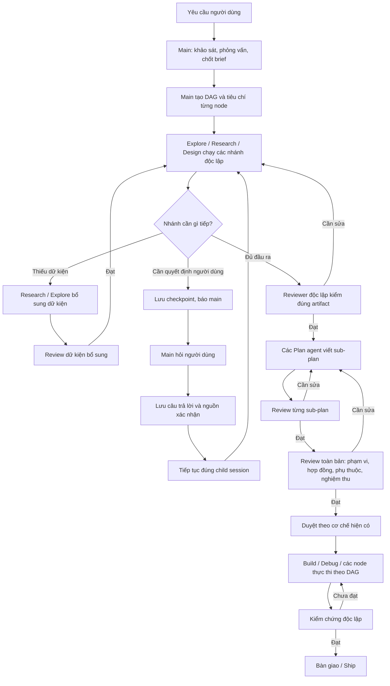

# Sửa độ tin cậy của Work Graph: điều phối linh hoạt, kiểm chứng theo nhiệm vụ và phỏng vấn có thể tiếp tục

> Bản cập nhật v2 — 01/10/2026. Trạng thái: đã triển khai các sửa nhỏ W0/W1 và phần diagnostic của W2 trên nhánh B; checklist và kiểm thử tại mục 13. W1 preflight và W2 UI chưa triển khai.
>
> Quyết định mới của chủ dự án thay thế yêu cầu “mọi sub-agent đều có một lượt review giống nhau”: main chọn specialist và cách kiểm chứng phù hợp; backend bảo đảm các kiểm tra bắt buộc theo đầu ra, phạm vi thay đổi và rủi ro. Phần 6–9 cụ thể hóa chính sách này, chuẩn đầu ra và prompt cho coding agent.

## 1. Kết quả khảo sát và các lỗi cần sửa

### Phạm vi và trạng thái hiện tại

Giữ luồng hiện có:

**Main làm rõ yêu cầu → Explore/Research/Design → các sub-plan → review toàn bản → duyệt → thực thi theo DAG → kiểm chứng → bàn giao.**

Hai yêu cầu bạn đã chốt:

- **Kiểm chứng bắt buộc được xác định theo nhiệm vụ**, không gắn một reviewer giống nhau vào mọi sub-agent. Khi một kiểm tra đã được xác định là bắt buộc, không được bỏ qua vì thiếu role, hết ngân sách hoặc bật Autopilot. Plan và thiết kế làm căn cứ triển khai cần phản biện độc lập; code cần kiểm thử; debug định tuyến có thể không cần semantic review riêng. Xem ma trận tại mục 6.
- Khi một nhánh cần người dùng định hướng, **nhánh đó gửi yêu cầu về main; main phỏng vấn rồi gửi câu trả lời về đúng agent đó**. Các nhánh độc lập tiếp tục chạy.

Khảo sát trước ngày 01/10/2026 đã đọc code, SQLite của phiên thử nghiệm, hai tài liệu đính kèm và kiểm tra UI bằng CUA. Đợt W0–W2 ngày 01/10/2026 sửa validation/schema/hướng dẫn recovery và tách diagnostic qua code paths hiện có, chạy kiểm thử bằng fixture trên checkout B. Không mở phiên model/live CUA mới trong đợt này. Kết quả fixture kiểm chứng hành vi code, không chứng minh chất lượng plan do model thật sinh ra.

**Nhánh triển khai: B.** Checkout chính tại `D:/create/BoxFox-Agent-Box` vẫn ở `main`, có thay đổi chưa commit tại `HarnessFlowVisualizer.tsx`. Checkout riêng của B tại `D:/create/BoxFox-Agent-Box-B`, cùng baseline commit `3694305642fc9bf922389dc04329fbc7ede4ef59`. Source, tests và tài liệu của đợt này chỉ được sửa trong checkout B; không sửa bản người dùng lưu ở main hoặc file frontend đang dở. Chưa commit/push/merge.

**File bàn giao hiện tại:** `docs/plan/Work-Graph-fix.md` trong checkout B. Giữ cùng tên với bản người dùng cung cấp, không tạo thêm một plan song song. Các đường dẫn code trong bằng chứng cũ trỏ checkout chính; nội dung tương ứng đã đối chiếu với B. Khi triển khai phải mở file thuộc checkout B.

### Bằng chứng quan trọng từ phiên bạn thử

Run `w-eb1e012a20` hiện có:

| Thành phần | Trạng thái thực tế |
|---|---|
| R1–R4 | `failed`, lỗi `Specialist is disabled or unknown`; không có reviewer session hoặc verdict. |
| E1 | `accepted`, có reviewer và `VERDICT: ok`; vẫn có những tiêu chí chưa xác minh. |
| Review toàn bản | Chưa chạy. |
| Node Plan | Chưa được tạo. |
| Tài liệu chính thức của run | Chưa có. |
| Phỏng vấn trong snapshot run | Rỗng, dù lịch sử Decisions vẫn giữ câu trả lời. |
| Trạng thái run | `needs_revision`. |
| Kết luận của main trong chat | Báo “đã xong”, sau đó lưu tài liệu bằng đường ghi file thông thường. |

Cấu hình phiên lưu **9 role cũ**, thiếu `plan-review` và `research-review`. Vì vậy lỗi này không chứng minh bạn đã tắt reviewer; backend chưa bổ sung các role mới cho cấu hình cũ.

Trong 13 phiên con của ca này, 9 phiên có notice về output bị cắt, hết bước hoặc hết thời gian. Hai lượt cuối dùng hết **2.048 completion token cho reasoning**, không còn câu trả lời để bàn giao.

Các điểm vào chính để triển khai:

- [Work Graph engine](D:/create/BoxFox-Agent-Box/backend/src/agentbox/agent_core/work_graph.py:1024).
- [Runtime delegation và xử lý completion](D:/create/BoxFox-Agent-Box/backend/src/agentbox/agent_core/runtime.py:6657).
- [Sub-agent inspector](D:/create/BoxFox-Agent-Box/frontend/src/components/panels/SubagentInspectorPanel.tsx:655).

### Danh mục lỗi

“Đã xác nhận” nghĩa là có bằng chứng từ phiên/UI hoặc phép kiểm tra trực tiếp. “Rủi ro trong code” nghĩa là đã xác định đường lỗi, nhưng chưa gây lại tình huống đó trên phiên sống.

| Mã | Hiện tượng và nguyên nhân | Hệ quả | Mốc sửa |
|---|---|---|---|
| **F01 — Đã xác nhận** | Reviewer cần cho nhiệm vụ thiếu trong cấu hình phiên cũ. Backend chỉ tìm role đã lưu và được bật; engine không kiểm tra trước khi nghiên cứu. | R1–R4 nghiên cứu xong rồi thất bại lúc tạo reviewer; main tiếp tục thử lại mà cấu hình không đổi. Chuẩn hóa/preflight theo check policy, không bật mọi reviewer cho mọi node. | M1 |
| **F02 — Đã xác nhận** | Research dùng mặc định 4.096 output token. Khi bị cắt, runtime gửi lại cùng lịch sử dài, bỏ tools và thường giảm xuống 2.048 token. | Retry có thể chỉ sinh reasoning; không bảo toàn báo cáo hoàn chỉnh và không giải quyết nguyên nhân độ dài. | M2 |
| **F03 — Đã xác nhận trong code** | Adapter và SSE client dùng `length` cả khi hết token lẫn khi stream thiếu tín hiệu kết thúc. | `PROVIDER_OUTPUT_TRUNCATED` không đủ phân biệt giới hạn output với đứt kết nối; khó chọn cách phục hồi đúng. | M2 |
| **F04 — Đã xác nhận** | Runtime nối `[Diagnostic: … tools_run=[…]]` vào `summary`, sau khi đã giới hạn độ dài nội dung. Danh sách tool chứa nhiều tên lặp. | Metadata bị main hoặc UI coi như báo cáo; chuỗi diagnostic lọt vào bảng và cạnh URL đang viết dở như ảnh 5–6. | M2, M5 |
| **F05 — Đã xác nhận bằng CUA** | Payload `web_search` hợp lệ. Firecrawl trả 403; SearXNG, Brave, Tavily chưa có cấu hình. Hint lỗi vẫn yêu cầu “sửa input và gọi lại”. | Agent tốn bước thử những truy vấn khác trên cùng hạ tầng không hoạt động. Đây không phải lỗi do tiếng Việt trong query. | M2 |
| **F06 — Đã xác nhận** | Prompt wrapper, deliverable và reviewer template viết tiếng Anh. Nhánh `knowledge` còn dùng contract chung thay vì contract Work Graph đầy đủ. | Prompt pha hai ngôn ngữ; có knowledge agent trả kết quả cuối bằng tiếng Anh và nhắc tới `researchId` mà nó chưa được cấp. | M1, M5 |
| **F07 — Đã xác nhận** | Main tạo `mixed` run chỉ có discovery nodes; chưa tạo Plan hoặc chạy whole-plan review. Ba lần `write_plan` thiếu `slug`, rồi chuyển sang `file_write`/terminal. | Tài liệu nháp được lưu và báo hoàn tất ngoài cổng chất lượng của DAG. | M3, M5 |
| **F08 — Đã xác nhận trong code** | Reviewer nhận tối đa 14.000 ký tự output; whole-plan review nhận các phần 5.000–6.000 ký tự rồi context lại bị giới hạn. | Phần cuối, nguồn và cảnh báo có thể không tới reviewer; review không gắn chắc với toàn bộ tài liệu. | M1, M3 |
| **F09 — Đã xác nhận** | Engine có thể dùng output của child bị lỗi nếu còn chữ; parse verdict không bắt buộc child hoàn tất. Hết vòng, Research/Explore có thể chuyển `accepted` với caveat. | Một đoạn dở hoặc kết quả chưa đánh giá đầy đủ vẫn mở đường cho bước tiếp theo. E1 đã được nhận dù một số acceptance còn `UNVERIFIED`. | M3 |
| **F10 — Đã xác nhận** | Phỏng vấn xảy ra trước khi tạo run nên câu trả lời chỉ nằm trong events. Khi có interview trong run, context chỉ giữ question/answer, bỏ một phần provenance. | Reviewer không có snapshot đầy đủ về điều người dùng xác nhận và điều agent tự đề xuất. | M1, M4 |
| **F11 — Đã xác nhận trong code** | `Knowledge requests` chỉ hỗ trợ thiếu dữ kiện bên ngoài/repo, rồi tạo producer mới. Không có giao thức riêng cho quyết định của người dùng và resume đúng child. Interview giữ future trong RAM, có timeout tự giao quyền cho agent. | Luồng “research một phần → main hỏi user → đúng agent làm tiếp” chưa được bảo đảm; restart có thể làm quyết định không trả lời tiếp được. | M4 |
| **F12 — Đã xác nhận trong code** | Update chỉ reset node bị đổi, chưa vô hiệu hóa đầy đủ các node phụ thuộc. Thay đổi `files` không nằm trong bộ so sánh; remove chưa reset đầy đủ review/approval. | Kết quả cũ có thể được dùng sau khi căn cứ hoặc đồ thị đã đổi. | M1, M3 |
| **F13 — Đã xác nhận** | Acceptance yêu cầu shell probes nhưng Explore/Review không có `terminal_exec`. `codebase_glob` dùng `Path.glob`, không hỗ trợ brace expansion. Kiểm tra trực tiếp: `*.{py,ts}` trả 0, `*.py` trả 40 file. | “Không tìm thấy” có thể bị hiểu sai thành “không tồn tại”; nhiệm vụ được giao có tiêu chí agent không thể kiểm tra. | M2, M3 |
| **F14 — Đã xác nhận bằng CUA** | Màu xanh lá phản ánh child `completed`, không phải đã được reviewer chấp nhận. Vòng reviewer không tạo được vẫn hiển thị `pending`. Khi chuyển agent, dữ liệu cũ còn hiển thị trước khi fetch mới hoàn tất. | Người dùng khó biết hoàn thành tính toán, hoàn thành báo cáo và đạt phản biện là ba trạng thái khác nhau. | M5 |
| **F15 — Rủi ro trong code** | Execution reviewer dùng role Testing có quyền ghi; yêu cầu “không sửa source” chủ yếu nằm trong prompt. | Reviewer có thể sửa thứ đang kiểm tra, làm mất tính độc lập của bằng chứng test. | M3 |
| **F16 — Rủi ro trong code** | `work_ship` đổi branch sau khi thực thi và stage bằng `git add -A`, chưa gắn chặt với tập thay đổi của run. | Có thể sửa trên branch ngoài ý định hoặc đưa thay đổi không thuộc công việc vào commit. | M3 |

**Trả lời trực tiếp câu hỏi của bạn:** phiên này có gọi nhiều Research agent, nhưng **R1–R4 chưa được verify độc lập**. Hai knowledge agent cũng không có vòng review riêng. E1 có review thật, nhưng cổng hiện tại vẫn nhận kết quả còn khoảng trống nghiệm thu.

---

## 2. Đối chiếu feedback của coding agent

Dùng [plan bạn gửi](</C:/Users/Admin/.codex/attachments/8c2169e3-fa0e-46e1-ad6b-ba39833e9f3f/Văn bản đã dán.txt>) và [feedback đính kèm](</C:/Users/Admin/.codex/attachments/9ab199c0-9fe6-4db0-9c84-5b507982a317/Văn bản đã dán.txt>) làm ca hồi quy cho harness.

Không lấy điểm “6,5/10” làm kết luận kỹ thuật. Những nhận xét có cơ sở được quy về nguyên nhân sau:

| Nhận xét | Kết luận và nguyên nhân ở harness |
|---|---|
| Thiếu nguồn pháp lý quan trọng; Luật 91 bị đánh dấu chưa xác minh | Có cơ sở. Tìm kiếm không hoạt động, nhưng nhiệm vụ/reviewer chưa bảo đảm tìm nguồn thay thế, kiểm tra đúng số hiệu–tên–mốc hiệu lực và phát hiện khoảng trống pháp lý trước khi tổng hợp. |
| Benchmark/schema chưa khớp bàn giao ca, hội chẩn | Có cơ sở về khoảng trống phù hợp mục tiêu. Research chưa có bước đánh giá khả năng chuyển kết quả benchmark sang bài toán của người dùng; review toàn bản chưa chạy. “Discharge Me!” thực sự tập trung vào nội dung tóm tắt xuất viện. [Bài gốc](https://aclanthology.org/2024.bionlp-1.7/). |
| Có citation chưa chứng minh câu tổng hợp đúng | Đúng. Plan chưa định nghĩa đầy đủ quan hệ claim–evidence và cách kiểm chứng nội dung. Rubric chưa buộc phân biệt kiểm tra field tồn tại với chứng minh yêu cầu đúng. |
| `unsupported_claims` dùng ID chưa được định nghĩa; input/output không thống nhất | Đúng. Thiếu kiểm tra hợp đồng xuyên suốt giữa kiến trúc, schema, grounding và nghiệm thu. |
| Ngưỡng nghiệm thu chưa có căn cứ | Đúng. Agent đề xuất ngưỡng nhưng chưa ghi rõ đơn vị đo, dữ liệu, baseline, mức nghiêm trọng, cách hiệu chỉnh và bất định thống kê. Với giả định các ca độc lập, 0 lỗi/250 ca vẫn cho cận trên một phía 95% khoảng 1,19%; không chứng minh tỷ lệ lỗi thực bằng 0. |
| Điểm Qwen được dùng để biện minh cho tóm tắt lâm sàng | Có cơ sở. Bảng 33 đo MLogiQA, INCLUDE, MT-AIME24 và PolyMath. Knowledge agent đã cảnh báo chúng không đo chất lượng tóm tắt lâm sàng; cảnh báo bị mất khi main tổng hợp. [Báo cáo Qwen3](https://arxiv.org/html/2505.09388v1). |
| Timeline, lệnh kiểm thử và cây thư mục mâu thuẫn | Đúng về những điểm nêu rõ trong tài liệu, như P5 “4–8 tuần” và “3–6 tháng”. Thiếu review toàn bản và ma trận liên kết đầu ra–milestone–nghiệm thu. |
| Sizing GPU, throughput và tiến độ chưa được đo | Có cơ sở về thiếu bằng chứng. Harness chưa buộc giữ trạng thái “ước tính cần đo” khi số liệu được chuyển thành quyết định thiết kế. |
| Người dùng chọn bừa nhưng plan dựng luôn phạm vi production lớn | Harness không thể biết người dùng chọn bừa. Lỗi cần sửa là thiếu bản brief xác nhận phạm vi, chi phí và các đánh đổi lớn sau phỏng vấn; không được tự thay câu trả lời thành MVP. |
| Header cho thấy plan chưa qua reviewer | Đúng với bản này. Không có whole-plan review hoặc plan-verification tương ứng. Trạng thái phải hiện trong UI/sổ review; nội dung chuyên môn không nên bị trộn diagnostic nội bộ. |

Đã xác minh sự tồn tại và mốc hiệu lực của các văn bản mà feedback nói còn thiếu:

- [Luật 91/2025/QH15](https://vanban.chinhphu.vn/?classid=1&docid=214590&pageid=27160&typegroupid=3) và [Nghị định 356/2025/NĐ-CP](https://vanban.chinhphu.vn/?classid=1&docid=216387&pageid=27160&typegroupid=4): hiệu lực 01/01/2026.
- [Luật 134/2025/QH15](https://vanban.chinhphu.vn/?classid=1&docid=216334&pageid=27160&typegroupid=3): hiệu lực 01/03/2026; [Nghị định 142/2026/NĐ-CP](https://vanban.chinhphu.vn/?classid=1&docid=218029&pageid=27160&typegroupid=4): hiệu lực 01/05/2026.
- [Thông tư 13/2025/TT-BYT](https://vbpl.vn/boyte/Pages/vbpq-toanvan.aspx?ItemID=178219) về bệnh án điện tử và [Thông tư 33/2025/TT-BYT](https://vanban.chinhphu.vn/?classid=1&docid=214427&orggroupid=4&pageid=27160) về thời hạn lưu trữ.

Đợt này chưa xác nhận toàn bộ nghĩa vụ áp dụng cho hệ thống y tế cụ thể. Benchmark phải kiểm khả năng nhận diện phần còn cần xác minh, không biến danh sách văn bản thành chứng nhận tuân thủ.

**Không đưa các ý sau thành luật mặc định của harness:**

- Bắt buộc NLI cho mọi thiết kế grounding.
- Alpha 0,8 là ngưỡng phổ quát cho mọi bài toán y tế.
- Model bị gated đồng nghĩa không thể dùng production.
- Không tìm thấy model/benchmark đồng nghĩa chúng không tồn tại.
- Model cũ hơn đồng nghĩa lựa chọn chắc chắn kém.

Đây là các quyết định cần bằng chứng và đánh đổi theo bài toán.

---

## 3. Thiết kế sửa trong DAG hiện có

### 3.1 Luồng phối hợp và phản biện

Sơ đồ trên minh họa luồng đầy đủ cho một nhiệm vụ lập kế hoạch có nghiên cứu. Nhánh debug, testing, knowledge đơn giản và các điểm kiểm chứng linh hoạt được định nghĩa tại mục 6; không dùng sơ đồ này làm chuỗi review cố định cho mọi vai trò. Giữ cách main phân rã công việc, fan-out và thứ tự thực thi hiện tại.

Đặc biệt, **không đổi ngữ nghĩa cạnh Plan → Plan hiện có**. Nếu nhiều sub-plan cần một hợp đồng chung, tạo đầu ra Design/Research dùng chung làm dependency; whole-plan reviewer kiểm tra các hợp đồng thống nhất.

### 3.2 Cấu hình, snapshot và kết quả có cấu trúc

Bổ sung một giao thức kết quả dùng chung cho producer, knowledge helper và reviewer.

| Thành phần | Thay đổi tối thiểu cần có |
|---|---|
| Run | Thêm phiên bản giao thức, ngôn ngữ đầu ra, loại deliverable, snapshot brief và provenance. |
| Node/stage | Theo dõi riêng trạng thái thực thi, mức hoàn chỉnh của deliverable và trạng thái review. |
| Artifact | Nội dung đầy đủ, ID/version/hash bất biến, nguồn liên quan và các phần đã hoàn thành. |
| Review | Gắn với run, node, stage, node revision, brief revision, artifact hash và snapshot dependency. |
| Yêu cầu từ child | Phân biệt `knowledge`, `user_decision`, `environment_blocker`; có ID ổn định và lý do ảnh hưởng. |
| Continuation | Gắn đúng child session, checkpoint và snapshot; invocation ID chống chạy trùng. |

Backend tự lấy danh tính session và binding; model không được tự khai mình là reviewer độc lập hoặc tự gán một đề xuất thành quyết định người dùng.

**Công cụ mới `work_report`:**

- `checkpoint`: lưu những phần đã hoàn thành và phần còn thiếu.
- `needs_user`: trả internal feedback, câu hỏi đề xuất, lựa chọn và tác động.
- `finalize`: chốt deliverable đầy đủ để đưa vào review.
- `review`: ghi kết quả theo từng acceptance cùng findings có bằng chứng.

Các thao tác dùng part/invocation ID để gửi lại an toàn. Backend lưu kết quả trước khi xác nhận thành công. UI dựng báo cáo từ artifact đã lưu; không buộc model sinh lại toàn bộ tài liệu dài trong một câu trả lời cuối.

Tiếp tục hỗ trợ đọc transcript và verdict cũ. Kết quả dùng parser cũ chỉ là lịch sử; khi tiếp tục run phải kiểm theo giao thức mới trước khi coi là đạt.

### 3.3 Hoàn thành output và phục hồi đúng nguyên nhân

- Tách nguyên nhân: output token limit, stream kết thúc bất thường, hết bước, hết thời gian, provider refusal và lỗi schema.
- Router truyền finish reason gốc và tình trạng có/không có terminal event. Không tự đổi stream bị đứt thành “hết token”.
- Bỏ cách retry cùng yêu cầu dài với budget bị giảm một nửa.
- Producer ghi checkpoint sau các phần nghiên cứu có giá trị. Báo cáo dài được lưu theo phần hoàn chỉnh; finalize dùng manifest/reference ngắn.
- Khi thiếu phần cuối, phục hồi từ checkpoint trên cùng model/route, chỉ yêu cầu bổ sung phần còn thiếu.
- Tool-call JSON bị cắt không được thực thi hoặc tự vá thành `{}`.
- Lỗi tham số trả đúng field bị thiếu, ví dụ `slug`, cùng một ví dụ hợp lệ ngắn.
- Lỗi cấu hình/provider không được trả hint “sửa input”; phải trả capability đang thiếu và các đường còn dùng được.
- Diagnostic nằm trong trường metadata riêng. Model và Markdown renderer không nhận chuỗi `tools_run` nối vào deliverable.

Giữ model, provider và cấu hình reasoning đang dùng. Giữ trần review hiện có: mặc định ba vòng, tối đa bốn vòng khi cấu hình cho phép; whole-plan review tối đa ba lần. Retry/finalization phải nằm trong ngân sách, không tạo vòng vô hạn. Hết ngân sách thì lưu checkpoint và báo rõ phần chưa hoàn thành.

### 3.4 Kiểm chứng theo nhiệm vụ và review khi cần

**Bảo đảm có reviewer:**

- Chuẩn hóa cấu hình harness khi khôi phục frontend, tạo/đọc phiên backend và tiếp tục run.
- Những reviewer/tester mà check policy yêu cầu phải có effective configuration. Nếu role chưa tồn tại trong cấu hình cũ, bổ sung role tương thích với route kế thừa hiện có; không đổi provider.
- Settings thể hiện các specialist và việc kiểm chứng bắt buộc cho nhiệm vụ hiện tại; không trình mọi reviewer là bắt buộc cho mọi node.
- Preflight kiểm tra route, role, tools và khả năng đọc artifact của các check bắt buộc trước khi chạy producer. Node độc lập không cần capability đó vẫn được chạy.
- Reviewer không khởi tạo được phải ghi `review_error` cùng nguyên nhân; không để vòng ở `pending`.

**Điều kiện nhận một kết quả:**

- Deliverable đã finalize hoàn chỉnh.
- Mọi check bắt buộc theo policy có kết luận hợp lệ; check độc lập dùng child khác producer. Kiểm tra tự động có thể cung cấp bằng chứng trực tiếp mà không mở thêm một LLM reviewer.
- Nếu cần semantic review, reviewer kiểm đúng version/hash và đọc được toàn bộ artifact cần đánh giá. Test phải gắn đúng code snapshot và lệnh/đầu ra thật.
- Mọi acceptance bắt buộc có kết luận `pass`, `fail` hoặc `unverified` cùng căn cứ và check chịu trách nhiệm.
- Không có blocker và không có tiêu chí bắt buộc còn `unverified`.
- Kết quả reviewer bị cắt hoặc chưa hoàn tất không tự tính đạt dù có chuỗi `VERDICT: ok`.

Bỏ đường chuyển `accepted` khi đã hết vòng nhưng còn blocker hoặc chưa review. Giữ output dưới trạng thái nháp/partial để tận dụng tiếp; các node phụ thuộc không được coi nó là bằng chứng đã chốt.

**Research có ảnh hưởng lớn:**

- Knowledge đơn giản có thể được xác minh bằng nguồn/locator và kiểm tra tự động, hoặc được kiểm ở consumer trước khi consumer chốt quyết định. Không bắt một LLM reviewer cho từng helper. Knowledge quan trọng dùng để chốt kiến trúc, an toàn hoặc nghĩa vụ pháp lý phải có kiểm chứng độc lập trước khi quyết định dựa vào nó được chấp nhận.
- Với nghiên cứu ảnh hưởng tới pháp lý, sức khỏe, bảo mật, ngân sách lớn hoặc quyết định kiến trúc nền tảng, dùng hai lượt độc lập: **kiểm chứng bằng chứng** và **phản biện kết luận**.
- Tận dụng logic evidence/critique hiện có của Research; điều chỉnh binding cho Work Graph, không buộc child dùng một `researchId` chưa được tạo.
- Evidence review kiểm nguồn thật, đoạn trích, ngày, phạm vi và quan hệ claim–evidence.
- Critique kiểm suy luận, bằng chứng trái chiều, lựa chọn thay thế và khả năng áp dụng vào mục tiêu người dùng.
- Không review reviewer theo chuỗi đệ quy. Backend kiểm tính hợp lệ của review; các lượt evidence/critique đánh giá hai khía cạnh của cùng producer artifact.

**Review kế hoạch:**

Phải kiểm sản phẩm, kiến trúc, stack, dữ liệu, hợp đồng, AI engineering khi áp dụng, vận hành, milestone và nghiệm thu. Mỗi finding chỉ rõ section/acceptance bị ảnh hưởng, bằng chứng và hướng sửa.

Ma trận bắt buộc:

**Yêu cầu → quyết định thiết kế → milestone → đầu ra → cách nghiệm thu → expected result.**

Các con số chưa đo phải giữ nhãn đề xuất/ước tính; các đường dẫn dự kiến tạo phải khác đường dẫn đã xác minh tồn tại. `ready` chỉ xác nhận kế hoạch đủ căn cứ để triển khai theo phạm vi đã chốt, không chứng nhận sản phẩm đã an toàn hoặc tuân thủ pháp luật.

### 3.5 Hỏi người dùng và tiếp tục đúng agent

Internal feedback của child gồm:

- Phần đã hoàn thành và checkpoint.
- Quyết định nào đang chặn, vì sao không thể tự khảo sát.
- Lựa chọn và tác động tới phạm vi/chi phí/dữ liệu.
- Câu trả lời cần để tiếp tục phần nào.

Main gom câu hỏi liên quan thành các vòng ngắn, mặc định 1–3 câu. Không hỏi lại câu còn hiệu lực; không bắt người dùng chọn chi tiết kỹ thuật mà agent có thể nghiên cứu.

Quy trình:

1. Child lưu checkpoint và trả `needs_user`; giải phóng slot tính toán.
2. Scheduler giữ node và các dependency chưa đủ điều kiện ở trạng thái chờ; các nhánh độc lập tiếp tục.
3. Main nhận sự kiện sớm, không phải đợi toàn bộ `work_run` kéo dài kết thúc.
4. Câu hỏi xuất hiện trong chat và Decisions.
5. Câu trả lời được lưu cùng continuation trong transaction.
6. Worker tiếp tục **cùng child session ID**, mang lịch sử, nguồn đã đọc, checkpoint và brief cập nhật.
7. Output mới qua các check đúng policy của node; nếu cần review thì reviewer nhận đúng bản mới.

Yêu cầu bền vững:

- Pending question và continuation nằm trong SQLite, không phụ thuộc future trong RAM.
- Thời gian người dùng suy nghĩ không tiêu ngân sách tính toán.
- Không tự coi câu chưa trả lời hoặc timeout là “để agent quyết định”.
- Gửi trùng chỉ tạo một continuation.
- Kiểm revision của câu hỏi/node và brief liên quan; các nhánh khác hoàn tất không làm câu trả lời bị conflict chỉ vì global run revision tăng.
- Nếu phạm vi đã đổi, trả conflict rõ ràng và dựng lại câu hỏi.
- Giữ bảng hỏi cùng câu trả lời trong chat và lịch sử Decisions sau khi gửi.
- Phỏng vấn trước khi tạo run được gắn vào run theo cùng intent/invocation, không tự nhập toàn bộ quyết định cũ của phiên.
- “Để agent đề xuất” là ủy quyền đề xuất; phương án kỹ thuật vẫn mang nguồn `proposed`.

Sau phỏng vấn đầu, những dự án lớn phải có brief ngắn xác nhận phạm vi và đánh đổi đáng kể trước khi soạn đầy đủ. Không thay câu trả lời production thành MVP chỉ vì prompt ban đầu ngắn.

### 3.6 Artifact, nguồn và UI

- Khi deliverable yêu cầu kế hoạch, main phải bảo đảm có Plan artifact tương ứng và chạy review toàn bản. Mặc định Plan agents đảm nhiệm các sub-plan; Research được giao plan candidate đầy đủ có thể cung cấp artifact này nếu đạt cùng rubric. Main tổng hợp, điều phối và trình bày trạng thái; không tự lưu vài đoạn research rồi coi là plan đã đạt.
- Cho phép lưu nháp sớm qua đường artifact chuyên dụng. Ghi file thông thường không tạo chứng nhận review hoặc trạng thái `ready`.
- Tài liệu chính thức đi qua một đường đăng ký thống nhất để giữ version, hash, trạng thái chất lượng và lịch sử.
- Full plan nằm trong tab Plan; chat có tóm tắt, liên kết và trạng thái.
- URL lấy từ source record đã đọc, gồm URL gốc/cuối, thời điểm, locator và đoạn hỗ trợ claim. Không dựng lại URL từ trí nhớ, rút gọn bằng `...` hoặc dùng link lỗi như nội dung đã xác minh.
- Phân biệt nguồn không mở được, nguồn không hỗ trợ claim và nghiên cứu chưa tìm thấy bằng chứng.
- Kiểm tra pháp lý phải đối chiếu số hiệu, loại văn bản, tên và mốc hiệu lực; không chọn tài liệu chỉ vì trùng một phần số.
- Ngôn ngữ đầu ra lưu ở run và truyền cho mọi purpose. Template hiển thị, tiêu đề và kết quả cuối dùng tiếng Việt có dấu; giữ identifier, URL, trích dẫn và mã giao thức nguyên dạng. Reasoning có thể dùng tiếng Anh.
- Phân biệt feedback `definition_changed`, `review_findings`, `provider_failure`, `user_answer`; không gọi thay đổi node của main là “reviewer đã từ chối”.

UI dùng hai chỉ báo riêng:

| Chỉ báo | Ví dụ trạng thái |
|---|---|
| Thực thi/đầu ra | Đang chạy, chờ người dùng, dở do ngân sách, output bị cắt, đã hoàn thành deliverable. |
| Chất lượng | Chưa review, đang review, cần sửa, lỗi reviewer, đã đạt đúng phiên bản. |

Khi chuyển child, xóa nội dung của child trước khỏi vùng hiển thị và hiện loading/error theo đúng ID. Preview có nhãn cắt ngắn và đường mở bản đầy đủ; reviewer luôn đọc artifact đầy đủ.

### 3.7 Mất hiệu lực kết quả và quyền thực thi

- Đổi mục tiêu, acceptance, tests, files, dependency hoặc quyết định nền tảng phải vô hiệu hóa các kết quả bị ảnh hưởng theo quan hệ phụ thuộc.
- Add/remove/update làm mất hiệu lực whole-plan review và approval liên quan.
- Giữ review cũ trong lịch sử dưới trạng thái superseded, không xóa.
- Execute kiểm lại snapshot/hash đã duyệt. Autopilot không bỏ qua check bắt buộc hoặc kiểm tra phiên bản; yêu cầu chỉ lập plan/research/design không tự cho phép Build.
- Reviewer không được sửa source. Test chạy trên snapshot được kiểm soát; thay đổi source làm bằng chứng test không còn hợp lệ.
- Giao việc phải phù hợp tools của role. Shell probes đọc hiện trạng được thực hiện qua đường có quyền thích hợp và ghi bằng chứng, không giao cho Explore một acceptance bất khả thi.
- `codebase_glob` hỗ trợ danh sách pattern đơn; cú pháp không hỗ trợ phải báo lỗi thay vì trả rỗng gây hiểu nhầm.
- Nhánh làm việc được xác nhận trước khi Build ghi mã. Ship chỉ stage tập thay đổi thuộc run, kiểm tra dirty files ngoài phạm vi và branch được phép; không gom bằng `git add -A`.

---

## 4. Các mốc triển khai và tracking

M0–M6 là các gói đầu ra để tracking. **Thứ tự thi công thực tế từ dễ đến khó nằm tại mục 12**; không bắt hoàn thành toàn bộ M1 rồi mới được sửa bug độc lập của M2. Từng bước phải có test và handoff trước khi chuyển sang bước sau.

| Mốc | Công việc và đầu ra | Điều kiện hoàn thành |
|---|---|---|
| **M0 — Bàn giao và baseline** | Lưu/cập nhật `docs/plan/Work-Graph-fix.md` trên B; thêm bảng tracking gồm việc đã làm, commit, bằng chứng test, việc còn dở và bước tiếp theo. Tạo fixture đã loại thông tin nhạy cảm từ phiên lỗi. | Tài liệu đã lưu; fixture F01–F14 còn cần dựng; ghi riêng F15–F16 là rủi ro chưa tái hiện. Giữ nguyên checkout bẩn hiện tại; triển khai trong checkout B. |
| **M1 — Giao thức và tương thích cấu hình** | Check policy theo task/artifact/risk; role preflight; artifact/snapshot/binding; `work_report`; các trường trạng thái và ngôn ngữ. Migration SQLite bổ sung, đọc được lịch sử cũ. | Phiên 9 role cũ tạo được specialist kiểm chứng cần thiết. Main chọn policy có căn cứ; backend chặn hạ mức kiểm tra bắt buộc. Model không giả mạo nguồn người dùng hoặc review. Output đầy đủ không bị thay bằng preview. |
| **M2 — Completion và công cụ** | Sửa phân loại SSE, phục hồi từ checkpoint, tách diagnostic; schema errors đúng field; phân loại lỗi tìm kiếm và tránh retry hạ tầng đã hỏng; sửa glob/probe capability. | Các ca cắt giữa URL/JSON, reasoning-only, EOF và hết token có trạng thái đúng; checkpoint không mất; không spam query hoặc diagnostic. |
| **M3 — Kiểm chứng và chất lượng** | Policy Explore/Research/Design/Plan/Build/Debug/Testing; evidence/critique khi cần; rubric theo acceptance; review toàn artifact; invalidation theo dependency/hash; quyền tester/reviewer và phạm vi branch/change set. | Không nhận `accepted`/`verified` khi output dở hoặc check bắt buộc thiếu/lỗi. Debug/test có luồng phù hợp, không thêm review đệ quy. Bản mẫu phải bị yêu cầu bổ sung. |
| **M4 — Interview và resume** | Durable user requests, answer transaction, continuation worker, callback về main, tiếp tục đúng child; câu hỏi trước run và provenance. | Chờ user không giữ model turn; restart trả lời tiếp được; nhánh khác tiếp tục; gửi trùng chỉ resume một lần; child ID không đổi. |
| **M5 — Plan, prompt và UI** | Localize tất cả purpose; feedback đúng loại; Plan agent/sub-plan/whole-plan path; draft registration; chat–Decisions–Plan dùng cùng dữ liệu; badge và inspector loading theo child. | Không còn báo hoàn tất cho run `needs_revision`; toàn văn nằm trong Plan; lịch sử hỏi đáp còn nguyên; giao diện phân biệt completed với reviewed. |
| **M6 — Hồi quy và đánh giá sống** | Test unit/integration, fault injection, CUA và bộ prompt cố định; giữ model/route hiện có; báo cáo từng lần chạy, token/latency nếu đo được. | Đạt các cổng trong mục 5; không bỏ lượt lỗi khỏi thống kê; có handoff rõ phần chưa đạt. |

Tracking ban đầu:

- [x] Đọc code và xác định đường điều phối hiện tại.
- [x] Đối chiếu phiên SQLite, lỗi tìm kiếm và reviewer trên UI.
- [x] Đọc plan và phân loại feedback có cơ sở.
- [x] Ghi nhận điều chỉnh 01/10/2026: kiểm chứng linh hoạt theo nhiệm vụ; giữ resume đúng agent.
- [x] Lưu bản cập nhật vào `docs/plan/Work-Graph-fix.md` trên checkout B.
- [ ] M0: dựng fixture baseline; hiện chỉ hoàn thành khảo sát và tài liệu.
- [ ] M1–M6 — chưa triển khai code hoặc chạy bộ nghiệm thu của bản cập nhật này.

Mỗi mốc chỉ được tick sau khi có bằng chứng. Tick triển khai và tick nghiệm thu phải tách riêng.

**API bổ sung/điều chỉnh:**

- Giữ `GET /api/agent/sessions/{sid}/work`, bổ sung snapshot, request và trạng thái review rõ ràng.
- Thêm đường đọc artifact đầy đủ theo session/run/artifact ID, hỗ trợ đọc từng phần.
- Mở rộng `POST /api/agent/sessions/{sid}/decisions` cho câu trả lời bền vững với decision revision và invocation ID.
- Backend kiểm quyền sở hữu run/child, snapshot và deduplication; frontend không tự quyết định node đã đạt.

---

## 5. Kiểm thử, CUA và điều kiện nghiệm thu

### 5.1 Test xác định bắt buộc

| Nhóm | Ca kiểm tra | Kết quả đúng |
|---|---|---|
| Role migration | Khôi phục phiên chỉ có 9 role cũ. | Specialist cho check bắt buộc tồn tại trước khi producer chạy; giữ route đang cấu hình; không tạo reviewer thừa cho diagnostic đơn giản. |
| Preflight | Reviewer route hoặc công cụ cần thiết không khả dụng. | Báo nguyên nhân cấu hình trước khi tốn lượt nghiên cứu; không lặp producer vô ích. |
| Completion | Token limit, thiếu terminal event, reasoning-only, 503, deadline, step budget. | Phân loại riêng; checkpoint còn; không chuyển thẳng sang accepted. |
| Tool arguments | Thiếu `slug`, JSON bị cắt, object sai schema. | Tool chưa thực thi; lỗi nêu đúng field/độ dài/vị trí khi phù hợp; không thay bằng `{}`. |
| Search | Firecrawl 403 và các leg thiếu cấu hình. | Báo capability thiếu một lần; dùng nguồn còn khả dụng hoặc conditional answer; không bảo rằng sửa query sẽ chữa hạ tầng. |
| Diagnostic | Output kết thúc ở `https:` hoặc giữa bảng. | Metadata không nối vào Markdown hoặc URL; link không hoàn chỉnh bị đánh dấu, không bịa phần còn lại. |
| Review | Producer/reviewer partial nhưng có `VERDICT: ok`. | Chưa được nhận cho tới khi finalize và các check bắt buộc hợp lệ; verdict dở không tạo bằng chứng đạt. |
| Review cap | Hết vòng với blocker hoặc chưa có reviewer. | Giữ nháp và findings; dependency quan trọng chưa mở. |
| Full artifact | Finding nằm sau mốc 14.000 ký tự hoặc cuối sub-plan. | Reviewer đọc được phần đó; hash khớp toàn văn. |
| Knowledge | Helper đưa một dữ kiện sai nhưng producer dùng để chốt stack. | Check của helper hoặc consumer chặn trước khi quyết định được nhận; không bắt một reviewer cho mỗi phép tra cứu đơn giản. |
| Flexible checks | Debug chỉ tái hiện lỗi; Build tạo patch; Testing trả log; knowledge lookup đơn giản. | Debug có thể không semantic review; patch vẫn cần test; log được gắn snapshot; helper được xác minh theo mức rủi ro. Không review reviewer/tester theo vòng vô hạn. |
| User handoff | Research cần định hướng; nhánh độc lập đang chạy. | Main nhận request; nhánh độc lập tiếp tục; câu trả lời tới đúng child. |
| Restart/dedup | Restart khi đang chờ; gửi hai lần; trả lời câu hỏi cũ. | Pending còn; đúng một continuation; câu hỏi lỗi thời trả conflict rõ. |
| Invalidation | Update/remove node, đổi files, đổi brief hoặc output dependency. | Review/approval liên quan hết hiệu lực; node phụ thuộc được đánh giá lại. |
| Permissions | Reviewer thử sửa source; Build ở branch ngoài phạm vi; Ship gặp file ngoài run. | Bị chặn ở execution boundary; không dựa riêng vào prompt. |
| Locale | Producer, knowledge, reviewer, plan, API, render và copy. | Tiếng Việt có dấu; identifier và trích dẫn nguyên văn được giữ. |
| Legacy | Mở plan/run/review cũ. | Vẫn đọc được, không tự gán nhãn đạt tiêu chuẩn mới. |

### 5.2 Runbook CUA cho agent kiểm thử

Chạy các ca gây lỗi trong session, database và workspace thử nghiệm riêng. Phiên hiện có chỉ dùng để đọc đối chiếu.

| Thao tác CUA | Output đúng cần thấy |
|---|---|
| Mở một Research child đã finalize nhưng chưa review. | “Đã hoàn thành đầu ra” và “Chưa review” là hai trạng thái riêng; không gắn nhãn đã verify. |
| Gây lỗi tạo reviewer. | Node và round hiển thị lỗi reviewer cụ thể; không nằm mãi ở `pending`. |
| Mở kết quả `web_search` không khả dụng. | Thông báo cấu hình/provider; không yêu cầu sửa query nếu arguments đã hợp lệ. |
| Mở child có output bị cắt. | Thấy checkpoint, phần thiếu và cách tiếp tục; diagnostic nằm trong khu vực riêng. |
| Click đổi liên tục giữa hai child. | Loading và nội dung luôn thuộc child đang chọn; không hiện báo cáo A với badge của B. |
| Research trả `needs_user`. | Chat và Decisions cùng hiện bộ câu hỏi; Work Graph cho biết node đang chờ, nhánh độc lập vẫn chạy. |
| Chọn options/nhập tự do và gửi. | Bảng hỏi cùng câu trả lời còn trong chat và Resolved; node tiếp tục đúng child ID. |
| Reload rồi restart backend trong lúc chờ user. | Câu hỏi vẫn trả lời được; không tự chọn thay người dùng; không tạo child trùng. |
| Mở Plan nháp và Plan đã đạt review. | Có version, trạng thái, findings và toàn văn đúng bản; chat chỉ tóm tắt/liên kết. |
| Sửa quyết định sau review. | Bản mới chưa được duyệt; review cũ hiện superseded; thực thi không dùng bản cũ. |
| Copy báo cáo/click nguồn. | Không có `[Diagnostic…]` trong nội dung; URL đầy đủ và tiếng Việt giữ dấu. |
| Bật Autopilot với một node chưa đạt. | Các check của policy vẫn bắt buộc; không bỏ blocker hoặc biến yêu cầu chỉ lập tài liệu thành triển khai. |

Agent QA phải lưu ảnh, thao tác, run/child ID, revision/hash, kết quả quan sát và log liên quan. Không tick chỉ vì UI không có banner đỏ.

### 5.3 Bộ đánh giá hành vi

Chạy 12 kịch bản, mỗi kịch bản hai lần:

1. Prompt y tế nguyên văn và câu trả lời phỏng vấn đã cung cấp.
2. Prompt đầy đủ, không cần hỏi thêm.
3. Phiên cũ thiếu role mới.
4. Search provider không khả dụng.
5. Output bị cắt và reasoning-only.
6. Knowledge helper sai hoặc thiếu bằng chứng.
7. Research cần user định hướng giữa chừng.
8. Người dùng đổi ý sau checkpoint.
9. Restart khi đang chờ trả lời.
10. Plan đầy tiêu đề nhưng thiếu thiết kế và nghiệm thu thực chất.
11. Reviewer lỗi/partial và finding nằm cuối tài liệu dài.
12. Build/test thất bại hoặc có thay đổi ngoài phạm vi run.

Ghi model, commit B, cấu hình, từng attempt, budget, token/latency nếu có, và kết quả mong đợi của từng kịch bản. Giữ riêng lỗi provider/model và lỗi sản phẩm, nhưng tính cả lượt lỗi trong tổng số.

**Cổng nghiệm thu:**

- 100% kết quả được gắn `accepted`/`verified` có đầy đủ check bắt buộc theo policy, đúng snapshot. Nhãn UI phải nói rõ đã test, đã kiểm nguồn hay đã semantic review; không gọi tất cả là reviewed.
- Không có auto-pass vì reviewer thiếu, output partial, verdict không hoàn chỉnh hoặc hết vòng.
- 100% ca hỏi giữa nhánh tiếp tục đúng child, không làm dừng nhánh độc lập.
- 100% ca retry câu trả lời không tạo continuation trùng.
- Bản mẫu bị đánh dấu thiếu căn cứ/thiết kế cần bổ sung; không được gọi là ready chỉ vì có nhiều nguồn.
- Không có diagnostic trong deliverable, URL bịa hoặc mất dấu khi render/copy.
- Ít nhất 22/24 lượt hoàn tất **đúng trạng thái mong đợi của kịch bản**, kể cả `blocked` khi đó là kết quả đúng; không đánh đồng mọi kịch bản với phải sinh plan ready.
- Không chuyển provider/model để cải thiện số liệu nghiệm thu.
- Báo cáo bàn giao nêu rõ mốc hoàn thành, test đã chạy, phần còn dở và bước tiếp theo.

**Giới hạn đã chốt:** sửa các lỗi về độ tin cậy, kiểm chứng theo nhiệm vụ, provenance, completion, interview và UI trong DAG hiện có; ứng dụng y tế là ca đánh giá harness. Việc triển khai và lưu tài liệu phải diễn ra trên nhánh B.

## 6. Điều phối linh hoạt: main nhận kết quả rồi chọn bước tiếp theo

### 6.1 Quyết định kiến trúc

Chọn **main điều phối + backend bảo đảm điều kiện chuyển trạng thái**. Main hiểu mục tiêu, chia nhánh, nhận kết quả nháp, đề xuất check policy, gọi các specialist cần thiết và tổng hợp dần. Backend quản lý trạng thái bền vững, quyền, dependency, ngân sách và bằng chứng hoàn thành.

Main được đọc kết quả nháp ngay để phát hiện thiếu sót, đặt câu hỏi và giao bổ sung. Việc nhận nháp không chứng nhận kết quả đúng. Khi trình kết luận, đưa kết quả vào quyết định thiết kế hoặc mở thực thi, phải đáp ứng các check bắt buộc của quyết định đó.

Không giữ ba bộ điều phối cạnh tranh cho Plan/Design/Research của nhiệm vụ mới. WorkRun là nguồn trạng thái chung; Plan, Research và Design giữ các bộ quy tắc chuyên môn và các view/artifact tương ứng. PlanRun/ResearchRun/DesignRun cũ vẫn đọc được; API tương thích chuyển lệnh của run mới tới WorkRun, không ghi hai state machine độc lập cho cùng nhiệm vụ.

Không thay framework/model/provider để giải quyết đợt này. Tách các phần mới ra module nhỏ cạnh work_graph.py; runtime.py chỉ là adapter vào tool dispatch, session, provider và executor. Tên file mới tại mục 8 là dự kiến, không khẳng định đã tồn tại.

### 6.2 Luồng do chủ dự án bổ sung

~~~mermaid
flowchart TD
    U["Người dùng: yêu cầu / ticket / lỗi"] --> M["Main: brief, mục tiêu, quyền và tiêu chí"]
    M --> W["Giao Explore / Research / Design / Plan phù hợp"]
    W --> A["Lưu artifact hoặc checkpoint; thông báo main"]
    A --> N{"Main quyết định bước tiếp"}
    N -->|"Thiếu dữ kiện"| K["Explore / Research bổ sung"]
    K --> A
    N -->|"Thiếu quyết định người dùng"| Q["Main interview; lưu câu trả lời; resume cùng child"]
    Q --> W
    N -->|"Đủ nháp, cần phản biện"| R["Reviewer nhận yêu cầu và đúng artifact"]
    N -->|"Cần kiểm tra hành vi / patch"| T["Testing thực hiện checks trên snapshot"]
    N -->|"Chỉ là diagnostic / lookup đơn giản"| C["Kiểm nguồn, tái hiện hoặc kiểm ở consumer"]
    R --> G{"Các check bắt buộc đạt?"}
    T --> G
    C --> G
    G -->|"Chưa đạt"| M
    G -->|"Đạt"| D["Main tổng hợp phần đã có căn cứ"]
    D --> P{"Đầu ra cần giao"}
    P -->|"Research / Design riêng"| O["Đăng ký tài liệu và trả kết quả"]
    P -->|"Kế hoạch triển khai"| S["Plan agents hoàn thiện sub-plan nếu cần"]
    S --> V["Review sub-plan và toàn bản theo artifact"]
    V -->|"Cần sửa"| M
    V -->|"Đạt"| AP["Ready; duyệt bản/hash"]
    AP --> EX["Thực thi khi được yêu cầu; theo execution dependencies"]
    EX --> TS["Testing"]
    TS -->|"Lỗi"| DB["Debug: tái hiện, nguyên nhân, đề xuất hoặc sửa"]
    DB --> EX
    TS -->|"Đạt; các check bổ sung đạt"| SH["Bàn giao / PR khi thuộc phạm vi yêu cầu"]
~~~

Sơ đồ thể hiện các nhánh lựa chọn, không bắt mọi nhiệm vụ đi hết tất cả ô. Main có thể gọi Research/Design trong lúc Plan đang soạn và gọi tiếp sau một finding. Các nhánh độc lập tiếp tục theo giới hạn fan-out hiện có.

Với ví dụ Research nhả về kết quả và sub-plan:

1. Research lưu báo cáo, nguồn, hạn chế và plan candidate; main nhận thông báo cùng các artifact reference.
2. Main đọc tóm tắt và phần cần thiết, kiểm tiêu chí của yêu cầu gốc, chọn evidence review/critique/plan review hoặc research bổ sung.
3. Reviewer nhận nguyên yêu cầu, brief, câu trả lời có provenance, acceptance, artifact ID/version/hash và manifest nguồn. Main không viết lại bản nháp để che cảnh báo của producer.
4. Nếu Research chỉ trả findings nhưng thiếu kế hoạch thực thi, main giao Plan agent xây phần còn thiếu từ những kết luận đã được kiểm chứng.
5. Nếu Research đã được giao cả plan candidate và đầu ra đủ chuẩn, có thể kiểm trực tiếp theo rubric Plan; không cần tạo thêm Plan child chỉ để chép lại cùng nội dung.
6. Review plan không thay thế kiểm nguồn nghiên cứu; evidence review không thay thế kiểm tính triển khai của plan. Một child có thể nhận hai nhiệm vụ kiểm khi rủi ro cho phép, nhưng phải trả kết luận riêng cho từng check.
7. Findings về một lựa chọn cần người dùng chốt quay về main để interview; findings kỹ thuật được giao đúng specialist sửa. Bản sửa tạo artifact version mới và làm mất hiệu lực các check liên quan.

Đây là điều chỉnh của v2 so với quy tắc “main chỉ thấy output sau ok”. Main thấy draft/partial để điều phối; consumer và state gate chỉ dùng kết quả theo mức tin cậy được khai báo.

### 6.3 Chính sách kiểm chứng theo đầu ra

Role là chuyên môn của worker. Artifact kind, mục đích sử dụng, tác động của thay đổi và mức rủi ro quyết định check cần có. Không được đổi tên role từ Build thành Debug để bỏ test, hoặc từ Plan thành Research để bỏ phản biện kế hoạch.

| Công việc / artifact | Check tối thiểu | Khi tăng mức kiểm | Bước tiếp khi chưa đạt |
|---|---|---|---|
| Explore trả bản đồ repo hoặc fact đơn giản | Đường dẫn/symbol tồn tại, locator và phạm vi đã đọc; acceptance có căn cứ. Có thể dùng check tự động và main spot-check. | Kết quả là căn cứ migration, quyền, phân tách kiến trúc: independent Explore/Review kiểm các claim quyết định. | Explore bổ sung; capability không có thì báo blocker. |
| Knowledge lookup đơn giản | Source record đã đọc và claim có locator; giữ nguyên giới hạn nguồn. Có thể kiểm ở consumer trong cùng check. | Claim bên ngoài tác động lớn hoặc mâu thuẫn: evidence check độc lập trước khi consumer chốt quyết định. | Research/Explore bổ sung hoặc ghi chưa xác minh. |
| Research độc lập để giao cho người dùng | Evidence verification của các claim trọng yếu và review tính trả lời đúng câu hỏi. Có thể gộp trong một research-review child ở mức thường. | Y tế/pháp lý/bảo mật/quyết định khó đảo ngược: thêm critique độc lập về suy luận, nguồn trái chiều và mức áp dụng. | Research sửa đúng findings; main interview nếu thiếu phạm vi/định hướng. |
| Design làm căn cứ xây dựng | Independent contract/flow review theo phạm vi; các trạng thái, data/API, lựa chọn và acceptance thống nhất. | Auth, dữ liệu nhạy cảm, migration, tương tác phức tạp: thêm kiểm bảo mật hoặc nguyên mẫu có phạm vi rõ. | Design sửa hoặc Research giải quyết unknown. |
| Plan / sub-plan do bất kỳ role nào tạo | Independent plan review theo chuẩn SWE/AI; full-plan review kiểm coverage, contracts, dependencies và acceptance xuyên nhánh. | Thay đổi lớn: review quyết định nền tảng riêng và yêu cầu brief confirmation. | Plan/Design/Research sửa đúng phần; không chạy Build từ plan dở. |
| Build / Debug có sửa source | Test gắn code snapshot, acceptance và evidence thực tế. Testing child độc lập chạy các lệnh/check cần thiết trước khi nhận patch. | Thay đổi hành vi quan trọng, API/schema, concurrency, quyền, dữ liệu hoặc phạm vi rộng: semantic code review độc lập ngoài test. | Test fail -> Debug định vị -> Build/Debug sửa -> test lại. |
| Debug chỉ điều tra, chưa sửa mã | Tái hiện hoặc bằng chứng nguyên nhân; hypothesis phân biệt với conclusion. Không tự mở semantic review chỉ vì tên role Debug. | Root cause được dùng để thay kiến trúc hoặc bỏ một cơ chế an toàn: kiểm độc lập các bằng chứng liên quan. | Thiếu dữ liệu -> Explore/probe/Research; đã tìm hướng sửa -> giao worker sửa và test. |
| Testing trả kết quả lệnh | Backend xác nhận lệnh, exit code, log, môi trường và snapshot. Không review tester theo vòng đệ quy. | Test suite không chứng minh yêu cầu: main thêm acceptance/test hoặc semantic review. | Failure report gửi main và Debug; test không được tự sửa source. |
| Reviewer trả findings | Schema, ownership, binding, completion và coverage của review hợp lệ. Không tạo reviewer của reviewer mặc định. | Reviewers bất đồng về vấn đề lớn: main yêu cầu specialist thứ hai/adjudication giới hạn trong ngân sách. | Thiếu evidence -> review bổ sung; provider lỗi -> retry một lần. |
| Checkpoint, progress, needs_user | Kiểm schema/binding và lưu bền vững; không semantic review từng cập nhật. | Nội dung sắp được dùng làm kết luận chính thức phải chuyển thành finalized artifact và chạy check tương ứng. | Giữ partial, tiếp tục đúng child hoặc chờ câu trả lời. |

Khả năng làm các check chuyên môn là capability profile, không nhất thiết tạo thêm role công khai như Security cho đợt này. Dùng các role hiện có Explore, Research, Design, Plan, Build, Debug, Testing, Review, Plan Review, Research Review; giới hạn tool theo task binding.

Main được đề xuất tăng mức kiểm và chọn specialist phù hợp. Backend áp mức tối thiểu từ loại artifact, task intent và phạm vi thay đổi thực tế. Policy phải lưu rationale và phiên bản; thay đổi policy làm vô hiệu hóa những check không còn đủ.

Một fact không trọng yếu còn chưa xác minh có thể ở mục giới hạn của báo cáo. Nếu acceptance bắt buộc hoặc quyết định nền tảng phụ thuộc vào fact đó, kết quả chưa được nhận làm căn cứ. Không lấy tổng điểm cao bù cho blocker.

### 6.4 Hợp đồng dữ liệu và scheduler

Các trường mới dưới đây là thiết kế dự kiến:

~~~json
{
  "nodeId": "R1",
  "taskKind": "research",
  "artifactKind": "research_report",
  "purpose": "choose_architecture",
  "outputLanguage": "vi",
  "permissionProfile": "read_and_artifact",
  "verificationPolicy": {
    "version": "work-checks/2",
    "risk": "consequential",
    "rationale": "Kết luận được dùng để chọn kiến trúc xử lý dữ liệu y tế.",
    "required": [
      {"id": "sources", "kind": "evidence", "executorRole": "research-review"},
      {"id": "inference", "kind": "critique", "executorRole": "research-review"}
    ]
  },
  "produceDependsOn": [],
  "executeDependsOn": []
}
~~~

Check record gồm check ID/kind, checker identity hoặc deterministic executor, producer identity, run/node/stage revisions, artifact version/hash, dependency snapshot, acceptance results, findings, commands/log references và completion state. Check do một child làm vẫn độc lập với producer khi policy yêu cầu độc lập.

Đề xuất module mới:

- work_policy.py: policy tối thiểu, risk/intent, capability preflight; pure rules, không gọi model.
- work_artifacts.py: immutable parts/manifest/hash, full read, finalization và registration adapter.
- work_checks.py: dispatch/check records, acceptance gate, coverage, reviewer/test binding.
- work_requests.py: user/knowledge/environment requests, durable continuation và outbox.

Work Graph giữ scheduler và dependency ordering; main ra quyết định thông qua tools. Khi producer kết thúc, scheduler lưu artifact và phát artifact_ready/needs_checks; không tự gắn cùng một reviewer cho mọi role. Main gọi work_check để thực hiện những checks đã chọn; backend từ chối những thao tác dùng policy thấp hơn mức tối thiểu. Các automatic checks không cần quyết định mới có thể chạy trong scheduler.

Tool work_check dự kiến hỗ trợ status/start với runId, nodeId, artifact reference, checkIds và invocationId. Chỉ main được start; backend chọn role và binding theo policy, không nhận verdict tự khai từ main. Check xong trả pass/revise/unverified/error cùng next action cụ thể. Test failures trả danh sách command, symptom và snapshot để main giao Debug.

work_report dùng checkpoint/needs_user/finalize/review như mục 3.2; thêm completion report cho diagnostic/test artifacts. Không đánh đồng finalized với accepted.

State tách ba trục:

- execution: pending/running/waiting_user/waiting_capability/completed/failed/paused.
- artifact: none/partial/finalized/superseded.
- checks: not_required/pending/running/pass/revise/unverified/error/superseded.

not_required chỉ dùng cho check không thuộc policy; không dùng thay pass cho check bắt buộc. accepted được backend tính từ finalized + đủ required checks + dependency snapshot còn hiệu lực. verified toàn run còn cần kiểm output contract và coverage, không chỉ tổng số node accepted.

SQLite giữ WorkRun aggregate hiện có và bổ sung artifact/check/request/continuation records có unique invocation keys. Ghi state change và outbox trong cùng transaction. Worker claim outbox theo lease, xử lý idempotent, kiểm lại revision/hash trước khi ghi kết quả; kết quả cũ lưu lịch sử với nhãn superseded.

API GET work hiển thị policy, check coverage và pending requests. Đường đọc artifact/check theo run có kiểm quyền sở hữu session, hỗ trợ đọc phần lớn tài liệu. POST decisions ghi answer + continuation transaction. Legacy API Plan/Research/Design của run mới phải đi qua cùng service, không update trạng thái riêng.

### 6.5 Hai loại phụ thuộc và thực thi song song

Giữ ngữ nghĩa legacy Plan -> Plan là thứ tự thực thi khi nhập run cũ. Run protocol v2 phân biệt:

- produceDependsOn: cần artifact đã đạt các check phù hợp để thiết kế hoặc nghiên cứu tiếp.
- executeDependsOn: cần code/đầu ra thực thi trước đó đã qua acceptance để chạy bước sau.

Ví dụ P3 phụ thuộc P1 về implementation nhưng đã có contract chung D1: P1 và P3 có thể soạn song song từ D1; Build P3 phải đợi Build P1 và các check của P1 đạt. Nếu chưa có contract và P3 thật sự cần quyết định trong P1, thêm produce dependency hoặc giao Design chốt contract trước.

Backend kiểm cycle trên mỗi đồ thị và đồ thị kết hợp thực thi/đọc artifact, chặn dependency tới node không tồn tại. Whole-plan reviewer kiểm hidden coupling và thứ tự; không trông chờ chỉ một thuật toán cycle chứng minh thiết kế đúng.

Một nhánh chờ user hoặc đang debug chỉ chặn các nhánh phụ thuộc vào kết quả chưa đủ điều kiện. Bản kế hoạch toàn run có thể tổng hợp dần phần đã đạt, nhưng không trình ready khi coverage bắt buộc còn thiếu.

Trước Build, kiểm nhánh cho phép và baseline dirty state. Các worker thực thi song song có touch set; tác vụ đụng cùng file/contract dùng resource lock hoặc serialized merge. Không để hai agents viết cùng file chỉ vì DAG không có cạnh. Nhánh riêng/worktree từng worker chỉ tạo khi cần isolation và có đường merge/test rõ ràng.

Sau khi các patch được hợp nhất, chạy integration/system checks trên snapshot hợp nhất. Test từng nhánh pass không chứng minh cả hệ thống pass. PR chỉ được chuẩn bị từ change set thuộc run, kèm plan, check results, limitations và test thật; tạo/push PR theo quyền/phạm vi đã có, không ngầm cho phép từ yêu cầu chỉ viết tài liệu.

## 7. Lưu artifact theo session, lượt và run; giao review bằng reference

### 7.1 Quyết định của chủ dự án

Đã xác nhận ngày 01/10/2026: “mã hóa riêng” ở đây là **ID riêng cho session/lượt**. Backend sinh ID ổn định, không dùng tên người dùng, tiêu đề chat hoặc vị trí lượt trong danh sách làm định danh.

Mỗi sub-plan được lưu trước khi main giao review. Prompt không chứa toàn văn plan; nó chứa artifact reference, manifest reference, yêu cầu và acceptance cần kiểm. Reviewer mở file/đọc artifact qua tool được cấp.

Thư mục đề xuất trong workspace của session:

~~~text
.plans/
  sessions/
    s-<rootSessionId>/
      turns/
        t-<originTurnId>/
          runs/
            <runId>/
              manifests/
                manifest-v1.json
                manifest-v2.json
              master/
                v1-plan.md
                v2-plan.md
              subplans/
                p1/
                  v1-plan.md
                  v2-plan.md
                p2/
                  v1-plan.md
              research/
                r1/
                  v1-report.md
              design/
                d1/
                  v1-design.md
              checkpoints/
                r1/
                  part-<partId>.md
              checks/
                p1/
                  <checkId>/
                    result.json
                    report.md
              evidence/
                index.json
~~~

Đây là đường dẫn thiết kế dự kiến. Chọn prefix s-/t- để phù hợp slug segments hiện tại của worker; tận dụng directory grouping và exclusive version writes tại sandbox/worker.py:496–566. File source, URL và log lớn có thể nằm ở kho tương ứng; manifest trỏ reference và hash, không sao chép tất cả nguồn vào plan.

rootSessionId xác định phiên chủ sở hữu, không phải child ID. originTurnId là ID lượt khởi tạo công việc, không phải turn_count có thể đổi sau resume/compaction. runId phân biệt nhiều công việc được khởi tạo trong cùng lượt. Backend kiểm ID/prefix/path; model không được chọn thư mục tùy ý hoặc trỏ sang session khác.

Nếu run tiếp tục ở lượt sau, giữ nguyên originTurnId và folder; lưu continuationTurnIds, answer references và event sequence trong registry. Yêu cầu mới khác phạm vi tạo run/folder mới sau khi làm rõ; sửa cùng kế hoạch tạo version mới trong folder cũ.

### 7.2 Registry và manifest

SQLite là nguồn chân lý về owner, current version, trạng thái check và approval. Manifest là bản chỉ mục để đọc và xuất; agent sửa manifest trên đĩa không được thay đổi quyền hoặc tự tạo kết quả pass.

Manifest có:

- Schema version, root session ID, origin turn ID, run ID, run/brief revision và ngôn ngữ.
- Goal/brief reference và decision references có provenance.
- Nodes, task kinds, policy references, produce/execute dependencies.
- Danh sách artifact ID/kind/node/version, relative path, UTF-8 byte size, hash và completeness.
- Source records và claim/source mapping; nguồn không mở được có trạng thái riêng.
- Checks và kết quả theo acceptance, checker session ID, snapshot/hash được kiểm.
- Current document references, phần thiếu, các bản superseded và trạng thái ready/approval.

Main nhận summary nhỏ và manifest reference. Được đọc thêm phần cần để ra quyết định; không phải đưa mọi transcript/file của child vào context của main. Final chat chứa link master/sub-plan và trạng thái chính xác.

Reviewer prompt mẫu:

~~~json
{
  "task": "Kiểm tính triển khai và coverage của sub-plan P1",
  "runId": "w-example",
  "nodeId": "P1",
  "briefRevision": 4,
  "artifact": {
    "id": "a-example",
    "version": 2,
    "contentHash": "<sha256>",
    "path": ".plans/sessions/s-<sid>/turns/t-<tid>/runs/w-example/subplans/p1/v2-plan.md"
  },
  "manifestRef": "<manifest id/version/hash>",
  "requestRef": "<original goal and interview snapshot>",
  "requiredChecks": ["scope", "contracts", "dependencies", "acceptance"],
  "instruction": "Mở manifest và đọc bản v2 bằng tool. Đọc nguồn cần xác minh. Báo findings theo acceptance; không đánh giá chỉ từ preview."
}
~~~

Backend dựng binding thật từ registry. Không tin path/hash do model tự khai. Yêu cầu/tiêu chí ngắn được đưa vào prompt để reviewer hiểu nhiệm vụ; phần dài có reference và phải được đọc trước khi kết luận.

### 7.3 Quy tắc ghi, đọc và khôi phục

1. Producer có quyền ghi artifact theo node binding qua work_report hoặc artifact writer chuyên dụng; không mở file_write/terminal rộng chỉ để lưu plan.
2. Lưu checkpoint phần hoàn chỉnh có part ID idempotent. Bản nháp chưa đầy đủ có nhãn partial và danh sách phần còn thiếu.
3. Khi finalize, backend xác nhận các phần, UTF-8 bytes và hash; writer ghi file bất biến, không ghi đè v1 thành nội dung v2.
4. Ghi file qua temporary file + rename/exclusive create trong workspace. Sau khi xác minh file, đăng ký metadata/check request trong transaction SQLite + outbox. File và SQLite không được giả định là một transaction chung.
5. Nếu crash giữa ghi file và đăng ký, recovery phát hiện orphan/pending write, hoàn thành idempotent hoặc giữ draft có lỗi rõ. Không gắn accepted/ready cho file chưa có hoặc sai hash.
6. Reader hỗ trợ offset/limit, nextOffset, total bytes/chars và hash; không cắt im lặng. Manifest cho biết tổng artifact/sections để reviewer lập coverage.
7. Reviewer đọc full target hoặc các phần cần cho check có phạm vi được khai báo. Whole-plan check bao phủ tất cả sub-plan và hợp đồng chung; không lấy đoạn đầu 5.000 ký tự làm toàn văn.
8. Không đọc hết trong ngân sách thì check giữ incomplete/unverified với checkpoint; không trả pass để thoát deadline. Có thể phân nhánh check theo section rồi tổng hợp coverage.
9. Approval/Execute kiểm current snapshot, review/check bindings và bytes thực trên đĩa. Sửa file trực tiếp sau check làm check hết hiệu lực.
10. Export có manifest + master + sub-plans + check summaries, giữ đường dẫn tương đối đọc được. Backup/recovery phải chứa cả SQLite và workspace artifacts; mất workspace không được tiếp tục hiển thị verified từ DB.

Giữ giới hạn 1 MiB cho từng file plan hiện có; kế hoạch dài dùng nhiều sub-plan/parts và manifest, không tăng vô hạn output token. Preview có giới hạn, bản đầy đủ luôn có đường đọc; diagnostic nằm trong metadata, không vào nội dung.

Plan browser/index phải phân loại bằng registry artifact kind. Master/sub-plan hiện trong Plan; report Design/Research dùng đúng panel. Việc đặt supporting report trong cùng run folder không khiến mọi Markdown trở thành plan “đã đạt”. Thêm compatibility tests cho index/preview/export; các plan cũ trong .plans/work/<slug>/ vẫn đọc được tại chỗ, không mass-move hoặc tự chứng nhận lại.

### 7.4 Ca nghiệm thu bổ sung

| Ca | Output đúng |
|---|---|
| Hai session có cùng tiêu đề và cùng node P1 | Folder/identity khác nhau; không ghi nhầm hoặc xem nhầm dữ liệu. |
| Hai lượt mới trong cùng session | originTurnId khác nhau; mỗi run có manifest riêng. |
| Resume run sau interview hoặc restart | Folder và run ID giữ nguyên; câu trả lời mới được liên kết bằng continuationTurnId. |
| Main mở review | Prompt không có toàn văn plan; reviewer đọc manifest/target bằng tool và kết luận đúng version/hash. |
| Finding ở cuối bản dài | Reader cho đọc đến phần đó; reviewer phát hiện hoặc ghi rõ chưa đủ coverage. |
| Sửa file bằng đường ngoài sau review | Hash mismatch; ready/execute bị chặn và UI cho biết check lỗi thời. |
| Reviewer gửi path của session khác | Backend từ chối theo owner/binding; không lấy ID khó đoán làm quyền truy cập. |
| Crash trước/sau file promotion và DB registration | Không mất draft; recovery không tạo duplicate version/check và không chứng nhận file chưa đăng ký. |
| Export/copy | Đủ sub-plan, nguồn/check references; UTF-8 có dấu; không có diagnostic spam. |

## 8. Rà soát prompt gốc và chuẩn đầu ra chuyên môn

### 8.1 Những điểm giữ và những điểm phải sửa

Prompt gốc đã xác định đúng main là bộ não, context riêng cho child, sub-plan có acceptance/test và DAG thực thi. Nó chưa quyết định đủ những điều sau; coding agent cần dùng bản v2 thay vì diễn giải tự do:

| Điều trong prompt | Khoảng trống dẫn tới triển khai hiện tại | Quyết định của plan v2 |
|---|---|---|
| Main đa năng, không lock mode | Lệnh có task đã đi qua workIntent nhưng đường mode cũ, prompt và trạng thái còn nhiều nơi. | Intent/deliverable xác định đầu ra; task permission xác định được làm gì. Main có thể gọi mọi specialist phù hợp trong một WorkRun. |
| “User nói tính năng -> ship plan” | Main có thể tạo discovery-only mixed run rồi tự viết file và báo xong. | requestedDeliverables có plan thì phải có artifact Plan đủ chuẩn và checks; producer có thể Plan hoặc Research được giao rõ cả plan candidate. Backend chặn ready khi thiếu deliverable, không chỉ trông chờ prompt. |
| “Mọi output luôn review” | Reviewer cố định theo role, thiếu cấu hình gây lỗi; kiểm lookup/debug/test thừa; thiếu kiểm phù hợp với patch. | Dùng check policy tại mục 6; testing, evidence, critique, contract/code review có mục đích riêng. Main nhận nháp trước để điều phối. |
| “Review = verify” | Một VERDICT được dùng thay mọi bằng chứng, cả khi output còn dở. | Đặt một hệ thống check chung, nhưng giữ check kind và phạm vi: semantic review, evidence verification, executable test. Kết quả pass phải chứng minh đúng acceptance. |
| “Lặp tới khi tốt” | Không có điều kiện dừng, sửa lại toàn báo cáo, exhaustion có đường auto-pass. | Giữ vòng/budget có giới hạn, findings có ID; sửa phần bị ảnh hưởng; hết budget lưu checkpoint, chưa đạt vẫn draft/blocked. |
| “Explore 1..N rồi P1..N” | Dễ áp dây chuyền nhiều agents cho việc nhỏ hoặc bỏ Research/Design cần thiết. | Main phân nhánh theo unknown và output cần có. Task nhỏ có plan ngắn; task lớn có nhiều sub-plan. Không thưởng số agents hoặc số trang. |
| “P3 phụ thuộc P1” | Không rõ phụ thuộc khi soạn hay khi Build, có nguy cơ hidden contract. | Hai loại cạnh tại mục 6.5; shared contract artifact khi cần, execution waves giữ scheduler DAG. |
| “Tạo PR khi kế hoạch hoàn thành” | Không rõ chỉ viết plan hay đã code/test; branch được tạo quá muộn. | Plan-only dừng ở tài liệu. PR của triển khai sau patch, checks, integration và phạm vi ủy quyền; branch/change set kiểm trước khi ghi code. |
| “Interview” | Không rõ ai hỏi, child dừng ở đâu, có timeout hoặc restart ra sao. | Main hỏi; durable request/answer, same-child continuation, các nhánh độc lập tiếp tục. |
| “Tách context” | Kết quả dài bị cắt rồi ghép vào prompt/summary, mất caveat và nguồn. | Full artifact theo session/turn/run; main/reviewer nhận references; đọc bằng tool, summary không thay bản đầy đủ. |
| “Plan SWE chuyên nghiệp” | Nhiều tiêu đề/nguồn nhưng quyết định/data/API/test không khớp nhau. | Rubric theo chiều bắt buộc và traceability; check tính triển khai, không chỉ đếm headings. |
| “Fix plan_scope” | Một số lỗi hình dạng đã được sửa ở code, có thể sửa trùng hoặc nới provenance. | Audit schema/runtime/examples; regression trước khi sửa; giữ nguồn và readiness chặt, lỗi có field-specific recovery. |

### 8.2 Lỗi tool đã có sửa một phần

Tại baseline commit 36943056, plan_workflow.py:310–367 đã có coerce_item:

- Chuỗi brief được chuyển thành proposed; source dạng chuỗi được đổi thành object.
- Có alias source kind và lấy reason từ source.reason/why/tradeoff.
- Lỗi PLAN_BRIEF_INVALID đã nêu field và ví dụ hình dạng; revision conflict đã trả revision hiện tại.
- tool_contracts.py:40–58 và 104–119 đã khai báo nested brief schema.
- ROLES của PlanWorkflow tại dòng 28 đã bao gồm plan, research, research-review, plan-review và design. Báo cáo cũ “chỉ cho explore/design/review” không còn là mô tả chính xác của baseline này.

Đây là bằng chứng code đã đổi, chưa phải bằng chứng tất cả live cases đã khỏi. Cần test các payload đã gây lỗi, đường WorkRun mới và đường legacy. Không sửa bằng cách chấp nhận bất kỳ source kind nào hoặc tự nhận lời model là lời người dùng.

Đề xuất hoàn thiện:

1. Một schema canonical cho brief item, question option, decision và evidence; prompts/examples dùng đúng schema sinh từ cùng nguồn.
2. Bare string được lưu draft proposed để không mất ý; reason mặc định “model proposal” không đủ chứng minh lý do/đánh đổi của quyết định quan trọng. Readiness yêu cầu rationale thực hoặc hỏi/main nghiên cứu bổ sung.
3. Source user được backend gắn từ input/answer records, model chỉ đề xuất mapping tới record. Source observed tham chiếu evidence ID thật thay exact-match path kèm ghi chú.
4. Evidence có reference riêng và note riêng. Chuẩn hóa relative/absolute path trong cùng workspace và URL redirect bằng record đã đọc; không bỏ tùy tiện suffix rồi tin rằng source đã được đọc.
5. Conflict trả expectedRevision, actualRevision, affected field và next action. Không tự retry một mutation stale khi brief đã đổi; main đọc status, rebase proposal rồi gửi invocation mới.
6. Policy và source lỗi trả structured error, fieldErrors, retryable và recovery; không bọc mọi tình huống thành TURN_FAILED_VALUEERROR với cùng một reflection hint.
7. plan_scope có WorkRun binding dùng brief chung; không đòi người dùng gõ /plan trước mới cho main quản lý brief. Legacy bound PlanRun giữ adapter tương thích.
8. Main mutating brief/question bằng transaction; không chạy song song hai mutation cùng revision. Check completion của nhánh độc lập không làm câu trả lời user conflict chỉ vì global revision tăng.

### 8.3 Chuẩn Plan theo SWE/AI

Plan có quy mô tương ứng công việc. Task nhỏ được gộp mục nhưng vẫn phải rõ thay đổi, kiểm chứng và rủi ro. Hệ thống/app mới hoặc thay kiến trúc lớn cần:

- Sản phẩm: users, job-to-be-done, luồng chính, scope/non-goals và thành công đo được.
- Hiện trạng: code/contracts đã đọc, thành phần tận dụng/tạo mới và phần chưa xác minh.
- Kiến trúc: thành phần, ownership, data/control flows, boundaries và failure paths.
- Stack/decisions: công nghệ chọn để giải quyết việc cụ thể, alternatives và lý do/chi phí/đánh đổi.
- Data: entity/key/schema, invariants, nguồn, validation, retention, migration và dữ liệu lỗi.
- Contracts: API/events/input/output/errors/auth/async state/idempotency/versioning khi áp dụng.
- AI: mục đích LLM/agent, baseline không AI hoặc đơn giản, model/cách chọn, retrieval/OCR chỉ khi có nhu cầu, grounding, evaluation và fallback.
- Vận hành: deployment/config/secrets/observability/retry/backup/rollback theo quy mô.
- Milestones M1..Mn: phụ thuộc, work items, worker role, path/function dự kiến, output, test/check, expected result và completion evidence.
- Acceptance/traceability: requirement -> decision -> milestone -> artifact -> check -> expected. Lệnh chưa chạy là planned check, không phải kết quả.

Rubric lấy các chiều SWE-AI/1 hiện có làm nền: intent, grounding, technical, data_contracts, ai, acceptance, operations, clarity. Thêm check tương thích và tính nhất quán xuyên sub-plan. Mục không áp dụng cần lý do; không dùng một số điểm tổng để bù cho data/API thiếu hoặc nghiệm thu không chứng minh mục tiêu.

AI evaluation cần dataset/unit/baseline/scoring/calibration, severity và uncertainty; đo riêng correctness, omission, unsupported claims và abstention. Ngưỡng chưa có dữ liệu là “mục tiêu đề xuất cần hiệu chỉnh”. Có citation hoặc có field JSON không tự chứng minh câu tóm tắt đúng.

### 8.4 Chuẩn Research

Research artifact trả đúng câu hỏi, ghi phạm vi/as-of date, cách tìm và lựa chọn nguồn, claim/source mapping, đối chiếu phương án, bằng chứng trái chiều, giới hạn và recommendation có rationale.

Phải phân biệt observation, inference và proposal. Không tìm thấy trong một tập nguồn không chứng minh thứ đó không tồn tại. Search results/URL HTTP 200 không tự chứng minh nội dung nguồn hỗ trợ claim. Các kết luận chuyển sang Plan vẫn giữ caveat, độ chắc chắn và phạm vi áp dụng.

Khi task yêu cầu đề xuất kỹ thuật, Research có thể trả plan candidate riêng. Candidate phải được đăng ký artifact kind Plan và qua rubric Plan trước ready; không gọi báo cáo nghiên cứu vài đoạn là kế hoạch triển khai.

### 8.5 Chuẩn Design

Design artifact phải đúng loại thiết kế được giao:

- Architecture/API: boundaries, trách nhiệm, contracts, invariants, states/errors, concurrency, compatibility, alternatives và acceptance.
- UI/UX: users/tasks, navigation, interaction/state matrix, empty/loading/error/permission, accessibility/responsive và hành vi dữ liệu.
- Prototype: chỉ khi thuộc deliverable/permission đã cho; nằm trong vùng artifact, có nhãn và mục tiêu thử nghiệm; không ngầm scaffold code production.

Không bắt một API design tạo màn hình hoặc một UI task viết toàn bộ kiến trúc backend. Main chọn subtype; reviewer dùng rubric phù hợp. Design quyết định một contract dùng chung có thể là produce dependency của nhiều Plan nodes.

### 8.6 Prompt/skill và tham khảo bên ngoài

Cần đồng bộ role instructions, Work Graph wrappers và skills hiện có:

- Main: triage theo deliverable/unknown/risk; quản lý brief/provenance; phân nhánh; đọc draft refs; chọn checks; interview; gate cuối.
- Explore: câu hỏi repo cụ thể, paths/contracts/evidence/unknowns; không kết luận không tồn tại từ glob sai hoặc tool không khả dụng.
- Research: sources/search method/claims/contrary evidence/limits và recommendation; plan candidate riêng khi được giao.
- Plan: artifact hoàn chỉnh theo 8.3; dùng accepted decisions/contracts; request user/knowledge khi thật sự thiếu, không tự lấp bằng scope cũ.
- Design: subtype/flow/contracts/state/acceptance; không tự build.
- Build: touch set, permission và approved plan snapshot; code/test evidence; không nới scope tự ý.
- Debug: symptoms -> reproduction -> hypotheses -> evidence -> root cause -> fix proposal/patch -> regression target; chưa đủ bằng chứng phải nói chưa đủ.
- Testing: check command/environment/snapshot/result; không sửa source.
- Review profiles: evidence, critique, plan, contract, code; findings gắn acceptance + evidence + severity + fix, kết luận riêng cho mỗi check.

Nạp hướng dẫn bắt buộc theo task binding, không phụ thuộc việc user có bật skill tùy chọn. Tôn trọng custom AGENT.md về project conventions nhưng không cho bỏ state/check/permission gates. Prompt mẫu và runtime dùng cùng structured schemas; snapshot tests kiểm chúng tương thích.

Các template hiển thị cho owner/child/reviewer bằng ngôn ngữ của run; tiếng Việt có dấu. Reasoning có thể tiếng Anh; identifier/path/quote nguyên văn. Không ép external quote thành bản dịch rồi gọi là nguyên văn.

Nguồn tham khảo đã đọc:

- [Pi extensions chính thức](https://github.com/earendil-works/pi/blob/main/packages/coding-agent/docs/extensions.md): tools/events/session persistence và structured tool result hỗ trợ workflow. Đề xuất tách instructions khỏi state/permission gates của BoxFox là suy luận thiết kế từ các khả năng này.
- [Devin giới thiệu và hướng dẫn nhiệm vụ](https://docs.devin.ai/get-started/devin-intro): nhấn mạnh completion criteria, việc kiểm tra được và bước có phạm vi rõ. Tài liệu này không chứng minh Devin dùng chính DAG, review policy hoặc session resume của BoxFox.

Không coi thương hiệu một coding agent là bằng chứng kiến trúc nội bộ của nó. Đợt này không nhập framework ngoài; dựa trên code và lỗi BoxFox đã quan sát.

## 9. Kế hoạch triển khai cụ thể và handoff

### 9.1 Bản đồ thay đổi

Các file có chữ “mới” là dự kiến tạo; đọc applicable AGENTS.md trước khi sửa, đặc biệt vùng vendor skills. Tên API/tool mới là thiết kế của plan này, chưa tồn tại trong sản phẩm.

| Mốc / subtask | Files trọng tâm | Đầu ra / acceptance cụ thể |
|---|---|---|
| M0.1 — baseline fixtures | backend/tests/fixtures/work_graph_v2/ (mới); bản plan này | Fixture chứa cấu hình 9 role, output partial, diagnostic/URL lỗi, pre-run interview và medical sample. Không lấy một log chứa prompt thật làm fixture chưa loại dữ liệu nhạy cảm. |
| M1.1 — identity/state | memory/session_store.py; work_graph.py; work_requests.py (mới) | root session/origin turn/run IDs ổn định, task intents, revisions và outbox. Migration additive/idempotent; restart giữ identity. |
| M1.2 — policy/schema | work_policy.py (mới); tool_contracts.py; roles.py; tool_groups.py | Check policy và tool schemas typed; minimum policy theo artifact/risk; role/capability preflight; direct tool invocation không bypass được. |
| M1.3 — artifact store | work_artifacts.py (mới); sandbox/worker.py; sandbox/executor.py; plan_registry.py | Chuyên dụng write/read/manifest/finalize, stable paths, immutable versions/hash, crash reconciliation; draft không được tự tạo ready. |
| M1.4 — views/index | deploy/docker/plan_files.py; frontend/src/lib/planApi.ts; các Research/Design adapters | Index đọc artifact kind và namespace; link đọc đúng toàn văn; legacy plans vẫn mở được. |
| M2.1 — finish/recovery | runtime.py; router/src/providers/opencode.mjs; router stream normalization | Distinct finish reason/terminal state, continuation từ checkpoint, không giảm output budget rồi phát lại toàn history dài. |
| M2.2 — errors/schema | runtime.py; tool_contracts.py; plan_workflow.py; agent_core/web.py; agent_core/search_pipeline.py | Field-specific errors và input examples; source/reason/revision regression; provider/config errors không yêu cầu sửa query vô ích. |
| M2.3 — search/glob | sandbox/worker.py; agent_core/web.py; agent_core/search_pipeline.py | Brace syntax không silently empty; pattern list hoặc error rõ; capability không có không bị diễn giải thành “không tồn tại”. |
| M3.1 — task checks | work_checks.py (mới); work_graph.py; roles.py | Main start đúng check; Testing/Debug/Evidence/Review khác nhiệm vụ; finalized + required checks gate accepted. Không parse VERDICT dở thành pass. |
| M3.2 — bindings/invalidation | work_graph.py; plan_registry.py; research review adapters | Node/files/brief/dependencies/policy/artifact changes vô hiệu hóa transitively; historical checks retained superseded. |
| M3.3 — integration/ship | work_graph.py work_ship; runtime/executor capability enforcement | Branch before code; touch-set locks; tester không ghi source; merge snapshot integration tests; stage run-owned changes only. |
| M4.1 — requests | work_requests.py; runtime decision/interview; API server routes | needs_user durable, main callback sớm, không giữ compute slot; independent branches chạy tiếp. |
| M4.2 — answers/resume | session store; API decisions; continuation pump | Answer+resume transaction, invocation dedup, related revisions; same child session, same folder qua restart. |
| M5.1 — intent/prompt | skills/commands.py; skills/runtime_commands.py; runtime.py; roles.py; work-graph-planning/planning/research/design skills hiện có | Slash và natural language cùng workflow; deliverable scope không force mode; locale và schema thống nhất; Main không báo ready khi chưa đủ. |
| M5.2 — UI | frontend/src/components/panels/work/WorkGraphPanel.tsx; SubagentInspectorPanel.tsx; harnessStore.ts; Plan/Research/Design/Decisions panels và API stores | artifact links, per-kind check badges, loading theo ID, chat history questions/answers, folder/version/filter đúng. |
| M6.1 — tests | test_work_graph.py; test_plan_workflow.py; các unit/integration files mới cho policy/artifact/requests | Oracle cho từng state/check/failure; test fake không tự gán success cho các ca lỗi. |
| M6.2 — router/frontend/CUA | router/tests/opencode.test.mjs; reasoning-stream/stream-abort tests; frontend WorkGraph/Inspector tests; isolated live sessions | Kiểm SSE và trạng thái UI, copy/export links; 12 scenarios x2 hiện có, bổ sung flexible routing/folder tests bên dưới. |

API dự kiến cho artifacts: GET /api/agent/sessions/{sid}/work/runs/{runId}/artifacts/{artifactId} với version/offset/limit. Manifest/check records có endpoints tương tự hoặc trả qua GET work với references. Backend chỉ trả file thuộc registered artifact của run, không nhận arbitrary filesystem path từ client.

Ưu tiên reuse API/event/pump hiện có. Nếu có endpoint/tool đã phục vụ đúng capability thì mở rộng nó thay vì tạo API song song. Mỗi thay đổi phải có test contract chứng minh frontend, runtime và worker hiểu cùng schema.

### 9.2 Kiểm thử bổ sung cho luồng linh hoạt

| Case | Điều kiện | Kết quả mong đợi |
|---|---|---|
| V01 — Research -> main -> review | Producer finalized report + candidate plan | Main thấy draft và manifest; chọn checks; reviewer đọc artifact; chưa đủ check không ready. |
| V02 — Debug diagnostic | Debug chỉ đọc/tái hiện, không đổi source | Được gửi main làm routing evidence; không tạo một semantic reviewer máy móc. Hypothesis chưa chứng minh vẫn có nhãn. |
| V03 — Debug patch | Đổi source qua Debug thay vì Build | Cùng patch policy: phải test; không được bỏ checks vì tên role. |
| V04 — Build failed test | Testing báo failure có log/snapshot | Main giao Debug đúng symptom, Build/Debug sửa rồi test lại; acceptance fail chưa mở downstream. |
| V05 — Tester side effect | Test script ghi cache/artifact và cố sửa source | Cho output test trong vùng cho phép; source write bị chặn hoặc phát hiện làm check invalid. Không chỉ chặn file_write mà bỏ qua terminal side effects. |
| V06 — Simple knowledge | Lookup một symbol/setting có nguồn cụ thể | Check tối thiểu hoặc consumer check đủ; không spawn thêm reviewer không cần thiết. |
| V07 — Consequential knowledge | Lookup dẫn tới quyết định pháp lý/kiến trúc lớn | Evidence và critique theo policy trước khi chốt; provenance và caveat không mất. |
| V08 — Invalid policy downgrade | Main/child thử gán diagnostic cho artifact có patch hoặc plan | Backend áp minimum check theo thực tế; lỗi rõ và policy cần dùng, không auto-pass. |
| V09 — Partial reception | Main nhận producer draft dài hoặc provider-truncated | Main có thể interview/delegate bổ sung; draft không mở implementation hoặc verified publication. |
| V10 — Full reference review | Target >14.000 ký tự, prompt chỉ có refs | Reviewer đọc hết phần được giao qua paginated tool; finding ở cuối được phát hiện hoặc coverage chưa đạt. |
| V11 — Cross-session isolation | Cùng title/node/path guess nhưng khác session | Ownership rejects wrong ID; không dựa vào folder secrecy. |
| V12 — Source contradiction | Evidence đúng nhưng recommendation vượt phạm vi | Critique/Plan review yêu cầu sửa inference; không nhận vì URL hợp lệ. |
| V13 — No recursive checks | Testing/reviewer trả hoàn chỉnh | Backend xác minh result contract/snapshot; không reviewer-of-reviewer chain vô hạn. |
| V14 — Requirements-only request | User chỉ xin plan hoặc research, Autopilot đang bật | Giao đúng artifact; không Build/PR vì Autopilot. |
| V15 — Produce vs execute deps | P1/P3 chung contract D1, P3 execution depends P1 | Soạn parallel khi contract đủ; Build P3 chờ P1 accepted; file conflicts vẫn serialized. |

### 9.3 Lệnh nghiệm thu dự kiến

Các lệnh dưới đây chưa chạy trong lượt chỉnh tài liệu. Chạy trong checkout B với runtime/dependency của dự án; live runner phải dùng DB/workspace riêng. Nếu fixture/server giả chưa có, dựng trong M0/M6 trước khi gọi ca tương ứng.

~~~powershell
# Backend: từ root checkout B
$env:PYTHONPATH = (Join-Path (Get-Location) 'backend/src')
python -m pytest backend/tests/unit/test_work_graph.py backend/tests/unit/test_plan_workflow.py backend/tests/unit/test_plan_workflow_routes.py

# Frontend: workdir frontend
npm run test -- src/components/panels/work/WorkGraph.test.tsx src/components/panels/SubagentInspectorPanel.stream.test.tsx src/components/panels/SubagentInspectorPanel.turns.test.tsx src/components/panels/SubagentInspectorPanel.target.test.tsx
npm run typecheck

# Router: workdir router
npm test
~~~

Sau M1–M4, thêm test files cho work_policy, work_artifacts, work_checks, work_requests, continuations và migrations vào lệnh backend. Tests deploy/docker index/version/export cần chạy theo runner hiện có sau khi khảo sát cấu hình tests; không giả định chúng được gọi bởi backend pytest ở trên.

Kết quả kỳ vọng: process exit 0, từng oracle mới pass và không mất những behaviors đã được bảo toàn. Báo riêng lỗi có sẵn ngoài phạm vi với log; không ghi “toàn bộ dự án pass” từ một nhóm test mục tiêu. Typecheck/lint/build cũng là bằng chứng riêng, không thay kiểm thử hành vi.

CUA bổ sung:

- Chọn Research có plan candidate: main có link artifact, check list và draft label; Plan tab không gắn ready trước policy pass.
- Chạy luồng Build -> Testing fail -> Debug -> sửa -> Testing pass: mỗi child có task/check kind đúng và log; không hiện reviewer thừa chỉ vì Debug completed.
- Đổi child nhanh: nội dung/badge luôn cùng ID; lỗi fetch hiện rõ và không giữ nội dung child trước.
- Mở folder hai lượt có cùng title: artifact thuộc đúng root session/turn/run, version list đúng; review đọc đúng target.
- Interview giữa run: cùng child/folder tiếp tục, bảng hỏi/câu trả lời còn ở chat và Decisions; nhánh độc lập vẫn chạy.
- Copy/export/click links: đọc được toàn bộ sub-plan, đúng UTF-8 và path/version/hash; không Diagnostic và không URL bị nối rác.

Lưu screenshots/steps + run/child/artifact/check IDs + revisions/hashes + observed logs. Thao tác live sau code trong session thử nghiệm riêng; đợt này chỉ ghi runbook, không đánh dấu CUA cho bản v2 đã pass.

### 9.4 Rollout, tương thích và dừng an toàn

1. Migrations additive; backup DB cùng workspace artifacts trước nâng phiên bản. Existing run giữ protocol version cũ; không áp nhãn v2 cho lịch sử.
2. Nhập tiếp run cũ qua adapter, có baseline/brief/artifact references rõ; checks cũ chỉ reuse khi binding/coverage còn đủ, nếu không là historical/unverified.
3. Triển khai runtime và frontend cùng schema capability version. Client cũ không hiểu policy vẫn xem history nhưng không được tự gửi approval/execute vượt gate.
4. Pilot bằng work protocol v2 trên isolated sessions; chạy baseline cùng model/config/answers và báo failures.
5. Sau khi gates đạt, bật cho nhiệm vụ mới; không reset sessions/config hoặc mass-move files.
6. Rollback routing về protocol trước chỉ cho nhiệm vụ mới hoặc paused run có migration rõ. Không dùng rollback để cho một plan/check đang fail trở thành pass.
7. Budget exhaustion giữ checkpoint/partial, nêu missing checks và next action; người dùng có thể tiếp tục, sửa phạm vi hoặc hủy. Không lặp vô hạn để đạt một nhãn đẹp.

### 9.5 Tracking để agent khác tiếp tục

| Hạng mục | Tài liệu/khảo sát | Code | Test/Live | Việc tiếp theo |
|---|---|---|---|---|
| Lỗi F01–F16 và ca mẫu | Đã đối chiếu code/DB/UI trong khảo sát trước | Chưa sửa theo plan này | Chưa chạy regression v2 | M0 fixture tái hiện; giữ phân biệt live-confirmed/static risk. |
| Schema plan_scope | Đã đọc các sửa có sẵn | Có sửa ở baseline, không phải code do lượt này tạo | Chưa chạy lại payload errors | M2 regression; chỉ sửa phần còn thiếu. |
| Flexible checks / main receives drafts | Đã thiết kế theo yêu cầu 01/10 | Chưa | Chưa | M1 policy schema + M3 routing/gates. |
| Artifact session/turn/run | Đã xác nhận dùng ID riêng và thiết kế folder/manifest | Chưa | Chưa | M1 identity/store/index; M6 isolation/crash tests. |
| Interview/resume | Đã thiết kế | Chưa | Chưa | M4 durable requests + same-child continuation. |
| SWE/Research/Design prompts | Đã xác định nội dung/rubric | Chưa sửa skills/prompts | Chưa | M5 canonical schema/templates + locale tests. |
| Lưu plan | Đã ghi bản cập nhật trên B | Chỉ Markdown | Đọc lại/diff tài liệu; không phải product test | Agent sau dùng đúng checkout B. |

Sau mỗi subtask, cập nhật: status (planned/in_progress/implemented/verified/blocked), commit hoặc uncommitted files, test command + result/log, artifact references, outstanding issue và next step. Chỉ tick verified khi có chứng cứ; đừng tick M0 hoàn thành chỉ vì đã lưu tài liệu.

Đường làm việc hiện tại: D:/create/BoxFox-Agent-Box-B, branch B. File được sửa trong lượt này chỉ là tài liệu này; checkout main và thay đổi HarnessFlowVisualizer.tsx được giữ nguyên. Không tự merge, commit, push hoặc tạo PR trong đợt chỉnh plan.

## 10. Prompt đề xuất cho coding agent khi triển khai

Đây là prompt thay thế phần còn mơ hồ của prompt gốc. Dùng khi chủ dự án yêu cầu bắt đầu code; việc lưu prompt này không có nghĩa đợt chỉnh tài liệu đã triển khai.

~~~text
Hãy triển khai kế hoạch docs/plan/Work-Graph-fix.md trên nhánh B.
Thứ tự thi công là workflow W0–W10 ở mục 12; M0–M6 là các gói đầu ra để tracking.
Sửa các bug độc lập trước, dựng nền artifact/checks/interview rồi mới thay đổi scheduler DAG.
Trước khi sửa, kiểm tra branch, status, applicable AGENTS.md và những thay đổi đang có.
Không sửa checkout main hoặc thay đổi ngoài phạm vi; hiện có checkout B riêng.
Đọc toàn bộ plan, đặc biệt quyết định mới tại mục 6–9. Không dựng lại một kiến trúc khác chỉ từ prompt này.

Mục tiêu:
Main luôn là điều phối chính. Slash /plan, /research, /design và yêu cầu tự nhiên
đều xác định deliverable/intent, không khóa main thành một chuyên gia cố định.
Main chia nhánh theo unknown, contracts và việc cần giao; có thể gọi Explore, Research,
Design, Plan, Build, Debug, Testing và các reviewer phù hợp trong cùng workflow.
Yêu cầu chỉ viết plan/research/design không tự cho phép Build, kể cả khi Autopilot bật.

Main nhận draft/checkpoint của child để điều phối; không coi draft là kết luận đã kiểm chứng.
Research có thể trả report và plan candidate. Main chọn evidence check, critique,
plan review hoặc nghiên cứu bổ sung dựa trên mục đích/rủi ro. Plan candidate phải đạt
cùng chuẩn Plan trước khi dùng làm kế hoạch triển khai. Plan agent hoàn thiện phần còn thiếu;
không tạo một child chỉ để chép lại bản đã đủ.

Kiểm chứng linh hoạt:
- Plan/sub-plan: independent SWE/AI review và whole-plan coverage/contracts/dependencies review.
- Research: kiểm nguồn và tính trả lời; consequential research thêm critique.
- Design: contract/flow/state/acceptance review theo subtype được giao.
- Build hoặc Debug sửa code: Testing độc lập chạy checks trên đúng snapshot; thêm semantic
  code review khi tác động/rủi ro yêu cầu.
- Debug chỉ điều tra: reproduction/evidence; có thể không thêm semantic reviewer riêng.
- Knowledge đơn giản: nguồn/locator, deterministic check hoặc kiểm tại consumer.
- Testing/reviewer/checkpoint: không tạo review đệ quy cho mỗi output.
Main đề xuất check policy; backend áp minimum policy theo artifact/intent/actual changes.
Không né check bằng đổi role, hết ngân sách, partial output, reviewer lỗi hay Autopilot.

Artifact:
Lưu mọi sub-plan trước review trong folder theo root session -> origin turn -> run ID,
đúng cấu trúc mục 7. Dùng ID riêng, giữ origin folder khi resume sau interview/restart.
Lưu immutable versions, manifests, source/check references và content hash.
Prompt cho main/reviewer chỉ mang request/criteria + artifact/manifest references,
không nhét toàn văn plan vào context. Reader phải đọc được full target theo từng phần.
Draft/finalized/accepted/check-pass là các trạng thái riêng; SQLite là nguồn trạng thái thật.

Interview:
Child gửi needs_user có checkpoint và quyết định đang chặn. Main hỏi 1–3 câu liên quan;
không hỏi lại thông tin còn hiệu lực hoặc việc repo tự trả lời được.
Lưu câu hỏi/câu trả lời và continuation trong transaction; resume đúng child ID,
giữ history/sources/folder. Nhánh độc lập tiếp tục, user wait không tiêu compute budget.
Không timeout rồi tự xem im lặng là giao quyền. “Hãy đề xuất” vẫn là proposed cho tới
hành động xác nhận phù hợp của user.

DAG:
Phân biệt produce dependencies và execution dependencies; giữ compatibility cho run cũ.
Execution waves theo dependency accepted; touch-set conflicts có lock/isolation.
Plan toàn bản phải kiểm coverage và hợp đồng xuyên sub-plan. Sau merge chạy integration
checks trên snapshot hợp nhất. Chuẩn bị PR chỉ khi thuộc deliverable/quyền đã cho.
Xác nhận branch trước Build; ship chỉ gom changes thuộc run.

Chất lượng:
Plan đủ sản phẩm/hiện trạng/kiến trúc/stack/decisions/data/contracts/AI khi cần/operations/
milestones/dependencies/tests/expected results/risks/rollback và traceability.
Research phân biệt observation/inference/proposal, nêu nguồn trái chiều và giới hạn.
Design đúng subtype, không ép mọi thiết kế thành UI scaffold.
Không coi headings, URL hoặc citation tồn tại là bằng chứng kết luận đúng.
Tiếng Việt có dấu ở templates và final outputs; giữ identifiers/paths/quotes nguyên văn.

Sửa lỗi bằng regression:
Legacy role preflight; completion/stream EOF/reasoning-only; diagnostic contamination;
search capability errors; source/reason/revision/slug/schema errors; brace glob;
full artifact review; invalidation; stale inspector content; permission/change-set boundaries.
Một số plan_scope normalization đã có ở baseline: kiểm trước, không sửa trùng hoặc
nới provenance để hết lỗi.

Thực hiện từng milestone và test ngay phần thay đổi; dùng fixture/router/session/DB/workspace
riêng cho fault injection/live eval. Giữ model/route/provider cấu hình hiện tại.
Cập nhật plan sau từng checkpoint: đã làm, files/commit, test và log thật, phần còn dở,
next step. Không ghi “pass” cho test chưa chạy; không gộp product và provider failures
hoặc bỏ lượt lỗi khỏi thống kê. Nếu ngân sách hết, lưu checkpoint/handoff.
Báo cáo cuối phải gồm hành vi đã thay đổi, evidence kiểm chứng và giới hạn còn lại.
~~~

## 11. Nhật ký cập nhật tài liệu

- 01/10/2026: đọc toàn bộ bản Work-Graph-fix người dùng lưu; giữ các lỗi F01–F16 và phân biệt bằng chứng sống với rủi ro code.
- 01/10/2026: thay quy tắc blanket review bằng check policy theo task/artifact/risk; main được nhận draft rồi điều phối kiểm chứng.
- 01/10/2026: bổ sung Research report + plan candidate và cổng Plan theo loại đầu ra, không theo tên producer.
- 01/10/2026: chủ dự án xác nhận ID riêng cho session/lượt; thêm origin folder, manifest, full-reference review, versions/hash và recovery.
- 01/10/2026: bổ sung đánh giá prompt gốc, các sửa plan_scope có sẵn, chuẩn đầu ra chuyên môn, bản đồ file/M0–M6, test/CUA expected outputs và prompt bàn giao.
- Trạng thái trước đợt W0–W2: mới hoàn thành tài liệu. Đợt sửa nhỏ đã được chủ dự án cho phép và được theo dõi tại mục 13; chưa chạy live eval cho bản v2. Các bước tiếp theo vẫn theo workflow W0–W10 tại mục 12 và cần đúng phạm vi được chủ dự án duyệt.
- Đọc lại tài liệu: UTF-8 hợp lệ, Markdown code fences đóng đủ; đã đối chiếu diff với bản người dùng lưu, và kiểm tra status của main/B. Đây là kiểm tra tài liệu, không phải nghiệm thu sản phẩm.
- Bổ sung workflow từ sửa bug/cấu hình nhỏ đến artifact, check policy, interview và thay đổi DAG; M0–M6 dùng để tracking theo đầu ra, không còn là thứ tự thi công cứng.

## 12. Workflow triển khai từ dễ đến khó

### 12.1 Thứ tự ưu tiên

Mục tiêu là sửa được từng nhóm lỗi và có thể kiểm chứng ngay, trước khi thay scheduler hoặc state machine. Mức dễ/khó dưới đây là đánh giá độ rộng thay đổi và mức rủi ro hồi quy từ code đã khảo sát, không phải cam kết số giờ.

~~~mermaid
flowchart LR
    W0["W0: baseline và fixture"] --> W1["W1: lỗi tool/schema/preflight"]
    W1 --> W2["W2: diagnostic và UI sai trạng thái"]
    W2 --> W3["W3: output budget và stream completion"]
    W3 --> W4["W4: prompt/skill và chuẩn đầu ra"]
    W4 --> W5["W5: artifact theo session/lượt"]
    W5 --> W6["W6: main giao checks linh hoạt"]
    W6 --> W7["W7: interview/resume bền vững"]
    W7 --> W8["W8: DAG dependencies và execution"]
    W8 --> W9["W9: ghép toàn luồng và rollout"]
    W9 --> W10["W10: đánh giá/test/CUA cuối"]
~~~

Mỗi bước có vòng nhỏ **tái hiện -> sửa -> test mục tiêu -> kiểm tra hồi quy -> cập nhật plan**. W10 là nghiệm thu tổng hợp; không hoãn toàn bộ test tới W10.

Không cần giải quyết DAG để sửa slug, source shape, diagnostic spam hay output budget. Những bước dễ được triển khai qua adapter/cấu hình hiện có; không giả lập những tool/state của bước sau rồi báo đã xong.

### 12.2 Bảng công việc, đầu ra và cổng chuyển bước

| Bước | Mức / liên hệ M0–M6 | Việc theo thứ tự trong bước | Đầu ra và điều kiện qua bước |
|---|---|---|---|
| **W0 — Chốt baseline** | Chuẩn bị; M0 | Kiểm branch/status; lập danh sách file đang dở; lưu fixture lỗi; chạy bộ test liên quan trước sửa; ghi model/route/budgets hiện tại. | Có baseline thực, oracle expected/actual và test failures ngoài phạm vi. Không xóa dữ liệu hay reset cấu hình. |
| **W1 — Bug tool và lỗi dễ tái hiện** | Dễ; M2.2–M2.3, phần preflight của M1.2 | Regression slug/brief/source/reason/revision; chỉ sửa phần còn lỗi; tách field-specific error; sửa glob; phân loại search config/provider; kiểm role/tools cần dùng trước khi producer tốn lượt. | Payload hợp lệ chạy; payload sai báo đúng field và recovery. Glob sai không trả empty như bằng chứng repo rỗng. Search 403/config thiếu không lặp query để chữa hạ tầng. Reviewer cần nhưng thiếu được báo trước. |
| **W2 — Diagnostic và hiển thị hiện có** | Dễ–vừa; M2 completion payload, phần UI độc lập của M5.2 | Tách metadata khỏi summary; render error ở vùng riêng; bỏ tools_run lặp trong Markdown; reset inspector content/loading theo child ID; completed không bị gọi là reviewed. | Repro ảnh 3–6 không nối diagnostic vào URL/bảng. Chuyển child không hiện nhầm report. Những trạng thái chưa có backend support chưa được UI tự bịa. |
| **W3 — Output budget và completion** | Vừa; M2.1 | Áp ngân sách output theo loại nhiệm vụ; giữ giới hạn provider/owner; sửa retry không giảm nửa budget; phân biệt token limit/EOF/refusal; bảo toàn partial và tool-call JSON. | Model request có max output đúng; test cap/EOF/reasoning-only khác trạng thái; không thi hành JSON dở; không coi output dài hơn là đã đạt chất lượng. Recovery từ artifact/checkpoint đầy đủ được hoàn thiện khi W5 có store. |
| **W4 — Prompt/skill và chất lượng nội dung** | Vừa; phần M5.1 | Đồng bộ schema/examples; localize wrapper/purpose; rubric theo artifact; Plan có milestone/data/API/tests; Research có sources/limits; Design theo subtype; Debug/Testing đúng nhiệm vụ. | Snapshot/contract tests cho prompts; không trộn English templates với owner tiếng Việt; không bắt Debug viết plan hoặc Research-only tạo implementation scope. Prompt gọi tool mới chỉ bật khi tool đó đã khả dụng ở W5/W6. |
| **W5 — Nền artifact/version/identity** | Vừa–khó; M1.1, M1.3–M1.4 | Stable session/turn/run IDs; SQLite records; bounded writer/read; manifests; immutable versions/hash; namespace/index/export; crash reconciliation; migration legacy. | Sub-plan lưu trước review; main/reviewer nhận refs và đọc full file; không mất identity qua resume/restart; cross-session access bị chặn; draft không tự tạo ready. |
| **W6 — Main điều phối kiểm chứng** | Khó; M1.2 policy, M3.1–M3.2, phần M5.1 | work_check + result bindings; main nhận draft; policy tối thiểu; Testing/Debug/Evidence/Critique/Plan Review; acceptance coverage; partial/review-error gates; node/artifact invalidation. | Các ca V01–V14 đúng. Debug diagnostic không bị thêm review thừa; Debug patch vẫn test; plan candidate qua cổng Plan; missing check không auto-pass. Policy/snapshot hết hiệu lực chặn next step. |
| **W7 — Interview và same-child continuation** | Khó; M4.1–M4.2 | Durable needs_user/request/answer/outbox; callback/yield về main; gom 1–3 câu; history UI; answer transaction; invocation dedup; resume đúng child và origin folder. | Restart/duplicate/stale answer có oracle đúng; independent branches vẫn chạy; user wait không tốn compute; main không tự suy ra câu trả lời từ timeout. |
| **W8 — Thay đổi DAG/execution** | Khó nhất về implementation; phần M1 state/dependencies và M3.2–M3.3 | Typed produce/execute dependencies; compatibility; cycle/hidden coupling; scheduler cho artifact/check/wait state; touch-set conflict; branch trước Build; integration snapshot; run-owned ship. | Scheduling trace đúng thứ tự với cùng đầu vào; P1/P2 song song khi độc lập; P3/P4 chờ dependency execute/check tương ứng; không chạy từ plan dở hoặc branch sai; test từng nhánh và integration đều có evidence. |
| **W9 — Ghép UI/API và rollout** | Tích hợp; phần còn lại M5 và mục 9.4 | Sync session/chat/Decisions/Work Graph/Plan/Research/Design; full links; policy badges; version/check history; compatibility client; feature capability và pilot. | Không có hai state machines cùng ghi một run; click/copy/export đúng version; lỗi/handoff hiển thị trung thực; rollback không biến failed thành pass. |
| **W10 — Nghiệm thu tổng hợp** | Đánh giá; M6 | Chạy unit/integration/router/frontend; fault injection; CUA isolated; 12 scenarios x2; các V/folder cases; cập nhật report và handoff. | Đạt gates mục 5/9, báo riêng mọi failure. Model/provider giữ nguyên; không bỏ lần lỗi khỏi mẫu; phần chưa đạt giữ checkpoint/blocked rõ. |

W8 là thay đổi implementation lớn cuối cùng. W9–W10 ghép, đo và nghiệm thu phần đã dựng, không khởi tạo lại thiết kế DAG.

### 12.3 Chi tiết riêng cho tăng output token

Đây là một sửa cấu hình/cơ chế request ở W3, làm sớm vì đã thấy research completion mặc định 4.096 và retry 2.048 dùng hết cho reasoning. Nó hỗ trợ hoàn thành output; không thay rubric, artifact storage hoặc checks.

Đề xuất thử nghiệm ban đầu (kết quả triển khai W3 ngày 01/10/2026 ở mục 14):

- Giữ budget Main hiện tại; ưu tiên main đọc summary/reference để điều phối.
- Research deliverable dài: đã đo 4.096/8.192/12.288/16.000 trên OpenCode `space-bunny-free`; chọn mặc định **16.000** cho producer báo cáo dài. Mức 8k/12k còn cấu hình được. Đây là kết luận cho các fixture mục 14, không phải mức tối ưu cho mọi workload.
- Plan/Design: baseline đã có DOCUMENT_MAX_TOKENS=16.000 cho Work Graph producer; giữ 16.000 và áp cùng profile cho delegation ngoài Work Graph. Cho phép override 32.000, nhưng chưa bật/chưa đo live vì các lần hỏng ở 16k là ngắt stream/thời gian, chưa chứng minh thiếu token.
- Explore/Debug/Testing/Review: chọn theo nhiệm vụ và độ dài artifact/check. Tra cứu ngắn hoặc log test không mặc định tăng lên 16.000. Review báo cáo dài có thể tăng budget trong phạm vi cho phép nhưng vẫn đọc artifacts bằng tools.
- Budget completion có thể gồm reasoning; số cấu hình không bảo đảm từng đó token final text. Ghi provider usage/completion/reasoning khi có; không suy ra quota text từ tên model.
- Tôn trọng model output ceiling, context còn lại và owner ceiling. Metadata không có thì ghi unknown và kiểm request trên route hiện có ở môi trường thử; không bịa max từ tên model hoặc tự chuyển provider.
- Retry không tự giảm một nửa rồi lặp toàn history. Trước W5, giữ partial/error rõ và recovery có giới hạn; sau W5 tiếp tục phần thiếu từ checkpoint/artifact.
- Quan sát truncation rate, completeness, latency và usage của cùng fixture/model/config. Tăng budget không được làm mất deadline/fan-out bounds hoặc tạo vòng retry vô hạn.

Test W3 tối thiểu:

1. maxTokens theo task được gửi đúng tới adapter, không mất khi tạo/resume child.
2. Provider ceiling thấp hơn đề xuất được tôn trọng; setting sai có lỗi cấu hình rõ.
3. Output bị cắt giữa text/URL/tool JSON có trạng thái khác nhau và không tự thi hành tool JSON dở.
4. 4.096 -> mức được cấu hình không thay đổi verdict của ca plan giả đầy headings; quality gate độc lập với độ dài.
5. Provider EOF không terminal event không bị gọi nhầm là token exhaustion.
6. Đo cùng prompt hai mức budget trong isolated session, giữ nguyên reasoning/model/provider; báo kết quả thật, không cam kết trước sẽ hoàn thành.

### 12.4 Các điều kiện phụ thuộc không được bỏ

- W1–W4 có thể sửa qua code paths hiện có. Không cần đợi migration lớn để có quick fixes, nhưng vẫn cần test và bảo toàn legacy.
- W5 phải xong trước khi bật workflow “review chỉ nhận file refs”; nếu reader chưa có, không gửi reviewer một đường dẫn nó không đọc được.
- W6 dựa vào artifact/hash/binding W5. Preflight W1 chỉ là kiểm capability ban đầu; flexible check scheduling đầy đủ ở W6.
- W7 dựa vào identity/outbox W5 và task/check states W6. Không mở câu hỏi durable bằng RAM future cũ rồi gọi là restart-safe.
- W8 cần W5–W7 ổn để định nghĩa readiness, waiting và invalidation. Không đổi scheduler trước rồi nới gates để hệ thống chạy được.
- UI cải thiện nhỏ ở W2; UI các state/policy/artifact mới tích hợp W9. Schema/API đi cùng feature capability để client không tưởng backend đã hỗ trợ.
- Mỗi bước có test hồi quy và rollback/feature boundary cụ thể. Lỗi mới ảnh hưởng code paths đang dùng phải sửa trước khi sang bước khó hơn.

### 12.5 Checklist thực thi

Checklist này theo dõi implementation/verification, độc lập với việc tài liệu đã được lưu. W1/W2 được tách rõ phần đã làm và phần còn lại theo yêu cầu giới hạn lượt sửa; không đánh dấu cả bước hoàn tất khi còn công việc.

| Bước | Implemented | Verified | Evidence / checkpoint cần ghi |
|---|---|---|---|
| W0 baseline/fixtures | [x] | [x] | Baseline 165 passed; fixture và thông số giữ nguyên: mục 13. |
| W1 tool/schema | [x] | [x] | Regression slug/brief/source/reason/revision, glob, provider recovery: mục 13. |
| W1 role/tool preflight | [ ] | [ ] | Chưa thay luồng kiểm capability trước producer/reviewer; thuộc lượt sửa điều phối sau. |
| W2 diagnostic metadata | [x] | [x] | Summary sạch; status/reason/error/tools_run và transcript giữ riêng; mục 13. |
| W2 UI/inspector/badges | [ ] | [ ] | Không sửa UI/UX theo yêu cầu lượt này; cần test/CUA ở lượt được duyệt. |
| W3 output/finish | [x] | [x] | Mục 14: 2543 backend tests passed, 18 Linux-only skipped; 250 router tests passed; 40 lượt live Space Bunny. Timeout production còn ở mục 14.5. |
| W4 prompt hiện có: sửa bug | [x] | [x] | Mục 15: contract/mock/regression đã đạt; live 7/8 completion, còn finding nội dung. Không coi output là semantic-ready. |
| W4 phần mở rộng skill/gate | [ ] | [ ] | Chưa thêm skill loader, tool, cổng chất lượng hoặc cơ chế chọn check mới. Cần thống nhất scope riêng. |
| W5 đường tài liệu hiện có: sửa bug | [x] | [x] | Mục 15: writer sai kiểu, path/version thực, UTF-8/hash; full regression 2584 passed. Không thêm artifact store. |
| W5 artifact store/identity mới | [ ] | [ ] | Để thảo luận: session/turn namespace, registry, immutable snapshots, migration và reviewer đọc file thay inline. |
| W6 flexible checks | [ ] | [ ] | Policy/check traces, acceptance coverage, no bypass/recursive check cases. |
| W7 interview/resume | [ ] | [ ] | Request/answer/invocation, same child/folder và independent branches. |
| W8 DAG/execution | [ ] | [ ] | Dependency/resource-lock traces, branch/change set và integration results. |
| W9 UI/API/rollout | [ ] | [ ] | Panel/version/API compatibility/CUA, pilot and rollback evidence. |
| W10 final evaluation | [ ] | [ ] | Full report, 24 runs và bổ sung V/folder cases, outstanding failures. |

Sau mỗi bước, agent báo ngắn: đã sửa gì, test nào đã chạy, còn lỗi gì và bước tiếp theo. Hết token dừng ở checkpoint có ID và evidence, ghi phần dở trong bảng; agent khác tiếp tục bước đang làm, không bắt đầu lại toàn bộ hoặc tự tick các bước chưa kiểm.

## 13. Checkpoint triển khai W0–W2 — 01/10/2026

### 13.1 Phạm vi chủ dự án đã duyệt trong lượt này

- Sửa trên nhánh **B**, checkout `D:/create/BoxFox-Agent-Box-B`.
- Chỉ sửa tool/schema, validation, hướng dẫn recovery và diagnostic bị nối vào báo cáo qua các adapter hiện có.
- **Không thay UI/UX, scheduler DAG, state machine, cấu trúc DB/API, policy review hoặc luồng điều phối.** Đây là sửa cục bộ trong các file backend hiện hữu, không cải tổ backend.
- Không đổi model/provider/route/reasoning, tăng ngân sách output, bật/tắt mode hoặc sửa dữ liệu phiên thật.
- Kiểm thử bằng lệnh, model/executor/provider fixture và DB/workspace tạm. Không gọi model thật, không chạy prompt DAG dài và không dùng CUA. Nếu lượt sau dùng CUA, dùng model `space-bunny-free` của OpenCode theo yêu cầu chủ dự án.
- Chưa commit/push/merge. Thay đổi đang nằm trong working tree B; coding agent tiếp theo cần mở đúng checkout này.

### 13.2 Công việc đã xong và oracle kiểm thử

| ID | Lỗi / hiện trạng và nguyên nhân | Sửa / bảo toàn trong lượt này | Kiểm chứng |
|---|---|---|---|
| W0-01 | Cần baseline để phân biệt hồi quy với lỗi có sẵn. | Xác nhận B và commit `3694305642fc9bf922389dc04329fbc7ede4ef59`; không sửa checkout main. Chạy 6 module nền trước sửa source. | **165 passed**, 34,55 giây. Module: Work Graph, Plan workflow, write_plan, web search multi, web tools, async delegation. |
| W1-01 | `plan_scope` từng lệch hình dạng brief/source/reason; baseline đã có normalizer nhưng thiếu regression cho các payload cụ thể. | Giữ normalizer, nhận reason nằm trong source, bare string vẫn là **proposed**. Không đổi đề xuất thành người dùng đã xác nhận. | Test nested proposal reason, invalid brief/source/reason, field-specific error và invalid update không làm đổi run. |
| W1-02 | Model có thể lặp mutation revision cũ; generic hint bảo sửa input mà không đọc trạng thái mới. | Hint `PLAN_REVISION_CONFLICT` yêu cầu đọc `plan_scope(action="status")`, đối chiếu thay đổi với run mới rồi thử một lần nếu còn phù hợp. **Giữ nguyên optimistic lock**, không auto-refresh/replay mutation. | Stale update vẫn conflict; run không đổi sau conflict; status + revision mới cho phép gọi lại. Đây là oracle recovery, không chứng minh mọi model đều làm đúng hint. |
| W1-03 | Evidence chứa ghi chú sau path không khớp sự kiện đã đọc. | Giữ kiểm tra ref chính xác; không cắt chuỗi rồi đoán nguồn hoặc tự nhận đã đọc. | `.plans/v1-old.md (đọc 3500 ký tự đầu)` bị từ chối; path nguyên bản có read event được chấp nhận. |
| W1-04 | `write_plan` thiếu slug báo chưa rõ; số/object/list có thể bị stringify thành slug hợp lệ. Worker cũng trả lỗi không có code. | Runtime và worker yêu cầu slug là string không rỗng; vẫn normalize string hợp lệ tại runtime. Worker trả `PLAN_SLUG_INVALID` hoặc `PLAN_INVALID` cho markdown thiếu/sai. | Không có file/event plan khi input bị từ chối; normalize `Workspace Plan`, identity/version, file UTF-8 và lịch sử version tiếp tục qua test cũ. |
| W1-05 | `pathlib.glob` không hỗ trợ shell brace, nên `**/*.{py,ts}` trả empty dù có source. | Từ chối brace expansion bằng `GLOB_PATTERN_INVALID`, chỉ cách gọi từng glob. Không thêm dependency hoặc bộ brace expansion mới. Shape sai của pattern cũng có mã/field rõ. | Brace list/range không trả empty; `**/*.py` và default glob chạy; match thực sự không có vẫn trả empty. Literal brace/character class, containment và trần 500 kết quả giữ nguyên. |
| W1-06 | Lỗi search config/HTTP và lỗi fetch bị hướng dẫn sửa schema/query. | Hint phân biệt `WEB_SEARCH_UNAVAILABLE`, `WEB_FETCH_FAILED` với input lỗi; chỉ đọc lỗi provider, dùng nguồn còn khả dụng/URL đã biết, hoặc báo capability gap. Bao phủ cả `read_source`/`paper_citations` khi chúng trả các mã web đó. | Mock missing config + HTTP 403 giữ nguyên error/code trong tool envelope, hint không yêu cầu sửa input. Không thay fallback/cache/rate-limit/search pipeline và không sửa credential. |
| W1-07 | Schema câu hỏi thiếu `tradeoff` mà backend đã lưu; option dạng string gây AttributeError thay vì lỗi shape. | Thêm field tradeoff **tùy chọn** vào schema; validate option object/label trước khi đọc `.get`, báo `PLAN_OPTIONS_INVALID` kèm vị trí options. | Vòng 3 câu lưu đủ tradeoff; option sai không lưu nửa vòng hỏi. Không đổi UI, giới hạn số câu, answer transaction hoặc quyền confirm. |
| W2-01 | `delegate` nối `[Diagnostic: ... tools_run=...]` vào summary, làm bẩn URL, bảng, copy và prompt downstream. | Summary chỉ giữ text do child trả, qua giới hạn copy hiện có. Status/reason/last_error/tools_run/answerChars/truncated vẫn ở metadata riêng. | Partial report kết thúc bằng URL giữ nguyên URL; summary trong child event và parent tool result sạch. Tool timeline thật vẫn còn; failed với 0 ký tự có summary rỗng, không tạo báo cáo giả. |
| W2-02 | Kết quả partial/failed của delegation không có errorCode có thể nhận hint sửa đối số dù lỗi nằm ở child. | Hint đọc status/last_error/reason và nội dung còn lại. Lỗi đối số delegation có errorCode vẫn nhận hint schema như cũ. | Test phân biệt partial-result hint với argument-error hint. Giữ trạng thái partial, reason, diagnosis và `is_error` hiện có; không đổi quyền acceptance hoặc quyết định review. |

Các test W0–W2 là fixture xác định; assertion không được gọi là xác minh ngữ nghĩa SWE/AI hay xác minh nguồn y tế/pháp lý. Lỗi provider thật cần cấu hình provider còn khả dụng; sửa hint không tự khắc phục HTTP 403. Tại checkpoint W0–W2, tăng token/retry W3 chưa thực hiện; xem checkpoint W3 ở mục 14 cho trạng thái mới. Output thật vẫn có thể bị cắt.

### 13.3 File sửa và thông số giữ nguyên

Source chỉ có bốn file:

- `backend/src/agentbox/agent_core/tool_contracts.py`: schema tradeoff, mô tả glob, recovery hints.
- `backend/src/agentbox/agent_core/runtime.py`: kiểu slug và summary không nối diagnostic.
- `backend/src/agentbox/agent_core/plan_workflow.py`: validation option; không đổi pha hay trạng thái workflow.
- `backend/src/agentbox/sandbox/worker.py`: validation glob/slug và coded writer errors.

Fixture mới: `backend/tests/unit/test_tool_recovery.py`, `test_worker_glob.py`. Regression bổ sung trong `test_child_truncation.py`, `test_child_diagnosis.py`, `test_plan_workflow.py`, `test_write_plan.py`.

Các giá trị baseline còn nguyên: Main/research request thông thường 4.096 token; retry truncation 2.048; Work Graph document writer 16.000; bản copy child answer 8.000 ký tự; default 40 bước; trần child 40 bước/900 giây, kẹp theo cha; default deadline 600 giây, max 1.200; reviewer Work Graph 14 bước. Route thật của phiên không bị đọc/sửa lại trong đợt fixture này.

### 13.4 Bằng chứng chạy test

| Lần chạy | Kết quả | Evidence |
|---|---|---|
| Baseline trước sửa source | 165 passed / 34,55 giây | Sáu module W0-01; output terminal đã ghi trong checkpoint này. |
| Regression oracle trước sửa source | 28 failed, 69 passed / 21,80 giây | `.tmp/work-graph-w012/before.xml`. Đây là 28 ca thất bại, không phải 28 root cause; các lỗi harness của test lúc soạn đã được sửa trước lần ghi report này. |
| Sau bản sửa đầu tiên | 97 passed / 21,56 giây | `.tmp/work-graph-w012/after-targeted.xml`. |
| Hồi quy mở rộng đầu tiên | 607 passed / 114,56 giây | `.tmp/work-graph-w012/after-regression.xml`. Sau đó bổ sung 4 ca kiểm hint; cần lần chạy cuối bên dưới cho snapshot chốt. |
| Snapshot code cuối | **611 passed, 0 failed / 113,49 giây**. | `.tmp/work-graph-w012/after-regression-final.xml`; đủ 30 module trong lệnh dưới. |

Các XML nằm trong `.tmp/` đã gitignore; checkpoint và các test được lưu trong dự án để agent khác chạy lại mà không cần raw log. Không lấy output của một process chưa kết thúc để tick thành công.

Kiểm tra diff dùng `git -c core.whitespace=blank-at-eol,blank-at-eof,space-before-tab,cr-at-eol diff --check` để giữ newline CRLF hiện có trên Windows. Không sửa hàng loạt định dạng file chỉ để đổi CRLF sang LF. Checkout main được đối chiếu lại: branch/HEAD giữ nguyên; không có source/backend mới của đợt này ở main. Lần kiểm cuối thấy thêm tám file docs/plan bị xóa ngoài các thao tác sửa B của đợt này, nên danh sách file dở của main đã thay đổi; chưa xác định tác nhân và không khôi phục/reset chúng.

Các deletion quan sát ở main: `plan-mode-backend-verified.log`, `plan-mode-final-contracts.log`, `plan-mode-final-eval-contracts.log`, `plan-mode-final-ui.log`, `plan-mode-frontend-verified.log`, `plan-mode-lint.log`, `plan-mode-typecheck.log`, `v21-boxfox-plan-summary.md`, đều dưới `docs/plan/`. Agent tiếp theo cần giữ riêng các thay đổi đó, không gộp chúng vào patch W0–W2 trên B.

Chạy lại nhóm hồi quy trong PowerShell, **tại checkout B**:

~~~powershell
$env:PYTHONPATH = Join-Path (Get-Location) 'backend/src'
$testFiles = @(
  'test_work_graph.py', 'test_plan_workflow.py', 'test_write_plan.py',
  'test_web_search_multi.py', 'test_web_tools.py', 'test_async_delegation.py',
  'test_delegation_contract.py', 'test_child_truncation.py', 'test_child_diagnosis.py',
  'test_tool_recovery.py', 'test_worker_glob.py', 'test_tool_arg_errors.py',
  'test_failure_classification.py', 'test_harness_runtime.py', 'test_plan_workflow_routes.py',
  'test_worker_file_read.py', 'test_worker_evidence.py', 'test_worker_session_ops.py',
  'test_worker_dossier.py', 'test_design_mode_shell.py', 'test_design_review.py',
  'test_design_write.py', 'test_design_worker.py', 'test_research_mode_shell.py',
  'test_research_mode_join.py', 'test_research_ledger.py', 'test_research_checks.py',
  'test_research_gate_runtime.py', 'test_research_report_gate.py', 'test_research_review_role.py'
)
$testPaths = $testFiles | ForEach-Object { Join-Path 'backend/tests/unit' $_ }
python -m pytest @testPaths -q --tb=short
~~~

### 13.5 Công việc còn lại và hướng bàn giao

- [x] W0 baseline/fixture và ghi phạm vi.
- [x] W1 validation/schema/recovery trong mục 13.2.
- [ ] W1 role/tool preflight trước producer: cần lượt sửa điều phối; lỗi thiếu reviewer role vẫn có thể xảy ra với cấu hình phiên cũ. Không tự thêm/bật role để che lỗi trong lượt này.
- [x] W2 tách diagnostic và giữ metadata/timeline/model-written diagnosis.
- [ ] W2 UI reset content/loading theo child ID; badge completed/reviewed; render/copy/export live. Chủ dự án yêu cầu không sửa UI/UX trong lượt này.
- [x] W3: xem mục 14. `PROVIDER_OUTPUT_TRUNCATED`/`PROVIDER_STREAM_INTERRUPTED` vẫn có thể xảy ra và phải báo partial; không coi W3 là đã giải quyết mọi lỗi completion/provider.
- [ ] W4–W10: chưa triển khai trong lượt này.

Không tự dọn diagnostic đã lưu trong transcript/DB cũ: đó là lịch sử, cần migration riêng nếu chủ dự án yêu cầu. Các kết quả delegation tạo mới từ code đã sửa mới có summary sạch.

Khi được duyệt kiểm live/CUA, agent tiếp theo mở app chạy **code B**, giữ model OpenCode `space-bunny-free`, dùng session/workspace thử riêng. Kiểm report có URL cuối và bảng Markdown: expected không có `[Diagnostic: ... tools_run=...]` trong report/copy, lỗi vẫn hiện qua metadata/event như trước. Kiểm ba câu interview và tradeoff vẫn lưu; input sai báo field; chuyển child kiểm nội dung/badge và ghi bug UI còn lại. Không lấy UI đang chạy source main để kết luận patch B đã đạt/chưa đạt. Không cần một lần DAG đầy đủ chỉ để kiểm shape hoặc diagnostic.

## 14. Checkpoint W3 — output budget và hoàn tất completion (01/10/2026)

### 14.1 Phạm vi đã được chủ dự án cho phép

- Chỉ sửa ở checkout `D:\create\BoxFox-Agent-Box-B`, nhánh `B`; HEAD nền `3694305642fc9bf922389dc04329fbc7ede4ef59`.
- Đo Research 8k/12k/16k; Plan/Design 16k, chỉ xem 32k khi có bằng chứng thiếu output token ở 16k. Giữ OpenCode `space-bunny-free`, không đổi provider để làm đẹp kết quả.
- Sửa output budget, completion parser/recovery, metadata và tests. Giữ UI/UX, DAG scheduler/dependencies/state machine, mode ownership, quyền tool và vòng phỏng vấn hiện tại.
- Không dùng CUA. Không chạy một workflow DAG y tế đầy đủ, không xác minh chuyên môn y tế/pháp lý. Probe dùng fact packet synthetic cố định; kết quả chỉ đo khả năng hoàn tất và proxy độ bao phủ.

### 14.2 Thay đổi cụ thể

| Phần | Trước | Sau |
|---|---|---|
| Research producer | Mặc định request 4.096 | Profile producer báo cáo dài 16.000; lookup `taskKind=knowledge` giữ mặc định nhỏ. |
| Plan/Design producer | 16.000 chỉ ở đường Work Graph writer | 16.000 cả Work Graph và delegation cùng role ngoài Work Graph. |
| Main/Explore/Debug/Testing/Reviewer | Budget hiện có | Giữ profile hiện có; không tăng mọi specialist lên 16k. |
| Output bị cắt nhưng có text | Viết lại với budget giảm, có thể thay mất bản đầu | Giữ nguyên text và nguồn; partial, không tự gửi lại cả history. |
| Completion rỗng | Các nhánh retry có thể giảm trần | Tối đa một recovery; cùng budget hiệu lực, cùng route/thinking; chỉ khi history không quá 64.000 ký tự. Không có text/tool call mới được retry. |
| SSE thiếu terminal | Gán `length`, gộp lỗi stream với hết token | `stream_incomplete` → `PROVIDER_STREAM_INTERRUPTED`; không tuyên bố biết nguyên nhân chỉ từ EOF. |
| Reasoning-only/refusal/lỗi | Có thể rơi vào empty retry/final giả | Reasoning-only chưa có answer là partial sau recovery giới hạn; refusal không retry; provider finish `error`/`failed` là lỗi thật. |
| Tool call bị cắt | Có thể vào nhánh thực thi nếu còn call | Chặn toàn bộ call của completion chưa hoàn tất, kể cả JSON nhìn hợp lệ; giữ arguments gốc trong metadata để điều tra. JSON sai ở completion khỏe vẫn báo input error và không tới executor. |
| Socket lỗi sau text | Fallback POST có thể gọi provider lần nữa | Giữ output đã stream; chỉ fallback cho stream thật sự rỗng chưa có terminal/verdict. Terminal đã nhận hợp lệ vẫn được giữ nếu socket hỏng sau đó. |
| Usage | Có thể chỉ thấy lần retry cuối | `completion_attempt` lưu requested budget/finish/reason/usage; `turn_end` cộng completion token của các response attempt trong cùng bước khi đủ số. Thiếu usage thì ghi unknown + known subtotal, không bịa tổng. |

`output_policy.py` sở hữu profile/cap/classification; runtime áp ở request và delegation; OpenCode adapter phân biệt Responses/Chat EOF, incomplete/refusal và giữ reasoning usage khi upstream công bố. Khâu wrap-up đọc tool cũng chặn completion chưa hoàn tất; evidence repair/compaction không dùng output dở làm bản sửa/summary hợp lệ.

Giới hạn và cấu hình:

- `BOXFOX_RESEARCH_OUTPUT_TOKENS`: 8192, 12288 hoặc 16000; mặc định 16000.
- `BOXFOX_DOCUMENT_OUTPUT_TOKENS`: 16000 hoặc 32000; mặc định 16000.
- Session config `maxTokens`/`outputTokenCeiling` được kiểm kiểu số nguyên 1–64000, lưu cùng config. `outputTokenCeiling` là trần **mỗi request**, không phải tổng token của cả workflow; con kế thừa trần này.
- Request thường lấy min(profile/requested, trần owner nếu có, output ceiling đã được model metadata công bố, context ước lượng còn lại sau reserve 512). Không dùng metadata model cũ khi đổi model ID. Provider route chỉ gộp output ceiling khi mọi target công bố.
- Space Bunny chưa công bố output ceiling trong inventory hiện tại: ghi **unknown**. Trần request 64000 của router không phải khả năng của model.
- Summary copy về main vẫn giới hạn 8.000 **ký tự**, độc lập với completion token. Lưu full artifacts/continuation đầy đủ thuộc W5; W3 không tự giải quyết việc chuyển cả sub-plan dài về main.
- Usage attempt chỉ bao phủ response đã nhận của các completion thường/recovery trong một bước. Không tuyên bố đã tính toàn bộ network retries, compaction/wrap-up hoặc billing khi provider không trả usage.

### 14.3 Kết quả 40 lượt live trên Space Bunny

Evidence đã lưu: `docs/plan/W3-output-budget-evidence.json`. Có prompt hash, model/route, commit + source hash khi đo, requested budget, finish/usage/reasoning, latency, report hash và kết quả từng lần. Raw `.md`/logs dưới `.tmp/output-budget/` đã gitignore; không chứa bệnh án thật.

Mỗi nhóm dùng hai đề bài, mỗi đề bài chạy hai lần/budget. Prompt cố định yêu cầu báo cáo kỹ thuật dài khoảng 1.800–2.600 từ khi cần, không lặp để kéo dài. Research gồm evaluation và so sánh cách triển khai; Plan gồm app y tế và sửa tool; Design gồm pipeline và evaluation service. Không dùng browse nên model phải đánh dấu đề xuất, không giả vờ đọc nguồn ngoài.

| Môi trường | Role/budget | Hoàn tất + END_REPORT | Coverage proxy v2 | Usage chưa có |
|---|---|---:|---:|---:|
| Router đang dùng, deadline 90s | Research 4096 | 0/4 | 0/4 | 0/4 |
| Router đang dùng, deadline 90s | Research 8192 | 0/4 | 1/4 | 0/4 |
| Router đang dùng, deadline 90s | Research 12288 | 1/4 | 2/4 | 3/4 |
| Router đang dùng, deadline 90s | Research 16000 | 1/4 | 3/4 | 3/4 |
| Router đang dùng, deadline 90s | Plan/Design 16000 | 5/8 | 4/8 | 3/8 |
| Relay đo riêng, deadline 240s | Research 12288 | 3/4 | 3/4 | 0/4 |
| Relay đo riêng, deadline 240s | Research 16000 | **4/4** | **4/4** | 0/4 |
| Relay đo riêng, deadline 240s | Plan/Design 16000 | **7/8** | **7/8** | 1/8 |

Coverage proxy v2 chấp nhận nội dung dưới heading lồng; parser đầu tiên đếm thiếu khi section bắt đầu bằng `###`. Số đo gốc giữ nguyên trong evidence, v2 lưu riêng và tính lại trên đúng file/hash. Một bản bị cắt vẫn có thể đủ heading nên không lấy coverage bù cho completion lỗi. Không coi các cột này là semantic review hoặc rubric SWE/AI.

Nhận định và lựa chọn:

1. 4k/8k: mọi lượt Research dài bị provider báo `length`, có usage chạm đúng requested completion cap. Reasoning có thể tiêu nhiều budget; 8k không đủ ổn định cho bộ fixture này.
2. 12k: khi bỏ ảnh hưởng deadline router trong môi trường đo riêng, vẫn có một lượt dùng đủ **12.288**, gồm **6.948 reasoning token**, thiếu Khuyến nghị/Giới hạn. Có cơ sở chọn **16.000 Research**.
3. Research 16k đo riêng: hoàn tất 4/4, usage 5.594–12.094 completion token, latency 48,502–139,197s. Mẫu nhỏ không bảo đảm mọi báo cáo tương lai hoàn tất.
4. Plan/Design 16k đo riêng: 7/8 hoàn tất. Một Plan bị stream ngắt ở 240,018s, không có usage; lần lặp cùng case hoàn tất với 11.344 token. Không có ca nào chứng minh đã chạm 16k output cap; **giữ 16k, chưa cần đo/bật 32k**. Lỗi semantic/thiếu quyết định thuộc W4–W6, tăng token không chứng minh chất lượng.
5. Deadline router thật nằm ở `RouterEngine(deadlineMs=90000)`. Các lần không có terminal/usage xấp xỉ 90s phù hợp với deadline này, nhưng EOF một mình không xác định được mọi nguyên nhân. Đường client cũ gán các lần đó thành `length`; evidence đánh dấu không phân biệt được output-limit/EOF. Không âm thầm đổi deadline router production.
6. Relay đo riêng gọi đúng B OpenCode adapter, free authentication do adapter quản lý, không đọc/copy production credentials, không dùng Harness DB/session thật. Đây là đo khả năng sinh output với deadline riêng, **không phải chứng minh production đã hết lỗi timeout**. Các process đo độc lập cùng provider nên latency không phải throughput benchmark có kiểm soát.

### 14.4 Kiểm thử xác định và regression

- Budget: profile/purpose/knowledge lookup; override 12k/32k; input sai; owner/model/context cap; metadata model cũ; unknown ceiling; Research 16k và Plan 16k thực sự tới `complete`; lưu/reopen config con.
- Completion: output cap, SSE EOF, socket lỗi trước/sau terminal, in-band error giữ ngoài text, reasoning-only, refusal, provider error; recovery một lần, không giảm nửa, không replay history dài.
- Tool: call JSON hợp lệ nhưng stream/length chưa hoàn tất không được thi hành; JSON dở không tới executor; healthy tool vẫn hoạt động; không thay quyền Plan.
- Metadata: usage từng attempt, cộng retry khi đủ số; unknown không thành zero/tổng bịa; URL cuối report không bị diagnostic nối vào; partial child về main vẫn partial.
- Router: Responses incomplete không biến thành `tool_calls`; Chat/Responses refusal; EOF; missing usage; reasoning count; giữ routing/keyring/abort và wire contracts.

Kết quả chốt: targeted 103 passed; router toàn bộ **250 passed**; nhóm compatibility sau sửa **79 passed**. Backend unit cuối: **2543 passed, 0 failed, 0 errors, 18 skipped / 416,29s** (`.tmp/output-budget/full-unit-final.xml`, 2561 ca tổng). 18 skipped thuộc `claude_worker`, daemon Linux cần `/proc` và POSIX permissions, không chạy được trên Windows này; chưa lấy skipped làm pass.

Lần backend unit mở rộng đầu tiên: 2531 passed, 6 failed, 18 skipped / 424,34s. Các ca fail gồm oracle metadata mới, fixture dùng content_filter giả lập empty, lỗi provider finish error cần giữ failed; hai source-inspection ca bị ảnh hưởng do source thay đổi trong lúc process đang chạy. Không xóa khỏi thống kê. Nhóm compatibility đã chạy lại pass; sau đó toàn bộ source giữ cố định trong lần regression cuối, không có failure. XML/logs trong `.tmp/output-budget/`; không lấy kết quả process còn chạy để tick.

Lệnh chạy lại tại **B**:

~~~powershell
Set-Location D:\create\BoxFox-Agent-Box-B
$env:PYTHONPATH = 'backend/src'
python -m pytest backend/tests/unit -q --disable-warnings
Set-Location D:\create\BoxFox-Agent-Box-B\router
node --import ./tests/isolate-logs.mjs --test tests/*.test.mjs
~~~

Đo live thông thường: chạy `python scripts/eval/output_budget_eval.py --live --roles research --research-budgets 8192 12288 16000 --repeats 2 --output .tmp/output-budget/rerun` từ B. Để tách timeout router, chạy `node scripts/eval/output_budget_relay.mjs`, lấy URL loopback nó in ra rồi truyền `--router <URL>` và `--scope 'Isolated B adapter, 240s evaluation deadline'` cho evaluator. Relay chỉ nhận Space Bunny text-only, không đọc production DB/credentials; dừng relay sau khi đo. Mỗi lần chạy dùng folder mới nếu muốn rerun, vì evaluator resume và bỏ qua các case/budget/repeat đã ghi.

### 14.5 Checklist bàn giao và kiểm live tiếp theo

- [x] Profile/cap/completion/partial/tool guard đã triển khai trên B.
- [x] 40 lượt Space Bunny đã chạy, giữ cả lượt thất bại; chọn Research 16k, Plan/Design 16k.
- [x] Router regression 250 passed.
- [x] Backend regression cuối với source cố định: 2543 passed, 18 Linux-only skipped; XML `.tmp/output-budget/full-unit-final.xml`.
- [ ] Timeout production: đề xuất một lượt riêng để thống nhất request deadline tương thích báo cáo dài và budget owner; giữ giới hạn turn/child/fan-out, không chỉ tăng timeout vô hạn. W3 hiện vẫn có thể trả partial khi router 90s ngắt.
- [ ] Full live Harness/CUA ở W10: chạy code B, provider/model giữ nguyên, session/DB/workspace thử riêng. Không tự bật 32k.
- [ ] W4–W10 theo thứ tự mục 12; chưa đổi prompt/skill, artifact store, flexible checks, interview continuation, DAG hay UI trong W3.

Nếu agent khác kiểm CUA: chọn một child Research dài và một Plan/Design. Expected: request budget 16k trừ khi bị cap rõ ràng; completed chỉ khi completion terminal hợp lệ; lỗi EOF/time phải partial và có code riêng; URL/report không có tool-list diagnostic; không gọi tool từ arguments dở; không mất output đã stream. Kiểm switch giữa child, copy/render/export theo mục 13.5; vấn đề badge/render còn lại ghi vào W9, không sửa UI tự phát.

Đối chiếu checkout cuối: B và main vẫn ở HEAD nền trên; W3 chỉ có trong working tree B, chưa commit/push/merge. Main hiện có các thay đổi riêng (frontend HarnessFlowVisualizer, tài liệu v21/v22/logs bị xóa và plan cũ untracked); chỉ quan sát, không phục hồi hay sửa chúng. Relay thử riêng đã dừng, không restart router/app đang dùng. Không có file frontend/UI hoặc `work_graph.py` được chỉnh trong W3.

## 15. Checkpoint W4 và phần sửa bug W5 — 01/10/2026

### 15.1 Neo khôi phục và phạm vi đã duyệt

- Commit neo **`4da6388d`** trên **B**: `fix: stabilize planning tools and specialist completions (W0-W3)`. Đã commit 24 file W0–W3/docs/evidence theo danh sách cụ thể; không push/merge.
- Checkout duy nhất được sửa: `D:/create/BoxFox-Agent-Box-B`. `D:/create/BoxFox-Agent-Box` thuộc main, có thay đổi riêng của chủ dự án và chỉ được quan sát.
- Lượt này chỉ sửa lỗi prompt/contract và đường lưu tài liệu đang có. Không thêm feature, thay UI/UX, scheduler/DAG, quyền tool, approval/autopilot, vòng review, cơ chế interview/resume, schema SQLite hoặc provider/model.
- W4 đầy đủ và W5 đầy đủ không được tự đánh dấu xong vì phần mở rộng cần thảo luận riêng. Các việc mới ở 15.4 giữ unchecked.

### 15.2 Lỗi có căn cứ và thay đổi giới hạn

| ID | Hiện trạng/nguyên nhân trước sửa | Hệ quả | Sửa trong lượt này | Oracle |
|---|---|---|---|---|
| W4-B01 | Producer/reviewer/knowledge/whole-plan wrapper, expectation và result contract viết tiếng Anh dù goal người dùng tiếng Việt. | Prompt giao việc và tài liệu trộn ngôn ngữ; role instructions và output template có thể lệch nhau. | Tách các template hiện có vào `work_prompts.py`; chọn tiếng Việt/Anh từ goal gốc, không từ tên model hoặc nội dung dependency. Wrapper/context/template/rubric của Work Graph cùng ngôn ngữ. Giữ identifier, nguồn trích và marker máy đọc. | Lượt mock 2 producer + 2 reviewer + 1 whole review vẫn chạy; câu dẫn tiếng Việt; marker `Knowledge requests`, `research`, `explore`, `VERDICT`, `REVISE` còn parse được. |
| W4-B02 | Contract yêu cầu mọi khẳng định có nguồn mà không tách dữ kiện, suy luận, đề xuất và quyết định còn mở. Template Plan thiếu chỉ dẫn cụ thể cho data/AI/ops/milestone/truy vết. | Đề xuất có thể được trình như dữ kiện; có tiêu đề nhưng người triển khai vẫn phải tự đoán thiết kế. | Chỉnh hợp đồng đầu ra hiện có: dữ kiện cần nguồn thực; đề xuất/suy luận/unknown phải ghi nhãn. Plan theo quy mô có kiến trúc/stack/data/API/AI/ops/M1…Mn/output/test/expected/truy vết. Ngưỡng chưa đo là đề xuất cần hiệu chỉnh. | Template không bị cắt ở `CHILD_EXPECT_MAX_CHARS=2000`; không bắt test trong plan phải đã chạy pass. Live artifact được đọc để đánh giá, không coi số heading là chất lượng SWE. |
| W4-B03 | Design và rubric áp empty/loading/screen states cho cả nhiệm vụ API/kiến trúc; Debug bắt có Fix/Proof ngay cả khi chỉ chẩn đoán. | Mở rộng scope hoặc sửa mã ngoài nhiệm vụ. | Chỉ dẫn theo loại thiết kế và scope đang được giao; API không tự thêm màn hình; diagnosis-only không cho phép patch. | Test contract và live ca API-only/diagnosis-only; không thêm UI/scaffold/patch hoặc bịa test pass. |
| W4-B04 | Build review rubric quảng cáo `terminal_exec` dù role Review chỉ có READ; Research chưa phân biệt không tìm thấy với không tồn tại. | Reviewer gọi tool không được cấp hoặc kết luận vượt bằng chứng. | Prompt yêu cầu chỉ chạy khi tool/scope cho phép, nếu không ghi NOT RUN/gap. Research ghi phạm vi/phương pháp/trái chiều/giới hạn, không tự tạo plan ngoài yêu cầu. Không mở thêm quyền hoặc thay loại checker. | Tool permissions giữ nguyên; nguồn không đọc được UNVERIFIED; command dự kiến không là command đã chạy. |
| W4-B05 | Parser `has_no_blocking_findings` chỉ nhận header tiếng Anh. | Sau bản địa hóa, cùng một báo cáo rỗng có thể bị xử lý khác bản cũ. | Thêm tương đương tiếng Việt cho header/none trong parser hiện có; báo cáo có finding vẫn không được coi là rỗng. Không đổi quy tắc verdict/retry/round cap. | Ca tiếng Việt/Anh rỗng có cùng kết quả; finding chặn thực vẫn false; báo cáo không có section không tự coi là đạt. |
| W5-B01 | Error formatter của `write_document` dùng `.get` trên phản hồi writer bất kỳ; phản hồi chuỗi/list khác rỗng gây AttributeError. | Lỗi lưu tài liệu bị che bởi lỗi định dạng, mất recovery code. | Định dạng theo kiểu phản hồi, giữ WORK_DOCUMENT_FAILED; không emit plan_written khi chưa có metadata thành công. | Phản hồi malformed không AttributeError; phản hồi hợp lệ còn bytes/hash/UTF-8/path. |
| W5-B02 | Master document chỉ ghi slug sub-plan, thiếu path/version file thực đã lưu. | Main/người đọc không xác định chính xác bản cần mở. | Dùng metadata của các sub-plan vừa được writer xác nhận để ghi tham chiếu bản thực trong master; draft trước ghi nói chưa lưu, không dùng metadata run cũ. Không đổi thời điểm lưu hoặc review. | Master trỏ bản writer vừa trả về; không suy đoán v1 hay tái dùng đường dẫn cũ. Điều hướng UI còn cần kiểm riêng và không được tuyên bố đã đạt. |

Các sự kiện `plan_written` giữ nguyên schema/hash tính trên payload UTF-8. Chưa xác nhận lỗi writer bỏ dấu hoặc tự thêm header trên đường Work Graph: worker ghi nguyên payload. Không tạo patch cho giả thuyết chưa được chứng minh.

### 15.3 Kiểm chứng đang thực hiện

- [x] Baseline trước sửa: 80 passed cho Work Graph/delegation/write_plan, 18,45 giây.
- [x] Regression mới cuối: 41 passed; prompt/role/scope/parser/writer/reference/UTF-8 và full mock pipeline giữ 5 child như cũ. Bộ mục tiêu tổng: **121 passed**, 21,63 giây.
- [x] Bộ mục tiêu trước bổ sung 5 ca parser: 115 passed; chưa dùng con số này thay kết quả full suite cuối.
- [x] Router: 250 passed với BOXFOX_SYSTEM_LOG_DIR trỏ folder thử riêng. Lần đầu 249 passed / 1 failed: test bridge tìm router.jsonl ở tmpdir cũ trong khi logger mặc định dùng user-home. Không sửa router hoặc test để che lỗi; chỉ cấu hình log dir tường minh cho lần chạy lại.
- [x] Full backend unit lần đầu: 2583 passed / 18 Linux-only skipped, 416,01 giây. Sau chỉnh tham chiếu thành path copyable và thêm ca writer list khác rỗng, chạy lại trên source cố định: **2584 passed / 18 skipped / 0 fail hoặc error**, 412,36 giây. Evidence cuối: `.tmp/work-prompts/full-unit-final.xml`, `.tmp/work-prompts-full-unit-final.log`.
- [x] Live: 4 role Research/Plan/Design/Debug x 2 lượt trên OpenCode space-bunny-free: **7/8 completion**, 1 Debug finish=length tại 4096 token; giữ cả lượt lỗi. Kết quả/adjudication `.tmp/work-prompts/live/results.json`; bản metadata/quotes/hash có Git: `docs/plan/W4-W5-bugfix-evidence.json`. Output `.md` trong `.tmp/work-prompts/live/` là artifact local, không có Git; có thể rerun bằng script.
- [x] Đọc các báo cáo live và ghi adjudication/giới hạn mục 15.6; không bản nào được đánh dấu semantic-ready. Đây là đánh giá của agent thực hiện, không phải một vòng specialist review độc lập hoặc bác sĩ kiểm chứng.
- [x] AST đối chiếu 12 hàm cốt lõi DAG/create/run/submit/autopilot/ship với neo 4da6388d: giống nhau; toàn bộ bộ test scheduler/retry/delegation hiện có còn pass. Đối chiếu main: HEAD 36943056 và danh sách thay đổi riêng giữ nguyên; không sửa frontend/UI.
- [x] Kiểm cuối: source hash và output hash khớp evidence, source/docs UTF-8 không có U+FFFD, 22 fence markers cân bằng, diff whitespace sạch. XML cuối: 2602 ca tổng, 2584 pass, 18 skip, 0 failure/error. Relay/evaluator/full test đã kết thúc.
- [x] Checkpoint commit W4/W5 bug-only dùng message `fix: align specialist prompts and plan document references (W4-W5)`; commit tách khỏi neo 4da6388d, chỉ trên B. Tra commit bằng Git log theo message này; không push/merge. Source đã freeze trước full suite cuối.

Live dùng text-only probe gọi prompt/role thực với dữ liệu synthetic, không mở session/DB/workspace production, không có browse/file/terminal tools. Vì vậy chỉ đánh giá output/scope/language/evidence honesty của prompt, không chứng minh research đã tra nguồn thật hoặc whole Harness hoàn tất. Relay B riêng có deadline thử 240s để tách khỏi timeout production 90s; không sửa timeout production. Plan/Design/Research 16k, Debug 4k theo scope; không nâng 32k hoặc đổi provider. Dừng relay sau thử.

### 15.4 Việc bỏ qua để thảo luận feature/workflow

- [x] Đã khoanh vùng và để lại các mục dưới đây; không tick implementation của feature chưa làm.
- [ ] W5-F01: namespace mới theo root session/origin turn/run/attempt, registry SQLite, manifest/index/export và chính sách truy cập.
- [ ] W5-F02: artifact immutable version/hash, dedicated writer/reader, crash reconciliation và migration plan cũ.
- [ ] W5-F03: lưu sub-plan trước review, main/reviewer nhận file refs, đọc đủ nội dung thay inline prompt; bounded recovery tiếp tục từ artifact.
- [ ] W6: main chọn checks linh hoạt theo loại/rủi ro, check bindings/invalidation, gate đối với partial/reviewer error/caveats; thay review cố định sau mọi sub-agent.
- [ ] W7: child cần định hướng trả request về main, interview bền vững và resume cùng child sau answer.
- [ ] W8: DAG dependencies/execution/resource locks/branch ownership. Không đổi scheduler trong lượt sửa bug.
- [ ] W9: badges, inspector, điều hướng file, lịch sử câu hỏi và mode UI; không sửa UI/UX.
- [ ] Timeout router production 90s; cần thống nhất riêng với owner/child budgets.

Các giới hạn còn tồn tại: Work Graph đọc full final của child từ SQLite nhưng vẫn bound output/context/reviewer inline ở các mức hiện có (20k/14k và từng nhánh); round-cap caveat acceptance, loại reviewer cố định và whole review theo prefix không được thay trong lượt này. W4 prompt tốt hơn không chứng minh các gate đó đủ an toàn cho production.

### 15.5 Checklist cho agent kiểm CUA sau

Chỉ chạy khi có lượt nghiệm thu UI/live Harness được giao; dùng B, DB/session/workspace thử riêng và OpenCode space-bunny-free.

1. Tạo yêu cầu tiếng Việt: mở assigned task của producer, reviewer, knowledge child và whole-plan reviewer. Expected: prose/expectation/rubric tiếng Việt; marker/identifier/quote giữ nguyên; thinking có thể tiếng Anh. Không đánh giá quality chỉ vì prompt đã dịch.
2. Yêu cầu Research-only và API Design-only. Expected: output giữ scope, dữ kiện có nguồn thực hoặc UNVERIFIED, không tự tạo Build/UI/scaffold. Thiếu quyết định người dùng được nêu rõ; durable callback/resume chưa triển khai ở lượt này.
3. Diagnosis-only Debug. Expected: nguyên nhân, bằng chứng và giới hạn; không sửa mã hoặc bịa lệnh đã chạy. Nếu sau đó giao patch, chỉ lúc ấy mới có thay đổi và bằng chứng test.
4. Sau whole review lưu hai version: mở master và đọc path/version của sub-plan. Expected: đúng file writer vừa xác nhận; copy path mở được trong workspace; draft trước lưu không trình path đoán. Nếu link click trong Plan panel chưa mở Files đúng, ghi W9 và không đổi UI tự phát.
5. Đổi child, copy/render/export. Expected: không có tools_run diagnostic trong Markdown/URL, tiếng Việt giữ dấu, không hiển thị report child cũ. Badge hiện có không được gọi là semantic verified khi mới completed.
6. Bơm writer error. Expected: WORK_DOCUMENT_FAILED, không plan_written giả; run giữ cơ chế retry/recovery hiện có, không auto-approve/execute.

Agent tiếp nối bắt đầu từ 15.3, đọc evidence thật và phần deferred 15.4. Chỉ tick xong các ca đã chạy; không mở W5–W9 feature từ việc chủ dự án duyệt sửa bug.

### 15.6 Kết quả live, finding còn lại và cách chạy lại

| Role | Completion | Kiểm scope/ngôn ngữ | Finding còn lại; không được coi là ready |
|---|---|---|---|
| Research | 2/2 | Tiếng Việt; không tạo milestone triển khai; ghi không browse/test và UNVERIFIED. | Vẫn hỏi lại ràng buộc F5 đã cho; một quote đổi chữ; lý luận định lượng chưa được đối chiếu nguồn. |
| Plan | 2/2 | Có M1–M4, kiến trúc/data/API/AI/ops/test/expected/truy vết; path chủ yếu planned; test dự kiến ghi chưa chạy. | Plan 1 khẳng định extraction grounding tuyệt đối, thiếu định nghĩa đầy đủ metric/rollback. Plan 2 nới citation thành 95%, dùng lexical overlap làm cổng căn cứ, PK/revision thiếu thống nhất, gọi fixture path là tồn tại. |
| Design | 2/2 | API-only, không thêm UI/scaffold; có payload/state/error/idempotency/checks. | Bản 1 dùng EXPIRED chưa có trong enum, catalogue lỗi thiếu mã. Bản 2 có field/type/fence thiếu hoặc dính dòng. Cả hai chưa chứng minh nghĩa câu được nguồn hỗ trợ chỉ bằng kiểm span/quote. |
| Debug | 1/2 | Cả hai giữ diagnosis-only, không patch, không bịa test pass; bản hoàn chỉnh có NOT RUN/NOT REPRODUCED. | Bản 1 cắt tại 4k; bản 2 vẫn có suy luận dựa vào dữ liệu synthetic của nhiệm vụ khác. Không tăng quota Debug ngoài scope W3 đã chốt. |

Tất cả 8 output dùng tiếng Việt; không có tools_run diagnostic spam. Plan 1 có một ký tự U+FFFD trong text nhận từ client; file giữ đúng hash của text, chưa cô lập được nguyên nhân upstream nên chỉ ghi finding độ rõ ràng, không quy lỗi cho writer. **7/8 completion = 87,5%**, không phải tỉ lệ đạt nội dung. Không bỏ Debug lỗi khỏi mẫu hoặc rerun tới khi đẹp. Nguồn fixture không thể dùng làm căn cứ y tế/pháp lý ngoài bài thử.

Các finding trên được giữ để thiết kế checks W6/đánh giá W10: bảo toàn ràng buộc cứng, claim-source entailment, schema/state/error consistency, fixture-versus-existing path và quote integrity. Chưa thêm gate/scheduler mới trong lượt này. Prompt tốt hơn vẫn không đủ bảo đảm tất cả output đúng.

**Giới hạn lưu/đọc đã đo:** Design bản 2 dài **28.122 ký tự**, provider báo stop tại 15.814 completion token. Nếu đi qua Work Graph hiện tại, state.output 20k và context reviewer 14k sẽ bound nội dung; whole review còn bound từng nhánh. Cần thảo luận W5 artifact/file-reference và W6 binding trước khi tuyên bố reviewer đã đọc đủ bản. Không tăng output lên 32k để che vấn đề này.

**Thời gian:** Design 202,62 và 238,43 giây trên relay thử 240s. Đây không chứng minh router production 90s sẽ hoàn thành. Relay thử đã dừng; không restart app/router production, không tạo session/DB/workspace Harness thật, không dùng CUA.

**Tham chiếu tài liệu:** master chỉ ghi version và path workspace copyable từ writer; không tạo link bấm. `PlanPanel.tsx` hiện dùng MarkdownRenderer không có onOpenFile callback, nên basename link có thể mở sai vị trí. Điều hướng Files/Plan panel để W9.

Chạy lại từ checkout B:

~~~powershell
$env:PYTHONPATH='backend/src'
python -m pytest backend/tests/unit/test_work_prompt_contracts.py backend/tests/unit/test_work_graph.py backend/tests/unit/test_delegation_contract.py backend/tests/unit/test_write_plan.py -q
python -m pytest backend/tests/unit -q --junitxml=.tmp/work-prompts/full-unit-rerun.xml
node scripts/eval/output_budget_relay.mjs
# Lấy URL loopback relay in ra, dùng folder output mới để không resume mẫu cũ:
python scripts/eval/work_prompt_eval.py --router <URL> --output .tmp/work-prompts/rerun --repeats 2
# Dừng đúng process relay thử sau khi chạy. Không đổi router production.
~~~

Live prompt hash khớp prompt tái tạo bằng source cuối. Hash work_graph.py ở đầu live có trước chỉnh path copyable của writer; phần producer/reviewer prompts không thay đổi bởi chỉnh đó. Full suite cuối đã kiểm source sau chỉnh writer. Hash source cuối, usage/latency/output/quotes và adjudication nằm trong evidence JSON; không coi source-hash khác là cùng snapshot toàn file.
