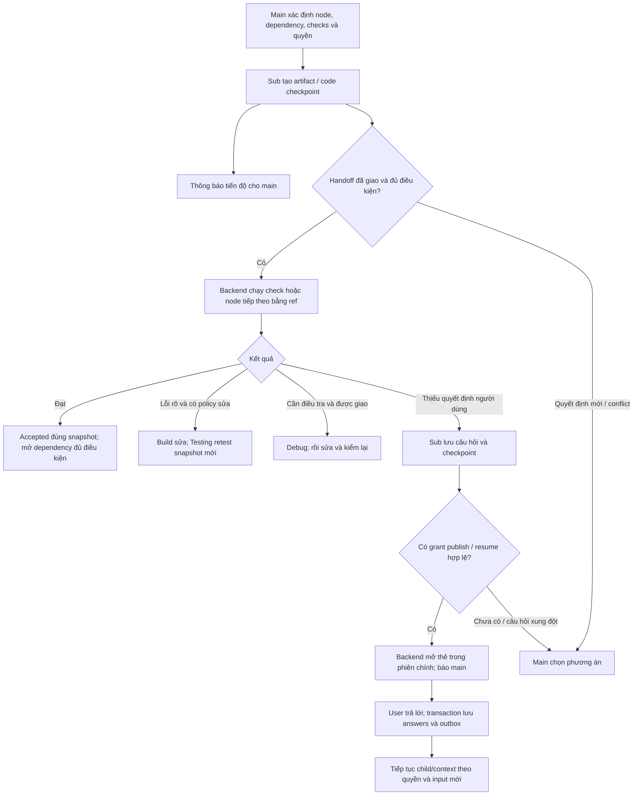

# Đối chiếu PR cloud và bàn giao W6–W10 — 03/10/2026

**Cập nhật sau khi nhận gói cloud:** xem [mục 9](#9-cập-nhật-sau-khi-nhận-gói-w10-handoff-03_10). Đã nhận gói một phần; phát hiện thêm lỗi thu thập/chấm benchmark. Các mô tả “chưa nhận folder” bên dưới là checkpoint trước khi nhận gói, không phải trạng thái mới nhất.

## 1. Phạm vi và checkpoint Git

Yêu cầu: đọc PR cloud, đồng bộ main mới nhất sang **B**, đối chiếu code/plan/bằng chứng, báo việc còn lại và nguyên nhân các lượt dài không hội tụ. Báo cáo này không triển khai các W đang mở.

- [x] Đọc văn bản PR người dùng gửi, PR gốc, PR tích hợp, `handoff-03_10.md`, `review-simplify-03_10.md`, các mục hiện hành của `Work-Graph-fix.md` và evidence liên quan.
- [x] Fetch Git và đồng bộ B bằng fast-forward; đã push `origin/B`.
- [x] Kiểm tra 14 thay đổi có sẵn của người dùng: không giao nhau với diff upstream; trạng thái tồn tại/xóa và SHA-256 được giữ nguyên sau merge.
- [x] Đối chiếu cơ chế chính trong code: scope, policy/checks, handoff, interview/continuation, recovery, worktree/integration/ship, helper output và harness W10.
- [ ] Nhận bundle W10 đầy đủ và kết quả repair mới từ cloud. Các đường `/var/tmp/...` trong bàn giao thuộc máy cloud, không phải thư mục trên Windows này.
- [ ] Chứng nhận end-to-end trên mã cuối sau merge. Lượt này không chạy test/model/CUA mới; số test dưới đây là số trong tài liệu/evidence cloud, không phải kết quả vừa chạy trên máy local.

| Mốc | Giá trị đã đọc từ Git/GitHub |
|---|---|
| Checkout local | `D:/create/BoxFox-Agent-Box`, nhánh **B** |
| Trước đồng bộ | `68ecdf04f5208ae1cf5e04ef79d290ae6a368c51` |
| PR cloud | [nganngan99hy-coder/BoxFox-Agent-Box#1](https://github.com/nganngan99hy-coder/BoxFox-Agent-Box/pull/1), đã merge; head `3f2ff6ae`, merge `94bf0f7e` |
| PR tích hợp | [vukhai248/BoxFox-Agent-Box#5](https://github.com/vukhai248/BoxFox-Agent-Box/pull/5), đã merge |
| HEAD B = origin/B = origin/main | `6732f9342c5d838bc49493f93641fdbb2ec0b350` |
| Nhánh main local | Còn ở `68ecdf04`; không checkout/di chuyển main local trong lượt này |
| Diff upstream | 129 file, +26.818/−4.411 dòng, có cả thay đổi định dạng; không có diff frontend trong PR |

Bản sao trạng thái WIP trước merge: `.tmp/cloud-pr-review-20261003/wip-before.json` và `wip-before.patch`. `.gitignore`, file frontend đang sửa và 12 file tài liệu/log đang xóa là thay đổi có sẵn của người dùng. Báo cáo này là file mới duy nhất do lượt kiểm tra bổ sung.

**Không diễn giải merge thành nghiệm thu:** code đã về B/main remote; các W thiếu bằng chứng vẫn chưa hoàn tất nghiệm thu.

## 2. Cloud đã bổ sung những gì

Đây là một đợt bổ sung cơ chế backend đáng kể, bao gồm các phần kiến trúc đã bàn giao trước đó, không chỉ sửa vài schema.

| Phần | Cơ chế có trong code | Bằng chứng/giới hạn |
|---|---|---|
| W8.A4.2 — quyền theo lượt/assignment | `work_scope.py` tính phạm vi và chặn ở tool list, dispatch, delegate/custom command. Run artifact-only không mở quyền sửa mã; terminal dùng allowlist đọc, mặc định deny. Có vá bypass shell `$'…'`, option dính của `git grep`/`tree`/`file`. | Evidence scope và test mục tiêu đã lưu. Bộ phân loại cố ý chặt với lệnh ghép/redirect. Không phải chứng minh mọi lệnh shell đều được hiểu ngữ nghĩa. |
| W8.A4.3 — isolation | `work_worktrees.py` tạo nhánh/worktree cho run và node, checkpoint node rồi tích hợp vào run; merge conflict trả vấn đề về main. Không có Git dùng touch-set/lock. Cleanup giữ lại worktree dirty. | `W8.A4.3-worktree-evidence.json`: hai ca có `oracle=true`. Đây là probe của snapshot được ghi trong evidence, không chứng nhận toàn bộ HEAD hiện tại. |
| W8.A4.4 — ship | Snapshot tích hợp có head/tree/hash; kiểm lại trước ship. Nhánh isolated được push riêng; ledger chống gửi trùng. Legacy phải chỉ rõ paths thuộc run. | `W8.A4.4-ship-scoped-evidence.json`: ca dirty-owner/scoped-ship đạt. Không stage tất cả WIP người dùng trong đường isolated. |
| W8.A4.5 — repair/review hội tụ | `work_repair.py`: policy sửa có giới hạn; lỗi rõ có thể giao Build sửa; Debug chỉ khi policy/kết quả yêu cầu điều tra. Review code của patch isolated được chuyển đến cây tích hợp; test/check đọc snapshot mới. | Có code và test, nhưng probe end-to-end đang **false**, xem mục 3. |
| W7 — interview và handoff | Request/checkpoint có ID, revision, artifact; câu trả lời ghi nguồn `user_action`. Grant quyết định được tự mở thẻ/tự resume hay cần main. Handoff có predicate, binding và invocation; thông báo không đợi main xác nhận. | Backend/API đã có. History/pagination renderer và CUA vẫn chưa nghiệm thu. |
| W7.2 — schema/recovery | `work_report` có trường theo action, lỗi chỉ field/hint/received; `work_artifact_read` thiếu runId báo đúng mã. `tool_end` là điểm commit: dùng receipt đã có; tool đọc được replay một lần; tool unsafe bị ngắt phải kiểm trạng thái. So cả args/hash để tránh call ID cũ trùng. | Probe schema native 2/2 đạt; replay được đo bằng test đơn vị, không phải toàn bộ đều probe model. |
| W6.1.3 — reviewer | `verify_exec`, receipt, finding contract, hạ finding không đủ căn cứ; chống verdict/coverage xanh bỏ qua finding blocking đã hợp lệ. Retry sửa hợp đồng không được xóa finding hợp lệ rồi cho pass. | Cơ chế có, nhưng hành vi reviewer chưa đạt công tâm đầy đủ: 4/6 oracle, đối chứng false-positive 2/2, `verifyExecCalls=0/6`. |
| W6.2 — producer | `work_prompts.deliverable()` theo role/taskKind/depth; lookup có hợp đồng ngắn; reviewedSet và binding phục vụ tổng hợp. | Lookup A/B ngắn hơn rõ, nhưng strict oracle vẫn false vì Answer 122 từ vượt trần 120. Chưa chứng minh tất cả plan/research/design đạt chuẩn SWE. |
| W6.5.3 — helper output | `output_policy.py` mặc định helper knowledge 16.000; override chỉ 4.096/16.000, vẫn chịu trần chủ phiên. | 32 lượt đã lưu; cap 4.096 bị length 5/16, cap 16.000 là 0/16. Hai arm dùng deadline router khác nhau, không suy toàn bộ chênh lệch latency là do cap. |
| W9 — recorder/CDP | MP4 phân mảnh, stop có các mức tín hiệu và ffprobe; attach CDP có ngân sách 2×35s. | Evidence ghi recorder 30/40 → 40/40. Trang JS bận vô hạn vẫn có thể timeout ~70s; nguyên nhân Chromium ~59s chưa chốt. |
| W10 — harness | 12 ca ×2, shard/merge, lưu bundle, rescore không gọi model; oracle đã vá shape tool_end, no_run, test proof, diagnostic. | Harness có; bộ kết quả 24 lượt và báo cáo kết luận **chưa có trong Git**. |

Nguồn code chính: [work_scope.py](../../backend/src/agentbox/agent_core/work_scope.py), [work_policy.py](../../backend/src/agentbox/agent_core/work_policy.py), [work_graph.py](../../backend/src/agentbox/agent_core/work_graph.py), [work_worktrees.py](../../backend/src/agentbox/agent_core/work_worktrees.py), [work_repair.py](../../backend/src/agentbox/agent_core/work_repair.py), [work_checks.py](../../backend/src/agentbox/agent_core/work_checks.py), [work_feedback.py](../../backend/src/agentbox/agent_core/work_feedback.py), [work_handoffs.py](../../backend/src/agentbox/agent_core/work_handoffs.py), [tool_recovery.py](../../backend/src/agentbox/agent_core/tool_recovery.py).

## 3. Chỗ chưa thể gọi là hoàn tất

### 3.1 W8.A4.5: cơ chế có, chưa có một vòng sửa khép kín đạt

[`W8.A4.5-repair-loop-evidence.json`](W8.A4.5-repair-loop-evidence.json) ghi:

- Test thật trả đỏ → phân loại `clear` → lưu findings → resume **đúng Build child cũ**; child đã đọc finding và sửa file.
- Sau đó checkpoint/hoàn tất draft không thành công; oracle **false**, 675,313s (~11 phút 15 giây), `WORK_CHECK_NOT_READY`.
- Ghi chú xác định cò của **probe** khớp thô `pytest`, bắn nhầm vào checkpoint chứa `:(exclude).pytest_cache`.
- Fixture được vá tại `ac7a9a7`; lượt chạy lại bị dừng để gộp B. Chưa có probe khép kín sau merge; đường node ảo `__integration__` chưa đo.

Đây chưa phải bằng chứng sản phẩm repair vẫn hỏng: ca đo bị lỗi fixture. Đồng thời cũng chưa phải bằng chứng repair sản phẩm đạt. Bảng handoff ghi “Xong (oracle false)” cần hiểu là **đã giao code, còn nghiệm thu**.

### 3.2 W10: thiếu bundle nên chưa thể kiểm chứng con số cuối

[`handoff-03_10.md`](handoff-03_10.md) ghi shard 2–5 xong, shard 1/6 chưa xong, **16/24 ô**; văn bản PR người dùng gửi nhắc kết quả đầy đủ. Git tại HEAD `6732f934` không có:

- `docs/plan/W10-acceptance-evidence.json`
- `docs/plan/W10-acceptance-report.md`

Vì vậy chưa thể kết luận 24/24 đã chạy, gate đạt bao nhiêu, hoặc report cuối nằm ở commit nào. Không lấy câu mô tả PR thay cho file kết quả.

Điểm đã ghi rõ trong bàn giao:

1. Runtime của lượt W10 là **`46ed557`**; các vá `3b23fa3` trở đi chưa có trong mã sản phẩm đã chạy. `--rescore` chỉ chấm lại bundle bằng oracle mới, **không thực thi mã sản phẩm mới**.
2. Có các ca main không tạo `work_graph create` dù có workIntent (`no_run`). Cần raw transcript để phân biệt fast-path hợp lệ với bỏ workflow. Code prompt hiện cho phép `/research` một fact dùng fast-path; không được đánh dấu mọi việc không tạo DAG là lỗi.
3. Same-child fail do không có continuation để đo khác với **thực sự resume sai child**. Vẫn giữ failure trong mẫu số, nhưng cần phân loại coverage chưa được thực hiện với vi phạm cơ chế.
4. S09 cũ gặp `Cannot operate on a closed database`. Harness đã vá `8f24be7` để cancel + await task cũ trước đóng DB/restart; bản vá không biến receipt cũ thành pass.

### 3.3 Reviewer vẫn là vướng mắc chất lượng thật

[`W6.1.3-verify-findings-evidence.json`](W6.1.3-verify-findings-evidence.json):

- 6 lượt, oracle đạt **4/6**; cả hai lượt đối chứng `side-remark` đều bị chặn sai vì đòi thêm bằng chứng ngoài mục tiêu đối chứng.
- **0/6 gọi `verify_exec`**, dù đã có tool và prompt hướng dẫn.
- Finding bị hạ giảm 7/20 → 5/29; có cải thiện trích receipt nhưng mẫu nhỏ và không đủ để nói reviewer công tâm.
- `numericCited=true` trong các lượt này có phần kiểm tra rỗng: không có numeric claim còn sống/không có verify_exec receipt, không chứng minh đã đo số.

Không chuyển các lỗi này sang producer/main chỉ vì reviewer có verdict `revise`. Cần adjudicate finding theo nguồn và tiêu chí trước, đúng chỉ đạo đã chốt của người dùng.

[`W6.2-producer-quality-evidence.json`](W6.2-producer-quality-evidence.json) cũng ghi lookup strict oracle false: Answer thô 122 từ; bỏ heading 119. Đây là lệch nhỏ về hợp đồng độ dài, khác mức độ với chặn sai hoặc claim không có nguồn. Main/producer SWE tổng quát vẫn cần checkpoint riêng.

### 3.4 Một số ghi chú bàn giao đã cũ hoặc chỉ phủ một phần

- `work_policy.VERSION` vẫn **`work-checks/10`**, compatible `/10,/11`. Handoff yêu cầu bump chưa thực hiện. Tuy vậy `work_checks.INPUTS_VERSION='work-check-inputs/2'` đã tham gia binding/cache: không suy “chưa bump” đồng nghĩa mọi receipt cũ tự pass.
- `apply_findings()` cố ý giữ ngữ nghĩa cũ cho report không khai báo findings list. Khi chốt policy mới cần phân biệt compatibility dữ liệu lịch sử và yêu cầu hợp đồng mới; đây là việc rà contract, không tự đổi trong lượt này.
- W1.P evidence ghi `answer_knowledge()` chưa nối preflight. Code hiện tại **gọi qua `spawn()` và preflight chạy trước reserve**, với `readTool=True` cho knowledge. Vì vậy không lặp lại ghi chú cũ thành kết luận “lookup không được kiểm quyền”. Còn cần xác nhận coverage sau merge và ca skip verify_exec trong evidence cũ.
- W5.LEGACY có 7/7 ca import/read/stale/corrupt/restart trong scope đã đo, nhưng `Work-Graph-fix.md` vẫn nêu export/index/migration toàn luồng chưa phủ. Không coi fixture suite này là mọi migration đã xong.
- W6.2.BIND: chưa chứng nhận mọi claim kỹ thuật mới main thêm sau whole review thuộc artifact đã kiểm. Giữ mục này riêng; không khóa mọi chat summary vào reviewer.
- W2.UI/W9.UI: chỉ có runbook; không có nghiệm thu renderer/CUA đầy đủ. PR không thay frontend, không suy UI cũ đã được sửa.
- Handoff còn ghi PR OPEN, HEAD `1bd238f`, trong khi PR đã merge và cloud head cuối là `3f2ff6ae`. Dùng Git thực tế, giữ tài liệu cũ như lịch sử.

### 3.5 Hai test đỏ và cấu hình box

Cloud ghi sweep **988 passed / 2 failed / 1 skipped**, suite đích **294 passed / 1 skipped**, 8 kịch bản E2E đạt. Bản handoff và PR có thời điểm cập nhật khác nhau; cần log gốc để gắn từng số với đúng commit.

Hai ca `test_claude_worker_router.py` có giả định môi trường “host không có bwrap”: một assert `readOnlyIsolation is False`, một ca role read-only phải bị từ chối khi không có bwrap. Fixture vẫn nối PATH host. Điều này hỗ trợ giải thích lỗi môi trường cloud đã ghi, nhưng lượt này chưa chạy lại baseline; không tự xóa hai failure khỏi thống kê.

Compose hiện có `seccomp=unconfined`, `apparmor=unconfined`, `BOX_DEFAULT_NETWORK: "on"`. Tài liệu ghi đây là đánh đổi chủ máy đã duyệt để verify_exec dùng bwrap/mạng trong box. Cần chuyển nguyên trạng quyết định này vào bàn giao triển khai, không mô tả như chỉnh token/schema đơn thuần. Lượt kiểm tra không thay cấu hình.

## 4. Vì sao đợt trước gần 19–20 giờ vẫn chưa hội tụ

Không có đủ trace thời gian tổng để chia chính xác toàn bộ 19 giờ. Các bằng chứng sau xác nhận những nguồn tiêu hao thực tế; không quy tất cả cho mất mạng hoặc giới hạn token.

| Nguyên nhân | Bằng chứng cụ thể | Hệ quả |
|---|---|---|
| Main giao tiêu chí/expected sai, cập nhật lại nhiều lần | [`W6.1-plan-baseline-final-evidence.json`](W6.1-plan-baseline-final-evidence.json): 7.588,713s (~2h06), **36 child** gồm 4 Explore/14 Plan/18 Plan-review, **9 lần sửa definition**; main tự ghi sai số test/rollback/expected, cuối `STEP_BUDGET_EXHAUSTED`, 0 whole verify, chưa master plan. | Sửa assignment invalidates đầu ra, gọi lại producer/reviewer; không tiến tới kết quả toàn run. |
| Reviewer có kết luận không nhất quán hoặc prose/nguồn chưa đúng | Plan P2 có expected chuỗi rỗng sai; một reviewer bắt, lượt sau đọc thiếu nhánh quote rồi pass; P3 kế thừa. Policy9 compact 4 lượt đều oracle false; Design repeat2 tốn 3.664,036s (~1h01) dù root completed. | Cả false pass và false reject đều tạo rework; nâng output không tự giải quyết. |
| Giới hạn một lượt chưa phải giới hạn vòng đời run | Plan mục 25 và ghi chú W6.5.2/W8 nêu sửa definition/reset stage mở thêm nhiều đợt. Code mới có admission/input/evidence ledger và dừng sau 3 lượt không tiến triển. | Một request có thể tiếp tục sinh nhiều child dù từng child còn trong budget. Guard mới là checkpoint cải thiện, không sửa lại lịch sử cũ. |
| Hợp đồng reviewer/provider còn lỗi | Evidence mới vẫn có stream interruption, coverage JSON thiếu target, report quá dài; backend phải retry hoặc giữ unverified. | Tốn thêm lượt, và có receipt “completed” nhưng không đạt oracle. Cần phân biệt token limit/stream/deadline/schema. |
| Probe/oracle có lỗi riêng | A4.5 trigger `.pytest_cache`; W10 đọc sai shape tool_end/no_run trước vá; S09 đóng DB khi task cũ còn chạy. | Chạy lâu vẫn nhận failure do phép đo; cần sửa phép đo trước lặp model. |
| Quy trình mở rộng scope và lặp test/model quá nhiều | Lịch sử Work-Graph-fix chuyển qua nhiều policy/snapshot, kiểm source/corpus/native/full sweep và các lỗi recorder/CDP. Các lượt có source hash khác nhau không thay thế lẫn nhau. | Công việc backend, chất lượng model, hạ tầng và UI bị kéo vào cùng goal; khó có điểm chốt nhỏ và thống kê chung rõ. Đây cũng là vấn đề cách triển khai/đánh giá của agent thực hiện. |

Hai số 7.588s và 3.664s là các lượt khác nhau, không cộng chúng để nhận là tổng 19 giờ. Mất mạng có thể gây một số lần ngắt, nhưng không giải thích expected sai, review bỏ sót, vòng definition hoặc lỗi fixture.

## 5. Luồng hiện tại phù hợp với ý đã chốt đến đâu

- **a — thông báo:** `work_handoffs.notify()` gửi sự kiện, không cần main ack.
- **b — bàn giao:** `enqueue()/dispatch()` và continuation controller dùng artifact/version/hash/binding và predicate đã giao; check vs dependency chấp nhận là hai điều kiện khác nhau.
- **c — quyết định main:** thiếu assignment mới, conflict, revoked grant, repair không đủ điều kiện/đã hết hoặc không có tiến triển.
- **d — quyết định user:** `work_report needs_user` lưu 1–3 câu; có grant phù hợp thì backend mở nguyên thẻ; answers ghi `user_action`, không đoán từ timeout.

Không có yêu cầu mọi role phải qua Explore → Plan → Build → Testing → Debug → Review. `work_policy.derive()` chọn check theo artifact/task/risk; patch bình thường cần test, patch rủi ro cần review phù hợp; Debug diagnostic và lookup khác deliverable lớn.

**Giới hạn cần làm rõ trong nghiệm thu:** `spawn()` mới có fallback từ child không resume được (`WORK_RESUME_*`) sang child mới, giữ worktree và ghi `repairChildReason`. Đây là ngoại lệ thực tế so với mục tiêu same-child. Không đổi chính sách ở lượt này; W10 phải phân loại ca fallback có lý do và ca đổi child sai. Đường probe A4.5 đã thấy Build cũ, nhưng chưa có vòng cuối tester cũ retest xanh để chứng nhận toàn chuỗi.

## 6. Việc tiếp theo, theo thứ tự — chưa thi công

| ID bàn giao | Việc | Checkpoint hoàn tất |
|---|---|---|
| C1 — thu hồi dữ liệu cloud | Nhận 6 shard, log, bundle theo lượt, report/evidence W10 cuối; nhận probe repair mới nếu có. | Đủ 24 case×repeat duy nhất; biết product commit, oracle commit, model/config, lỗi và trạng thái từng lượt. File thiếu được liệt kê, không tự tạo số pass. |
| C2 — chốt bằng chứng hiện có | Merge/rescore từ bundle, kiểm case no_run/coverage/same-child; đối chiếu mọi tick trong plan với đúng source. | Report giữ toàn bộ lỗi trong mẫu số, tách lỗi oracle/fixture/provider/model/product. Chấm lại không nhận là runtime patch đã chạy. |
| C3 — nghiệm thu repair ở source đóng băng | Sau khi xin phạm vi: ca lỗi rõ Build sửa trực tiếp, ca cần Debug, test lại bằng tester cũ, tích hợp `__integration__`, chống trùng/restart. | Test đỏ → sửa artifact/code mới → test/check xanh → integration đúng hash; child reuse/fallback và quyết định main có receipt; không có ship sai snapshot. |
| C4 — công tâm reviewer | Adjudicate corpus đã có; false-positive control trước, rồi đo numeric verification bằng receipt thật. | Không chặn thêm scope ngoài acceptance; finding hợp lệ không bị retry xóa; false finding không block; numericCited không dùng kiểm tra rỗng làm proof. |
| C5 — producer/main và W10 trên mã cuối | Chỉ tuning producer/main sau khi xác nhận không do reviewer; sửa no_run sai workflow ở checkpoint riêng nếu raw chứng minh. | Freeze product+oracle; chạy những ca cần đo lại với Space Bunny; đủ ≥22/24 và các gate cứng theo plan để gọi nghiệm thu W10. Không đổi model hoặc loại lỗi. |
| C6 — phần còn lại có scope riêng | Policy version/legacy contract, W6.2.BIND, legacy export/index, preflight sau merge, W2.UI/W9.UI, simplify tùy chọn. | Mỗi mục có phạm vi duyệt và test tương ứng. UI/UX cần duyệt riêng; simplify không trộn với bug/đo model. |

Danh mục C1–C6 là phụ lục audit để agent sau đối chiếu các W hiện có, không đổi tên/tick W lịch sử hoặc mở lại goal đã đóng.

## 7. Nội dung gửi cloud agent để xin folder

> Tôi đã đồng bộ code PR về `B` tại `6732f934`. Xin bàn giao **file thật**, không chỉ đường dẫn nằm trên máy cloud:
>
> 1. Cho biết thư mục workspace cuối, branch/HEAD, và thư mục artifact của lần chạy W10. Đóng gói ZIP/tar để tải được, hoặc commit các report/evidence không chứa bí mật.
> 2. Gửi đủ `/var/tmp/w10-s1` đến `/var/tmp/w10-s6` và các log `/var/tmp/w10-s1.log` đến `w10-s6.log`. Mỗi shard phải có `results.json` và `runs/<case>-r<n>/bundle.json`; giữ cấu trúc thư mục để `--merge --rescore` đọc được. Nếu có raw transcript/DB hoặc file mà bundle tham chiếu, gửi kèm hoặc liệt kê rõ file nào không còn.
> 3. Gửi thư mục kết quả gộp/chấm lại, `docs/plan/W10-acceptance-evidence.json` và `docs/plan/W10-acceptance-report.md`. Git hiện chưa có hai file này, còn handoff ghi mới 16/24 ô: xin xác nhận số lượt cuối, mọi failure và gate cuối.
> 4. Ghi riêng **commit mã sản phẩm đã chạy**, **commit oracle/harness dùng chấm**, model/config, source manifest, thời điểm chạy. W10 cũ chạy `46ed557`; nếu chỉ rescore thì ghi rõ chưa chạy các vá sản phẩm mới.
> 5. Gửi probe/log/bundle W8.A4.5 sau vá fixture `ac7a9a7` và sau merge, đặc biệt `__integration__` + retest đúng Testing child cũ. Nếu chưa chạy xong thì xác nhận chưa nghiệm thu; evidence hiện tại oracle=false.
> 6. Gửi log test cuối gắn đúng commit cho sweep 988/2/1, suite đích và E2E; nêu 2 test đỏ còn lại. Không gửi API key, token router, credentials hoặc dữ liệu người dùng thật.
>
> Xin kèm `README-handoff.md`: cây thư mục, commit, file nào đủ/thiếu, lệnh đọc lại hoặc merge/rescore, và kết luận đạt/chưa đạt. Tôi cần tải được folder từ phiên cloud về máy local; đường `/var/tmp/...` đơn lẻ không truy cập được từ Windows.

## 8. Kết luận checkpoint

Code mới đã được đồng bộ/push vào **B**, WIP người dùng giữ nguyên. Cloud đã giao nhiều cơ chế cần thiết cho W7/W8, và có evidence tốt cho isolation/scoped ship/schema/helper/recorder. Tuy nhiên **chưa đủ bằng chứng để đóng W6 chất lượng, W8.A4.5 và W10**. Phần folder còn thiếu phải xin từ cloud; không có căn cứ tiếp tục một goal dài vô hạn hoặc viết “đã hoàn tất” thay cho các ca chưa đạt.

## 9. Cập nhật sau khi nhận gói w10-handoff-03_10

### 9.1 Đã nhận và đã kiểm tra

Gói local: `D:/create/BoxFox-Agent-Box/docs/w10-handoff-03_10`. Đã đọc README, hai report, merged-partial, log sáu shard, các bundle và dữ liệu repair. Lượt này vẫn chỉ đọc code/dữ liệu và ghi báo cáo; không sửa runtime/UI, không chạy model hoặc CUA.

- [x] Đã nhận **20 bundle**: S01 r1/r2, S03–S11 r1/r2. Có kết quả tổng hợp đã chấm **16 ô** từ shard 2–5; bốn bundle S01/S11 chưa nằm trong tổng hợp này.
- [x] Có hai report W10 **CHƯA ĐẦY ĐỦ** trong `reports/` của gói. Không còn nói cloud chưa cung cấp hai file này.
- [x] Đọc raw bundle và cộng lại số liệu; đối chiếu các lỗi với code harness hiện tại và diff cloud đến `95a968f`.
- [x] Kiểm SHA-256 nội dung **30 artifact** trong bundle: tất cả khớp `contentHash`. Điều này chứng minh nội dung trong gói khớp identity đã ghi, không chứng minh nội dung đúng hoặc đã được review.
- [ ] Thiếu S02 r1/r2 và S12 r1/r2; chưa có `results.json` của shard 1/6. Trạng thái “đang chạy” chỉ là trạng thái lúc đóng gói, không phải xác nhận tiến trình cloud còn chạy hiện nay.
- [ ] Thiếu nguồn để thu lại toàn bộ events bị cắt ở trang đầu; ZIP chủ động không chứa DB từng lượt. Cần cloud export đầy đủ hoặc gửi DB fixture thích hợp để kiểm chứng lại.

Receipt tổng hợp local: [cloud-w10-bundle-audit-03_10.json](cloud-w10-bundle-audit-03_10.json). Receipt chỉ có metadata/count/hash và trạng thái; không chép reasoning vào báo cáo.

### 9.2 Commit mới có sửa thêm runtime không?

Đọc remote cloud B thấy `95a968f783aec0bacdec9c5f9c3fda64323772c3`, hơn cloud head cũ `3f2ff6ae` **3 commit**:

| Commit | Thay đổi |
|---|---|
| `744bc658` | Harness thêm `--merge --partial`, ghi danh sách ô còn thiếu; thêm assertion test tương ứng. Đây là chức năng báo cáo một phần. |
| `dbfad869` | Thêm hai file report/evidence W10 16/24, ghi rõ chưa đầy đủ và tách product/oracle commit. |
| `95a968f7` | Cập nhật handoff với gói dữ liệu, lệnh gộp một phần và HEAD. |

Diff chỉ có **5 file**: harness, test harness, hai report và handoff. Không có sửa `backend/src/agentbox/...` hoặc frontend ở ba commit này. Các sửa sản phẩm nêu ở mục 2 đã có trong lần merge trước; gói mới chủ yếu bổ sung khả năng kiểm chứng chúng.

`6732f934` là merge commit trong repo **vukhai248**, còn `95a968f` là HEAD B của repo fork **nganngan99hy-coder**. Cloud nói không có `6732f934` trong fork của họ là hợp lý; điều đó không phủ nhận neo repo local. Checkout local vẫn là **B@6732f934**; không tự nhập ba commit cloud chưa qua PR tích hợp.

### 9.3 Số liệu đã đối chiếu

| Số | Kết quả |
|---|---|
| Ô đã chấm trong merged-partial | 16/24 |
| `statePassed` do report/harness ghi | 4/16: S03 r1/r2 và S05 r1/r2 |
| `passed` đủ tất cả luật | 0/16 |
| `no_run` trong JSON | **10/16**, gồm S06–S10, mỗi ca hai lần |
| `no_check` | 2/16, S04 |
| Bộ đếm sameChild | 4, S07/S09 không có continuation quan sát được |
| Các bộ đếm cứng còn lại | 0, nhưng nhiều ca không thực hiện cơ chế hoặc bị thiếu events; không coi số 0 là nghiệm thu an toàn đầy đủ |
| Usage 16 ô | 7.664.121 token vào, 335.910 token ra, 328 model call |
| `wallTimeMs` 16 ô | 7.214.938ms (~2h00m15s): **tổng thời lượng các ô**, không phải thời gian thực của cả đợt chạy song song |

Report viết “8/16 no_run” là sai với chính JSON của nó. Cần sửa mô tả thành 10/16, rồi phân loại nguyên nhân theo dữ liệu thật ở mục 9.4.

Với kết quả chấm đang có, ngay cả tám ô còn lại đều đạt state thì tối đa **12/24**, thấp hơn ngưỡng 22/24. Hoàn tất shard chỉ giúp đầy đủ mẫu; không thể biến bộ kết quả hiện tại thành đạt nếu không thay đổi dữ liệu/phép đo hoặc chạy lại phù hợp.

### 9.4 Phát hiện mới: bộ nghiệm thu còn lỗi

Những phát hiện dưới đây là lỗi hoặc giới hạn của **harness kiểm thử**. Không dùng chúng để tự sửa DAG/runtime hoặc quy lỗi cho producer/reviewer.

#### H1 — Events chỉ lấy trang đầu: mất bằng chứng cuối lượt

**Đã xác nhận trong code và dữ liệu.** `scripts/eval/work_acceptance_bench.py:_safe_events()` gọi `store.events(sid)` đúng một lần. `SessionStore.events()` trả một trang, tối đa **500**, thứ tự seq tăng. Caller không đọc `hasMore/nextAfter` hoặc tăng cursor để lấy các trang còn lại.

Trong 20 bundle có **57 session** ghi đúng 500 events, thuộc 14 lượt. Ví dụ S07 r1 có 9 model call nhưng events chỉ chứa hai `completion_attempt` và hai bước đã kết thúc. S08 còn notes ghi đã trả lời 4 câu rồi 3 câu, nhưng bundle không có feedback Work Graph và chỉ giữ ba bước đầu. Run/registry/artifact được đọc riêng vẫn có thể đầy đủ trong khi events/turns thiếu.

**Hệ quả:** thiếu final output, tool_end, receipt lỗi, câu trả lời/interview, bàn giao; có thể tạo false failure hoặc bỏ sót diagnostic/URL bịa. `--rescore` trên bundle bị cắt không khôi phục phần đã mất. Các ca không có đủ events không được dùng để kết luận không có vi phạm.

**Checkpoint sửa sau:** export phân trang toàn bộ events gốc và đối chiếu tổng seq/count; test >500 events/session chứa marker cuối; oracle thấy đúng marker/final/continuation. Cần xin dữ liệu gốc trước, không gọi lại model chỉ để bù lỗi export.

Nguồn: `scripts/eval/work_acceptance_bench.py:1501`, `backend/src/agentbox/memory/session_store.py:376`, receipt local `pageLimitedSessions`.

#### H2 — Restart trả runtime mới nhưng caller còn đọc DB cũ

**Đã xác nhận ở cả hai bundle S09 và code hiện tại.** `drive_session()` thay `store, rt, graph` cục bộ khi `_restart_session()` đóng DB cũ, tạo store/runtime/graph mới. Hàm cuối chỉ trả `notes`. `run_cell()` vẫn gọi `collect_bundle(store, graph, ...)` bằng đối tượng **cũ đã đóng**.

S09 r1/r2 đều có `missing` gồm `sessions: Cannot operate on a closed database.` và `run: Cannot operate on a closed database.`; events rỗng. S09 r2 còn có notes về request `wr-...` đã trả lời: không có căn cứ nói main không tạo Work Graph chỉ vì bundle thu được `run:{}`.

Bản vá `8f24be7` cancel + await task cũ giải quyết một race, **chưa giải quyết đường collect DB cũ này**. Không lặp lại câu “S09 đã sửa hết” từ bàn giao.

**Checkpoint sửa sau:** caller lấy đúng runtime/store hiện hành; thu events/run sau restart; giữ đủ mọi lỗi trong mẫu số và phân loại `measurement_invalid`/lỗi harness, không gọi đây là lỗi model không create. Chứng minh restart không mất request/child bằng source đã thu đúng.

Nguồn: `scripts/eval/work_acceptance_bench.py:1615`, `:1731`, `:1750`; `shards/w10-s5/runs/S09-r1/bundle.json`, `S09-r2/bundle.json`.

#### H3 — Call thiếu session ID, tiêm fault nhầm main

**Đã xác nhận.** Tất cả **647/647 model call** trong 20 bundle có `sessionId:null`. `RecordingClient` lấy ID từ `route.get('sessionId')`, trong khi route thực tế ở những call này không có ID.

- Thống kê theo role mặc định dồn các call không xác định về main; không dùng bảng roleLatency này để quyết định main/research/reviewer nào tốn budget.
- Fault S06 kiểm `route.sessionId != root_session_id`. Vì `None != root ID`, nó tiêm `ghost-sentinel-7f3a` vào final **main**, dù fixture mô tả phải tiêm vào helper child.
- S06 r1/r2 đều không có child; raw call cuối vẫn mang `fault=claim_unsourced`, và final main chứa marker. Đây **không phải** phép đo đúng đường helper → claim_sources → main.

**Checkpoint sửa sau:** recording/fault có caller identity thật; assert root không nhận fault chỉ dành cho child; role usage gắn đúng session; nếu không xác định caller thì ghi unknown và lỗi đo, không đoán thành main.

Nguồn: `scripts/eval/work_acceptance_bench.py:1418`, `:1430`, `:1852`; bundle S06 và receipt local.

#### H4 — Fixture từ chối tool và lệnh mà hệ thống mới cần

**Đã xác nhận.** `WorkspaceExecutor.execute()` không xử lý `verify_exec`. Có **6 receipt tool_end** được thu trong gói báo `W10 fixture: công cụ không thuộc lượt: verify_exec` (S01 r1 hai lần, S03 r1, S04 r1, S11 r1/r2).

Vì vậy riêng W10 không thể dùng việc thiếu phép đo thành công để nói reviewer không muốn kiểm chứng: có agent đã gọi tool nhưng executor fixture chặn. Kết quả này khác probe W6.1.3 trước đó, nơi có executor thật nhưng 0/6 gọi verify_exec; phải giữ hai nhóm riêng.

Terminal fixture chỉ cho snapshot, pytest và lệnh bắt đầu `git status`/`git diff`; đường worktree/integration sản phẩm dùng `git -C ...`, lệnh `cd ... && ...`, checkpoint/merge. Các lệnh này sẽ không được fixture hiện hành chấp nhận. Do đó cần chứng minh parity executor trước khi dùng S12 để chứng nhận isolation/ship mới. Chưa có bundle S12 trong gói để xác nhận lỗi cụ thể của lượt đó.

**Checkpoint sửa sau:** cung cấp executor kiểm thử tương thích đúng tool/backend commands trong workspace riêng, vẫn giữ giới hạn phạm vi. Không mở terminal vô hạn hoặc bypass scope để làm xanh. Fault verify_exec unavailable phải là ca cố ý tách riêng.

Nguồn: `scripts/eval/work_acceptance_bench.py:1294`, `backend/src/agentbox/agent_core/work_worktrees.py:196`.

#### H5 — Một số oracle/metadata chưa chứng minh điều chúng ghi

**Đã xác nhận bằng đọc logic; các nguy cơ false-positive dưới đây chưa có probe riêng trong lượt audit.**

1. `interview_questions_max` cộng toàn bộ câu hỏi trong run rồi so ≤3, trong khi yêu cầu là **1–3 mỗi vòng**, không phải ≤3 suốt run. Nó cũng không thấy thẻ legacy ngoài feedback được thu. `interview_answered` cho đạt nếu revision≥1, dù request W7 ban đầu đã có revision 1; chưa buộc có answer từ user. Cần dùng trạng thái/answer receipt từng vòng.
2. S05 ép hai phản hồi đầu root thành length, trước khi tạo run/check; yêu cầu còn phải có `check_status_any` khiến ca partial đúng vẫn fail vì không có check. S04 cũng không có check: không mặc định đây là lỗi reviewer quá nghiêm, vì reviewer chưa chạy. Cần đặt fault đúng pha cần kiểm và định nghĩa hành vi khi chưa tới pha đó.
3. Các ca yêu cầu 80 bước/2.700s nhưng events báo **STEPS_CLAMPED→60**, **DEADLINE_CLAMPED→1.200s**; driver có deadline ngoài 2.700s. Metadata phải tách requested/effective/driver. Đây không tự chứng minh engine clamp là bug và không là quyền tăng giới hạn.
4. `merge_results()` tính `statePassed` lại bằng state_matches trực tiếp, trong khi `score_bundle()` còn chặn state match khi missing bundle. Ví dụ S05 vẫn được merged ghi statePassed dù không có run. Cần định nghĩa rõ state-observed khác workflow-validated.
5. `gate.ok` hiện dựa trên statePassed và vài counter cứng, **không bắt `passed` đủ mọi luật đạt ngưỡng**. Một bộ có nhiều lỗi chất lượng ngoài counter cứng có thể vẫn đủ điều kiện gate. Không dùng gate này để chứng nhận mọi chiều SWE/AI đều đạt khi chưa chốt lại ý nghĩa nghiệm thu.
6. Các ô thu dữ liệu lỗi S09 vẫn được nhãn `quality-valid`, `error:null`; lỗi chỉ nằm trong `bundle.missing`. Không loại chúng khỏi mẫu số, nhưng cần đổi phân loại để biết lỗi phép đo.

### 9.5 Có chất lượng không?

**Hướng kỹ thuật có giá trị; chất lượng sản phẩm toàn luồng chưa được chứng minh. Chất lượng bộ nghiệm thu còn cần sửa.**

Phần tốt giữ nguyên: cổng quyền cả tool list/dispatch; artifact có hash/binding; worktree theo run; ship theo snapshot; thông báo độc lập bàn giao; interview bền; test thật trước accepted; các bản vá review F1/F2 đã có test đích. Đọc gói giúp xác nhận cloud đã ghi trung thực phần lớn giới hạn thay vì tự nói đạt.

Đầu ra cũng có tiến bộ về độ chi tiết: P1 của **S01 r2** dài 13.537 ký tự, có hiện trạng/nguồn, kiến trúc, dữ liệu, M1–M4, test/expected, rollback và bảng truy vết. Tuy nhiên không gọi plan này là hoàn thiện chỉ vì dài hoặc plan_review pass:

- Owner xin API, plan P1 chỉ thiết kế hàm lõi và đẩy HTTP adapter ra ngoài phạm vi P1. Run còn B1/T1, nên chưa kết luận toàn run bỏ API; phải kiểm phần tổng hợp có contract/stack/route hay không.
- Plan suy từ `== rows` thành cần giữ **chính object** gốc; phép so sánh bằng giá trị không chứng minh yêu cầu identity. Có cả bất biến “cùng thứ tự” trong khi yêu cầu sắp xếp giảm dần; cần làm rõ nghĩa.
- Có các quyết định mở về input lỗi, dữ liệu thiếu và cắt giới hạn; chúng chưa thể thành quyết định đã xác nhận chỉ vì có đề xuất mặc định.
- Whole checks của lượt này đều error vì reviewer chưa hoàn tất; run `needs_revision`. **Không có master plan đã được whole-pass.**

S11 r1/r2 giữ `discovering`, có nhiều artifact partial, đều chạm deadline ngoài ~2.700s. Reviewer có lần giữ finding và supersede bản cũ; không auto-pass. Nhưng chuỗi thiết kế → kiểm chứng → hội tụ chưa hoàn tất. Bộ này cũng chưa chứng minh ứng dụng AI tổng hợp bệnh án lớn: S01 thực tế là API lịch hẹn nhỏ, không phải prompt AI hồ sơ y tế nguyên văn đã dùng trước đó.

**Kết luận:** không đủ căn cứ tuyên bố “đã giải quyết W6.1/6.5/7/8” hoặc “plan/research/design đã đạt SWE ổn định”. Đồng thời không kết luận toàn code cloud kém chỉ từ 0/16, vì bộ đo có lỗi đã xác nhận.

### 9.6 Bàn giao tiếp theo — sửa phép đo trước khi chạy dài

| Việc | Trạng thái | Checkpoint |
|---|---|---|
| **W10.M1 — export events đầy đủ** | Chưa sửa; lỗi H1 xác nhận | Đọc đủ trang/session; marker cuối và final tồn tại; xin raw DB/export còn thiếu; chấm lại từ dữ liệu đầy đủ, không tự điền events. |
| **W10.M2 — restart/caller identity** | Chưa sửa; H2/H3 xác nhận | Thu đúng DB mới; S09 không mất trace; S06 fault chỉ vào child; usage theo vai có identity đúng. |
| **W10.M3 — executor và oracle parity** | Chưa sửa; H4/H5 | Test ngắn cho verify_exec/worktree commands, interview nhiều vòng, missing/partial gate; giữ scope và không che failures. |
| **W8.A4.5.N — repair native** | Vẫn mở | Sửa fixture trigger xong mới chạy một vòng đỏ→sửa→tester cũ kiểm lại; thêm `__integration__`; chưa mở sweep 24 ô cho việc này. |
| **W6.Q — công tâm reviewer/producer** | Vẫn mở | Giữ thứ tự review-first đã duyệt; adjudicate đúng finding; không dùng W10 lỗi executor để đánh đồng với probe thật. |
| **W10.F — nghiệm thu snapshot cuối** | Chưa đạt | Chỉ chạy lại model sau khi M1–M3 đạt, freeze source và applied budgets; pilot ít ca trước rồi mới đủ 24; báo mọi lỗi, không đổi Space Bunny để tô xanh. |

Đây là các checkpoint đề xuất cho agent tiếp theo, **chưa triển khai code**. Không sửa UI/UX hoặc DAG trong lượt audit. C1 trước đó đã nhận gói một phần; việc cần hỏi cloud bây giờ là **events đầy đủ/DB fixture, S02/S12 và report 24 ô cuối**, cùng xác nhận các lỗi H1–H5. Đừng chạy lại toàn bộ 24 lượt trên bộ đo hiện tại.
