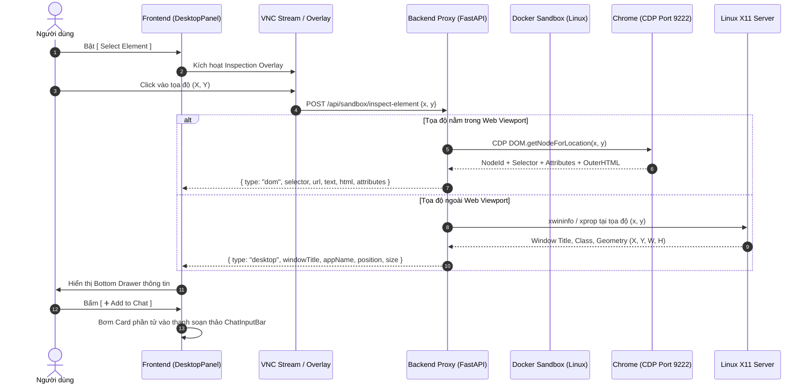

# 🎯 MASTER SPECIFICATION & PROMPT: ELEMENT SELECTOR FOR SANDBOX DESKTOP & CUA

> **Tài liệu đặc tả kiến trúc & Prompt mẫu:** Hệ thống thanh tra phần tử trực quan 2 lớp (Web DOM + Desktop OS Window) tích hợp trên luồng Sandbox Machine (VNC Desktop), hỗ trợ gửi ngữ cảnh chính xác cho Agent (`Add to Chat`) và làm nền tảng vững chắc cho Computer-Use Agent (CUA) tự động hóa.
> 
> *File này dùng để lưu trữ tham khảo cho việc phát triển trong tương lai.*

---

## 1. 📌 TỔNG QUAN VÀ MỤC TIÊU HỆ THỐNG

### 1.1. Vấn đề giải quyết:
1. **Khoảng cách giữa Vision và Code:** Khi người dùng nhìn thấy lỗi giao diện trên màn hình Sandbox Desktop, việc mô tả bằng lời ("sửa cái nút màu xanh góc trên") khiến AI Agent phải đoán mò file mã nguồn (`Navbar.tsx`, `Header.tsx` hay `Button.tsx`).
2. **Hạn chế của CUA truyền thống:** Agent Computer-Use chỉ tương tác mù qua tọa độ pixel $(x, y)$, dễ bị lệch khi thay đổi độ phân giải màn hình và không có cơ chế tự kiểm chứng mã HTML/CSS thực tế sau khi render.

### 1.2. Giải pháp Element Selector:
* Cung cấp chế độ **Thanh tra trực quan (Visual Inspector)** ngay trên màn hình Sandbox Desktop.
* Khi người dùng nhấp vào bất kỳ vị trí nào trên màn hình:
  * **Nếu là phần tử Web (DOM Element):** Tự động bóc tách **CSS Selector, Page URL, Text nội dung, Attributes và OuterHTML**.
  * **Nếu là phần tử Hệ điều hành / Cửa sổ (Desktop Element):** Tự động bóc tách **Window Title, Tên ứng dụng, Tọa độ $(x, y)$ và Kích thước cửa sổ $(W \times H)$**.
* Nút **`[ ➕ Add to Chat ]`** cho phép đính kèm trực tiếp thông tin phần tử đã chọn vào khung chat để Agent sửa code chính xác 100% trong 1 giây.

---

## 2. 🎨 THIẾT KẾ GIAO DIỆN & TRẢI NGHIỆM NGƯỜI DÙNG (UI/UX WORKFLOW)

### 2.1. Thanh công cụ Sandbox Toolbar:
* Thêm nút chuyển đổi trạng thái:
  * Trạng thái thường: `[ 🎯 Select Element ]`
  * Khi đang bật thanh tra: `[ ❌ Exit Selector ]` (nền xanh nổi bật `bg-brand text-white`).
* Khi bật chế độ, hiển thị một banner thông báo nổi giữa màn hình:
  `[ 🎯 Click an element to inspect it ]`

### 2.2. Lớp chặn sự kiện an toàn (Click Interception & Event Capturing):
* Khi chế độ `Select Element` kích hoạt, một lớp phủ trong suốt (Transparent Overlay) sẽ bắt toàn bộ sự kiện click chuột.
* **Bảo vệ cửa sổ:** Nếu người dùng vô tình nhấp vào nút `[X]` (Close) của trình duyệt Chrome, trình duyệt **không bị tắt**, thay vào đó hệ thống sẽ nhận diện và hiển thị thông tin về nút `[X]` / thanh tiêu đề.

### 2.3. Ngăn kéo thông tin phần tử (Bottom Inspector Drawer):
Khi người dùng nhấp chọn 1 phần tử, một Drawer trượt lên từ đáy màn hình với 2 chế độ hiển thị:

#### A. Chế độ Web DOM Element (Khi nhấp vào nội dung trang web):
```
┌──────────────────────────────────────────────────────────────────────────────────┐
│ DOM Element                                                [ ➕ Add to Chat ] [ ✕ ]│
│                                                                                  │
│ [ span.text-sm.font-semibold.tracking-tight.text-fg ]                            │
│ Page: http://localhost:3100/                                                     │
│ Text: "boxfox"                                                                   │
│ Attributes:                                                                      │
│   class="text-sm font-semibold tracking-tight text-fg"                           │
│ HTML:                                                                            │
│   <span class="text-sm font-semibold tracking-tight text-fg">boxfox</span>       │
└──────────────────────────────────────────────────────────────────────────────────┘
```

#### B. Chế độ Desktop Element (Khi nhấp vào ngoài web viewport / thanh OS):
```
┌──────────────────────────────────────────────────────────────────────────────────┐
│ Desktop Element                                            [ ➕ Add to Chat ] [ ✕ ]│
│                                                                                  │
│ ⚠️ Chrome element inspection failed: element inspect: Click outside viewport      │
│ Application:                                                                     │
│ Window: "BoxFox — Agent Box - Google Chrome"                                     │
│ Position: (0, 0), Size: 1186×787                                                 │
└──────────────────────────────────────────────────────────────────────────────────┘
```

---

## 3. 🏗️ KIẾN TRÚC KỸ THUẬT (TECHNICAL ARCHITECTURE)



---

## 4. 📦 HỢP ĐỒNG DỮ LIỆU (DATA CONTRACTS)

### 4.1. Request:
```typescript
interface InspectElementRequest {
  x: number // Tọa độ X trên màn hình VNC (tính theo độ phân giải gốc, vd 1280x800)
  y: number // Tọa độ Y trên màn hình VNC
}
```

### 4.2. Response:
```typescript
type InspectElementResponse =
  | {
      type: 'dom'
      selector: string
      url: string
      text: string
      attributes: Record<string, string>
      html: string
      boundingBox?: { x: number; y: number; width: number; height: number }
    }
  | {
      type: 'desktop'
      message?: string
      appName?: string
      windowTitle: string
      position: { x: number; y: number }
      size: { width: number; height: number }
    }
```

### 4.3. Định dạng Payload đưa vào Khung Chat (`Add to Chat`):
Khi người dùng bấm `Add to Chat`, hệ thống tự động chèn ngữ cảnh Markdown có cấu trúc vào khung chat:

```markdown
> 🎯 **Inspected Element Context:**
> - **Type:** DOM Element
> - **Page:** `http://localhost:3100/`
> - **Selector:** `span.text-sm.font-semibold.tracking-tight.text-fg`
> - **Content:** `"boxfox"`
> - **HTML Snippet:**
> ```html
> <span class="text-sm font-semibold tracking-tight text-fg">boxfox</span>
> ```
[User prompt sẽ được gõ tiếp tại đây...]
```

---

## 5. 🤖 PROMPT MẪU ĐỂ GIAO NHIỆM VỤ CHO CLOUD AGENT TRIỂN KHAI TRONG TƯƠNG LAI

```markdown
Chào Cloud Agent,

Hãy giúp chúng tôi triển khai tính năng "Element Selector & DOM Inspector" trên tab Desktop (VNC Sandbox Machine) của BoxFox Agent Box với các yêu cầu sau:

1. PHÍA FRONTEND:
   - Thêm nút toggle `[ 🎯 Select Element ]` trên `DesktopToolbar.tsx`. Khi bật, đổi thành `[ ❌ Exit Selector ]` và hiển thị badge hướng dẫn `Click an element to inspect it`.
   - Tạo component `ElementInspectorOverlay.tsx` phủ lên màn hình VNC canvas để bắt sự kiện pointer click (ngăn click trực tiếp làm tắt cửa sổ hoặc bấm nhầm trên OS).
   - Tạo component `ElementInspectorDrawer.tsx` trượt lên từ đáy màn hình khi có kết quả:
     + Render đẹp mắt CSS selector dạng badge `bg-panel2 font-mono`, text nội dung, attributes và OuterHTML block có syntax highlight.
     + Nếu là desktop element, hiển thị window title, position và size.
     + Có nút `[ ➕ Add to Chat ]` để đính kèm metadata phần tử vào thanh `ChatInputBar`.

2. PHÍA BACKEND (Docker Sandbox):
   - Tạo endpoint `POST /api/sandbox/inspect-element` nhận `{ x, y }`.
   - Sử dụng kết nối Chrome DevTools Protocol (CDP port 9222) qua thư viện PyCDP hoặc Playwright/AIOHTTP để kiểm tra node tại tọa độ (x, y).
   - Nếu tọa độ ngoài viewport trình duyệt, sử dụng `xwininfo` / `xprop` qua subprocess để đọc thông tin X11 Window.
   - Trả về payload JSON theo đúng hợp đồng `InspectElementResponse`.

3. YÊU CẦU CHẤT LƯỢNG & AN TOÀN:
   - Viết trọn bộ Unit tests tự động cho cả frontend và backend.
   - Giữ nguyên giao diện Sleek Dark và design system của BoxFox.
```

---

*Tài liệu được khởi tạo và lưu trữ tại thư mục gốc của dự án BoxFox-Agent-Box để phục vụ phát triển CUA trong các giai đoạn tiếp theo.*
