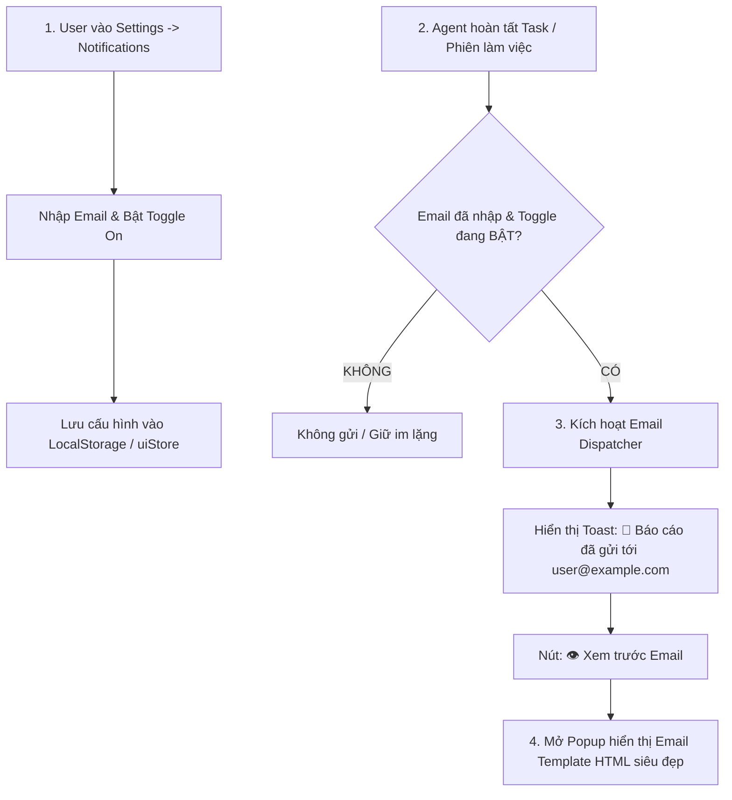

# 📧 MASTER SPECIFICATION & PROMPT: TASK COMPLETION EMAIL NOTIFICATIONS

> **Tài liệu đặc tả kiến trúc & Prompt mẫu:** Hệ thống thông báo kết quả hoàn thành nhiệm vụ qua Email (Task Completion Email Handoff), bao gồm quản lý cấu hình Email người dùng trong Settings, cơ chế Mock Dispatcher kèm Preview Email HTML mẫu, và hợp đồng kết nối SMTP Backend cho tương lai.
> 
> *File này dùng để lưu trữ tham khảo cho việc phát triển trong tương lai.*

---

## 1. 📌 TỔNG QUAN VÀ MỤC TIÊU HỆ THỐNG

### 1.1. Vấn đề giải quyết:
1. **Thời gian chờ đợi của Autonomous Agent:** Các tác vụ lập trình tự động (Autonomous Coding) thường mất nhiều phút để hoàn thành (nghiên cứu, viết code, chạy test, build container). Người dùng không thể ngồi nhìn màn hình liên tục.
2. **Nhu cầu tóm tắt kết quả theo ngôn ngữ người dùng:** Khi hoàn thành, người dùng cần một báo cáo cô đọng gồm: **Những gì đã làm, những commit đã tạo, trạng thái kiểm thử**, được trình bày bằng ngôn ngữ dễ hiểu (Tiếng Việt/English).
3. **Chuẩn hóa thông tin người dùng:** Loại bỏ email mock cứng cũ (`khaikhaichimtoonly@gmail.com`), đưa về trạng thái mặc định `Undefined User` (chưa thiết lập email) và chỉ kích hoạt gửi thông báo khi người dùng chủ động cấu hình.

### 1.2. Nguyên tắc cốt lõi (Core Principles):
* **Tuyệt đối Opt-in:** Chỉ gửi email khi người dùng **đã nhập email hợp lệ** VÀ **bật toggle cho phép gửi**.
* **Đa ngôn ngữ (Localization):** Nội dung tóm tắt được viết theo ngôn ngữ người dùng đã chọn (mặc định là Tiếng Việt).
* **Minh bạch & Trực quan (Rich HTML Email):** Email được định dạng chuyên nghiệp với huy hiệu commit, danh sách tệp thay đổi và kết quả test.

---

## 2. 🎨 THIẾT KẾ GIAO DIỆN & TRẢI NGHIỆM NGƯỜI DÙNG (UI/UX WORKFLOW)



---

### 2.1. Chuẩn hóa Profile người dùng (`Sidebar.tsx` & `sessions.ts`):
* Thay thế tài khoản mock cũ thành:
  * `displayName`: `'Undefined User'` (hoặc tên tùy chỉnh).
  * `email`: `''` (để trống ban đầu).
  * `initials`: `'UU'` (hoặc icon User mặc định).
* Khi chưa cấu hình email, thanh Sidebar hiển thị badge xám `[ ⚠️ Setup Email ]` dẫn thẳng vào mục Settings.

---

### 2.2. Giao diện Cài đặt Thông báo (`NotificationsView.tsx` trong Settings Modal):

```
┌──────────────────────────────────────────────────────────────────────────────────┐
│ Notifications Settings                                                           │
│ Quản lý phương thức và nội dung thông báo kết quả từ AI Agent                    │
├──────────────────────────────────────────────────────────────────────────────────┤
│                                                                                  │
│ ✉️ Task Completion Email                                                         │
│ [X] Gửi email thông báo khi Agent hoàn thành nhiệm vụ                            │
│                                                                                  │
│ Email nhận thông báo:                                                            │
│ ┌──────────────────────────────────────────────────────────────────────────────┐ │
│ │ user@example.com                                                             │ │
│ └──────────────────────────────────────────────────────────────────────────────┘ │
│                                                                                  │
│ Ngôn ngữ báo cáo:                                                                │
│ (•) Tiếng Việt (Mặc định)    ( ) English                                         │
│                                                                                  │
│ Nội dung đính kèm trong Email:                                                   │
│ [X] Tóm tắt những việc đã làm (Work Accomplished Summary)                        │
│ [X] Danh sách Git Commits & Branch info                                          │
│ [X] Kết quả kiểm thử tự động (Unit Tests & Lint Status)                          │
│ [ ] Danh sách toàn bộ các file đã thay đổi (Files Diff List)                     │
│                                                                                  │
│ [ 📨 Gửi thử Email mẫu (Test Send) ]                          [ 💾 Lưu cài đặt ] │
└──────────────────────────────────────────────────────────────────────────────────┘
```

---

### 2.3. Modal Xem trước Email (Email Preview Modal):
Khi click `[ Xem trước Email ]` từ Toast hoặc bấm `[ Gửi thử Email mẫu ]`:

```
┌──────────────────────────────────────────────────────────────────────────────────┐
│ ✉️ Hộp thư xem trước (Email Preview)                                         [✕] │
├──────────────────────────────────────────────────────────────────────────────────┤
│ From: BoxFox Agent Box <notifications@boxfox.ai>                                 │
│ To: user@example.com                                                             │
│ Subject: ✅ [BoxFox] Đã hoàn thành nhiệm vụ: Nâng cấp Design Canvas & Toolbar     │
├──────────────────────────────────────────────────────────────────────────────────┤
│                                                                                  │
│   🦊 BOXFOX AGENT BOX — BÁO CÁO KẾT THÚC NHIỆM VỤ                                │
│   ────────────────────────────────────────────────────────────                   │
│   Trạng thái: ✅ HOÀN TẤT THÀNH CÔNG   •   Thời gian: 3m 45s                     │
│   Phiên làm việc: #sess-canvas-upgrade                                           │
│                                                                                  │
│   📝 1. TỔNG HỢP NHỮNG VIỆC ĐÃ HOÀN THÀNH:                                       │
│   • Di dời thanh Zoom xuống góc dưới bên phải dạng Floating Dock.                │
│   • Tối ưu thanh công cụ Canvas Toolbar: gộp Webview vào dropdown [+].           │
│   • Render Markdown / LaTeX / Code cho tin nhắn chat người dùng.                 │
│                                                                                  │
│   📦 2. CÁC COMMIT ĐÃ TẠO TRÊN GIT:                                              │
│   • [237ca92] refactor(canvas): remove unused lucide-react zoom imports          │
│   • [e88eaa3] feat(ui): relocate canvas zoom controls to floating dock           │
│                                                                                  │
│   🧪 3. TRẠNG THÁI KIỂM THỬ TỰ ĐỘNG:                                             │
│   • Vitest: 231/231 tests PASSED (100% OK)                                       │
│   • TypeScript: 0 errors (NoEmit Clean)                                          │
│                                                                                  │
│   ────────────────────────────────────────────────────────────                   │
│   Truy cập BoxFox Web để xem chi tiết: http://localhost:3100                     │
└──────────────────────────────────────────────────────────────────────────────────┘
```

---

## 3. 🏗️ KIẾN TRÚC KỸ THUẬT & HỢP ĐỒNG DỮ LIỆU

### 3.1. Cấu trúc State trong Frontend (`uiStore.ts`):
```typescript
export interface NotificationSettings {
  emailEnabled: boolean
  recipientEmail: string
  language: 'vi' | 'en'
  includeSummary: boolean
  includeCommits: boolean
  includeTests: boolean
  includeFilesDiff: boolean
}
```

### 3.2. Hợp đồng API Backend (Khi triển khai SMTP thật):
```typescript
// POST /api/notifications/send-completion-email
interface SendCompletionEmailRequest {
  toEmail: string
  sessionId: string
  sessionTitle: string
  language: 'vi' | 'en'
  durationSeconds: number
  summaryMarkdown: string
  gitCommits: Array<{
    hash: string
    message: string
  }>
  testResults: {
    total: number
    passed: number
    failed: number
  }
}
```

---

## 4. 🤖 PROMPT MẪU ĐỂ GIAO NHIỆM VỤ CHO CLOUD AGENT TRIỂN KHAI TRONG TƯƠNG LAI

```markdown
Chào Cloud Agent,

Hãy giúp chúng tôi triển khai tính năng "Task Completion Email Notifications & User Profile Email Configuration" cho dự án BoxFox Agent Box với các yêu cầu chi tiết sau:

1. PHÍA PROFILE & SETTINGS FRONTEND:
   - Trong `frontend/src/lib/mock/sessions.ts` và `Sidebar.tsx`: Đổi tài khoản mock cũ (`khaikhaichimtoonly@gmail.com`) về `Undefined User` với email rỗng ban đầu.
   - Tạo component `frontend/src/components/settings/NotificationsView.tsx` trong mục Settings -> FEATURES -> Notifications:
     + Cho phép nhập Email người nhận kèm regex validation.
     + Toggle switch bật/tắt gửi email khi hoàn thành task.
     + Tùy chọn ngôn ngữ (Tiếng Việt / English).
     + Checkbox chọn nội dung đính kèm (Summary, Git Commits, Test Results).
     + Lưu cài đặt vào `uiStore` / LocalStorage.
     + Nút "Gửi thử email mẫu" (Test Send).

2. MOCK EMAIL DISPATCHER & EMAIL PREVIEW MODAL:
   - Tạo component `EmailPreviewModal.tsx` để hiển thị email HTML template Sleek Dark/Clean Card khi người dùng bấm xem trước.
   - Viết helper `dispatchCompletionNotification(sessionData)`: Khi Agent kết thúc phiên làm việc, nếu người dùng đã nhập email và bật toggle -> Tự động bắn Toast thông báo kèm nút mở `EmailPreviewModal`.

3. HỢP ĐỒNG BACKEND (Sẵn sàng cho SMTP):
   - Tạo endpoint stub hoặc router `deploy/docker/notifications.py` nhận payload `SendCompletionEmailRequest`.
   - Chuẩn bị sẵn cấu hình SMTP (Resend / SendGrid / Gmail SMTP).

4. YÊU CẦU CHẤT LƯỢNG:
   - Viết unit tests tự động (Vitest) cho NotificationsView, state lưu trữ và hàm dispatch email.
   - Đảm bảo 100% typecheck và lint đều xanh.
```

---

*Tài liệu được khởi tạo và lưu trữ tại thư mục gốc của dự án BoxFox-Agent-Box để phục vụ triển khai trong các giai đoạn tiếp theo.*
